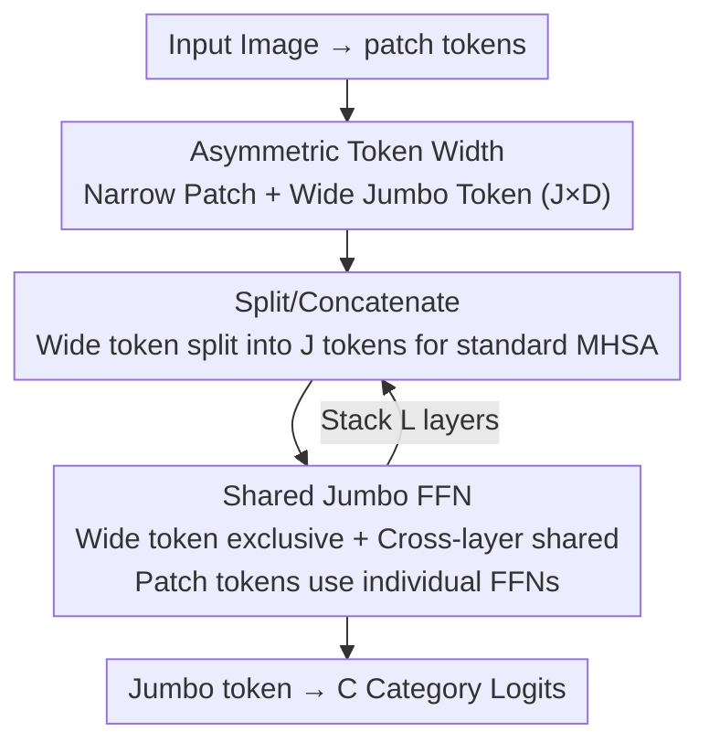

# Thicker and Quicker: A Jumbo Token for Fast Plain Vision Transformers

**Conference**: ICLR 2026  
**OpenReview**: [https://openreview.net/forum?id=nxcevynv08](https://openreview.net/forum?id=nxcevynv08)  
**Code**: https://github.com/antofuller/jumbo  
**Area**: Model Compression / Efficient ViT / Vision Backbone  
**Keywords**: Efficient ViT, Jumbo token, Asymmetric token width, Parameter-shared FFN, Plain ViT compatibility

## TL;DR
To make small-scale plain ViTs both fast and accurate, this paper replaces the original CLS token with a "Jumbo token" that is $J$ times wider than patch tokens and equips it with a cross-layer shared, dedicated wide FFN. This supplements global representation capacity with almost no added computation or memory overhead—achieving a 13% improvement over ViT+Registers at the ImageNet-1K Nano scale while maintaining full compatibility with the plain ViT ecosystem (MAE, SAR, segmentation heads, multi-modality, and time series).

## Background & Motivation
**Background**: Plain ViT (pure attention, non-hierarchical/isotropic structure) is currently the dominant vision backbone, with foundation models such as DINOv2, CLIP, SAM, and DiT built upon it. Its advantage lies not only in accuracy but also in its "interface"—the non-hierarchical, pure attention structure allows for direct token dropping for sparse computation, flexible tokenizers for time series/point clouds/multi-modality, and plug-and-play compatibility with various ViT-specific segmentation heads, test-time adaptation methods, and Flash Attention.

**Limitations of Prior Work**: At the smallest and fastest scales, plain ViT cannot compete with specialized efficient architectures like EfficientViT, SHViT, or MobileNetV4. To accelerate ViT, the industry has followed two paths: either designing hybrid architectures (incorporating convolutions, hierarchical structures, or BatchNorm), which discards the aforementioned interface and renders MAE, SAR, and ViT segmentation heads unusable; or directly narrowing the token width (Base 768 → Small 384 → Tiny 192 → Nano 128), which leads to a significant drop in accuracy.

**Key Challenge**: Existing approaches scale the width $D$ equally across **all tokens and all layers**—to gain speed, the entire model must be narrowed. However, an image with $224\times224$ resolution and $16\times16$ patches contains 196 local tokens but only 1 CLS token. Global representation occupies only $1/197$ of the capacity, which is inherently imbalanced. When narrowing the width, the global capacity is slashed alongside local tokens, which is the primary cause of accuracy degradation.

**Goal**: To restore global representation capacity for small-scale ViTs without sacrificing the plain ViT interface (pure attention + non-hierarchical), making them competitive in high-speed regimes.

**Key Insight**: Token width does not need to be symmetric. Registers (Darcet et al. 2024) proved that "providing more global capacity" is beneficial by prepending multiple register tokens to the CLS token. This paper takes it further: while registers remain the same width as patches, this work **widens** the global token directly, giving it exclusive access to greater processing capacity.

**Core Idea**: Reduce patch token width to gain speed, while introducing a Jumbo token that is $J$ times wider + a dedicated wide FFN to compensate for global capacity—distributing computation through "asymmetric token width" so that a single wide token can support global representation at negligible cost.

## Method

### Overall Architecture
Structurally, Jumbo is almost identical to a plain ViT: images are patched, linearly projected into patch embeddings $x_P \in \mathbb{R}^{N\times D}$, and added with positional encodings. The sole modification is replacing the original CLS token with a **$J$ times wider** Jumbo token $x_{\text{Jumbo}} \in \mathbb{R}^{J\cdot D}$. The entire network uses $L$ transformer layers of identical structure to process these two paths. No convolutions or hierarchical downsampling are introduced, ensuring the output feature maps are consistent with standard ViT, allowing downstream heads/methods to be used without modification.

The data flow within each layer is as follows: Before entering self-attention, the wide Jumbo token is **split into $J$ tokens** along the feature dimension, each having the same width ($D$) as the patches. These are concatenated with patches to form a sequence of length $N+J$, which passes through standard Multi-Head Self-Attention (MHSA). After attention, these $J$ tokens are extracted from the sequence and **concatenated back** into a $J\cdot D$ wide token along the channel dimension. Then, the paths diverge for their respective FFNs: the wide Jumbo token passes through a **dedicated, cross-layer shared** Jumbo FFN, while patches pass through their own (layer-independent) patch FFNs. After $L$ layers, the final Jumbo token is projected into $C$ class logits.

### Key Designs

**1. Asymmetric Token Width: Narrowing Patches and Widening Global Token**

Directly narrowing the entire ViT slashes global capacity, which is the root cause of performance drops in small models. Ours **decouples** the width distribution: patch tokens remain narrow (inheriting the speed gain), while a Jumbo token $x_{\text{Jumbo}} \in \mathbb{R}^{J\cdot D}$ that is $J$ times wider is introduced for global representation. "Widening one token" is nearly free because the computational cost (FLOPs) per layer is primarily determined by **sequence length $N$** and **patch width $D$**. Jumbo is just a single additional token in the sequence that only becomes wider at the FFN, making its FLOPs contribution negligible (Fig. 3 in the paper). This leads to two verifiable hypotheses: the narrower the patch, the greater the gain from Jumbo (confirmed: Nano +13% > Tiny +4% > Small +0.8%); and the higher the task output dimension, the greater the gain (ImageNet-1K → 21K, Small gain increased from 0.8% to 3.1%).

**2. Splitting/Concatenation: Making Wide Tokens Compatible with Standard MHSA**

Wide tokens cannot directly enter attention layers of standard width, and forcing a separate wide attention would break the simple plain ViT interface. Ours bypasses this via zero-cost reshapes: before attention, $x_{\text{Jumbo}}$ is split into $J$ segments $\mathbb{R}^{1\times J\cdot D} \to \mathbb{R}^{J\times D}$ and concatenated with patches $x = x_{\text{Jumbo}}\,\|_0\,x_P \in \mathbb{R}^{(N+J)\times D}$. This is equivalent to having "$J$ additional global tokens/attention heads" participating in the **same standard MHSA** as patches. After attention, these $J$ tokens are sliced along the sequence dimension and concatenated back into $\mathbb{R}^{1\times J\cdot D}$. This process involves only tensor rearrangements with negligible runtime overhead while enabling the wide token to interact fully with global information in multi-head form, maintaining the "pure attention, non-hierarchical" interface. This is a key difference from Registers: Registers' global tokens are always the same width as patches and share the same FFN, while Jumbo allows the global token to be truly wide and processed independently.

**3. Dedicated Jumbo FFN + Cross-layer Sharing: Balancing Capacity and Memory**

Widening in the attention stage is insufficient; true capacity enhancement requires stronger non-linear processing. Thus, Ours assigns a **dedicated FFN (not shared with patches)** to the Jumbo token (applied after concatenating back to $J\cdot D$). However, a $J\cdot D$ wide FFN has significant parameter counts; making it independent per layer would explode memory usage. The solution is to **share one Jumbo FFN's parameters across all layers**. Since it only processes 1 token per layer, its temporal cost is extremely low. By sharing, the parameters are counted only once, minimizing memory overhead and providing a regularization effect. Ablations show that sharing causes negligible accuracy loss (ImageNet-21K Small: 44.95% unshared vs. 44.61% shared), and this gap can be closed using layer-wise LoRA (rank=8, 44.94%) at negligible cost. Notably, even without the Jumbo FFN (relying only on widening + feeding concatenated global tokens to the classifier), Ours outperforms Registers by 2.2%—indicating that "asymmetric widening + feeding all global tokens to the classifier" is effective in itself, with the dedicated wide FFN acting as a supplementary capacity source (at $J:6\to10$, Small reaches 45.6%, surpassing many configurations).

### Loss & Training
Standard cross-entropy with distillation is used for classification to accelerate convergence. ImageNet-1K is trained from scratch for 400 epochs ($128\times128$) + 20 epochs ($224\times224$). Jumbo is robust to $J$: Base uses $J=3$, others use $J=6$. The baseline Registers uses $R=16$. For ImageNet-21K, token dropping training is used to save compute (linearly decreasing drop rate from 90% to 10%), demonstrating the benefits of the plain ViT interface—masking requires minimal code changes.

## Key Experimental Results

### Main Results
Covering 5 types of tasks to verify "Fast and Accurate + Ecosystem Compatibility":

| Task / Dataset | Metric | ViT+Jumbo | ViT+Registers | Gain |
|--------------|------|-----------|---------------|------|
| ImageNet-1K (Nano) | Top-1 Acc | — | — | ↑13% |
| ImageNet-1K (Tiny) | Top-1 Acc | — | — | ↑4% |
| ImageNet-21K (Small / Base) | Top-1 Acc | — | — | ↑3.1% / ↑1.2% |
| ADE20K Seg (Base/Small/Tiny) | mIoU | 44.4 / 39.1 / 35.5 | 42.5 / 37.0 / 32.4 | ↑1.9~3.1 |
| MAE Linear Probe (Base) | Top-1 Acc | 73.0 | 68.1 | ↑4.9 |
| ImageNet-C (TTA, SAR) | Avg Acc | 60.1 | 54.9 | ↑5.2 |

Highlight: ViT-Base+Jumbo's MAE linear probe (73.0%) **matches the ViT-Large** baseline, but with 2.3× fewer parameters, 3.5× fewer FLOPs, and 3.1× higher throughput. Compared to specialized efficient architectures (EfficientViT/SHViT/MobileNetV4), Jumbo reaches the Pareto frontier on ImageNet-1K/v2/ReaL/HR/R and is 1.9× faster than Registers at the same accuracy (ImageNet-21K). For time series, PatchTST+Jumbo ranked first on 20 UCR/UEA benchmarks, proving it generalizes to non-causal transformers beyond ViT.

### Ablation Study (ImageNet-21K, ViT-Small)

| Config | Top-1 Acc | Memory (GB) | Note |
|------|-----------|---------|------|
| Jumbo (Shared FFN, $J=6$) | 44.61 | 2.6 | Default config |
| w/o Layer Sharing | 44.95 | 4.1 | Slight acc gain but memory ↑1.6× |
| w/o Jumbo FFN | 43.64 | 2.2 | Still 2.2% higher than Registers |
| + Layer-wise LoRA (rank=8) | 44.94 | 2.5 | Shared+LoRA almost matches unshared |
| $J: 6\to10$ | 45.62 | 3.4 | Higher accuracy via widening at low cost |

### Key Findings
- **Narrower patch, larger gain**: Confirms the hypothesis that global capacity is the bottleneck for small models; Nano's improvement is far greater than Small's.
- **Cross-layer sharing is almost free**: Not sharing adds only 0.34% accuracy but increases memory by 1.6×; layer-wise LoRA can recover this gap while keeping sharing.
- **Jumbo FFN is an effective but not unique capacity source**: Removing it still beats Registers by 2.2%, proving that "asymmetric widening + feeding all global tokens to the classifier" provides the primary gain.
- **Ecosystem compatibility is a true advantage**: TTA methods like SAR are designed for LayerNorm; specialized architectures using BatchNorm cannot be used plug-and-play, whereas Jumbo benefits directly (+5.2% after TTA).

## Highlights & Insights
- **"One wide token is almost free" is the pivot**: Captures the observation that FLOPs per layer are dominated by sequence length and patch width, while single-token expansion contributes negligibly. This FLOPs perspective is transferable to any sequence model seeking "local savings, global compensation."
- **Splitting/Concatenation for Standard MHSA Reuse**: Avoiding specialized wide attention and relying on zero-cost reshapes to fit "wide global tokens" into uniform-width attention is the key engineering trick for preserving the plain ViT interface.
- **Cross-layer Shared FFN is both memory-efficient and regularizing**: Single-token processing ensures that sharing incurs almost no temporal cost; it is a textbook example of using "parameter sharing" in the right context. Pairing it with LoRA fine-tuning balances efficiency and accuracy.
- **Compatibility as a Selling Point over Pure Metrics**: The authors repeatedly emphasize that Jumbo is plug-and-play with MAE/SAR/segmentation heads/multi-modality/time series, which is its most persistent value compared to specialized efficient architectures.

## Limitations & Future Work
- **Language/Multi-modal experiments are concept-only**: Results for image-caption retrieval (top-10 34% vs 30%) and MLM (perplexity 4.8 vs 4.9) are proof-of-concept without pursuing SOTA; real gains in NLP remain unclear.
- **Optimal ratio of $J$ to patch width requires sweeping**: Although robustness to $J$ is claimed, Base uses $J=3$, others $J=6$, and the optimum is sometimes $J=10$, indicating a lack of an automatic selection mechanism.
- **Shared FFN drops slight accuracy at small scales**: Requires LoRA to compensate, suggesting "sharing" is not entirely lossless; performance at larger scales or longer training needs further validation.
- **Gains depend on "Small Model + High Output Dimension" scenarios**: On already wide large models, the relative gain of asymmetric widening diminishes (Base gain is only 1.2%).

## Related Work & Insights
- **vs. ViT+Registers**: Registers add multiple **uniform-width** register tokens outside the CLS and share the FFN with patches; Jumbo directly **widens the global token $J$ times** and uses a dedicated shared FFN, providing stronger independent processing for global representation. Both keep the plain ViT interface, but Jumbo is more accurate in high-speed regimes and faster at equivalent accuracy (1.9×).
- **vs. EfficientViT / SHViT / MobileNetV4**: These rely on convolution, hierarchies, and BatchNorm for speed. While fast, they lose the plain ViT interface and cannot use MAE/SAR/ViT heads/multi-modality out-of-the-box. Jumbo reaches or exceeds their speed-accuracy frontier while maintaining all compatibility.
- **vs. BiXT (Perceiver-like)**: Also an efficient extension using pure attention and non-hierarchical structures, serving as a natural baseline; Jumbo achieves a better frontier on ImageNet.
- **Insight**: Decouple "capacity" and "speed" at the token grain—add capacity where it's cheap (a few wide tokens) and keep it narrow where it's expensive (many patches). This "asymmetric scaling" idea can extend to point clouds, video, long-sequence time series, or any scenario with many tokens requiring strong global representation.

## Rating
- Novelty: ⭐⭐⭐⭐ Combining "asymmetric width distribution + single wide token + shared wide FFN" into a minimalist, interface-preserving solution is a novel perspective.
- Experimental Thoroughness: ⭐⭐⭐⭐⭐ Covers 6 types of tasks (Classification/Segmentation/MAE/TTA/Time Series/Language), multiple scales, and comprehensive ablation/analysis.
- Writing Quality: ⭐⭐⭐⭐⭐ Clear derivation of motivation, beautiful hypothesis-verification loop, and well-supported charts.
- Value: ⭐⭐⭐⭐⭐ Provides a practical path for small-scale plain ViTs to be "fast, accurate, and ecosystem-friendly," with high deployment value.

<!-- RELATED:START -->

## Related Papers

- [\[ICLR 2026\] Faster Vision Transformers with Adaptive Patches](faster_vision_transformers_with_adaptive_patches.md)
- [\[ICLR 2026\] Vulcan: Tailoring Compact Class-Specific Vision Transformers for Edge Intelligence](vulcan_crafting_compact_class-specific_vision_transformers_for_edge_intelligence.md)
- [\[ICLR 2026\] WSVD: Weighted Low-Rank Approximation for Fast and Efficient Execution of Low-Precision Vision-Learning Models](wsvd_weighted_low-rank_approximation_for_fast_and_efficient_execution_of_low-pre.md)
- [\[AAAI 2026\] Distillation Dynamics: Towards Understanding Feature-Based Distillation in Vision Transformers](../../AAAI2026/model_compression/distillation_dynamics_towards_understanding_feature-based_di.md)
- [\[AAAI 2026\] Stratified Knowledge-Density Super-Network for Scalable Vision Transformers](../../AAAI2026/model_compression/stratified_knowledge-density_super-network_for_scalable_vision_transformers.md)

<!-- RELATED:END -->
