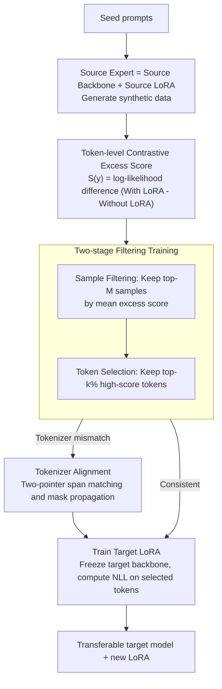

# TiTok: Transfer Token-level Knowledge via Contrastive Excess to Transplant LoRA

**Conference**: ICLR 2026  
**arXiv**: [2510.04682](https://arxiv.org/abs/2510.04682)  
**Code**: [https://github.com/NaughtyMaltiz16/TiTok](https://github.com/NaughtyMaltiz16/TiTok)  
**Area**: Model Compression  
**Keywords**: LoRA transfer, knowledge distillation, token-level selection, parameter-efficient fine-tuning, contrastive excess score

## TL;DR

Ours proposes the TiTok framework, which achieves efficient LoRA adapter transfer across models through token-level contrastive excess scores. It requires no additional discriminator models and consistently outperforms TransLoRA and knowledge distillation baselines in reasoning and personalization tasks.

## Background & Motivation

- **Binding issue of LoRA**: Although PEFT methods like LoRA are parameter-efficient, adapter parameters depend on specific base models and cannot be transferred across different models.
- **Limitations of Prior Work**:
    - Knowledge Distillation (KD) depends on original training data, which is typically unavailable.
    - TransLoRA addresses data dependency through synthetic data but requires training additional discriminator models for data filtering, increasing complexity.
- **Key Motivation**: Is it possible to extract token-level task knowledge signals from LoRA in a more lightweight manner to guide cross-model knowledge transfer?

## Method

### Overall Architecture

TiTok aims to "transplant" a LoRA trained on a source model to another base model without access to original training data or the need to train an extra discriminator like TransLoRA. The approach first generates synthetic data using the source model, then uses the token-level output difference between the source model "with LoRA" and "without LoRA" as a signal for task knowledge. Based on this, the most valuable supervision is filtered at both the sample and token levels. Finally, the target model's new LoRA is trained using standard NLL loss on this filtered data. The entire process introduces no external models, as all signals come from the internal contrast of the source model.

### Key Designs

**1. Token-level Contrastive Excess Score: Reading task knowledge from LoRA's internal differences.** The primary missing signal in cross-model transfer is identifying which tokens carry the task capabilities injected by LoRA. TiTok measures this directly via the prediction difference of the source model with and without LoRA. For each generated token $y_i$, the excess score is defined as $S(y_i) = L_e(y_i) - L_a(y_i)$, where $L_a(y_i) = \log P_{\mathcal{M}_s}(y_i \mid \mathbf{q}, \mathbf{y}_{<i})$ is the log-likelihood of the bare base model and $L_e(y_i) = \log P_{\mathcal{M}_s + \mathcal{A}_s}(y_i \mid \mathbf{q}, \mathbf{y}_{<i})$ is the log-likelihood with the source LoRA. When the base model is uncertain about a token but the LoRA-equipped model predicts it with high confidence, that token receives a high score—representing exactly where LoRA changed model behavior. This quantity is essentially a token-level log-likelihood ratio (LLR), which, according to the Neyman-Pearson lemma, is the optimal statistic for distinguishing between "with LoRA" and "without LoRA" distributions, providing theoretical support for token selection.

**2. Two-stage Filtering Training: Retaining high-information supervision at sample and token granularities.** Synthetic data contains both entire samples with little task information and many irrelevant tokens within samples; training on all such data dilutes the signal. TiTok first performs sample filtering: for each sample, it calculates the mean token excess score $\bar{S}_j = \frac{1}{|\mathbf{y}_j|} \sum_{y_i \in \mathbf{y}_j} S(y_i)$ and retains the top-$M$ most informative samples to form $\mathcal{D}_f$. Then, token selection is performed within the retained samples: loss is only calculated for tokens in the top-$k\%$ of excess scores, with others masked by an indicator function $I_{k\%}(y_i)$. The training objective is $\sum_{(\mathbf{q}_j, \mathbf{y}_j) \in \mathcal{D}_f} \sum_{y_i \in \mathbf{y}_j} I_{k\%}(y_i) \cdot L_t(y_i)$. In experiments, $k\% = 70\%$ is optimal for most settings, and the top 20% of tokens are verified to concentrate the densest task knowledge (0.482 vs. 0.468 for the bottom).

**3. Tokenizer Alignment: Ensuring mask alignment despite disparate tokenization.** Source and target models often use different tokenizers, leading to misaligned token boundaries. TiTok uses double pointers to match spans at the text level during incremental decoding and propagates masks through four scenarios: one-to-one (direct copy), one-to-many (copying the same score to multiple target tokens), many-to-one (averaging multiple source scores), and many-to-many (averaging then copying). After alignment, top-$k\%$ selection is performed on the target sequence to ensure training focuses on the most credible tokens on the target side.

### Loss & Training

The target LoRA $\mathcal{A}_t$ is attached to the frozen target backbone $\mathcal{M}_t$ and trained only on the filtered synthetic data by computing standard NLL loss for the selected tokens:

$$\mathcal{L}_{\text{TiTok}} = \sum \sum I_{k\%}(y_i) \cdot \bigl(-\log P_{\mathcal{M}_t + \mathcal{A}_t}(y_i \mid \mathbf{q}, \mathbf{y}_{<i})\bigr)$$

The backbone remains frozen, and only the LoRA (rank=8 in experiments) is updated, ensuring the transfer process remains parameter-efficient.

## Key Experimental Results

### Main Results: Four Transfer Settings

| Transfer Setting | Method | BBH Acc | MMLU Acc | News R-1 | Scholarly R-1 |
|----------|------|---------|----------|----------|--------------|
| Mistral→Mistral | Vanilla | 0.397 | 0.557 | 0.117 | 0.381 |
| Mistral→Mistral | TransLoRA | 0.416 | 0.534 | 0.156 | 0.447 |
| Mistral→Mistral | **TiTok** | **0.424** | **0.561** | **0.161** | **0.473** |
| Mistral→Llama3 | Vanilla | 0.469 | 0.469 | 0.125 | 0.444 |
| Mistral→Llama3 | TransLoRA | 0.473 | 0.473 | 0.126 | 0.461 |
| Mistral→Llama3 | **TiTok** | **0.484** | **0.485** | **0.139** | **0.464** |
| Llama2→Llama3 | **TiTok** | **0.488** | **0.477** | **0.138** | **0.461** |

### Ablation Study

| Sample Filtering | Token Selection | BBH | MMLU | News R-1 | Scholarly R-1 |
|----------|-----------|-----|------|----------|---------------|
| ✗ | ✗ | 0.458 | 0.485 | 0.133 | 0.456 |
| ✗ | ✓ | 0.463 | 0.496 | 0.137 | 0.460 |
| ✓ | ✗ | 0.470 | 0.500 | 0.139 | 0.460 |
| ✓ | ✓ | **0.483** | **0.501** | **0.142** | **0.464** |

### Key Findings

- TiTok outperforms the vanilla target model by an average Gain of +9.94%, KD by +8.5%, and TransLoRA by +4.4%.
- It is effective across model families (Mistral→Llama), scales (3B→8B), and versions (Llama2→Llama3).
- Top 20% excess score tokens contain the most concentrated task knowledge (0.482 vs. bottom 0.468).
- Different model experts (Mistral 7B and Llama2 7B) show a 59.76% overlap in top 20% token selection.
- The token selection ratio $k\% = 70\%$ is optimal in most settings.
- TiTok remains effective even when using external data from unrelated domains.

## Highlights & Insights

- **Simple and Effective**: Does not require training additional models (discriminators); utilizes only the difference between the source model with and without LoRA.
- **Solid Theory**: The excess score is supported by the theory of statistical testing using log-likelihood ratios.
- **Comprehensive Transfer Scenarios**: Covers same-family, cross-family, cross-scale, and cross-version settings.
- **Tokenizer Alignment**: Elegantly solves the mismatch problem between different model tokenizers.

## Limitations & Future Work

- Dependency on synthetic data quality; source models with weak synthesis capabilities may limit transfer performance.
- The token selection ratio $k\%$ is not perfectly consistent across different transfer settings (e.g., the optimal value for Llama3 3B→8B is 30%).
- Validated only on LoRA (rank=8), without exploring other PEFT methods.
- Evaluation tasks are primarily concentrated on reasoning (BBH/MMLU) and personalization (LaMP), with other task types yet to be verified.

## Related Work & Insights

- **PEFT Transfer**: TransLoRA transfers LoRA via synthetic data and discriminators, which is a heavier approach.
- **Knowledge Distillation**: Traditional KD operates at the logit or sequence level within a teacher-student framework and requires original data.
- **Selective Token Training**: Inspired by selective training literature, this work is the first to extend token selection to the context of knowledge transfer.

## Rating

| Dimension | Score |
|------|------|
| Novelty | ★★★★☆ |
| Theoretical Depth | ★★★★☆ |
| Experimental Thoroughness | ★★★★☆ |
| Value | ★★★★☆ |
| Writing Quality | ★★★★☆ |

<!-- RELATED:START -->

## Related Papers

- [\[ICLR 2026\] Generative Diffusion Prior Distillation for Long-Context Knowledge Transfer](generative_diffusion_prior_distillation_for_long-context_knowledge_transfer.md)
- [\[ACL 2026\] LoRA on the Go: Instance-level Dynamic LoRA Selection and Merging](../../ACL2026/model_compression/lora_on_the_go_instance-level_dynamic_lora_selection_and_merging.md)
- [\[ICLR 2026\] LoRA-Mixer: Coordinate Modular LoRA Experts Through Serial Attention Routing](lora-mixer_coordinate_modular_lora_experts_through_serial_attention_routing.md)
- [\[CVPR 2026\] A Unified Framework for Knowledge Transfer in Bidirectional Model Scaling](../../CVPR2026/model_compression/a_unified_framework_for_knowledge_transfer_in_bidirectional_model_scaling.md)
- [\[CVPR 2026\] SelecTKD: Selective Token-Weighted Knowledge Distillation for LLMs](../../CVPR2026/model_compression/selectkd_selective_token-weighted_knowledge_distillation_for_llms.md)

<!-- RELATED:END -->
