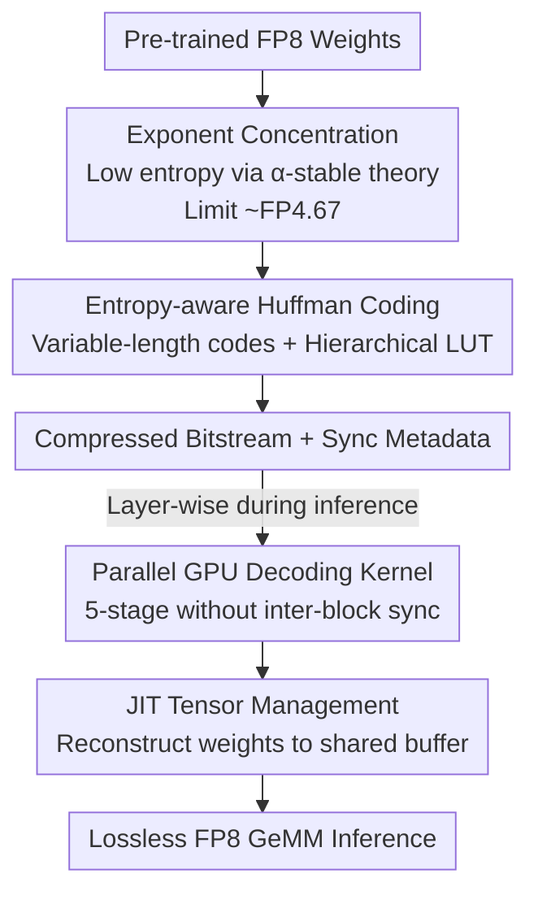

# To Compress or Not? Pushing the Frontier of Lossless GenAI Model Weights Compression with Exponent Concentration

**Conference**: ICLR 2026  
**OpenReview**: [https://openreview.net/forum?id=XI1CeufywD](https://openreview.net/forum?id=XI1CeufywD)  
**Code**: https://github.com/zeyuyang8/ecf8  
**Area**: Model Compression  
**Keywords**: Lossless Compression, FP8, Exponent Concentration, Huffman Coding, Inference Acceleration

## TL;DR
This paper discovers the "exponent concentration" (low entropy) phenomenon in post-training GenAI weights. It theoretically proves bounded exponent entropy via $\alpha$-stable distribution theory, corresponding to a compression limit of approximately FP4.67. Based on this, the authors design ECF8, a lossless FP8 compression framework (entropy-aware Huffman coding + GPU parallel decoding + just-in-the-time tensor management), achieving up to 26.9% memory savings and 177.1% throughput improvement on LLMs and DiTs with up to 671B parameters, maintaining zero bit-wise deviation in output.

## Background & Motivation
**Background**: As model scales expand to hundreds of billions of parameters, low-precision computation has become a deployment necessity. The mainstream approach is integer quantization (INT8/INT4, etc.), which reduces memory and compute by compressing weights into fixed-point numbers.

**Limitations of Prior Work**: Integer quantization suffers from two fundamental flaws. First, it is **lossy**—compression introduces degradation in precision or generation quality, to which generative models are particularly sensitive. Second, it often **slows down large-batch inference**: integer tensors must be dequantized back to floating-point before matrix multiplication. This dequantization step, combined with mixed-precision execution, consumes the throughput gains intended by compression.

**Key Challenge**: There is a demand for "memory savings without quality loss and without speed degradation," but quantization typically forces a trade-off between these three. While DFloat11 observed that the exponent entropy of BF16 weights is far lower than the allocated bit-width, the community has lacked a **fundamental principle** for this phenomenon: Can it be generalized beyond BF16? Where is the theoretical lower bound for exponent entropy? Crucially, can memory compression be converted into **inference acceleration** (rather than just storage savings)?

**Goal**: (1) Provide a theoretical explanation and entropy lower bound for the exponent concentration phenomenon; (2) Derive the compression limit for lossless floating-point formats; (3) Implement this theory into a practical FP8 framework that is both lossless and capable of end-to-end acceleration.

**Key Insight**: The authors start from an empirical observation consistent across architectures and modalities—weight exponents are concentrated within a very narrow range of values. The Shannon entropy remains stable at 2–3 bits, while standard floating-point formats allocate 4 bits or more to the exponent. This "entropy gap" represents a "free lunch" for lossless compression.

**Core Idea**: By modeling weights trained via SGD as an $\alpha$-stable distribution, the authors prove that floating-point exponents follow a bilateral geometric distribution with bounded entropy (limit ~FP4.67). They then utilize entropy-aware Huffman coding combined with customized GPU decoding kernels to eliminate redundant bits and convert them into throughput.

## Method

### Overall Architecture
ECF8 addresses the waste of the 4 bits allocated to the exponent in FP8 weights. The pipeline consists of two stages: **Offline Encoding** compresses each weight exponent into a compact bitstream using variable-length Huffman codes and generates synchronization metadata; **Online Inference** uses customized GPU kernels to decode exponents layer-by-layer, restoring weights to original FP8 for lossless GeMM. It is lossless because only the discrete exponent symbols are compressed, while mantissa and sign bits remain untouched, ensuring the decoded result is bit-wise identical to the original FP8.

The design is built on a theoretical foundation: the authors first prove that exponents of trained weights possess naturally low entropy (exponent concentration). This explains "why it can be compressed" and "to what extent" (~FP4.67), proving FP8 to be an engineering sweet spot that is both close to the theoretical limit and hardware-friendly.

### Key Designs

**1. Exponent Concentration: Proving Bounded Exponent Entropy via $\alpha$-stable Distributions**

This section addresses the fundamental question of why lossless compression is possible. The authors point out that weights are accumulated by SGD through updates with heavy-tailed noise. Mini-batch sampling causes gradient noise to follow a power-law tail $P(|\Delta_t|>x)\sim x^{-\alpha}$ ($\alpha<2$). By the Generalized Central Limit Theorem, the sum of such heavy-tailed variables converges to an $\alpha$-stable distribution. Thus, trained weights approximately follow a symmetric $\alpha$-stable law $X\sim S_\alpha(\beta=0,\gamma,\delta)$.

Defining the floating-point exponent as $E=\lfloor\log_2|X|\rfloor$, the paper proves that $E$ follows a bilateral geometric distribution with parameter $q=2^{-\alpha}$, $P(E=k)=\frac{1-q}{1+q}q^{|k|}$, and provides a tight entropy bound:

$$\frac{\alpha}{1+2^{-\alpha}}\le H(E)\le\frac{\alpha}{1-2^{-\alpha}}$$

This implies that exponents do not spread uniformly across the integer axis but are geometrically concentrated around 0 at a rate of $2^{-\alpha}$. Consequently, **entropy remains finite regardless of $\alpha$**, and smaller $\alpha$ leads to tighter concentration and lower entropy. This transforms the observation of "2–3 bit exponent entropy" from a coincidence into a statistical law, indicating that exponents carry very little uncertainty and are naturally compressible.

**2. Compression Limit FP4.67: Theoretical Lower Bound justifying FP8 as the Optimal Engineering Target**

The authors translate the entropy bound into a specific compression limit. The minimum expected bits to losslessly encode the exponent is $L_{\min}=H(E)$. For Gaussian-like cases where $\alpha=2$ ($2^{-\alpha}=1/4$), the exponent entropy bound is $1.6\le H(E)\le 2.67$, meaning in extreme cases, the exponent itself requires approximately 2.67 bits. Adding 1 sign bit and a minimal mantissa (approximately 1 bit) to maintain precision, the absolute floor is $2.67+1+1\approx4.67$ bits.

However, "FP4.67" or even FP5 is nearly impossible to implement efficiently on modern GPUs due to alignment and hardware constraints. Thus, the authors select FP8 as the implementation format—it is close to the entropy-driven theoretical limit while retaining sufficient mantissa precision and hardware compatibility. The value of this design point is that FP8 is not chosen arbitrarily but is justified by a theoretical lower bound showing that further compression yields diminishing returns with skyrocketing hardware costs.

**3. Entropy-aware Huffman Coding + Hierarchical Lookup Table: Making Variable-length Codes GPU-friendly**

Standard FP8 allocates 4 bits to the exponent (values $\{0,\dots,15\}$), but measured entropy is much lower. ECF8 computes empirical exponent frequencies $p(x)$ and constructs an optimal Huffman tree to minimize expected code length $E[\ell]=\sum_x p(x)\ell(x)$, assigning shorter codes to high-frequency exponents. To ensure GPU compatibility, the maximum code length is limited to 16 bits (rare symbols undergo frequency adjustment, though this is rarely triggered in Transformer layers).

The challenge of variable-length codes is decoding: bit-by-bit tree traversal is extremely slow on GPUs. The authors construct **cascaded hierarchical lookup tables (LUTs)** organized by byte-aligned prefixes. Each 8-bit sub-table has 256 entries; an entry either provides the decoded exponent (if the prefix constitutes a complete code) or a pointer $256-\text{index}(p_{i'})$ to a sub-table for a longer prefix. This decomposes variable-length decoding into several 8-bit lookups, with memory usage $O(|P|\cdot 256)$ and lookup time $O(\lceil\ell_{\max}/8\rceil)$, aligned with GPU memory architecture. During encoding, gap offsets $g_t=\big(\sum_{i<t}\sum_{x_j}\ell(x_j)\big)\bmod 8B$ and output positions for each block are pre-calculated as synchronization metadata for parallel decoding.

**4. Parallel GPU Decoding Kernel + JIT Tensor Management: Converting Compression into Throughput**

Lossless compression is meaningless if decoding is slow. This design point is key to the "compression $\to$ acceleration" conversion. The CUDA decoding kernel consists of five phases: (i) memory initialization with register buffers; (ii) data loading of bit segments from global memory into registers; (iii) parallel counting, where each thread uses the gap to calculate decoded symbols and performs intra-block parallel reduction for cumulative counts and non-overlapping output positions; (iv) collaborative decoding into shared memory; (v) coalesced write-back to global memory. Leveraging pre-calculated gaps and positions, **thread blocks decode autonomously without inter-block synchronization**.

A corresponding Just-In-Time (JIT) tensor management system uses PyTorch forward hooks to intercept execution, decompressing each layer's weights only before computation. It reuses a pre-allocated buffer sized to the "largest layer weight." Once layer $\ell_i$ finishes, the buffer is immediately released for $\ell_{i+1}$, ensuring a constant GPU decompression overhead regardless of model depth. The saved memory allows for larger batches, translating storage efficiency into actual throughput and latency gains.

## Key Experimental Results

Tests were performed on 9 models, including autoregressive LLMs, Diffusion Transformers (DiTs), and MoE variants, ranging from 8B to 671B parameters.

### Main Results: Lossless Memory Savings + Throughput under Fixed VRAM

| Model | Memory ↓(%) | Throughput ↑(%) | Notes |
|------|---------|---------|------|
| DeepSeek-R1-0528 (671B) | 14.8 | 150.3 | 623→530 GB, runnable on 8×H100 |
| Qwen3-235B-A22B-Instruct-FP8 | 14.4 | 35.9 | 217→186 GB |
| Llama-3.3-70B-Instruct-FP8 | 13.4 | 11.3 | — |
| Qwen3-Coder-30B-A3B-FP8 | 14.3 | 23.7 | Fits in a single RTX5090 |
| Qwen3-8B-FP8 | 9.8 | 12.6 | Single RTX4070 |
| FLUX.1-dev | 14.1 | **177.1** | DiT, highest throughput gain |
| Wan2.1-T2V-14B | 25.4 | 55.1 | — |
| Wan2.2-T2V-A14B | **26.9** | 108.3 | Highest memory saving |
| Qwen-Image | 21.0 | 126.6 | — |

Key Observations: LLM compression rates are stable at 9.8%–14.8%, while DiTs are higher (up to 26.9%). Compression remains consistent across scales (8B to 671B), indicating that ECF8 depends on the statistical nature of weight distributions rather than model size. In terms of generation quality, ECF8-Qwen-Image outputs are **pixel-wise identical** to the original FP8 under the same seeds/parameters, with strictly zero numerical deviation.

### LLM Inference Comparison under Fixed VRAM (FP8 vs ECF8)

| Model / Constraint | Max Batch (FP8→ECF8) | Latency ↓(%) | Throughput ↑(%) |
|------|------|------|------|
| DeepSeek-R1-0528 / 640 GB | 2 → 16 | 60.1 | 150.3 |
| Qwen3-235B / 240 GB | 32 → 64 | 26.4 | 35.9 |
| Llama-3.3-70B / 80 GB | 32 → 48 | 10.2 | 11.3 |
| Qwen3-Coder-30B / 32 GB | 16 → 32 | 19.2 | 23.7 |
| Qwen3-8B / 12 GB | 16 → 24 | 11.2 | 12.6 |

For DiTs (DiffSynth + VRAM management on a single GH200): FLUX.1-dev end-to-end latency dropped from 24.29s to 13.15s (↓45.9%); Qwen-Image single-step latency dropped by 55.9%. Video models like Wan2.x showed smaller latency improvements (3.3–4.0%) due to being compute-bound, but still achieved 7.6–17.8% memory savings.

### Key Findings
- **Mechanism of Compression to Acceleration**: Under fixed memory, savings are directly converted into larger batch sizes, increasing throughput and lowering per-request latency (e.g., DeepSeek batch size increased from 2 to 16 under 640 GB).
- **Architectural Differences**: DiT exponent entropy is lower (under 1 bit for some blocks), leading to higher compression than LLMs. DiTs are mostly compute-bound; single-batch latency gains primarily stem from reduced weight transfer overhead during VRAM management.
- **Lossless as a Hard Constraint**: All models output zero deviation, which is a fundamental difference from lossy quantization and critical for production deployment.

## Highlights & Insights
- **Upgrading "Phenomenon" to "Law"**: Proving bounded exponent entropy via $\alpha$-stable distributions and providing a quantifiable lossless limit of FP4.67 gives empirical observations like DFloat11 a theoretical basis and sets a benchmark for future numerical format designs.
- **Theory Guiding Format Selection**: Instead of choosing FP8 empirically, the authors use the entropy lower bound to argue that "FP8 is close to the limit and hardware-friendly," making the methodology rigorous.
- **True End-to-End Acceleration**: While many lossless methods only save storage and decode too slowly for inference, ECF8 uses hierarchical LUTs and non-sync parallel GPU kernels to convert compression into up to 177% throughput gain, fulfilling the promise of end-to-end acceleration.
- **Transferable Trick**: The cascaded 8-bit LUT approach for variable-length decoding on GPUs can be applied to other entropy decoding scenarios such as KV cache or activation compression.

## Limitations & Future Work
- Gains strongly depend on the statistical premise of "low-entropy exponents." If weight distributions are explicitly regularized to be uniform, or if non-Transformer architectures do not satisfy $\alpha$-stable assumptions, compression space will decrease.
- Only the exponent is compressed while the full mantissa is retained, capping the compression rate (approx. 10–15% for LLMs), which is an order of magnitude lower than lossy quantization. This is the trade-off for strict losslessness.
- For DiTs in compute-bound scenarios, single-batch latency gains are limited and depend on VRAM management savings; benefits are sensitive to deployment configurations.
- Reliance on customized CUDA kernels and forward hooks requires extra effort for framework integration (e.g., vLLM or LoRA compatibility).

## Related Work & Insights
- **vs. Integer Quantization (GPTQ / AWQ / SmoothQuant, etc.)**: These are lossy and require dequantization, which can slow down large batches. ECF8 is lossless, decodes directly to original FP8, and converts compression to throughput—though its compression ratio is lower.
- **vs. DFloat11**: DFloat11 observed low exponent entropy in BF16 and used entropy coding but remained at the empirical level without end-to-end acceleration. This paper provides an $\alpha$-stable theoretical explanation, generalizes to FP8, and implements GPU kernels for real acceleration.
- **vs. Heilper & Singer (2025)**: While also reporting low exponent entropy in neural networks, this work integrates it into a unified framework of statistical laws and engineering implementation.

## Rating
- Novelty: ⭐⭐⭐⭐⭐ Proves exponent concentration as a bounded entropy law via $\alpha$-stable distributions and identifies the FP4.67 limit.
- Experimental Thoroughness: ⭐⭐⭐⭐⭐ 9 models from 8B to 671B across LLM/DiT/MoE, including throughput and bit-wise lossless verification.
- Writing Quality: ⭐⭐⭐⭐ Both theory and systems sections are clear; includes full formulas and kernel workflows.
- Value: ⭐⭐⭐⭐⭐ First lossless weight compression delivering end-to-end acceleration, ready for production use-cases.

<!-- RELATED:START -->

## Related Papers

- [\[ICLR 2026\] The Unseen Frontier: Pushing the Limits of LLM Sparsity with Surrogate-Free ADMM](the_unseen_frontier_pushing_the_limits_of_llm_sparsity_with_surrogate-free_admm.md)
- [\[ICLR 2026\] QVLA: Not All Channels Are Equal in Vision-Language-Action Model's Quantization](qvla_not_all_channels_are_equal_in_vision-language-action_models_quantization.md)
- [\[ICLR 2026\] Towards Lossless Memory-efficient Training of Spiking Neural Networks via Gradient Checkpointing and Spike Compression](towards_lossless_memory-efficient_training_of_spiking_neural_networks_via_gradie.md)
- [\[ICLR 2026\] OrderDP: A Theoretically Guaranteed Lossless Dynamic Data Pruning Framework](orderdp_a_theoretically_guaranteed_lossless_dynamic_data_pruning_framework.md)
- [\[ICML 2026\] ZipMoE: Efficient On-Device MoE Serving via Lossless Compression and Cache-Affinity Scheduling](../../ICML2026/model_compression/zipmoe_efficient_on-device_moe_serving_via_lossless_compression_and_cache-affini.md)

<!-- RELATED:END -->
