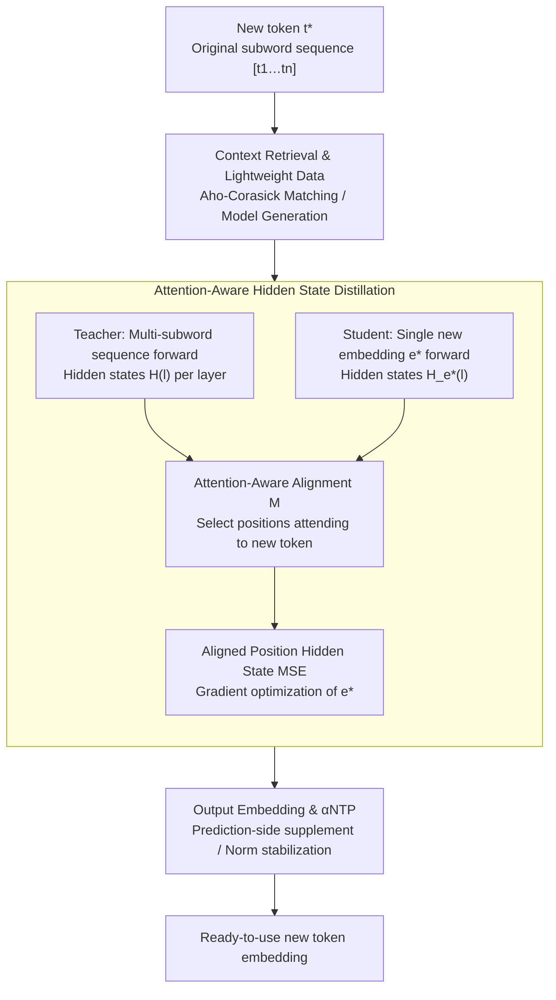

# Token Distillation: Attention-Aware Input Embeddings for New Tokens

**Conference**: ICLR 2026  
**arXiv**: [2505.20133](https://arxiv.org/abs/2505.20133)  
**Code**: [https://github.com/konstantinjdobler/token-distillation](https://github.com/konstantinjdobler/token-distillation)  
**Area**: Model Compression  
**Keywords**: Vocabulary Expansion, Token Embedding Initialization, Knowledge Distillation, Domain Adaptation, Language Adaptation

## TL;DR

Ours proposes the Token Distillation method, which distills multi-subword interaction information encoded by Transformer layers into a single token embedding. This achieves high-quality initialization for new token embeddings without pre-training hypernetworks and outperforms existing methods.

## Background & Motivation

- **Static Vocabulary Issue**: Pre-trained language models use fixed tokenizers, which lead to over-segmentation of domain-specific or new language vocabulary, resulting in performance degradation and increased computational overhead.
- **Limitations of Prior Work in Initialization**:
    - Subword averaging only utilizes information from the embedding matrix, ignoring the functional knowledge within Transformer layers.
    - For example, the individual embeddings of `<_pal><at><able>` do not contain the semantics of `<_palatable>`.
    - Multi-subword semantics are constructed incrementally by the Transformer's attention and feed-forward layers during contextualization (neural detokenization).
- **Key Insight**: Effective new token embeddings must capture information stored in all Transformer layers, rather than relying solely on the embedding matrix.

## Method

### Overall Architecture

Ours addresses the challenge of providing high-quality input embeddings for newly added vocabulary tokens. The core idea is that the semantics of a new token $t^{\star}$, originally "calculated" layer-by-layer by the Transformer from its corresponding subword sequence $[t_1,\dots,t_n]$ (neural detokenization), are lost when using subword averaging which only considers the embedding matrix. Token Distillation treats the hidden states produced by the original model after reading the full subword sequence as the teacher signal. It then optimizes the single new embedding $\mathbf{e}^{\star}$ via gradient descent, forcing the model's hidden states when seeing only the new token to approximate those of the teacher.

The pipeline consists of three steps: first, **retrieve or generate** a small amount of realistic context containing the target word; second, perform a **forward pass for both teacher (multi-subword sequence) and student (single new embedding)**, performing MSE distillation on hidden states at positions that "attend to the new token"; finally, **supplement the output-side embeddings and stabilize the norm** to obtain a new embedding that can be directly inserted into the frozen model.

### Key Designs

**1. Context Retrieval and Lightweight Data: Realistic and Efficient Distillation**

Distillation requires real sentences containing the target token to avoid learning embeddings detached from actual usage. Ours provides two paths: the primary method uses the Aho-Corasick multi-pattern matching algorithm to efficiently retrieve snippets containing target words from domain-specific or general corpora. If certain words are missing from the corpora, an alternative path uses the new token as a prompt for the causal model to generate text. Both paths aim for a small amount of high-quality context: approximately 25 snippets per token, each truncated to 50 tokens. Since tokens are independent and the target model is reused throughout, 2500 new tokens can be initialized on a single GPU within 10 minutes—eliminating the pre-training costs associated with hypernetwork methods like ZeTT.

**2. Attention-Aware Hidden State Distillation: Compressing Interactions into one Embedding**

Subword averaging fails because the embeddings for `<_pal><at><able>` do not contain the semantics of `<_palatable>`, which are instead computed by attention layers. Token Distillation frames this as a regression problem: for a sentence $s$ sampled from the corpus, forward passes are run using the original subword sequence (teacher) and the single new token (student). The goal is to minimize the MSE of hidden states at aligned positions in a specified layer $l$:

$$\min_{\mathbf{e}^{\star} \in \mathbb{R}^d} \mathbb{E}_{s \sim S} \left[ \frac{1}{|\mathcal{M}(s_\tau, s_{\tau^{\star}})|} \sum_{(i,j) \in \mathcal{M}(s_\tau, s_{\tau^{\star}})} \left\| \mathcal{H}_{\mathbf{e}^{\star}}^{(l)}(s_{\tau^{\star}})_i - \mathcal{H}^{(l)}(s_\tau)_j \right\|_2^2 \right]$$

where $\mathcal{H}^{(l)}(s_\tau)$ is the teacher's hidden state at layer $l$ under original tokenization, and $\mathcal{H}_{\mathbf{e}^{\star}}^{(l)}(s_{\tau^{\star}})$ is the student's hidden state. The "attention-aware" aspect is in the alignment mapping $\mathcal{M}$, which only retains positions $i$ in $s_{\tau^{\star}}$ that attend to the new token. Constraining these positions is sufficient to force the multi-subword interaction information into $\mathbf{e}^{\star}$. In practice, the last hidden layer is used for supervision.

**3. Output Embeddings and αNTP: Prediction Side and Norm Stabilization**

The distillation objective only constrains the input-side hidden states. Because new tokens are not in the teacher's prediction vocabulary, output embeddings cannot be distilled directly. They are either set to zero or trained via an additional NTP (next-token prediction) objective. For tied-embedding models, this can cause the embedding norm to grow unboundedly. Ours uses $\alpha$NTP to mitigate this by dynamically multiplying the NTP loss by a scaling factor $\alpha$ with a stop-gradient, allowing NTP to implicitly constrain the output embedding norm without interfering with the distillation-learned input embedding.

## Main Results

### Biomedical Domain Adaptation (Average of 8 Models)

| Method | Avg. Accuracy |
|------|-----------|
| Original tokenization | 66.5 |
| Random | 57.5 |
| Subword Mean | 60.8 |
| NTP (New embedding only) | 63.0 |
| ZeTT (Hypernetwork) | — (Partial models only) |
| **Token Distillation (Ours)** | **64.6** |
| **Ours + αNTP** | **64.7** |

### Definition Generation Quality (LLM Judge)

| Method | Similarity Avg | Correctness Avg |
|------|-----------|-----------|
| Random | 0.0 | 0.1 |
| Subword Mean | 16.6 | 18.6 |
| NTP | 52.0 | 59.4 |
| ZeTT | — | — |
| **Token Distillation (Ours)** | **68.5** | **74.4** |
| **Ours + αNTP** | **76.7** | **83.3** |

### French Language Adaptation

| Method | Mistral-7B | Llama3-8B | Llama3-8B-i | Avg |
|------|-----------|-----------|-------------|-----|
| Original | 69.5 | 69.4 | 72.1 | 73.2 |
| Subword Mean | 56.3 | 58.4 | 61.7 | 61.5 |
| NTP | 64.7 | 67.0 | 70.1 | 70.8 |
| **Token Distillation (Ours)** | **68.5** | **68.9** | **72.9** | **72.9** |

## Key Findings

- Token Distillation consistently outperforms NTP and subword averaging across all 8 models and exceeds ZeTT without needing hypernetwork pre-training.
- Definition generation experiments confirm that distilled embeddings possess higher quality and more complete semantics.
- Freezing original embeddings and updating only new ones (NTP variant) is more effective than adjusting all embeddings.
- Tied embedding models (e.g., Llama3.2-3B) may exhibit norm explosion; $\alpha$NTP regularization effectively mitigates this.
- In French adaptation, Token Distillation can even surpass the performance of the original tokenization (e.g., Llama3-8B-i).

## Highlights & Insights

- **Deep Theoretical Insight**: Identifies the fundamental flaw in existing methods that ignore functional knowledge in Transformer layers.
- **Extremely Lightweight**: Requires only 25 text snippets per token; processes 2500 new tokens in 10 minutes.
- **No Extra Models Required**: Uses the target model itself rather than pre-training an external hypernetwork.
- **Broad Model Validation**: Robust across settings including 3B-8B parameters, base/instruct versions, and tied/untied embeddings.

## Limitations & Future Work

- Currently only learns input embeddings; output embeddings require additional handling.
- Potential norm instability in tied embedding models.
- The choice of the last hidden layer for distillation has not been fully explored as the optimal target.
- Requires a small amount of context for each new token, limiting utility in zero-resource scenarios.
- Initialization is slower than hypernetwork-based methods (requires gradient optimization versus a single forward pass).

## Related Work & Insights

- **Gradient-free methods**: Subword mean, weighted linear combinations (WECHSEL, FVT)—ignore Transformer layer knowledge.
- **Gradient-based methods**: NTP embedding tuning, hypernetwork ZeTT—the former has an indirect objective, the latter requires expensive pre-training.
- **Token-to-Words**: Uses PatchScopes to locate layers where subwords are unified, but requires training mapping modules.
- **Token Distillation**: Captures information across all layers via distillation without needing to locate specific layers.

## Rating

| Dimension | Rating |
|------|------|
| Novelty | ★★★★☆ |
| Theoretical Depth | ★★★★☆ |
| Experimental Thoroughness | ★★★★★ |
| Value | ★★★★☆ |
| Writing Quality | ★★★★★ |

<!-- RELATED:START -->

## Related Papers

- [\[ICLR 2026\] GAPrune: Gradient-Alignment Pruning for Domain-Aware Embeddings](gaprune_gradient-alignment_pruning_for_domain-aware_embeddings.md)
- [\[ICLR 2026\] Differentiable JPEG-based Input Perturbation for Knowledge Distillation Amplification via Conditional Mutual Information Maximization](differentiable_jpeg-based_input_perturbation_for_knowledge_distillation_amplific.md)
- [\[ICLR 2026\] FASA: Frequency-Aware Sparse Attention](fasa_frequency-aware_sparse_attention.md)
- [\[ICLR 2026\] Entropy-Monitored Kernelized Token Distillation for Audio-Visual Compression](entropy-monitored_kernelized_token_distillation_for_audio-visual_compression.md)
- [\[ICLR 2026\] Reassessing Layer Pruning in LLMs: New Insights and Methods](reassessing_layer_pruning_in_llms_new_insights_and_methods.md)

<!-- RELATED:END -->
