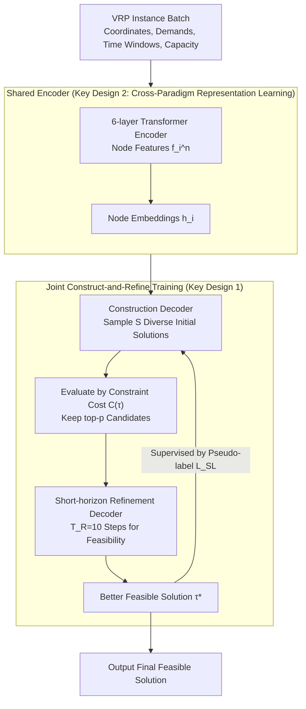

# Towards Efficient Constraint Handling in Neural Solvers for Routing Problems

**Conference**: ICLR 2026  
**arXiv**: [2602.16012](https://arxiv.org/abs/2602.16012)  
**Code**: [https://github.com/jieyibi/CaR-constraint](https://github.com/jieyibi/CaR-constraint)  
**Area**: Model Compression  
**Keywords**: Neural Combinatorial Optimization, Vehicle Routing Problem, Constraint Handling, Construct-and-Refine, Feasibility Restoration

## TL;DR

The proposed Construct-and-Refine (CaR) framework implements efficient feasibility restoration through the joint training of a construction module and a lightweight refinement module. This provides the first general and efficient neural constraint handling solution for hard-constrained routing problems, significantly outperforming classical and neural SOTA solvers on TSPTW and CVRPBLTW.

## Background & Motivation

- **VRP Constraint Challenges**: Real-world vehicle routing problems involve complex constraints (time windows, capacity, backhauls, etc.), while existing neural solvers primarily focus on simple variants.
- **Limitations of Prior Work**:
  1. **Feasibility Masking**: Excluding invalid actions in MDP—effective for simple VRPs, but calculating masks is NP-hard in complex cases (e.g., TSPTW) or overly restricts the search space (e.g., >60% nodes filtered in CVRPBLTW).
  2. **Implicit Feasibility Awareness**: Guiding via reward penalties or feature enhancement—limited effectiveness and high computational overhead.
- **Limitations of Hybrid Solvers**: Existing construct-and-refine hybrids (RL4CO, NCS) are designed for optimization objectives rather than feasibility, requiring thousands of refinement steps (e.g., 5000 steps) and potentially remaining 100% infeasible on hard-constrained VRPs.
- **Core Problem**: Can a simple, general, and efficient neural constraint handling framework be designed?

## Method

### Overall Architecture

CaR (Construct-and-Refine) integrates "constructing an initial solution" and "restoring an infeasible solution" into an end-to-end jointly trained framework. Given a batch of VRP instances, a **shared 6-layer Transformer encoder** first encodes nodes into embeddings. The **construction decoder** then samples a small batch of diverse and high-quality initial routes in parallel. After evaluating them based on the constraint cost $C(\tau)$, only the top-$p$ high-potential candidates are passed to the next stage. The **lightweight refinement decoder** then uses a minimal number of steps ($T_R=10$) to quickly fix constraint violations. The resulting improved feasible solutions $\tau^*$ serve as pseudo-labels to supervise the construction strategy, enabling both ends to collaboratively correct infeasibility and sub-optimality. The key is that refinement is no longer a lengthy 5000-step optimization process typical of traditional hybrid solvers, but is compressed into a short-horizon process of $T_R=10$ steps specifically serving the goal of "restoring feasibility."

### Key Designs

**1. Jointly Trained Feasibility Restoration: Mutual Signaling between Construction and Refinement**

Existing hybrid solvers train the constructor and refiner separately, focusing only on optimization objectives; consequently, they may remain 100% infeasible on hard-constrained VRPs even after thousands of refinement steps. CaR optimizes both modules jointly under a single objective, where the total loss is $\mathcal{L}(\theta) = \mathcal{L}(\theta^{\text{C}}) + \omega \mathcal{L}(\theta^{\text{R}})$, with $\theta^{\text{C}}$ and $\theta^{\text{R}}$ being the parameters for construction and refinement, and $\omega$ balancing the scales. The refinement module is modeled as a short-horizon Constrained MDP (CMDP), running only $T_R=10$ steps and using REINFORCE to optimize restoration quality at each step. Due to the extremely short duration, it is as efficient as a standard forward pass yet sufficient to pull infeasible solutions back into the feasible region. The better solutions produced by refinement supervise the construction end via pseudo-labels ($\mathcal{L}_{\text{SL}}$), with both ends updating and correcting errors simultaneously in each gradient step. This combination of "short refinement + joint training + mutual signaling" reduces the traditional 5000 steps to 10 and execution time from hours to minutes/seconds.

**2. Cross-Paradigm Representation Learning: Shared Encoder, Separate Decoders**

Although construction and refinement are different paradigms, they face the same routing graph. Forcing them to learn separate encodings would waste shared constraint-related knowledge. CaR uses a shared 6-layer Transformer encoder where node input features $f_i^{\text{n}} = \{x_i, y_i, q_i, l_i, u_i, \ell\}$ include coordinates, demands, time window bounds, and duration. The refinement side additionally uses cyclic positional encoding to inject the sequence structure of the current solution via synthetic attention, then uses an MLP to element-wise fuse node-level attention scores $a^{\text{n}}$ and solution-level scores $a^{\text{s}}$. Decoders are kept independent—ablations show that a unified decoder degrades performance because "construction from scratch" and "local patching" require different decision patterns. The benefits of the shared encoder are most evident in multi-constraint scenarios like CVRPBLTW, indicating that constraint awareness indeed transfers between paradigms.

**3. Flexible Constraint Handling: A Triple Strategy of Masking, Implicit Awareness, and Explicit Restoration**

Relying solely on feasibility masking is either NP-hard in complex constraints (e.g., TSPTW) or overly constrains the search space (filtering >60% nodes in CVRPBLTW, hindering RL convergence). Thus, CaR integrates three complementary strategies: **flexible masking** when computable (allowing relaxation as needed), **cross-paradigm shared representation** for implicit constraint awareness, and a **lightweight refinement process** as a final explicit feasibility restoration backup. The degree of violation is measured by a unified constraint violation cost:

$$C(\tau) = \sum_{e_{ij} \in \tau} \left[C_L(e_{ij}) + \sum_{\eta=1}^{m} C_V^{\eta}(e_{ij})\right]$$

where $C_L$ is the objective cost (e.g., path length), $C_V^{\eta}$ is the violation cost for the $\eta$-th constraint (e.g., time window lateness $t_j - u_j$) on edge $e_{ij}$, and $m$ is the number of constraint types. Unifying the objective and violations into one cost function guides the short-horizon refinement on where to fix first and provides a basis for top-$p$ candidate selection.

### Loss & Training

The construction module's training mixes three losses. The core is the policy gradient based on REINFORCE, using the average reward of $S$ trajectories sampled from the same instance as a baseline to reduce variance:

$$\mathcal{L}_{\text{RL}}^{\text{C}} = \frac{1}{S} \sum_{i=1}^{S} \left[\left(\mathcal{R}(\tau_i) - \frac{1}{S}\sum_{j=1}^{S}\mathcal{R}(\tau_j)\right) \log \pi_{\theta}^{\text{C}}(\tau_i)\right]$$

To compensate for the diversity loss from removing multi-start strategies, an entropy-based diversity loss is added to encourage exploration:

$$\mathcal{L}_{\text{DIV}} = -\sum_{t=1}^{|\tau|} \pi_{\theta}^{\text{C}}(e_t \mid \tau_{<t}) \log \pi_{\theta}^{\text{C}}(e_t \mid \tau_{<t})$$

When the refinement module produces a solution $\tau^*$ superior to the construction solution, it is used as a pseudo-label for supervised learning, allowing the construction end to absorb the refinement results ($\mathbb{I}$ is the indicator function for "refinement is better"):

$$\mathcal{L}_{\text{SL}} = -\mathbb{I} \cdot \sum_{t=1}^{|\tau^*|} \log \pi_{\theta}^{\text{C}}(e_t^* \mid \tau_{<t}^*)$$

The refinement module optimizes restoration quality at each step using REINFORCE on the short-horizon CMDP. Finally, it is combined with the construction loss via weight $\omega$ into the unified joint loss for backpropagation.

## Key Experimental Results

### TSPTW (NP-hard Mask Calculation)

| Method | n=50 Gap↓ | n=50 Infsb%↓ | n=50 Time | n=100 Gap↓ | n=100 Infsb%↓ |
|------|-----------|-------------|-----------|-----------|--------------|
| LKH-3 (100 trials) | 0.004% | 11.88% | 7m | 0.103% | 31.05% |
| PIP (neural SOTA) | - | - | - | - | - |
| NCS | - | 100% | - | - | 100% |
| **Ours (CaR)** | **best** | **best** | **6-8× faster** | **best** | **best** |

- CaR achieves 6-8× speedup while improving both feasibility and solution quality.
- Even finds feasible solutions that LKH-3 cannot.

### CVRPBLTW (Multi-constraint, Mask Over-restriction)

CaR demonstrates dominant advantages under the four-constraint combination of capacity + backhauls + duration + time windows, surpassing both classical and neural SOTA.

### Ablation Study

| Component | Effect |
|------|------|
| Joint vs. Separate Training | Joint training significantly improves feasibility and solution quality. |
| Shared vs. Independent Encoder | Shared encoder provides the largest gain in complex constraints (CVRPBLTW). |
| Diversity Loss $\mathcal{L}_{\text{DIV}}$ | Compensates for diversity loss from removing multi-start strategies. |
| Supervised Loss $\mathcal{L}_{\text{SL}}$ | Leverages refinement feedback to improve construction quality. |
| Refinement Steps 10 vs. 5000 | 10 steps achieve effective restoration; runtime reduced from hours to minutes/seconds. |

### Generality Verification

- Construction Backbone: POMO and PIP can both be integrated with CaR.
- Refinement Backbone: Compatible with NeuOpt (k-opt) and N2S (remove-and-reinsert).
- Variants: Applicable to both simple VRPs (CVRP) and complex VRPs (TSPTW, CVRPBLTW).

## Highlights & Insights

- **First Universal Scheme**: Proposes the first unified neural constraint handling framework applicable to both simple and complex VRPs.
- **Incredible Efficiency**: Compresses refinement from 5000 steps to 10, reducing runtime from hours to minutes.
- **Theoretically Novel Restoration**: Introduces explicit learned feasibility restoration to the neural solver field, filling a critical gap.
- **Cross-Paradigm Synergy**: Shared encoder enables knowledge transfer between construction and refinement, proving especially advantageous in complex constraint scenarios.

## Limitations & Future Work

- Joint training increases implementation complexity, requiring the maintenance of both construction and refinement MDPs.
- Shared encoder gains are limited on simple VRPs (no significant improvement on CVRP).
- Selection of refinement operators (k-opt, remove-reinsert) needs adjustment for different VRP variants.
- Currently only verified for scales $n \le 100$; scalability to larger scales ($n > 1000$) remains to be explored.
- Relies on synthetic instances with uniform distributions; generalization to real-world distributions is not fully verified.

## Related Work & Insights

- **Constructive Solvers**: AM, POMO, PIP—Build solutions step-by-step, handling simple constraints via masking.
- **Improvement Solvers**: NeuOpt, N2S—Iteratively improve existing solutions, requiring many steps.
- **Hybrid Solvers**: LCP, RL4CO, NCS—Combine both paradigms, but mainly target optimality in simple VRPs.
- **Constraint Handling**: Lagrangian relaxation (Tang et al.), constraint features (MUSLA), approximate masking (PIP).
- **CaR**: The first unified framework integrating flexible masking, implicit awareness, and explicit restoration.

## Rating

| Dimension | Score |
|------|------|
| Novelty | ★★★★☆ |
| Theory Depth | ★★★★☆ |
| Experimental Thoroughness | ★★★★★ |
| Value | ★★★★☆ |
| Writing Quality | ★★★★☆ |

<!-- RELATED:START -->

## Related Papers

- [\[ICLR 2026\] Constraint-guided Hardware-aware NAS through Gradient Modification](constraint-guided_hardware-aware_nas_through_gradient_modification.md)
- [\[NeurIPS 2025\] MTL-KD: Multi-Task Learning Via Knowledge Distillation for Generalizable Neural Vehicle Routing Solver](../../NeurIPS2025/model_compression/mtl-kd_multi-task_learning_via_knowledge_distillation_for_generalizable_neural_v.md)
- [\[ICLR 2026\] SERE: Similarity-based Expert Re-routing for Efficient Batch Decoding in MoE Models](sere_similarity-based_expert_re-routing_for_efficient_batch_decoding_in_moe_mode.md)
- [\[ICLR 2026\] Dr.LLM: Dynamic Layer Routing in LLMs](drllm_dynamic_layer_routing_in_llms.md)
- [\[ICLR 2026\] Towards Lossless Memory-efficient Training of Spiking Neural Networks via Gradient Checkpointing and Spike Compression](towards_lossless_memory-efficient_training_of_spiking_neural_networks_via_gradie.md)

<!-- RELATED:END -->
