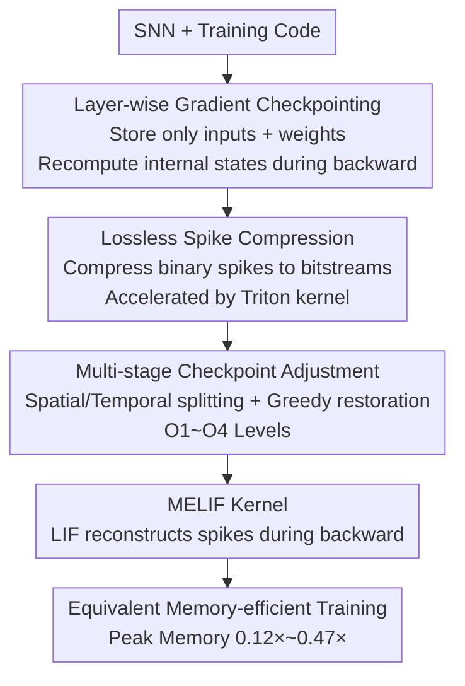

# Towards Lossless Memory-efficient Training of Spiking Neural Networks via Gradient Checkpointing and Spike Compression

**Conference**: ICLR 2026  
**OpenReview**: [https://openreview.net/forum?id=nrBJ0Uvj7c](https://openreview.net/forum?id=nrBJ0Uvj7c)  
**Code**: https://github.com/AllenYolk/snn-gradient-checkpointing  
**Area**: Model Compression / Spiking Neural Networks / Efficient Training  
**Keywords**: SNN, BPTT, Gradient Checkpointing, Lossless Spike Compression, Memory Optimization

## TL;DR
Addressing the $O(LT)$ memory explosion issue in Spiking Neural Networks (SNNs) during direct training with BPTT, this work packages "layer-wise gradient checkpointing + lossless binary spike compression + multi-stage checkpoint adjustment" into an automatic optimization pass. It reduces peak memory to 0.12×–0.47× without accuracy loss and with less than 20% slowdown.

## Background & Motivation

**Background**: SNNs utilize discrete time steps to treat themselves as RNNs with binary activations. End-to-end training using "backpropagation through time (BPTT) + surrogate gradients" is currently the most accurate and widely applicable direct training paradigm. Models like Spiking ResNet and Spiking Transformer rely on this to achieve competitive results.

**Limitations of Prior Work**: BPTT requires storing all intermediate results for $L$ layers expanded over $T$ time steps, leading to a memory complexity of $O(LT)$, whereas similar ANN structures only require $O(L)$. This makes SNNs more prone to out-of-memory (OOM) errors than ANNs, hindering training as depth and time steps increase. Existing memory-saving routes have significant drawbacks: Online learning truncates temporal gradients and executes single steps, which introduces gradient mismatch leading to performance drops in temporal tasks and incompatibility with temporal parallelism (e.g., PSN); BPTT-to-BP uses firing rate proxies to bypass the time dimension, rendering it unable to handle sequential data; reversible networks reconstruct intermediate features during the backward pass, maintaining accuracy but significantly slowing down training and imposing strict architectural constraints. Furthermore, most of these methods require manual modification of the network structure or training code, which is tedious and error-prone.

**Key Challenge**: Reducing memory overhead typically involves sacrificing accuracy, speed, generality, or ease of use—no existing method excels in all four aspects.

**Key Insight**: The authors performed a memory cost breakdown and found that SNN training memory is almost entirely occupied by "intermediate features." For an SNN with $T=4$, intermediate features (input spikes per layer + internal neuron states) account for over 96% of peak memory, while weights, gradients, and optimizer states are largely independent of $T$. In other words, memory optimization should focus on "internal states" and "input spikes."

**Core Idea**: Use classical gradient checkpointing (GC) to discard internal states and recompute them locally during the backward pass; compress the binary input spikes that must be retained into bitstreams losslessly; finally, use an automatic pass to adjust the checkpoint structure based on profiling results. This mechanism is applied non-intrusively to any layer-wise SNN.

## Method

### Overall Architecture

The entire method is an "optimization pass" that automatically reconstructs the computation graph before training. Users call `memory_optimization(net, ...)` once, passing the target layer types and a `level` setting. The pass transforms the network into a memory-efficient version with minimal changes to training code. It operates in three steps: first, **layer-wise gradient checkpointing** eliminates the storage of internal states; next, **lossless spike compression** compresses the required input spikes per layer from 32-bit floats into 1-bit bitstreams; then, **multi-stage checkpoint adjustment** adaptively inserts checkpoints in high-cost layers and reverts non-beneficial checkpoints to standard BPTT segments based on measured layer-wise memory/time. These are combined with a custom **MELIF kernel** to further save intermediate variables of LIF neurons. This pipeline reduces global peak memory while keeping the recomputation overhead of GC acceptable.

### Key Designs

**1. Layer-wise Gradient Checkpointing: Changing Internal States from "Full Storage" to "On-the-fly Recomputation"**

Standard BPTT stores the internal states $\Omega_l$ (e.g., membrane potentials) for every layer, totaling $\sum_l M_{\Omega_l}$, which is the main memory consumer in SNNs. This method applies GC to each layer $l$: during the forward pass, only the layer input $S_{l-1}$ and weights $W_l$ are retained, and internal states are discarded. During the backward pass for that layer, a local forward pass is rerun using $S_{l-1}$ and $W_l$ to reconstruct $\Omega_l$ for gradient calculation, which is released immediately after. Thus, at any moment, **only one layer's internal states are in memory**, and the peak upper bound changes from the sum of all layers to:

$$M^{peak}_{GC} \le \sum_l \big(M_{W_l} + M_{G_l} + M_{\Lambda_l} + M_{S_{l-1}}\big) + \max_l\big(M_{\Omega_l} + M_{R_l}\big).$$

Since the forward pass is much cheaper than the backward pass, the time cost of recomputation is manageable. Because SNN internal states are significantly larger than those of ANNs, the gain from GC is more pronounced.

**2. Lossless Spike Compression: Reducing Mandatory Input Spikes to 1 Bit**

After applying GC, input spikes $S_{l-1}$ must still be stored. Mainstream SNN frameworks store spikes as 32-bit floats (or 16-bit in mixed precision) for arithmetic compatibility, which is wasteful for binary values. This method stores the compressed form $\tilde S_{l-1}$ instead of the original $S_{l-1}$ during the forward pass and decompresses it when needed, further reducing the peak upper bound to:

$$M^{peak}_{GC+Comp} \le \sum_l \big(M_{W_l} + M_{G_l} + M_{\Lambda_l} + M_{\tilde S_{l-1}}\big) + \max_l\big(M_{\Omega_l} + M_{R_l}\big).$$

The compression **must be lossless** to ensure numerical equivalence with standard BPTT. The authors compared bit representation (1 bit/value, up to 32× compression), sparse representation (storing non-zero indices), and general lossless stream compression like Zstandard or ANS. Bit representation is usually faster and more efficient despite not exploiting spike sparsity, so it is the default, with Triton kernels for acceleration. Non-binary inputs (e.g., first layer $S_0$) skip compression.

**3. Multi-stage Checkpoint Adjustment: Using Profiling to Further Lower Peak Memory and Save Redundant Recomputation**

Even with GC and compression, global peak memory often concentrates on certain "critical layers." This provides room for optimization: spending more memory on non-critical layers to lower the peak in critical ones. The authors propose three strategies (Algorithm 2): **Spatial Splitting** identifies the GC segment with the highest peak and splits it along the layer dimension to insert checkpoints, ensuring $\max_l M_{\Omega_l}$ decreases since $M_{\Omega_{l^*}} > \max\{M_{\Omega_{l^*_1}}, M_{\Omega_{l^*_2}}\}$; **Temporal Splitting** cuts critical segments into $k$ temporal sub-segments along the time axis, used as a conservative supplement as it breaks temporal parallelism; **Greedy Restoration** does the opposite—for segments with memory far below the global peak, they are greedily reverted to standard BPTT segments based on forward duration to save recomputation time. These are exposed via `level`: O1 (GC+Comp), O2 (Spatial Splitting), O3 (Temporal Splitting), O4 (Greedy Restoration).

**4. MELIF: Custom Memory-efficient Kernel for LIF Neurons**

Beyond the pipeline, the method optimizes at the kernel level. For the commonly used LIF neuron, the BPTT formula derived from discrete dynamics shows that backward passes only require membrane potentials $\{H_l[t]\}$ and spikes $\{S_l[t]\}$. The authors further eliminate spike storage—$S_l[t] = \Theta(H_l[t]-V_{th})$ is used for reconstruction during backward. Floating-point spikes are discarded immediately after compression for the next layer. This Triton-based kernel, MELIF (memory-efficient LIF), is faster and more memory-efficient than SpikingJelly's CuPy version (SJLIF) or pure PyTorch (PTLIF).

## Key Experimental Results

### Main Results

Evaluated on Sequential CIFAR-10, DVS128 Gesture, CIFAR10-DVS, and ImageNet (SEW ResNet-34 / Spikformer / QKFormer). The table shows peak memory (percentage in brackets) and throughput for O4 + MELIF versus SJLIF+BPTT:

| Task / Network | Method | Throughput (sample/s) ↑ | Peak Memory (MB) ↓ |
|---|---|---|---|
| Seq. CIFAR-10 / SCNN | BPTT (SJLIF) | 4872 | 1317 |
| Seq. CIFAR-10 / SCNN | O4 (MELIF) | 5139 (1.05×) | 475 (0.36×) |
| ImageNet / SEW ResNet-34 | BPTT (SJLIF) | 309 | 8821 |
| ImageNet / SEW ResNet-34 | O4 (MELIF) | 281 (0.91×) | 2004 (0.23×) |
| ImageNet / Spikformer | BPTT (SJLIF) | 117 | 34265 |
| ImageNet / Spikformer | O4 (MELIF) | 94 (0.80×) | 7641 (0.22×) |
| ImageNet / QKFormer | BPTT (SJLIF) | 86 | 44571 |
| ImageNet / QKFormer | O4 (MELIF) | 77 (0.89×) | 5220 (0.12×) |

Peak memory is generally reduced to 0.12×–0.47×, with speed loss ≤20%. Larger models show more significant savings (0.12× for QKFormer).

### Comparison with other efficient training methods (CIFAR10-DVS, Spiking VGG)

| Category | Method | Throughput ↑ | Peak Memory (MB) ↓ | Biased Gradient | Constraints |
|---|---|---|---|---|---|
| Vanilla | BPTT | 290 | 6131 | No | None |
| Online Learning | SLTT | 297 | 737 | Yes | Single-step only |
| BPTT-to-BP | Tandem SNN | 552 | 1707 | Yes | No temporal dep. |
| Reversible Net | T-RevSNN | 191 | 1089 | No | Reversible models only |
| **Ours** | **O4** | **271** | **2349** | **No** | **Layer-wise only** |

Online learning has the lowest memory but biased gradients. BPTT-to-BP has high throughput but is biased and cannot handle temporal data. Reversible networks save memory but are slow and architecturally constrained. Ours is the only solution maintaining **mathematical equivalence to BPTT (unbiased) + acceptable speed + general layer-wise adaptation**.

### Ablation Study (CIFAR10-DVS, Spiking VGG)

| LIF Implementation / Level | Throughput ↑ | Peak Memory (MB) ↓ | Description |
|---|---|---|---|
| SJLIF | 290 | 6131 | CuPy Baseline |
| PTLIF | 151 | 5889 | Pure PyTorch, slowest |
| MELIF | 331 | 4865 | Faster/leaner with kernel change only |
| MELIF + O1 | 247 | 2888 | Adds GC+Comp, sharp memory drop |
| MELIF + O3 | 248 | 2349 | Adds Spatial/Temporal Splitting |
| MELIF + O4 | 271 | 2349 | Greedy Restoration recovers throughput |

### Key Findings

- **Clear Labor Division**: The MELIF kernel alone reduces memory from 6131 to 4865 and increases throughput from 290 to 331. O1 (GC+Comp) is the main driver for memory reduction (→2888). O3 (Splitting) further reduces it to 2349. O4 (Restoration) maintains memory while pulling throughput back to 271, validating the "split to save memory, restore to save recomputation" design.
- **Verified Equivalence**: Accuracy curves for MELIF with and without O4 on Sequential CIFAR-10 overlap perfectly, proving GC and compression introduce no bias. Small differences from SJLIF result from Triton vs. CuPy numerical implementations, falling within baseline error margins.
- **Wide Compatibility**: Works with temporal parallel PSN (O4 reduces ImageNet SEW ResNet-34 to 0.33×), AMP, and LOMO—while online learning and BPTT-to-BP are fundamentally incompatible with temporal parallelism.
- **Real-world Unlocking**: For QKFormer/ImageNet, batch size can be increased nearly 8× with similar memory (8→64 leads to 1.43× speedup); DH-SFNN on SHD can increase $T$ by 4× for finer resolution; SpikeVideoFormer on Kinetics-400 allows training on a 24GB 4090 instead of 8×A6000.

## Highlights & Insights

- **Quantification First**: Memory cost breakdown proves 96%+ SNN training memory is in intermediate features, pinpointing the target for optimization.
- **Lossless Compression as a First-class Citizen**: 1-bit bitstreams + Triton kernels save 32× space while ensuring bit-wise lossless reconstruction, maintaining strict equivalence with BPTT unlike "biased" methods.
- **Spatial-Temporal Duality**: Spatial/Temporal splitting "inserts checkpoints to lower peaks," while Greedy Restoration "removes checkpoints to save recomputation." Balancing these via profiling automates the memory-speed trade-off.
- **Zero-intrusive Engineering**: Packaged as a `memory_optimization` pass with a single knob, it turns academic research into a "one-line change" tool.

## Limitations & Future Work

- **Layer-wise Only**: GC granularity is "layer," and adaptation to non-layer-wise, strongly coupled structures is unknown.
- **Temporal Splitting Cost**: Cutting along the time axis breaks temporal parallelism and kernel fusion, making it a conservative supplement to spatial splitting.
- **Speed Loss**: Although ≤20%, recomputation trades time for memory, which may not be ideal where compute is scarce but memory is abundant.
- **Future Directions**: Automating splitting point selection and `level` settings (instead of manual specification) and exploring adaptive compressors based on sparsity.

## Related Work & Insights

- **vs Online Learning (SLTT / OTTT / NDOT)**: These have lower memory but biased gradients and lack temporal parallelism; ours is **unbiased and PSN-compatible**.
- **vs BPTT-to-BP (Tandem SNN / Rate-based)**: High throughput but biased and unsuitable for strong temporal dependencies; ours is mathematically equivalent to BPTT.
- **vs Reversible Networks (RevSResNet / T-RevSNN)**: These also maintain accuracy but have strict architectural constraints and are slower; ours is more general and faster.
- **vs Existing SNN Temporal GC (Singh 2022 / Bencheikh 2024)**: Previous works only did temporal GC for large $T$ ($T\ge100$) and lacked automation; this work performs combined spatial/temporal GC + compression + auto-pass.

## Rating
- Novelty: ⭐⭐⭐⭐ Targeted combination of GC for SNNs (internal state recomputation + binary lossless compression + auto-adjustment) is a clever system-level innovation.
- Experimental Thoroughness: ⭐⭐⭐⭐⭐ Covers 4 tasks, multiple architectures (CNN/Transformer/PSN/DH-LIF), cross-method comparisons, equivalence verification, and real case studies.
- Writing Quality: ⭐⭐⭐⭐⭐ Logical derivation from memory breakdown to algorithm layers, with clear design intent.
- Value: ⭐⭐⭐⭐⭐ Lossless, zero-intrusive, up to 8× memory savings, significantly lowering the hardware barrier for large-scale SNN training.

<!-- RELATED:START -->

## Related Papers

- [\[ICLR 2026\] Cannistraci-Hebb Training on Ultra-Sparse Spiking Neural Networks](cannistraci-hebb_training_on_ultra-sparse_spiking_neural_networks.md)
- [\[ICLR 2026\] Otters: An Energy-Efficient Spiking Transformer via Optical Time-to-First-Spike Encoding](otters_an_energy-efficient_spiking_transformer_via_optical_time-to-first-spike_e.md)
- [\[ICLR 2026\] Quantized Gradient Projection for Memory-Efficient Continual Learning](quantized_gradient_projection_for_memory-efficient_continual_learning.md)
- [\[ICLR 2026\] Robust Training of Neural Networks at Arbitrary Precision and Sparsity](robust_training_of_neural_networks_at_arbitrary_precision_and_sparsity.md)
- [\[NeurIPS 2025\] Spiking Brain Compression: Post-Training Second-Order Compression for Spiking Neural Networks](../../NeurIPS2025/model_compression/spiking_brain_compression_post-training_second-order_compression_for_spiking_neu.md)

<!-- RELATED:END -->
