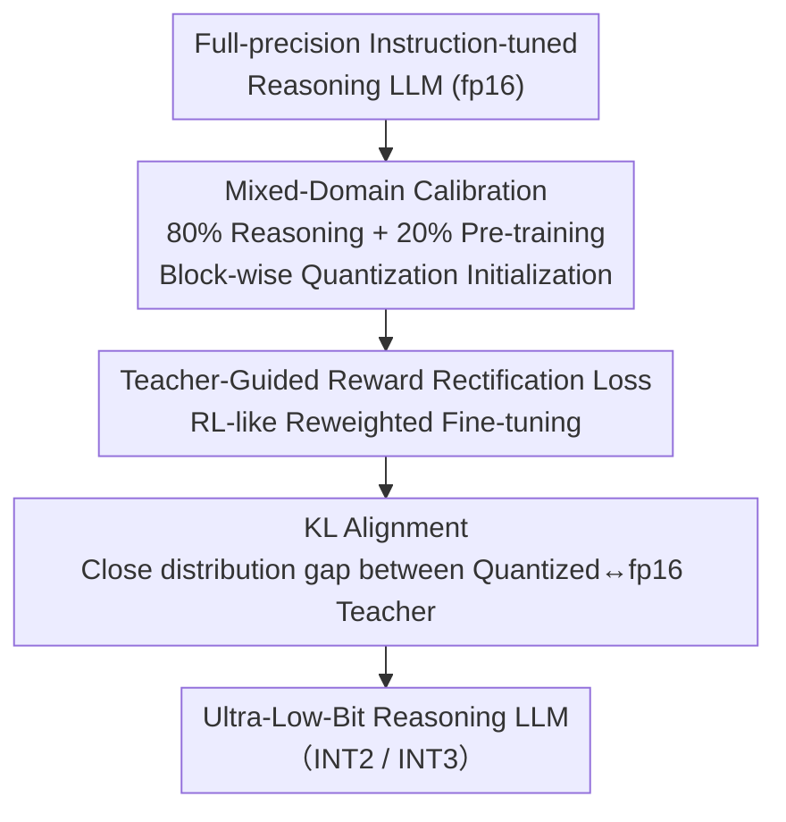

# Towards Quantization-Aware Training for Ultra-Low-Bit Reasoning LLMs

**Conference**: ICLR 2026  
**OpenReview**: [https://openreview.net/forum?id=Azsd2qyK6C](https://openreview.net/forum?id=Azsd2qyK6C)  
**Code**: https://github.com/yasu0001/ReasoningQAT  
**Area**: Model Compression  
**Keywords**: Quantization-Aware Training, Ultra-Low-Bit Quantization, Reasoning LLM, Mixed-Domain Calibration, Reward Rectification Loss

## TL;DR
To address the issue where ultra-low-bit ($\le$ 2 bit) quantization severely degrades reasoning capabilities, this paper proposes a two-stage QAT pipeline for reasoning LLMs. The first stage performs block-wise quantization calibration using "80% Reasoning + 20% Pre-training" mixed-domain data, and the second stage employs a teacher-guided reward rectification loss for fine-tuning. The 2-bit quantized Qwen3-8B outperforms the PTQ baseline by an average of 50.45% across five reasoning benchmarks.

## Background & Motivation
**Background**: Weight quantization is a dominant approach for deploying LLMs on edge devices. Quantization-Aware Training (QAT) is particularly effective for ultra-low-bit ($< 4$ bit) scenarios as it continues fine-tuning weights under quantization constraints, allowing 2-bit models to approach the performance of fp16 models, which is significantly more stable than Post-Training Quantization (PTQ). A typical QAT pipeline involves two steps: first initializing quantized weights with a small amount of calibration data, then performing end-to-end fine-tuning using self-supervised or distillation losses.

**Limitations of Prior Work**: Existing QAT methods are almost exclusively designed for "instruction-tuned models." Calibration data is usually a subset of pre-training data, and fine-tuning uses standard cross-entropy or distillation losses. However, when applied to **reasoning models subjected to post-training (SFT + Preference Optimization)**, reasoning benchmarks such as math, code, and instruction following experience catastrophic performance drops—2-bit GPTQ/AWQ scores pull nearly to zero on MATH-500.

**Key Challenge**: The authors emphasize the "heterogeneous knowledge structure" introduced by post-training. Commonsense knowledge from pre-training and reasoning capabilities from post-training have **different sensitivities** to quantization. A key experiment (Figure 2) shows that increasing the proportion of reasoning data in 3-bit calibration from 0 to 100% leaves commonsense accuracy unchanged while significantly improving math/code/science accuracy. t-SNE visualizations also reveal that pre-training activations are tightly clustered, whereas reasoning activations are highly dispersed. This suggests that reasoning capabilities suffer from "domain shift" and are highly sensitive to calibration data, while commonsense is more robust. Single-domain calibration inevitably fails to balance both.

**Goal**: Design a QAT pipeline specifically for reasoning LLMs to **concentrate computational effort on preserving hard-to-recover reasoning capabilities**, while maintaining commonsense knowledge with minimal input.

**Core Idea**: A two-stage process: (1) **Mixed-domain calibration** biased towards reasoning for block-wise quantization to "anchor" both abilities; (2) **Teacher-guided reward rectification loss** fine-tuning to "pull back" reasoning capabilities like RL, but without the high cost of online sampling.

## Method

### Overall Architecture
The pipeline takes a full-precision instruction-tuned reasoning model (Qwen3 series) and outputs an ultra-low-bit (2/3-bit) quantized model that retains reasoning capabilities through two sequential stages. The first stage is **block-wise quantization calibration**: using a calibration set of 80% reasoning data + 20% pre-training data to fit quantization parameters block-by-block. The second stage is **end-to-end fine-tuning**: keeping the quantization structure fixed and using a teacher-guided reward rectification loss (modifying cross-entropy to be "RL-like") combined with a KL loss to align with the fp16 teacher distribution.

### Key Designs

**1. Mixed-Domain Calibration Data: Balancing Reasoning and Commonsense**

The analysis in Section 3.1 demonstrates that calibration with pure pre-training data leads to high reasoning errors due to domain shift, while pure reasoning data drags down commonsense tasks. This paper proposes a calibration set consisting of **80% reasoning data (OpenThoughts-1.2M, including math/code/science) + 20% pre-training data (FineWeb-Edu)**. The focus is on reasoning because these capabilities are difficult to recover once lost, while the 20% pre-training data serves to cover the pre-training distribution and preserve commonsense. During block-wise quantization, only scales are fine-tuned (following EfficientQAT) using 4096 samples with a context length of 2048.

**2. Teacher-Guided Reward Rectification Loss: RL-style Rectification without Sampling Costs**

To recover reasoning capabilities, standard SFT lacks generalization, while Reinforcement Learning (RL) is balance but computationally expensive due to online sampling. This work draws on reward rectification, which effectively multiplies the SFT loss by a dynamic reweighting factor to make it "RL-like." The original form is $L(\theta) = L_{\mathrm{SFT}}(\theta)\cdot \mathrm{sg}(1/w)$, where $\mathrm{sg}(\cdot)$ is the stop-gradient operator. When $w = 1/\pi_\theta(y\mid x)$, its gradient equals an on-policy policy gradient update with reward $r(x,y)=\mathbb{1}[y=y^*]$, improving generalization without extra sampling.

However, since quantized model distributions are unreliable due to precision loss, reweighting with the model's own $\pi_\theta$ amplifies errors. Instead, the **teacher model** (fp16 model) probability $\pi_t(y^*\mid x)$ is used for reweighting:

$$L_t(\theta) = L_{\mathrm{SFT}}(\theta)\cdot \mathrm{sg}\big(\pi_t(y^*\mid x)\big)$$

When the quantized model's probability for the correct label is lower than the teacher's, the loss is amplified to force alignment.

**3. KL Divergence Alignment: Recovering the Global Distribution**

Reward rectification only focuses on the label token. To align the **global output distribution**, a KL divergence loss is added. The final objective is:

$$L(\theta) = \alpha L_t(\theta) + \beta D_{\mathrm{KL}}\big(\pi_T(\cdot\mid x)\,\Vert\,\pi_S(\cdot\mid x)\big)$$

Where $\pi_T$ is the fp16 teacher and $\pi_S$ is the quantized student. $\alpha, \beta$ control the weights (default $\alpha=0.2, \beta=1.0$, KL computed on top-20 probabilities).

### Loss & Training
Training occurs in two stages. Calibration: 4096 samples, 2048 context, learning rate 1e-4 for quantization parameters and 1e-5 for weights (2e-5 for 2-bit weights). Fine-tuning: 32768 samples from OpenThoughts-1.2M, AdamW + cosine annealing, batch 64. 3-bit models run for 1 epoch at 1e-6 LR; 2-bit 1.7B models run for 3 epochs with weight LR 5e-6.

## Key Experimental Results

### Main Results
Comparison on Qwen3 series across five benchmarks (MATH-500, LiveCodeBench, MMLU-Redux, GPQA-Diamond, IFEval), with group size = 128 and bf16 activations (W/A = 2 or 3 / 16).

| Model | Method | Bit-width(W/A) | Avg (5 tasks) | Note |
|------|------|-----------|-----------|------|
| Qwen3-8B | FP Baseline | bf16 | 80.5 | Upper bound |
| Qwen3-8B | GPTQ | 2/16 | 4.6 | PTQ collapse |
| Qwen3-8B | AWQ | 2/16 | 4.0 | PTQ collapse |
| Qwen3-8B | **Ours** | 2/16 | **55.1** | ~50.45% above PTQ |
| Qwen3-1.7B | GPTQ | 3/16 | 28.3 | — |
| Qwen3-1.7B | AWQ | 3/16 | 36.5 | — |
| Qwen3-1.7B | **Ours** | 3/16 | **55.2** | 18.71% above PTQ |

Under 2-bit settings, PTQ methods effectively fail on MATH-500, whereas the proposed method maintains 80.4 (8B), scaling effectively with model size.

### Ablation Study
Table 4: Dissecting block-wise calibration (C) and loss selection (S for standard SFT, R for Reward Rectification), 2-bit Qwen3-1.7B.

| Config | MATH-500 | LiveCodeBench | IFEval | Note |
|------|----------|---------------|--------|------|
| S | 1.4 | 0.0 | 10.72 | SFT alone is ineffective |
| R | 1.60 | 0.0 | 12.20 | New loss cannot recover without calibration |
| C+S | 22.70 | 0.00 | 23.66 | Calibration + Standard SFT |
| **C+R** | **38.13** | **5.75** | **31.61** | Calibration + Ours (Optimal) |

### Key Findings
- **Calibration and loss are indispensable pillars**: Lacking calibration (S/R) leads to collapse; lacking the new loss (C+S) is significantly weaker than C+R.
- **Mixed-domain calibration protects both ends**: 80/20 mixing matches pure reasoning calibration in reasoning tasks while preserving commonsense.
- **Effectiveness increases with capacity constraints**: The performance gain over PTQ is more pronounced as bit-widths and parameters decrease.

## Highlights & Insights
- **Explicit Domain Diagnosis**: Proving reasoning sensitivity versus commonsense robustness through t-SNE and data scaling provides a solid, verifiable motivation for the 80/20 budget.
- **Teacher-Guiding as an Anchor**: Switching from "student-calculated reweighting" to "teacher-calculated reweighting" prevents the quantized model from amplifying its own errors.
- **RL Benefits at SFT Efficiency**: Implementing reward rectification provides the generalization benefits of on-policy RL without the overhead of online generation.

## Limitations & Future Work
- Experiments are focused on the Qwen3 series; generalizability across architectures like Llama or MoE is not yet verified.
- Only weight quantization was explored; combined weight-activation quantization or extreme 1-bit scenarios remain for future work.
- Key hyperparameters like the 80/20 mix and loss weights rely on empirical settings.

## Related Work & Insights
- **vs EfficientQAT / BitDistiller**: These prioritize instruction models. This work demonstrates that mixed-domain calibration and teacher-guided rectification are superior for reasoning-heavy models.
- **vs BitNet b1.58 2B4T**: While BitNet is trained from scratch on 4T tokens, our 2-bit Qwen3-1.7B uses $<1$B tokens to outperform it in mathematical reasoning, highlighting a more efficient reuse of existing strong models.

## Rating
- Novelty: ⭐⭐⭐⭐ 
- Experimental Thoroughness: ⭐⭐⭐⭐ 
- Writing Quality: ⭐⭐⭐⭐ 
- Value: ⭐⭐⭐⭐ 

<!-- RELATED:START -->

## Related Papers

- [\[ICLR 2026\] Compute-Optimal Quantization-Aware Training](compute-optimal_quantization-aware_training.md)
- [\[AAAI 2026\] SpecQuant: Spectral Decomposition and Adaptive Truncation for Ultra-Low-Bit LLMs Quantization](../../AAAI2026/model_compression/specquant_spectral_decomposition_and_adaptive_truncation_for_ultra-low-bit_llms_.md)
- [\[ICLR 2026\] Quant-dLLM: Post-Training Extreme Low-Bit Quantization for Diffusion Large Language Models](quant-dllm_post-training_extreme_low-bit_quantization_for_diffusion_large_langua.md)
- [\[ICLR 2026\] Metis: Training LLMs with FP4 Quantization](metis_training_llms_with_fp4_quantization.md)
- [\[ICLR 2026\] SliderQuant: Accurate Post-Training Quantization for LLMs](sliderquant_accurate_post-training_quantization_for_llms.md)

<!-- RELATED:END -->
