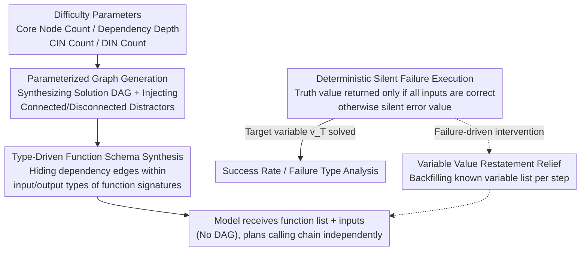

# Towards Reliable Benchmarking: A Contamination Free, Controllable Evaluation Framework for Multi-step LLM Function Calling

**Conference**: ICLR 2026  
**arXiv**: [2509.26553](https://arxiv.org/abs/2509.26553)  
**Area**: Video Understanding  
**Keywords**: Tool-augmented LLM, Multi-step function calling, benchmark, data contamination, DAG traversal

## TL;DR

Ours proposes the FuncBenchGen framework, which models multi-step function calling as a DAG traversal problem to achieve data contamination-free evaluation with fine-grained task difficulty control. It reveals critical failure modes of reasoning models under long calling chains and connected distracting functions.

## Background & Motivation

Existing Tool-augmented LLM (TaLM) evaluation benchmarks face two core issues:

**Data Contamination Risk**: The QA pairs of existing benchmarks (e.g., API-Bank, BFCLv4, ToolBench) may be leaked in pre-training data or web searches during testing, leading to unreliable evaluation results.

**Uncontrollable Task Complexity**: Existing benchmarks lack fine-grained control over task difficulty, making it impossible to systematically analyze which factors most significantly affect model performance.

| Benchmark | No Contamination | Function Set Size Control | Dependency Depth Control | Distractor Type Control |
|-----------|------------------|---------------------------|--------------------------|-------------------------|
| API-Bank | ✗ | ✗ | ✗ | ✗ |
| BFCLv4 | ✗ | ✓ | ✗ | ✗ |
| ToolBench | ✗ | ✓ | ✗ | ✗ |
| **FuncBenchGen** | **✓** | **✓** | **✓** | **✓** |

## Method

### Overall Architecture

FuncBenchGen formalizes "multi-step function calling" as a **Directed Acyclic Graph (DAG) traversal problem**: given a function set $\mathcal{F}=\{f_1,\ldots,f_n\}$, a set of known input variables $\mathcal{V}_{input}$, and a target variable $v_T$, the model must plan and iteratively execute a sequence of function calls, feeding intermediate results to downstream functions to eventually calculate the value of $v_T$. The pipeline operates as follows: first, a dependency graph is procedurally synthesized based on four difficulty parameters; each graph node is then instantiated as a function with type signatures (the function list is provided to the model without the dependency graph); the model plans and executes the calling chain based on this; the execution phase uses a "truth value returned only if all inputs are correct, otherwise silent error" rule to amplify state errors; finally, failure analysis drives a lightweight "variable value restatement" intervention loop. Since the graph and answers are procedurally generated during evaluation, there is no risk of contamination by pre-training corpora, and task difficulty can be independently adjusted across different dimensions.

### Key Designs

**1. Parameterized Graph Generation: Decomposing Difficulty into Independent Control Knobs**

To make difficulty "controllable," it is crucial to decouple the dimensions of task complexity. FuncBenchGen achieves this using four generation parameters, each corresponding to an independent source of difficulty. $n^{\text{core}}$ is the number of core nodes (the quantity of functions required for the solution), which directly determines the length of the calling chain; $d$ is the dependency depth, characterizing the number of serial layers from input to target—the greater the depth, the easier it is for errors to accumulate. Generation begins with a node sequence of length $d$ to ensure a valid solution path, followed by iterative addition of the remaining $n^{\text{core}}-(d+1)$ core nodes (maintaining acyclicity and depth constraints). Two additional parameters inject distractors: $n^{\text{conn}}$ represents Connected Irrelevant Nodes (CIN), which are attached as children of core nodes to share type-compatible variables, making them difficult to distinguish; $n^{\text{dis}}$ represents Disconnected Irrelevant Nodes (DIN), isolation nodes with no variable connections to the core subgraph, which theoretically should be easily excluded. Decoupling these knobs allows for systematic answers to whether chain length, depth, or specific distractor types most impact performance.

**2. Type-Driven Function Schema Synthesis: Manifesting DAG Edges in Function Signatures**

After graph construction, each node is instantiated as a complete function definition: a randomly generated function name (e.g., `func_yep`), input/output parameters with semantic type annotations, and a natural language description. Crucially, the dependency edges between nodes are **not** explicitly told to the model but are hidden within the type system: a usable data path exists only when the output type of an upstream function matches the input type (or its subtype) of a downstream function. The model receives only a list of functions and initial input variables and must perform "type inference" to reverse-engineer which calling path transforms inputs to the target. This ensures the tasks are synthesized at evaluation time to prevent contamination and replicates the core challenge in real-world tool orchestration: constructing a calling chain from API signatures.

**3. Deterministic Silent Failure Execution: Enforcing State Tracking via "One-Step Error, Total Failure"**

Each variable is assigned a three-digit random integer truth value. A function returns the correct output only if all inputs precisely match their truth values; otherwise, it returns a random error value **without throwing an exception**. This silent failure mode mimics real APIs: if a model uses an unknown or incorrect variable value, subsequent calls return plausible but incorrect results, quietly amplifying the error to the endpoint. Consequently, the evaluation assesses state tracking over multiple calls rather than just syntax—a single state error collapses the entire chain.

**4. Variable Value Restatement Strategy: Externalizing Working Memory**

Failure analysis indicates that most errors involve "using unknown/incorrect values" (79.6% of GPT-5 errors) rather than "calling incorrect functions." Based on this, a minimal intervention is proposed: each time a function returns, the system provides a list of all currently known variables and their values alongside the output. This step **provides no new information** but explicitly restores the state the model should have tracked to the context. Its effectiveness proves that the bottleneck in multi-step tool use is working memory rather than reasoning—success rates rose significantly (from 62.5% to 81.3% for GPT-5) once the state was externalized.

## Key Experimental Results

### Main Results: Success Rate vs. Core Node Count

| Model | 5 Core Nodes | 10 Core Nodes | 20 Core Nodes |
|-------|--------------|---------------|---------------|
| GPT-5 | 72.5% | 38.2% | 15.0% |
| Gemini-2.5-Pro | 46.5% | 14.4% | 6.0% |
| GPT-5-mini | 16.0% | 7.6% | 4.2% |
| Qwen3 | 11.0% | 8.2% | 3.8% |
| GPT-4.1 | 12.0% | 2.2% | 0.2% |

### Failure Type Analysis

| Failure Type | GPT-5 | Gemini-2.5-Pro | Qwen3 | GPT-4.1 |
|--------------|-------|----------------|-------|---------|
| Function Not Found | 0.0% | 2.4% | 0.0% | 0.0% |
| Wrong Argument Count | 0.0% | 0.2% | 0.1% | 0.0% |
| Using Unknown Value | 79.6% | 69.1% | 74.0% | 73.2% |
| Using Incorrect Value | 20.4% | 28.3% | 25.8% | 26.8% |

### Dependency Depth Impact

- GPT-5 achieves nearly 90% success at depth 1 (star structure), dropping to below 30% as depth increases to 4-8.
- Path structures (depth 8-9) show slight improvement over medium branching structures (depth 5-7), suggesting serialized chains with fewer branches are easier to process.
- Larger reasoning budgets (medium vs. minimal) significantly improve performance in complex scenarios.

### Key Findings

1. **Reasoning models significantly outperform general models**: GPT-5 reaches 72.5% at 5 core nodes, while GPT-4.1 achieves only 12.0%.
2. **Performance drops sharply with sequence length**: GPT-5 decreases from 72.5% (5 nodes) to 15.0% (20 nodes).
3. **Connected Irrelevant Nodes (CIN) are the most harmful**: Shared type-compatible variables make it difficult for models to distinguish relevant from irrelevant functions.
4. **Mitigation strategies are highly effective**: Variable restatement improved GPT-5's success rate from 62.5% to 81.3%.
5. **Inefficiency in GPT-5 calls**: Even when successful, GPT-5 calls approximately 10% redundant functions.
6. **Reasoning budget is critical**: Under minimal thinking budget, GPT-5's success rate falls below 20% when distractors are present.

## Highlights & Insights

1. **Elegant Formalization**: Abstracting tool use as a DAG traversal problem allows for the orthogonal decomposition of evaluation dimensions.
2. **Profound Failure Analysis**: Reveals that the primary weakness of all models is **state tracking** rather than grammatical understanding—79.6% of GPT-5 errors stem from using unknown variable values.
3. **Simple yet Effective Mitigation**: Restating known variable values (without providing new information) significantly boosts performance, indicating that LLM working memory is the core bottleneck for multi-step tool use.
4. **Warning for the MCP Ecosystem**: Even disconnected distractor functions severely degrade GPT-5 performance (<10%) when the function set size reaches 40, implying LLMs are not yet ready for large-scale Model Context Protocol (MCP) servers.
5. **Failure Mode Differences Reveal Model Character**: Upon failure, GPT-5 tends to make multiple attempts (calling more functions), whereas Gemini-2.5-Flash tends to give up (calling fewer functions).

## Limitations & Future Work

1. There is a gap between synthetic functions and real APIs, where function semantics are more complex.
2. Only DAG structures are considered, excluding complex control flows like conditional logic and loops.
3. Each function is fixed to one output variable; multi-output functions are not supported.
4. The capabilities of small open-source models on this task were not evaluated.
5. Function connections are established via type matching, lacking evaluation of natural language semantic reasoning.
6. Recovery and retry capabilities after call failures were not considered.

## Rating ⭐⭐⭐⭐

A systematic and deeply analytical framework for evaluation. The core contribution lies in identifying the state tracking bottleneck in multi-step LLM tool use, providing important guidance for Agent system design. The DAG modeling is elegant, and while the mitigation strategy is simple, the insights are profound. Weaknesses include the distance between synthetic tasks and real-world scenarios, and the classification under video understanding despite the topic focusing on LLM Agent evaluation.

<!-- RELATED:START -->

## Related Papers

- [\[ICLR 2026\] BeyondBench: Contamination-Resistant Evaluation of Reasoning in Language Models](beyondbench_contamination-resistant_evaluation_of_reasoning_in_language_models.md)
- [\[ICLR 2026\] STAR: Similarity-guided Teacher-Assisted Refinement for Super-Tiny Function Calling Models](star_similarity-guided_teacher-assisted_refinement_for_super-tiny_function_calli.md)
- [\[ICLR 2026\] ODESteer: A Unified ODE-Based Steering Framework for LLM Alignment](odesteer_a_unified_ode-based_steering_framework_for_llm_alignment.md)
- [\[ICLR 2026\] The Unseen Frontier: Pushing the Limits of LLM Sparsity with Surrogate-Free ADMM](the_unseen_frontier_pushing_the_limits_of_llm_sparsity_with_surrogate-free_admm.md)
- [\[ICLR 2026\] IDER: IDempotent Experience Replay for Reliable Continual Learning](ider_idempotent_experience_replay_for_reliable_continual_learning.md)

<!-- RELATED:END -->
