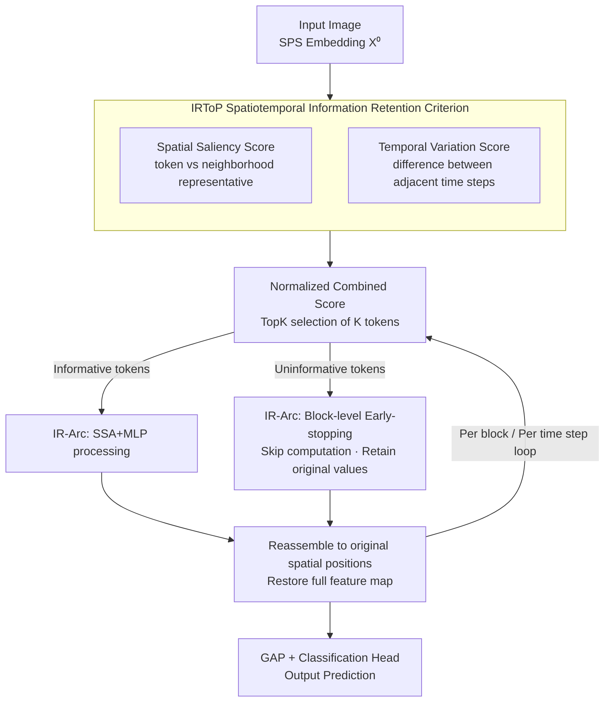

# TP-Spikformer: Token Pruned Spiking Transformer

**Conference**: ICLR 2026  
**OpenReview**: [https://openreview.net/forum?id=L5llQD0nMf](https://openreview.net/forum?id=L5llQD0nMf)  
**Code**: None  
**Area**: Model Compression  
**Keywords**: Spiking Neural Networks, Spiking Transformer, Token Pruning, Training-free, Spatiotemporal Saliency

## TL;DR
To address the high deployment overhead of Spiking Transformers, this paper proposes TP-Spikformer, a **training-free and architecture-invariant** token pruning method. It employs a neuroscience-inspired "Information Retention-driven Token Pruning" (IRToP) criterion to score tokens and a "Block-level Early-stopping Architecture" (IR-Arc) that allows unimportant tokens to skip subsequent computations instead of being deleted. Without fine-tuning, it achieves up to a 48% reduction in computational cost on ImageNet across multiple architectures and tasks, with only a 0.5–1.5% decrease in accuracy.

## Background & Motivation

**Background**: Spiking Neural Networks (SNNs) transmit information via binary spikes and event-driven mechanisms. Since only a subset of neurons is activated for synaptic accumulation, SNNs are inherently energy-efficient and suitable for neuromorphic hardware. Integrating Transformers into SNNs has led to models like Spikformer, QKFormer, and Spike-driven Transformer (SDT) V1/V3, which achieve high accuracy on large-scale benchmarks.

**Limitations of Prior Work**: High accuracy comes at the cost of scale. For instance, SDT-V3 achieves 86.2% accuracy on ImageNet but carries 173M parameters, 1384MB of memory overhead, and 28.4 billion synaptic operations per second—negating the energy-efficiency advantages of SNNs and hindering deployment on edge devices. While token pruning is a natural compression route (as visual predictions often rely on a subset of tokens), existing SNN token pruning methods (SparseSpikformer, AT-SNN, STATA) share two major drawbacks: they **modify the original architecture** (introducing extra tokens or trainable modules) and **require retraining**, leading to high costs and poor generalizability.

**Key Challenge**: Traditional compression requires structural changes and retraining, which increases application costs and weakens "plug-and-play" potential. Furthermore, existing methods typically use only the firing rate to measure token importance, **failing to exploit the unique temporal dimension of SNNs**, and are often validated only on single architectures or small datasets.

**Goal**: Design a token importance criterion that captures both spatial saliency and temporal dynamics, along with a pruning execution method that is architecture-invariant, requires no retraining, and is compatible with hierarchical Spiking Transformers using feature pyramids.

**Key Insight**: Drawing inspiration from neuroscience, the human visual system does not process all information equally; it prioritizes regions that are **spatially salient** (distinct from surroundings) or **temporally abrupt**. Applying this selective attention mechanism to Spiking Transformers allows for a heuristic criterion to identify "informative" tokens.

**Core Idea**: Use "spatial dissimilarity + temporal variation" to heuristically score tokens (IRToP). Then, implement **block-level early-stopping** for unimportant tokens (skipping SSA/MLP while retaining original values) via IR-Arc, reducing computational cost while minimizing information loss under zero-finetuning.

## Method

### Overall Architecture

TP-Spikformer is a **pruning plugin inserted before each block of a pre-trained Spiking Transformer**. After the input image generates spatiotemporal features $\mathbf{X}^0 \in \mathbb{R}^{T\times H\times W\times D}$ via Spiking Patch Embedding (SPS), at each block and time step $t$, the IRToP criterion scores $H\times W$ tokens. Based on a pruning rate $r_\ell$, TopK selection identifies the "informative token" set $\mathbf{I}$ and the "uninformative token" set $\mathbf{U}$. Informative tokens proceed through the standard SSA + MLP of the block, while uninformative tokens undergo **block-level early-stopping** (skipping computation and retaining original values). Finally, both sets are **reassembled** into their original spatial positions to restore the full feature map for the next block. After all blocks, global average pooling (GAP) and the classification head (CH) produce the prediction. This process introduces no trainable parameters, enabling **zero-finetuning** execution on official pre-trained weights.

### Key Designs

**1. Spatial Saliency Scoring: Measuring "uniqueness" via cosine dissimilarity with neighborhood representatives**

In human vision, spatial locations compete for saliency; only regions distinct from the local environment are preserved. The authors measure the representation difference between each token and its spatial "representative token": for a token $\mathbf{X}^{\ell-1}_{t,h,w}$ at position $(h,w)$, the mean $\mathbf{Y}^{\ell-1}_{t,h,w}$ of all tokens within a $k\times k$ window is taken as the local context representative. The cosine dissimilarity is calculated as:

$$\mathcal{S}_{\mathrm{score}}(\mathbf{X}^{\ell-1}_{t,h,w}) = 1 - \frac{\langle \mathbf{X}^{\ell-1}_{t,h,w}, \mathbf{Y}^{\ell-1}_{t,h,w}\rangle}{|\mathbf{X}^{\ell-1}_{t,h,w}|\cdot|\mathbf{Y}^{\ell-1}_{t,h,w}|}.$$

Using a "mean representative token" instead of pairwise comparisons reduces complexity from $O(k^2)$ to a single convolution (implemented as a Conv2d with a $k\times k$ all-ones mean kernel). Scores are normalized to $[0,1]$ per feature map; higher scores indicate a token is more "distinct." This branch captures spatial saliency within a single frame.

**2. Temporal Variation Scoring: Capturing unique SNN temporal information via differences between adjacent time steps**

This is the key differentiator from existing methods that only look at firing rates. SNNs process the same input over $T$ time steps; the change between adjacent steps carries true temporal dynamics, which firing rates average out. The authors calculate the variation magnitude for each token across adjacent time steps:

$$\mathcal{T}_{\mathrm{score}}(\mathbf{X}^{\ell-1}_{t,h,w}) = \begin{cases} |\mathbf{X}^{\ell-1}_{t,h,w} - \mathbf{X}^{\ell-1}_{t-1,h,w}|, & t>1, \\ |\mathbf{X}^{\ell-1}_{t,h,w}|, & t=1, \end{cases}$$

This is also normalized within each time step. Larger variations indicate richer temporal information and higher retention priority. IRToP combines the normalized spatial and temporal scores by **direct addition**: $\mathrm{IRToP} = \hat{\mathcal{S}}_{\mathrm{score}} + \hat{\mathcal{T}}_{\mathrm{score}}$. The TopK tokens are retained: $K=\lceil(1-r_\ell)\times H\times W\rceil$. Ablations show both branches are essential.

**3. IR-Arc Block-level Early-stopping Pruning: Skipping instead of deleting for training-free compatibility**

To execute pruning, directly deleting (Drop) tokens changes the feature map size, which is incompatible with hierarchical architectures like QKFormer (causing "Fail" in ablations). IR-Arc uses **early-stopping**: in the $\ell$-th block, informative tokens proceed with complete computation $\mathbf{X}^\ell_{t,\mathrm{inf}}=\mathrm{MLP}(\mathrm{SSA}(\mathbf{I})+\mathbf{I})+\dots$, while uninformative tokens skip the SSA/MLP and retain their original values $\mathbf{X}^\ell_{t,\mathrm{uni}}=\mathbf{U}^{\ell-1}_t$. "Reassemble" then merges them back based on original coordinates.

Benefits include: **Efficiency** (uninformative tokens skip self-attention and MLP), **Information Preservation** (pruned tokens are preserved rather than discarded), and **Universality** (consistent feature map sizes allow seamless application to hierarchical architectures). Crucially, since no trainable modules are involved, it can run on pre-trained weights with **zero-finetuning**.

### Loss & Training
The method is **training-free**: it introduces no new parameters and requires no structural modifications. It performs pruning directly during inference using official pre-trained weights. Pruning rates are set per-block (lower in shallow layers, higher in deep layers).

## Key Experimental Results

### Main Results

Cross-architecture validation on ImageNet (Excerpts from Table 2, "S" indicates no extra parameters/retraining, $N_{avg}$ is the average token retention rate):

| Architecture | $N_{avg}$ | OPs$_{block}$ | Power | Acc. | Throughput |
|------|-----------|---------------|-------|------|------|
| SDT-V1-8-768 | ×1 (Base) | 9.04G | 10.26mJ | 76.32% | 156 |
| SDT-V1-8-768 | ×0.51 | 4.71G (↓48%) | 6.36mJ (↓38%) | 74.79% (-1.53) | 202 (↑29%) |
| QK-10-768 | ×1 (Base) | 15.08G | 32.12mJ | 85.56% | 75 |
| QK-10-768 | ×0.53 | 7.97G (↓47%) | 25.71mJ (↓20%) | 82.53% (-3.03) | 106 (↑41%) |
| SDT-V3-19M | ×1 (Base) | 1.74G | 5.47mJ | 79.72% | 1562 |
| SDT-V3-19M | ×0.56 | 0.98G (↓44%) | 4.25mJ (↓22%) | 77.55% (-2.17) | 1886 (↑21%) |

Comparison on small datasets versus existing SNN token pruning methods (Table 1; Ours is the only "S" method): On CIFAR-10, retaining 20% tokens drops accuracy by only 0.07% (95.12% vs 95.19%); on CIFAR-100, retaining 60% actually increases accuracy by 0.27%, outperforming SparseSpikformer, AT-SNN, and STATA which require retraining.

### Ablation Study

Zero-finetuning ablation on ImageNet (Table 6, Accuracy %):

| Configuration | SDT-V1 ×0.52 | QKFormer ×0.65 | SDT-V3 ×0.78 |
|------|--------------|----------------|--------------|
| [Random, Drop] | 59.88 | Fail | Fail |
| [Random, IR-Arc] | 60.02 | 74.45 | 73.15 |
| [Spatial, IR-Arc] | 73.52 | 58.93 | 75.95 |
| [Temporal, IR-Arc] | 70.95 | 79.69 | — |
| [IRToP, IR-Arc] (Full) | **73.78** | **81.16** | **75.95** |

### Key Findings
- **Effectiveness of IRToP**: Under the IR-Arc framework, IRToP outperforms random pruning significantly, proving that selecting tokens based on spatiotemporal importance is superior.
- **Value of IR-Arc**: Compared to direct deletion (Drop), IR-Arc maintains compatibility with hierarchical architectures like QKFormer and SDT-V3, where Drop fails.
- **Complementarity of Scorers**: The spatial scorer is effective for SDT-V1, while the temporal scorer is critical for QKFormer (79.69% vs 58.93%). Combining them (IRToP) provides the best results across different architectures.
- **Zero-finetuning**: The ability to maintain accuracy using pre-trained weights without fine-tuning is the most practical property of this method.

## Highlights & Insights
- **Training-free as a core selling point**: By requiring no new parameters or structural changes, TP-Spikformer offers a massive deployment advantage over methods like STATA/AT-SNN.
- **"Early-stopping instead of deletion"**: This design choice saves computation while preserving information and feature map dimensions, enabling seamless integration with hierarchical architectures.
- **Leveraging the temporal dimension**: Unlike methods that rely on firing rates and lose temporal information, this work utilizes adjacent time step differences—a crucial factor for architectures like QKFormer.
- **Efficient implementation**: Using a mean kernel convolution for the spatial scorer avoids $O(k^2)$ pairwise complexity, serving as a lightweight trick for saliency detection.

## Limitations & Future Work
- **Manual pruning rates**: $r=\{r_1,\dots,r_L\}$ are manually set per-block (fewer pruned in shallow layers) without an adaptive mechanism.
- **Accuracy drop in large models**: For instance, QKFormer loses 3.03% accuracy at 53% retention, suggesting that larger, complex models are more sensitive to pruning.
- **Downstream performance gaps**: While competitive, there are still slight performance losses (e.g., -1% mAP in detection) compared to base models.
- **Future directions**: Automating or learning per-block pruning rates and combining this with quantization or NAS could further improve the compression-accuracy trade-off.

## Related Work & Insights
- **vs SparseSpikformer**: It uses hybrid pruning (weight + token) and firing rates but is limited in temporal awareness and lacks cross-architecture validation. TP-Spikformer is more comprehensive and training-free.
- **vs AT-SNN**: It uses ACT with Halting Scores, which introduces extra parameters and requires retraining. TP-Spikformer achieves results with zero additional parameters.
- **vs STATA**: While STATA was the first to validate SNN token pruning on ImageNet, it requires full retraining. TP-Spikformer achieves higher accuracy at similar retention rates without retraining.

## Rating
- Novelty: ⭐⭐⭐⭐ Neuroscience-inspired spatiotemporal criteria combined with early-stopping for architecture-invariant pruning is a novel combination.
- Experimental Thoroughness: ⭐⭐⭐⭐⭐ Comprehensive validation across four architectures and four tasks (classification, segmentation, detection, tracking) with decoupled ablations.
- Writing Quality: ⭐⭐⭐⭐ Clear structure with well-articulated motivations and formulas.
- Value: ⭐⭐⭐⭐ High practical value for edge deployment due to its training-free and plug-and-play nature.

<!-- RELATED:START -->

## Related Papers

- [\[ICLR 2026\] Otters: An Energy-Efficient Spiking Transformer via Optical Time-to-First-Spike Encoding](otters_an_energy-efficient_spiking_transformer_via_optical_time-to-first-spike_e.md)
- [\[ICLR 2026\] Vulcan: 为边缘智能裁剪紧凑的类特定视觉 Transformer](vulcan_crafting_compact_class-specific_vision_transformers_for_edge_intelligence.md)
- [\[ICML 2026\] Plug-and-Play Spiking Operators: Breaking the Nonlinearity Bottleneck in Spiking Transformers](../../ICML2026/model_compression/plug-and-play_spiking_operators_breaking_the_nonlinearity_bottleneck_in_spiking_.md)
- [\[ICLR 2026\] Ensembling Pruned Attention Heads for Uncertainty-Aware Efficient Transformers](ensembling_pruned_attention_heads_for_uncertainty-aware_efficient_transformers.md)
- [\[ICLR 2026\] Reasoning Models Can be Accurately Pruned Via Chain-of-Thought Reconstruction](reasoning_models_can_be_accurately_pruned_via_chain-of-thought_reconstruction.md)

<!-- RELATED:END -->
