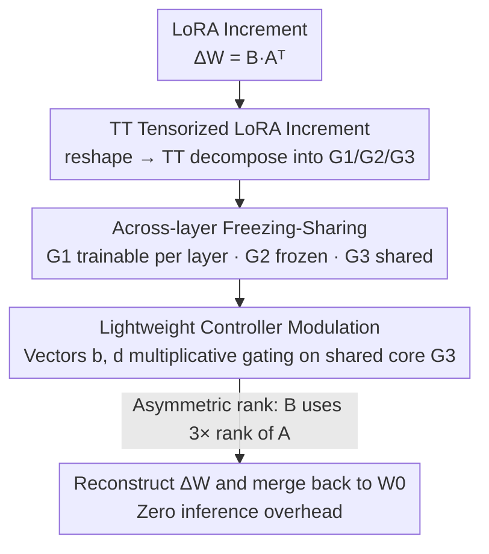

# TRAC: Tensor-Train Based Across-Layer Compression for Parameter-Efficient Fine-Tuning

**Conference**: ICLR 2026  
**OpenReview**: [https://openreview.net/forum?id=tz5yPWZp9W](https://openreview.net/forum?id=tz5yPWZp9W)  
**Code**: https://github.com/BangguoYe/TRAC  
**Area**: Model Compression / Parameter-Efficient Fine-Tuning (PEFT)  
**Keywords**: Tensor-Train Decomposition, Across-Layer Sharing, LoRA, Parameter-Efficient Fine-Tuning, Tensor Compression

## TL;DR
TRAC reformulates LoRA's low-rank incremental matrices $A$ and $B$ into Tensor-Train (TT) core sequences. By employing a strategy of "freezing/sharing specific cores across layers + restoring inter-layer flexibility via lightweight vector controllers," it reduces trainable parameters to an order of magnitude smaller than LoRA (20× on LLaMA2-13B, 14× on ViT-Large) while maintaining or exceeding LoRA's performance across NLU, NLG, common sense/mathematical reasoning, and image classification tasks.

## Background & Motivation

**Background**: Fine-tuning large models under resource constraints primarily relies on Parameter-Efficient Fine-Tuning (PEFT). LoRA, which represents weight updates as low-rank decompositions $\Delta W = BA^\top$ ($B\in\mathbb{R}^{m\times r}, A\in\mathbb{R}^{n\times r}$) and only trains these small matrices, has become the de facto standard due to its simplicity and efficiency.

**Limitations of Prior Work**: The parameter count of LoRA is constrained by the "matrix decomposition" paradigm itself—parameters are proportional to the rank $r$. Since $r$ is discrete, its minimum value is $r=1$. When a service provider needs to store separate LoRA weights for thousands of users, even this "small" amount becomes substantial. More importantly, the discrete nature of the rank prevents fine-grained adjustments to parameter budgets, making LoRA impractical in "extremely low parameter" regimes.

**Key Challenge**: One category of work (e.g., VeRA, ShareLoRA, VB-LoRA) attempts to further compress models through "across-layer freezing/sharing," utilizing the observation that LoRA matrices across different layers are often redundant. However, these methods remain trapped in the matrix decomposition paradigm, where structural constraints limit their reach to minimal budgets. Another category (e.g., LoRETTA, TT-LoRA, QuanTA) adopts more flexible tensor decompositions with stronger expressiveness and continuous parameter configurations. However, these treat decomposition modules per layer as independent trainable tensors and **fail to exploit across-layer redundancy**, resulting in parameter counts that still grow linearly with the network depth $L$.

**Goal**: To combine the advantages of both directions—leveraging the expressiveness and continuous adjustability of tensor decomposition while achieving parameter independence from depth through across-layer sharing.

**Key Insight**: The authors conducted a controlled experiment on RoBERTa-Base and found that among the three cores produced by TT decomposition, the larger cores $G_2$ and $G_3$ exhibit significant across-layer redundancy in deep Transformer models. Freezing or sharing these cores reduced parameters from 0.41M to 0.026M (nearly 15×) with almost no drop in accuracy. This suggests that "large cores can be saved, while layer specificity primarily resides in small cores."

**Core Idea**: Tensorize LoRA incremental matrices into TT core sequences and assign different roles to the three cores: the small core $G_1$ is trainable per layer, the large core $G_2$ is frozen, and $G_3$ is shared across layers. A pair of lightweight vector controllers per layer is then used to multiplicatively modulate the shared core $G_3$, restoring the inter-layer flexibility lost through sharing.

## Method

### Overall Architecture

The goal of TRAC is to express the LoRA increment $\Delta W = BA^\top$ using as few trainable parameters as possible without modifying the pre-trained backbone $W_0$. During inference, $\Delta W$ is merged back into $W_0$ just like LoRA, maintaining the original network structure. The pipeline consists of four steps: first, **tensorizing** the low-rank matrices $A$ and $B$ into TT core sequences; then, assigning roles to each core based on "**across-layer freezing-sharing**"; followed by using **lightweight controllers** to re-introduce layer-specific "flavors" to the shared cores; and finally, reconstructing $\Delta W$ for merging.

Specifically, for $A\in\mathbb{R}^{n\times r}$, it is first reshaped into a high-order tensor $\mathcal{A}\in\mathbb{R}^{n_1\times n_2\times n_3\times r}$ ($n_1n_2n_3=n$), then TT-decomposed into three third-order cores $G_1\in\mathbb{R}^{1\times n_1\times r_1}$, $G_2\in\mathbb{R}^{r_1\times n_2\times r_2}$, and $G_3\in\mathbb{R}^{r_2\times n_3\times r}$, such that $\mathcal{A}(i_1,i_2,i_3,:)=G_1(i_1)G_2(i_2)G_3(i_3)$. Matrix $B$ is similarly decomposed into $O_1, O_2, O_3$. Note that $G_1$ is very small due to its dimension of 1 ($|G_1|=n_1r_1$), while $G_2$ and $G_3$ constitute the bulk of the parameters ($|G_2|=r_1n_2r_2$, $|G_3|=r_2n_3r$)—these are the primary targets for freezing/sharing.

### Key Designs

**1. TT Tensorization of LoRA Increment: Breaking the parameter lower bound of matrix decomposition**

LoRA is limited by the fact that parameters are proportional to the rank $r$, and $r$ is discrete, reaching its limit at $r=1$. The first step of TRAC is to reshape LoRA's $A$ and $B$ into high-order tensors followed by Tensor-Train decomposition. The advantage of TT decomposition is that for a $d$-order tensor $\mathcal{X}\in\mathbb{R}^{n_1\times\cdots\times n_d}$, it is represented as a "matrix product" of $d$ third-order cores $G_k\in\mathbb{R}^{r_{k-1}\times n_k\times r_k}$, i.e., $\mathcal{X}(i_1,\dots,i_d)=G_1(i_1)\cdots G_d(i_d)$. The parameter count is approximately $dnr^2$, which **grows linearly with the order**, providing exponential compression compared to the original $n^d$ dimensions. Crucially, the compression ratio can be continuously adjusted through the TT-rank $(r_1, r_2)$, unlike LoRA which is stuck on discrete ranks. This allows TRAC to operate in extremely low parameter regimes inaccessible to LoRA. This step alone (the "All Trainable" baseline) is already more efficient than LoRA but does not yet exploit across-layer redundancy.

**2. Across-layer Freezing-Sharing: Assigning roles based on core size and redundancy**

Setting all TT cores as trainable per layer (the All Trainable baseline) still results in parameters growing linearly with the number of layers $L$. The author's experiments on RoBERTa-Base revealed that in deep Transformers, the large cores $G_2$ and $G_3$ are highly redundant across layers. By freezing $G_2$, sharing $G_3$ across layers, and keeping only the small core $G_1$ trainable per layer, parameters dropped from 0.41M to 0.026M (nearly 15×), with statistically negligible differences in performance on CoLA, MRPC, RTE, and STSB. Consequently, TRAC assigns fixed roles: $G_1$ is **trainable per layer** (retaining cheap layer specificity), $G_2$ is **frozen** (initialized randomly and not updated), and $G_3$ is **shared across layers** (all query/key/value/FFN matrices of the same type share one $G_3$). Since the bulk is shared, TRAC's parameter complexity drops to $O(n^{1/3}r^2)$—**independent of $L$**, whereas LoRA is $O(Lnr)$ and LoRETTA is $O(Ln^{1/3}r^2)$. This is the fundamental reason TRAC achieves 20× compression on 13B models.

**3. Lightweight Controller Modulation: Re-introducing inter-layer differences to shared cores**

Sharing $G_3$ saves parameters but risks losing layer specificity. TRAC introduces two lightweight vector controllers $b\in\mathbb{R}^{r_2}$ and $d\in\mathbb{R}^{n_3}$ per layer to perform multiplicative gating on the shared core:

$$\widetilde{G_3}(t_1,t_2,t_3)=\gamma(b,d)\cdot\sigma(b)(t_1)\cdot\sigma(d)(t_2)\cdot G_3(t_1,t_2,t_3)$$

Here, $\gamma$ is a (fixed or trainable) scaling factor, and $\sigma(\cdot)$ is a task-specific activation (exponential for text classification, linear for text generation and image classification). Intuitively, these vectors act like expert weights in MoE or continuous operator selection in DARTS, scaling different slices of the shared core per layer to allow distinct behaviors. The cost is minimal (just two vectors per layer), yet it significantly recovers the expressiveness lost to sharing—ablations show these controllers provide a clear performance boost with almost zero overhead. Matrix $B$ similarly has its own $b', d'$.

**4. Asymmetric Rank Allocation + TT-norm Initialization: Spending the budget on the critical $B$ matrix and stabilizing reconstruction variance**

TRAC adopts the existing conclusion that "$B$ is more critical than $A$" (Zhu et al., 2024) and implements it naturally via tensor structures: assigning rank $(r_1, r_2)$ to $A$ and $(3r_1, 3r_2)$ to $B$. Experiments prove this superior to a symmetric $(2r_1, 2r_2)$ configuration. For initialization, the authors improved upon LoRETTA to create **TT-norm initialization**: $\sigma_k=\frac{1}{\sqrt{r_k}}\left(\frac{1}{m+n}\right)^{\frac{1}{2n_k}}$. This accounts for both tensor rank and shape factors, ensuring that the variance of the reconstructed matrix remains stable and does not explode or vanish with changes in tensor dimensions or rank. Following LoRA convention, the last core of $B$, $O_3$, is initialized to zero (making the initial $BA^\top=0$), while controllers are initialized as equivalent to an identity mapping at the start. These implementation details allow TT to train stably even at extremely low ranks.

### Loss & Training
TRAC does not change the training objective, following the original fine-tuning losses of downstream tasks (e.g., cross-entropy for classification, language modeling loss for generation). It restricts trainable parameters to $G_1/O_1$ and controllers $b,d,b',d'$ (plus optional $\gamma$) per layer, with $G_2$ frozen and $G_3$ shared. During inference, TT cores can reconstruct $\Delta W$ via fast TT multiplication to be merged into $W_0$, with a computational complexity of $O(nr)$ per layer, comparable to LoRA.

## Key Experimental Results

Experiments cover models from 86M to 13B parameters, spanning NLU, NLG, common sense/mathematical/code reasoning, and image classification.

### Main Results

GLUE (RoBERTa-Base/Large, Average Score):

| Method | Trainable Params (Base) | AVG. (Base) | Trainable Params (Large) | AVG. (Large) |
|------|------|------|------|------|
| FT | 124.69M | 85.2 | 355.42M | 88.2 |
| LoRA | 0.295M | 85.6 | 0.8M | 88.2 |
| VeRA | 0.043M | 83.9 | 0.061M | 87.4 |
| LoRETTA | 0.068M | 83.2 | — | — |
| **TRAC** | **0.026M** | **85.0** | **0.041M** | **87.7** |

On RoBERTa-Large, TRAC achieves an AVG of 87.7 using only 0.041M parameters (~19× fewer than LoRA's 0.8M), outperforming VeRA and LoRETTA and approaching LoRA.

SuperGLUE (LLaMA2-7B/13B, AVG.) and E2E Generation (GPT-2, selected):

| Task/Model | Method | Trainable Params | Key Metric |
|------|------|------|------|
| SuperGLUE LLaMA2-13B | LoRA | 3.28M | 88.3 |
| SuperGLUE LLaMA2-13B | **TRAC** | **0.166M** | **88.6** (Best, 20× compression) |
| E2E GPT-2-Medium | LoRA | 0.35M | BLEU 68.9 |
| E2E GPT-2-Medium | **TRAC** | **0.054M** | **BLEU 70.3** (14% params) |

Image Classification (ViT-Base/Large, AVG. over 4 datasets):

| Model | Method | Trainable Params | AVG. |
|------|------|------|------|
| ViT-Base | LoRA | 0.295M | 90.27 |
| ViT-Base | **TRAC** | **0.026M** | **90.85** (Surpassed with 11× compression) |
| ViT-Large | LoRA | 0.786M | 91.74 |
| ViT-Large | **TRAC** | **0.056M** | **92.60** (Surpassed with 14× compression) |

Common sense/Math/Code (LLaMA3-8B, Qwen3-8B): TRAC uses 35%–59% of LoRA's parameters while maintaining comparable or higher AVG scores in common sense reasoning and GSM8K/HumanEval (e.g., Qwen3-8B common sense: TRAC-1.06M reaches 86.15 vs LoRA-1.92M's 84.82).

### Ablation Study

| Config (RoBERTa-Base, same TT-rank) | Trainable Params | CoLA | MRPC | RTE | STS-B |
|------|------|------|------|------|------|
| All Trainable | 411,648 | 64.83 | 88.92 | 80.29 | 91.21 |
| **Freeze+Share (Ours)** | **26,304** | 64.84 | 88.63 | 80.14 | 91.21 |

Parameter Efficiency and Overhead (RoBERTa-Large / LLaMA2-13B, selected):

| Metric | LoRA | **TRAC** | Note |
|------|------|------|------|
| Weight Storage (RoBERTa-L) | 3.014 MB | **0.197 MB** | >93% savings |
| Weight Storage (LLaMA2-13B) | 12.543 MB | **0.699 MB** | >94% savings |
| Training Time (RoBERTa-L) | 1932.3 s | 2002.5 s | <6% extra overhead |
| Peak VRAM (LLaMA2-13B) | 26.571 GB | 26.605 GB | Almost identical |

### Key Findings
- **Large core redundancy is the primary driver for compression**: The All Trainable configuration has nearly 15× more parameters than Freeze+Share but performs almost identically, validating the experimental foundation that $G_2$ and $G_3$ are highly redundant across layers.
- **Controllers recover expressiveness with minimal cost**: Ablations show controllers bring significant gains while using negligible parameters, confirming that "sharing for compression + controllers for individualization" is an essential pair.
- **Compression comes with almost no speed or VRAM penalty**: Training time overhead for TT decomposition is <6%, and peak VRAM is essentially the same as LoRA. The primary gain is storage (>93%), which is highly valuable for serving countless user-specific adapters.
- **Outperforming LoRA in extremely low parameter regimes**: On ViT, TRAC outperforms LoRA while using only 1/11 to 1/14 of the parameters. Across-layer sharing allows TRAC to use larger TT-ranks within the same budget, leading to lower approximation errors.

## Highlights & Insights
- **The combination of "tensor decomposition flexibility" and "across-layer sharing depth-independence" is the core strength**: While components like tensorization (LoRETTA) or sharing (VeRA) have been explored individually, TRAC is the first to combine them such that the parameter complexity successfully eliminates the $L$ factor ($O(n^{1/3}r^2)$).
- **Role assignment based on core size is a highly efficient engineering intuition**: Since $G_1$ is naturally small due to its unit dimension, keeping it trainable is inexpensive yet preserves layer specificity. Assigning the bulkier $G_2/G_3$ to freezing/sharing aligns "where to save" with the actual parameter distribution.
- **The controller design is transferable**: Using a pair of lightweight vectors to multiplicatively gate a large shared weight block to restore individual flavors is a pattern applicable to any "sharing but needing identity" scenario (e.g., cross-task or cross-head sharing).
- **Elegant implementation of asymmetric rank**: The relative importance of $B$ over $A$ is difficult to express precisely in standard LoRA but is naturally supported in TT by simply assigning larger ranks to $B$'s decomposition.

## Limitations & Future Work
- **Lack of Theory**: The authors admit a lack of rigorous theoretical characterization of how freezing and sharing affect the overall capacity of TT decomposition.
- **Increased Hyperparameter Space**: Compared to LoRA's rank $r$ and learning rate, TRAC introduces tensor order, tensor shapes $(n_1, n_2, n_3)$, and TT-ranks $(r_1, r_2)$, and currently relies on manual selection of which cores to share/freeze.
- **Task-dependent Activations**: The selection of $\sigma(\cdot)$ (exponential vs. linear) requires manual switching based on task types, lacking a principled guideline for generalizing to new task types.
- **Boundary of Redundancy**: The sharing assumption relies on layer similarity, which was primarily verified on standard Transformers. Whether this holds for architectures with high inter-layer variance or heterogeneous layers remains unexplored.

## Related Work & Insights
- **vs. LoRA**: LoRA uses matrix low-rank decomposition where parameter bounds are tied to discrete ranks ($O(Lnr)$). TRAC uses TT + across-layer sharing, reducing parameter complexity to $O(n^{1/3}r^2)$, providing continuous control and 20× storage savings on 13B models while matching or exceeding performance.
- **vs. VeRA**: VeRA shares LoRA matrices and trains only scalars, but its parameter complexity $O(Ln)$ still includes $L$, and its high effective rank results in computation close to $O(n^2)$. TRAC shares tensor cores, eliminating $L$ from the parameter count while maintaining $O(Lnr)$ computation.
- **vs. LoRETTA / TT-LoRA / QuanTA**: These also use TT but treat layers independently, meaning parameters grow linearly with depth ($O(Ln^{1/3}r^2)$). TRAC eliminates $L$ by freezing $G_2$ and sharing $G_3$, outperforming LoRETTA with ~1/3 of the parameters.
- **vs. ShareLoRA / VB-LoRA / FourierFT**: These operate within the matrix decomposition paradigm. TRAC elevates sharing to the tensor core level, benefiting from the superior expressiveness and granularity of tensor decomposition.

## Rating
- Novelty: ⭐⭐⭐⭐ Systematically combining tensor decomposition, across-layer sharing, and controller modulation to eliminate the depth factor in parameter complexity. Solid combination of existing concepts.
- Experimental Thoroughness: ⭐⭐⭐⭐⭐ Covers 86M to 13B models across NLU, NLG, reasoning, and vision, including detailed ablation, sensitivity, and overhead analysis.
- Writing Quality: ⭐⭐⭐⭐ Clear logic from motivation to design and theory. Some notations for TT are dense, but well-supported by the appendix.
- Value: ⭐⭐⭐⭐⭐ Direct hit on the pain point of "storing thousands of adapters" with >93% storage savings and zero inference overhead. High potential for engineering deployment.

<!-- RELATED:START -->

## Related Papers

- [\[ICLR 2026\] PiCa: Parameter-Efficient Fine-Tuning with Column Space Projection](pica_parameter-efficient_fine-tuning_with_column_space_projection.md)
- [\[ICLR 2026\] ABBA-Adapters: Efficient and Expressive Fine-Tuning of Foundation Models](abba-adapters_efficient_and_expressive_fine-tuning_of_foundation_models.md)
- [\[ICLR 2026\] SumRA: Parameter Efficient Fine-Tuning with Singular Value Decomposition and Summed Orthogonal Basis](sumra_parameter_efficient_fine-tuning_with_singular_value_decomposition_and_summ.md)
- [\[ICLR 2026\] Memba: Membrane-driven Parameter-Efficient Fine-Tuning for Mamba](memba_membrane-driven_parameter-efficient_fine-tuning_for_mamba.md)
- [\[ACL 2026\] A Layer-wise Analysis of Supervised Fine-Tuning](../../ACL2026/model_compression/a_layer-wise_analysis_of_supervised_fine-tuning.md)

<!-- RELATED:END -->
