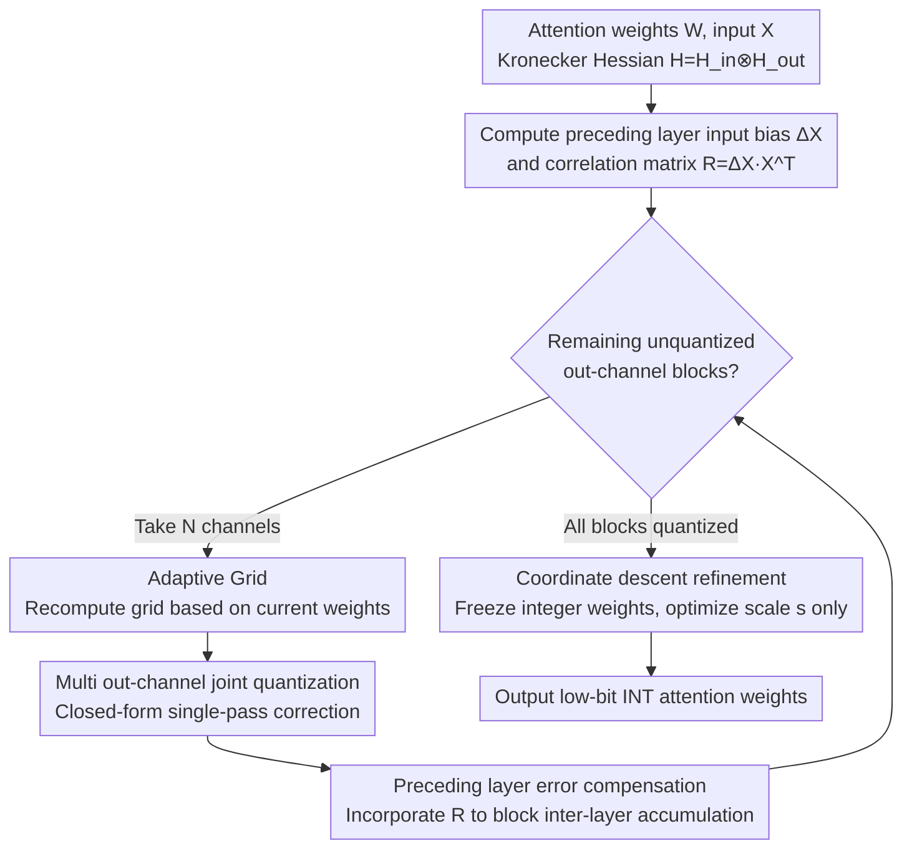

# TurboBoA: Faster and Exact Attention-aware Quantization without Backpropagation

**Conference**: ICLR 2026  
**arXiv**: [2602.04929](https://arxiv.org/abs/2602.04929)  
**Code**: [GitHub](https://github.com/SamsungLabs/TurboBoA)  
**Area**: Model Compression / Quantization / LLM  
**Keywords**: post-training quantization, attention-aware, backpropagation-free, low-bit quantization, LLM compression

## TL;DR

TurboBoA proposes a backpropagation-free post-training quantization (PTQ) method for LLMs. By introducing three innovations—multi-out-channel joint quantization, preceding layer error compensation, and adaptive grid selection—it achieves a speedup of over 3x while maintaining the accuracy advantages of BoA.

## Background & Motivation

The rapid growth in LLM scale makes PTQ a key technology for reducing memory and computational costs. Backpropagation-free methods based on Hessian-guided error compensation (e.g., GPTQ) have received significant attention due to their efficiency.

However, a trade-off exists between two types of methods:
- **GPTQ**: Assumes inter-layer independence, leading to severe accuracy degradation at low bits (e.g., INT2).
- **BoA**: Leverages cross-layer dependencies within attention modules to improve Hessian approximation, significantly enhancing accuracy. However, it requires sequential quantization per out-channel, making it far less efficient than GPTQ.

**Core Problem**: Can the accuracy of BoA be maintained while significantly increasing efficiency?

## Method

### Overall Architecture

TurboBoA follows the backpropagation-free quantization framework of BoA based on attention reconstruction error and a Kronecker-structured Hessian $\mathbf{H}=\mathbf{H}_{in}\otimes\mathbf{H}_{out}$, but transforms BoA's sequential per-out-channel process into a parallelizable and error-correcting version. The pipeline iterates by out-channel **blocks**: in each iteration, a block of $N$ out-channels is taken. First, the quantization grid is recomputed using an adaptive grid based on current weights. Then, these $N$ channels are jointly quantized with error correction through a closed-form solution (explicitly incorporating input bias from preceding layers). After all blocks are quantized, a final round of coordinate descent refinement is performed while freezing integer weights. Through the combination of "joint quantization to break sequential bottlenecks + preceding layer error compensation + grid/scale realignment," TurboBoA achieves over a 3x speedup while matching BoA's accuracy.

### Key Designs

**1. Multi out-channel joint quantization: Breaking the serial efficiency bottleneck**

BoA is slow because it quantizes only one out-channel at a time, using the remaining channels for error compensation; 128 channels imply 128 sequential operations. TurboBoA increases this granularity to quantize $N$ out-channels simultaneously, formulating error compensation as a constrained minimization problem $\min_{\Delta\mathbf{W}}\|\mathbf{G}\Delta\mathbf{W}\mathbf{X}\|_F^2$, where the $N$ quantized channels satisfy $\mathbf{e}_i^T\Delta\mathbf{W}=\mathbf{Q}_{i,:}-\mathbf{W}_{i,:}\;(0\le i<N)$. Proposition 3.1 provides the closed-form solution $[\Delta\mathbf{W}]_{N:,:}=-[\mathbf{U}_{out}^T]_{N:,B}[\mathbf{U}_{out}^T]_{B,B}^{-1}(\mathbf{W}_{B,:}-\mathbf{Q}_{B,:})$, where $B=\{0,\dots,N-1\}$ and $\mathbf{U}_{out}=\text{Chol}(\mathbf{H}_{out}^{-1})^T$. Since an analytical solution exists, joint quantization introduces no additional iterations. With $N=16$, sequential operations are reduced from 128 to 8, achieving over a 3x speedup compared to BoA with negligible accuracy loss as remaining channels still provide sufficient compensation.

**2. Preceding layer error compensation: Blocking error accumulation across layers**

BoA assumes that inputs to each layer are "clean," but in actual inference, preceding layers are already quantized, meaning the input itself contains bias $\Delta\mathbf{X}=\mathbf{X}-\tilde{\mathbf{X}}$. This error propagates and amplifies. TurboBoA directly incorporates this bias into the reconstruction objective: $\mathbf{G}\mathbf{Q}\mathbf{X}-\mathbf{G}\mathbf{W}\tilde{\mathbf{X}}=\mathbf{G}\Delta\mathbf{W}\mathbf{X}+\mathbf{G}\mathbf{W}\Delta\mathbf{X}$, where the second term on the right represents the contribution of preceding layer errors. Accordingly, Proposition 3.2 extends the compensation solution to $[\Delta\mathbf{W}]_{N:,:}=-[\mathbf{U}_{out}^T]_{N:,B}[\mathbf{U}_{out}^T]_{B,B}^{-1}\big((\mathbf{W}_{B,:}-\mathbf{Q}_{B,:})-\mathbf{W}_{B,:}\mathbf{R}\mathbf{H}_{in}^{-1}\big)$, where $\mathbf{R}=\Delta\mathbf{X}\mathbf{X}^T$ encodes the correlation between input bias and original input. Unlike GPTAQ, which also considers preceding errors but performs vector-level optimization, this method handles general dense $\mathbf{H}_{out}$, maintaining compatibility with attention module cross-layer dependencies.

**3. Adaptive grid + coordinate descent refinement: Aligning grids with updated weights**

Both joint quantization and error compensation modify weights. If the quantization grid remains fixed to old weights, misalignment occurs. TurboBoA recomputes the grid instantly before each quantization step (adaptive grid) to ensure the grid range matches current weights. After quantization, integer weights $\mathbf{W}_{int}$ are frozen, and only the scale vector $\mathbf{s}$ is optimized via coordinate descent refinement, targeting $\min_{\mathbf{s}}\|\mathbf{G}(\text{diag}(\mathbf{s})\mathbf{W}_{int}-\mathbf{W})\mathbf{X}+\mathbf{G}\mathbf{W}\Delta\mathbf{X}\|_F^2$, which also includes the preceding layer error term. Proposition 3.3 provides the component-wise closed-form update $s_j^*=s_j+\frac{[\mathbf{W}_{int}(\mathbf{H}_{in}(\mathbf{W}-\mathbf{Q})^T-\mathbf{R}^T\mathbf{W}^T)\mathbf{H}_{out}]_{j,j}}{[\mathbf{W}_{int}\mathbf{H}_{in}\mathbf{W}_{int}^T]_{j,j}[\mathbf{H}_{out}]_{j,j}}$. By using only diagonal elements of the Hessian, this step incurs minimal overhead while recovering grid drift caused by joint quantization, preserving low-bit accuracy.

## Key Experimental Results

### Main Results: INT2 Quantization Speedup

| Method | N | Llama3-8B Time | Wiki2 PPL |
|------|---|-------------|-----------|
| BoA | 1 | 94.75 min | 15.20 |
| TurboBoA | 4 | 39.46 min | 15.27 |
| TurboBoA | 8 | 30.55 min | 15.30 |
| TurboBoA | **16** | **25.30 min** | **15.41** |
| TurboBoA | 32 | 22.95 min | 15.22 |

For the 70B model: BoA requires 17 hours, while TurboBoA (N=16) requires only 5.6 hours, saving approximately 11 hours.

### Ablation Study: Impact of Three Features

| Method | F2 | F3 | Llama3-8B Wiki2↓ | C4↓ |
|------|----|----|-----------------|-----|
| BoA | - | - | 15.20 | 36.95 |
| TurboBoA (F1 only) | ✗ | ✗ | 15.41 | — |
| TurboBoA (F1+F2) | ✓ | ✗ | Improvement | — |
| TurboBoA (All) | ✓ | ✓ | Best | Best |

### SOTA Results

Combined with outlier suppression techniques like QuaRot:
- **Weight-only quantization**: Outperforms GPTQ, BoA, and other methods across the board at INT2.
- **Weight-activation quantization**: Also achieves SOTA performance.

### Key Findings

1. Accuracy degradation remains negligible even when $N$ increases to 64, indicating that the remaining out-channels provide sufficient error compensation capacity.
2. Speedup gains follow a diminishing returns pattern after $N > 16$; $N=16$ serves as the optimal balance point.
3. Preceding layer error compensation and grid refinement provide independent and complementary contributions.

## Highlights & Insights

- All three Propositions provide closed-form solutions, demonstrating theoretical elegance.
- Achieves over 3x speedup while maintaining or even improving accuracy.
- The method is agnostic to specific Hessian forms and can be directly adapted to more advanced Hessians.
- Saves over 11 hours of quantization time for 70B models, showing significant practical value.

## Limitations & Future Work

- Validated only on Llama series models; other architectures (e.g., Mixtral, Qwen) have not been tested.
- While the choice of $N$ is robust, it lacks a theoretical error bound analysis.
- The stabilization coefficient $\alpha$ requires manual tuning (selected from {0.05, 0.125, 0.25}).
- Focuses only on the quantization of attention layers; FFN layers use standard GPTQ.

## Related Work & Insights

- **Backpropagation-free Quantization**: GPTQ (Frantar et al., 2023), BoA (Kim et al., 2025), GPTAQ (Li et al., 2025)
- **Transformation Methods**: SmoothQuant (Xiao et al., 2023), QuaRot (Ashkboos et al., 2024)
- **Early PTQ**: AdaRound (Nagel et al., 2020), BRECQ (Li et al., 2021)

## Rating

- Novelty: ⭐⭐⭐⭐ — The closed-form solution for joint quantization is the core innovation.
- Theoretical Depth: ⭐⭐⭐⭐⭐ — The three Propositions are complete and rigorous.
- Experimental Thoroughness: ⭐⭐⭐⭐ — Covers multiple model scales with comprehensive ablations.
- Value: ⭐⭐⭐⭐⭐ — Directly addresses the efficiency bottleneck of BoA.
- Writing Quality: ⭐⭐⭐⭐ — Clear notation system and detailed mathematical derivations.

<!-- RELATED:START -->

## Related Papers

- [\[ICML 2025\] BoA: Attention-aware Post-training Quantization without Backpropagation](../../ICML2025/model_compression/boa_attention-aware_post-training_quantization_without_backpropagation.md)
- [\[ICLR 2026\] CARE: Covariance-Aware and Rank-Enhanced Decomposition for Enabling Multi-Head Latent Attention](care_covariance-aware_and_rank-enhanced_decomposition_for_enabling_multi-head_la.md)
- [\[ICLR 2026\] AgilePruner: An Empirical Study of Attention and Diversity for Adaptive Visual Token Pruning in LVLMs](agilepruner_an_empirical_study_of_attention_and_diversity_for_adaptive_visual_to.md)
- [\[ICLR 2026\] FASA: Frequency-Aware Sparse Attention](fasa_frequency-aware_sparse_attention.md)
- [\[CVPR 2026\] BinaryAttention: One-Bit QK-Attention for Vision and Diffusion Transformers](../../CVPR2026/model_compression/binaryattention_one-bit_qk-attention_for_vision_and_diffusion_transformers.md)

<!-- RELATED:END -->
