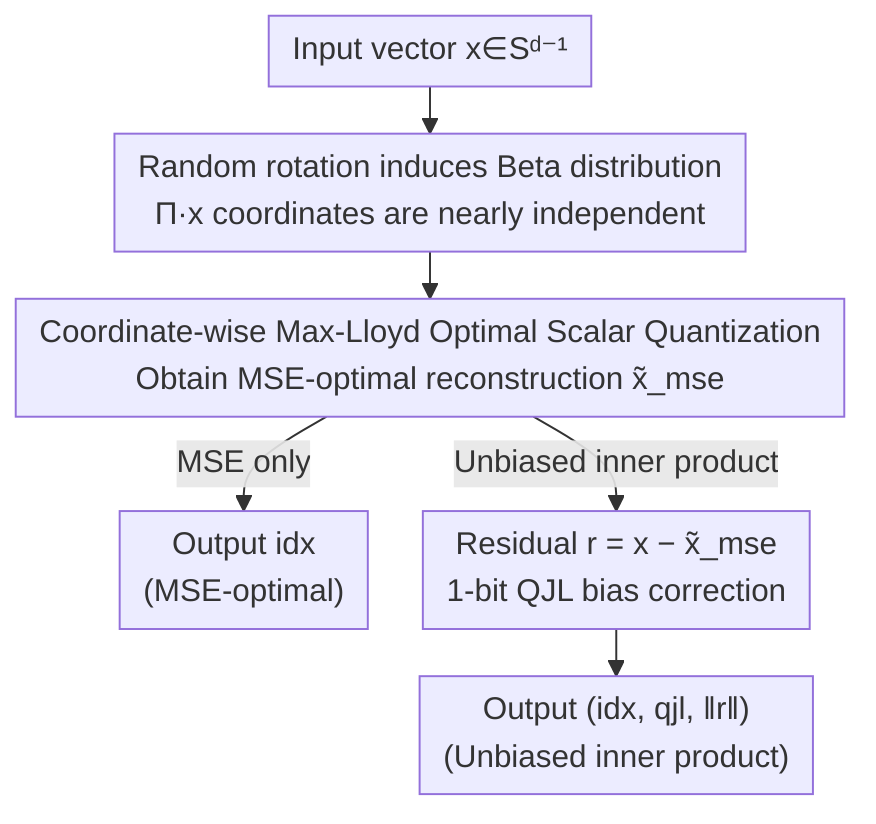

# TurboQuant: Online Vector Quantization with Near-Optimal Distortion Rate

**Conference**: ICLR 2026  
**OpenReview**: [https://openreview.net/forum?id=tO3ASKZlok](https://openreview.net/forum?id=tO3ASKZlok)  
**Code**: None  
**Area**: Model Compression  
**Keywords**: Vector Quantization, KV Cache Compression, Approximate Nearest Neighbor, Unbiased Inner Product Estimation, Distortion-Rate Bound

## TL;DR
TurboQuant is a data-oblivious (requires no calibration, ready for online use) vector quantization algorithm: it first applies a random rotation to "transform" the coordinates of any input vector into nearly independent Beta distributions, then applies pre-solved Max-Lloyd optimal scalar quantizers to each coordinate. This keeps MSE distortion within a constant factor ($\approx 2.7$) of the information-theoretic lower bound across all bitrates and dimensions. To address bias in inner product estimation, it adds a 1-bit QJL layer to process residuals for unbiased estimation, outperforming existing product quantization in KV cache compression and ANN retrieval.

## Background & Motivation

**Background**: Vector Quantization (VQ) is a core tool for compressing high-dimensional floating-point vectors into low-bit integers while preserving geometric structures (MSE, inner product). It is widely used in LLM weight/activation compression, KV cache compression, and Approximate Nearest Neighbor (ANN) retrieval in vector databases. Its theoretical foundation traces back to Shannon's source coding, where optimal distortion is characterized by the distortion-rate function.

**Limitations of Prior Work**: Existing VQ methods face a dilemma. One category is **offline/data-dependent** methods (e.g., GPTQ/AWQ based on Hessian information, or k-means codebooks for product quantization), which require heavy preprocessing and calibration, making them unsuitable for dynamic data like "on-the-fly" KV cache generation. The other category consists of **online/data-oblivious** methods that are ready for immediate use but provide loose distortion guarantees as bit-width decreases, failing to approach the near-optimal distortion-rate bound.

**Key Challenge**: It has long been considered difficult to simultaneously achieve online-readiness, accelerator-friendliness (vectorization), and distortion guarantees that approach information-theoretic lower bounds. Furthermore, a neglected detail is that **quantizers designed for MSE optimality are biased for inner product estimation** (introducing a multiplicative bias of $2/\pi$ in the 1-bit case), whereas ANN retrieval requires unbiased estimates.

**Goal**: Design a data-oblivious, accelerator-friendly quantizer $Q:\mathbb{R}^d\to\{0,1\}^{b\cdot d}$ that approaches optimality for any worst-case vector across both MSE and inner product metrics, while ensuring unbiased inner product estimation.

**Key Insight**: The authors leverage a key geometric fact: after applying a **random rotation** to a vector on a unit sphere, each coordinate follows the same Beta distribution (approaching a normal distribution in high dimensions), and different coordinates become **nearly independent**. Once coordinates are independent, $d$-dimensional quantization decomposes into $d$ one-dimensional scalar quantization problems, for which optimal codebooks can be solved offline once.

**Core Idea**: Combine "random rotation + coordinate-wise optimal scalar quantization" to obtain an MSE-optimal quantizer, then stack "1-bit QJL on residuals" to upgrade it to an unbiased inner product quantizer. This two-stage approach results in a near-optimal online VQ across all bit-widths.

## Method

### Overall Architecture
TurboQuant is a two-stage pipeline that decomposes the difficult $d$-dimensional quantization task into "$d$ one-dimensional scalar quantizations + one residual correction." Given a vector $x\in S^{d-1}$ on the unit sphere (with the norm stored separately as a float): the first stage performs a random rotation followed by coordinate-wise quantization to obtain an MSE-optimal reconstruction. The second stage applies a 1-bit QJL transformation to the residuals from the first stage to correct the inner product estimate from biased to unbiased. Both stages share a total bit budget $b$—the MSE quantizer uses $b-1$ bits, and the residual QJL uses 1 bit.

### Key Designs

**1. Random rotation induces Beta distribution and "washes" coordinates to near-independence**

Coordinates of worst-case input vectors may be highly correlated or arbitrarily distributed, preventing coordinate-wise quantization from providing guarantees. TurboQuant solves this by applies a random rotation matrix $\Pi\in\mathbb{R}^{d\times d}$ (obtained via QR decomposition of an i.i.d. normal matrix) to transform $x$ into $\Pi\cdot x$. Key fact (Lemma 1): The rotated vector is **uniformly distributed** on the unit sphere, meaning each coordinate follows the same input-independent Beta density:

$$f_X(x)=\frac{\Gamma(d/2)}{\sqrt{\pi}\,\Gamma((d-1)/2)}\left(1-x^2\right)^{(d-3)/2},\quad x\in[-1,1],$$

which tends toward a normal distribution in high dimensions. More importantly, any two distinct coordinates become **nearly independent** in high dimensions. This step is the foundation of the approach: it reduces a $d$-dimensional joint quantization problem into $d$ independent, identically distributed scalar quantization problems, providing worst-case guarantees and enabling high vectorization.

**2. Coordinate-wise Max-Lloyd optimal scalar quantization to compress MSE to near-lower bounds**

With independent coordinates, the task becomes designing an optimal scalar quantizer for the known distribution $f_X$. This is modeled as a one-dimensional continuous k-means problem:

$$C(f_X,b):=\min_{-1\le c_1\le\cdots\le c_{2^b}\le 1}\sum_{i=1}^{2^b}\int_{\frac{c_{i-1}+c_i}{2}}^{\frac{c_i+c_{i+1}}{2}}|x-c_i|^2\,f_X(x)\,dx,$$

where the optimal solution satisfies a Voronoi partition. Since $f_X$ depends only on dimension $d$ and bit-width $b$, the authors **solve for these codebooks offline** and store them for online lookups, making the quantization process itself almost zero-overhead. Theorem 1 proves that the MSE distortion satisfies $D_{\mathrm{mse}}\le\frac{\sqrt{3}\pi}{2}\cdot\frac{1}{4^b}$, which is an exponential improvement over existing online methods.

**3. Two-stage residual QJL to correct biased inner products**

MSE-optimal quantizers are biased for inner products: at $b=1$, the optimal codebook is $\pm\sqrt{2/(\pi d)}$, leading to a multiplicative bias of $2/\pi$ in the expectation. TurboQuant solves this by using $b-1$ bits for $Q_{\mathrm{mse}}$ and applying a 1-bit Quantized JL (QJL) transform $\mathrm{qjl}=\mathrm{sign}(S\cdot r)$ to the residual $r=x-Q^{-1}_{\mathrm{mse}}(Q_{\mathrm{mse}}(x))$. The final inner product estimate is:

$$\langle y,Q^{-1}_{\mathrm{mse}}(Q_{\mathrm{mse}}(x))\rangle+\|r\|_2\cdot\langle y,Q^{-1}_{\mathrm{qjl}}(Q_{\mathrm{qjl}}(r))\rangle.$$

Theorem 2 proves this estimate is **unbiased**, $\mathbb{E}\langle y,\tilde x\rangle=\langle y,x\rangle$, and reduces inner product distortion effectively with only 1 additional bit.

**4. Information-theoretic lower bound proof to establish "near-optimality"**

To demonstrate that TurboQuant approaches theoretical limits, the authors use the Shannon lower bound and Yao's minimax principle to prove that for **any** randomized quantization algorithm $Q:\mathbb{R}^d\to\{0,1\}^{b\cdot d}$, there exist hard instances such that $D_{\mathrm{mse}}(Q)\ge\frac{1}{4^b}$ and $D_{\mathrm{prod}}(Q)\ge\frac{\|y\|_2^2}{d}\cdot\frac{1}{4^b}$ (Theorem 3). Compared to Theorems 1 and 2, TurboQuant's MSE distortion is at most $\frac{\sqrt{3}\pi}{2}\approx 2.7$ times the lower bound.

### Loss & Training
This method **requires no training**: codebooks are obtained via offline Max-Lloyd iteration and cached. Rotation matrices $\Pi$ and QJL projections $S$ are randomly generated. In KV cache experiments, a **two-tier channel-wise mixed precision** strategy is used, allocating more bits to outlier channels.

## Key Experimental Results

### Main Results

**LongBench-V1 KV cache compression** (Llama-3.1-8B-Instruct):

| Method | KV Size | SingleQA | MultiQA | Summ. | Few-shot | Synthetic | Code | Average |
|------|---------|----------|---------|-------|----------|-----------|------|------|
| Full Cache | 16 | 45.29 | 45.16 | 26.55 | 68.38 | 59.54 | 46.28 | 50.06 |
| KIVI | 3 | 43.38 | 37.99 | 27.16 | 68.38 | 59.50 | 44.68 | 48.50 |
| PolarQuant | 3.9 | 45.18 | 44.48 | 26.23 | 68.25 | 60.07 | 45.24 | 49.78 |
| **Ours** | **2.5** | 44.88 | 44.01 | 26.75 | 68.39 | 59.07 | 46.03 | 49.74 |
| **Ours** | **3.5** | 45.01 | 45.31 | 26.00 | 68.63 | 59.95 | 46.17 | **50.06** |

**Needle-in-a-Haystack** (Llama-3.1-8B, 0.25 memory compression ratio):

| Method | Retrieval Score |
|------|---------|
| SnapKV | 0.858 |
| PyramidKV | 0.895 |
| KIVI | 0.981 |
| PolarQuant | 0.995 |
| Full-Precision | 0.997 |
| **Ours** | **0.997** |

### Ablation Study

Verification of theoretical vs. empirical distortion (DBpedia OpenAI3 embedding, $d=1586$):

| Configuration | Phenomenon | Explanation |
|------|------|------|
| TurboQuant_mse | Biased inner product estimate; bias disappears as $b$ increases | Verifies inherent bias of MSE-optimal quantizers |
| TurboQuant_prod | Unbiased inner product estimate across all bit-widths | Verifies the bias-correction effect of two-stage residual QJL |
| Empirical Errors | Fall between theoretical upper and lower bounds | $b=1$ is only ~1.45× from optimal |

### Key Findings
- **Trade-off between unbiasedness and variance**: At low bit-widths, TurboQuant_prod (unbiased) is better; at higher bit-widths, the bias of TurboQuant_mse naturally decays, and its lower variance makes it superior.
- **Distortion curves follow lower bounds**: Empirical MSE and inner product errors closely track the theoretical lower bounds.
- **Throughput advantages**: TurboQuant achieves significant speedups in $QK^\top$ computation for long sequences compared to PyTorch baselines.
- **Zero indexing time for ANN**: TurboQuant achieves higher recall than Product Quantization and RabitQ with almost zero indexing time (no k-means training needed).

## Highlights & Insights
- **Reduction of high-dimensional VQ to scalar quantization**: The "random rotation → coordinate independence" trick allows 1D optimal codebooks to be reused permanently, making the method both data-oblivious and near-optimal.
- **The "1-bit correction" ingenuity**: Reserving 1 bit for QJL residual correction provides an unbiased estimator without significantly increasing the bit budget.
- **Proven near-optimality**: By deriving both upper and lower bounds, the 2.7× constant factor provides a rigorous benchmark for the method's efficiency.
- **Offline codebook caching**: Practically useful as it moves computational overhead to a one-time offline step.

## Limitations & Future Work
- **Unit norm assumption**: Requires separate storage for norms and rescaling; results for data with extreme norm distributions were not fully explored.
- **Asymptotic independence**: Coordinate independence and Beta-to-normal convergence rely on high dimensionality ($d$); performance gains may diminish in lower-dimensional spaces (e.g., $d=200$).
- **Computational cost of random rotation**: Dense $O(d^2)$ rotation matrices can be expensive; whether structured fast rotations (e.g., Hadamard) maintain the same guarantees remains to be seen.
- **End-to-end weight quantization**: Experiments focused on KV cache and ANN; further study on weight/activation quantization is needed.

## Related Work & Insights
- **vs Product Quantization (PQ)**: PQ uses data-dependent codebooks and requires training; TurboQuant is data-oblivious with near-zero indexing time and generally higher recall.
- **vs RabitQ**: TurboQuant is more accelerator-friendly and provides a cleaner bit-budget accounting.
- **vs KIVI**: TurboQuant provides formal distortion guarantees ($1/4^b$), whereas KIVI's scalar quantization lacks such theoretical grounding and performs worse on long-context retrieval.
- **vs QJL**: This work extends QJL from a standalone 1-bit quantizer into a component of a two-stage "MSE + Residual" framework.

## Rating
- Novelty: ⭐⭐⭐⭐⭐ 
- Experimental Thoroughness: ⭐⭐⭐⭐ 
- Writing Quality: ⭐⭐⭐⭐⭐ 
- Value: ⭐⭐⭐⭐⭐ 

<!-- RELATED:START -->

## Related Papers

- [\[ICML 2026\] WUSH: Near-Optimal Adaptive Transforms for LLM Quantization](../../ICML2026/model_compression/wush_near-optimal_adaptive_transforms_for_llm_quantization.md)
- [\[AAAI 2026\] Reinforced Rate Control for Neural Video Compression via Inter-Frame Rate-Distortion Awareness](../../AAAI2026/model_compression/reinforced_rate_control_for_neural_video_compression_via_inter-frame_rate-distor.md)
- [\[ICLR 2026\] Compute-Optimal Quantization-Aware Training](compute-optimal_quantization-aware_training.md)
- [\[ICML 2026\] NeUQI: Near-Optimal Uniform Quantization Parameter Initialization for Low-Bit LLMs](../../ICML2026/model_compression/neuqi_near-optimal_uniform_quantization_parameter_initialization_for_low-bit_llm.md)
- [\[ICLR 2026\] KBVQ-MoE: KLT-guided SVD with Bias-Corrected Vector Quantization for MoE Large Language Models](kbvq-moe_klt-guided_svd_with_bias-corrected_vector_quantization_for_moe_large_la.md)

<!-- RELATED:END -->
