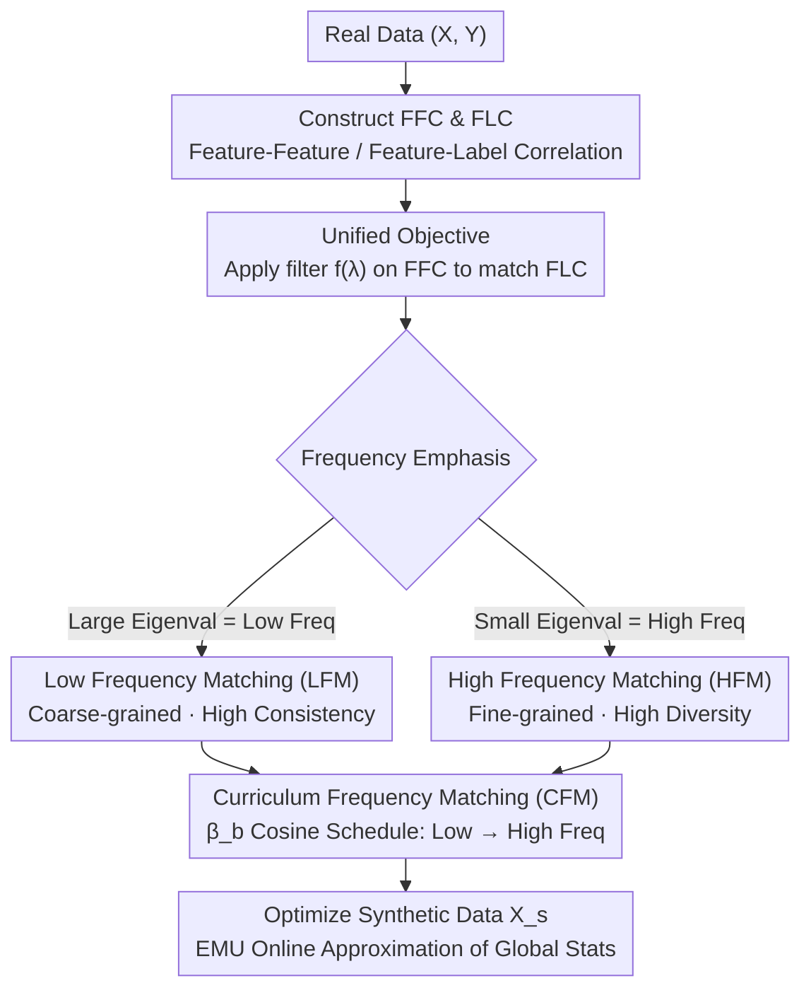

# Understanding Dataset Distillation via Spectral Filtering

**Conference**: ICLR 2026  
**arXiv**: [2503.01212](https://arxiv.org/abs/2503.01212)  
**Code**: Not provided  
**Area**: Model Compression / Dataset Distillation  
**Keywords**: dataset distillation, spectral filtering, frequency matching, curriculum learning, unified framework

## TL;DR

This paper proposes the UniDD spectral filtering framework, which unifies various dataset distillation methods as applying different filtering functions to the Feature-Feature Correlation (FFC) matrix to match the frequency information of the Feature-Label Correlation (FLC) matrix. Based on this insight, the authors introduce Curriculum Frequency Matching (CFM).

## Background & Motivation

Dataset distillation (DD) accelerates model training by compressing large-scale datasets into compact synthetic datasets. Existing methods vary significantly in their optimization objectives:
- **Statistical Matching** (DM): Aligns statistics such as means.
- **Gradient Matching** (DC): Minimizes the difference in gradient directions.
- **Trajectory Matching** (MTT): Simulates parameter update trajectories.
- **Kernel Methods** (FrePo): Bypasses inner-loop optimization via closed-form solutions.

Core Problem: **What are the connections between these methods? Does a unified framework exist?**

## Method

### Overall Architecture

The core observation of UniDD is that seemingly diverse distillation objectives all perform the same task: applying a filtering function $f(\cdot)$ to the Feature-Feature Correlation (FFC) matrix to match the Feature-Label Correlation (FLC) information between real and synthetic data. Theorem 1 unifies them as $\min_{X_s} \| f(X^\top X)\, g(X^\top Y) - f(X_s^\top X_s)\, g(X_s^\top Y_s) \|_F^2$, where $X^\top X$ and $X_s^\top X_s$ are FFC matrices, while $X^\top Y$ and $X_s^\top Y_s$ are FLC matrices, with $g$ being either the identity $I$ or $X^\top Y$. The distinction between methods lies solely in the shape of $f$ acting on the FFC eigenvalues $\lambda$. Thus, "designing a distillation algorithm" is reduced to "designing a filtering function." This paper categorizes methods into low-frequency and high-frequency families and proposes a curriculum scheme where filtering changes dynamically during training.

### Key Designs

**1. Low Frequency Matching (LFM): Capturing Coarse-grained Information via Identity/Linear Filtering**

When the filtering function favors large eigenvalues, the objective retains only the principal components of the FFC, corresponding to blurred but stable class-average representations. Distribution Matching (DM) uses $f(\lambda)=1$ (identity filtering), where the objective simplifies to $\|X^\top Y - X_s^\top Y_s\|_F^2$, directly aligning class-average representations. Gradient Matching (DC), derived from a gradient difference upper bound, results in $f(\lambda)\in\{1,\lambda\}$, adding a linear term to the identity filter. This family captures coarse-grained colors and outlines, offering fast convergence and high intra-class consistency, though synthetic images tend to lack diversity.

**2. High Frequency Matching (HFM): Capturing Fine-grained Texture via Inverse/High-pass Filtering**

Conversely, if the filtering function amplifies small eigenvalues, the objective emphasizes high-frequency components of the FFC, corresponding to fine-grained textures. Trajectory Matching (MTT) employs a filter shaped like $f(\lambda)=(1-\alpha\lambda)^{\{p,q\}}$, which acts as a high-pass filter when $\alpha\lambda<1$. Kernel methods like FrePo use $f(\lambda)=(\lambda+\beta)^{-1}$ for inverse weighting; a smaller $\beta$ places stronger emphasis on high frequencies. These methods produce images with rich textures and better diversity, at the cost of higher computational overhead and a tendency to introduce noise as useful signals. Consistency and diversity represent a fundamental trade-off here.

**3. Curriculum Frequency Matching (CFM): Sliding from Low to High Frequency**

Since a fixed $f$ only learns a single frequency, CFM implements a curriculum where the frequency control parameter $\beta$ evolves during training: $\beta_b = \beta \cdot (1 + \cos(\pi b / B)) / 2$, where $b$ is the current batch and $B$ is the total number of batches. As $\beta_b$ slides from large to small following a cosine curve, the filter gradually transitions from low-pass to high-pass. Early training uses low frequencies to lock in consistent global structures, while later stages use high frequencies to add diverse details. This allows a single distillation process to cover both ends of the spectrum, bypassing the dilemma of choosing a single filter.

### Loss & Training

The total loss combines a classification term with two matching terms: $\mathcal{L} = \mathcal{L}_{cls}(H_s, Y_s) + \eta \mathcal{L}_{filter} + \eta \mathcal{L}_{signal}$, where the weight is typically $\eta = 0.1$. The matching terms correspond to the framework settings $g=I$ and $g=X^\top Y$: $\mathcal{L}_{filter} = \sum_{b,l} \|(\Psi^l + \beta_b I)^{-1} - (\Psi_s^{l,b} + \beta_b I)^{-1}\|$ focuses on the FFC filtering structure, while $\mathcal{L}_{signal} = \sum_{b,l} \|(\Psi^l + \beta_b I)^{-1}\Phi^l - (\Psi_s^{l,b} + \beta_b I)^{-1}\Phi_s^l\|$ aligns the FLC signals. Both utilize the batch-wise $\beta_b$ schedule. Since recalculating global statistics $\Psi$ and $\Phi$ for the full dataset is expensive, CFM employs Exponential Moving Updates (EMU) to approximate full-batch statistics online, ensuring stable training on small batches.

## Key Experimental Results

### Main Results (CIFAR-10/100)

| Dataset | IPC | DM | DC | MTT | FrePo | CFM |
|---------|-----|------|------|------|-------|------|
| CIFAR-10 | 10 | 48.9 | 44.9 | 65.3 | 65.5 | **52.1** |
| CIFAR-10 | 50 | 63.0 | 53.9 | 71.6 | 71.7 | **64.0** |
| CIFAR-100 | 10 | 29.7 | 25.2 | 33.1 | 42.5 | **58.3** |
| CIFAR-100 | 50 | 43.6 | 30.6 | 42.9 | 44.3 | **67.1** |

On CIFAR-100 (IPC=50) using ResNet-18, CFM reaches 71.4%, significantly outperforming all baselines.

### Main Results (ImageNet-1K)

| IPC | SRe2L | G-VBSM | RDED | DWA | CFM |
|-----|-------|--------|------|-----|------|
| 10 | 21.3 | 31.4 | 42.0 | 37.9 | **40.6** |

### Ablation Study

| Component | Effect |
|-----------|--------|
| Only $\mathcal{L}_{filter}$ | Suboptimal |
| Only $\mathcal{L}_{signal}$ | Suboptimal |
| Fixed $\beta$ (Low Freq) | Good consistency, poor diversity |
| Fixed $\beta$ (High Freq) | Good diversity, high noise |
| CFM (Dynamic $\beta$) | Optimal balance |

### Key Findings

1. Low-pass filters (DM, DC) produce blurry synthetic images with high intra-class similarity.
2. High-pass filters (MTT, FrePo) produce fine-grained textures and high diversity but may introduce noise.
3. Curriculum-based frequency scheduling consistently outperforms fixed-frequency methods across all benchmarks.
4. CFM demonstrates superior cross-architecture generalization capabilities.

## Highlights & Insights

- First work to unify four major categories of dataset distillation from a spectral filtering perspective.
- Theoretical elegance: simplifies complex distillation objectives into a problem of filtering function design.
- The CFM method is simple yet effective, with a single hyperparameter $\eta = 0.1$ being universal across datasets.
- Clearly reveals the relationship between low-pass/high-pass filtering and synthetic data characteristics (consistency vs. diversity).

## Limitations & Future Work

- The unified framework currently covers only linear kernels; non-linear kernels (e.g., Gaussian, polynomial) remain unanalyzed.
- Calculation of FFC/FLC matrices on large-scale datasets may face numerical overflow issues (requiring covariance substitutes).
- Theoretical derivations are based on upper bound approximations; the gap between actual objectives and approximations is not quantified.
- Whether the cosine annealing schedule for CFM is optimal has not been fully explored.

## Related Work & Insights

- **Statistical Matching**: DM (Zhao & Bilen), IDM, SRe2L.
- **Gradient Matching**: DC (Zhao et al.), IDC, DSA.
- **Trajectory Matching**: MTT, DATM, FTD.
- **Kernel Methods**: KIP, FrePo, RFAD.
- **Spectral Methods**: FreD, NSD (differ from UniDD in the objects analyzed).

## Rating

- Novelty: ⭐⭐⭐⭐⭐ — The unified framework provides significant theoretical value.
- Theoretical Depth: ⭐⭐⭐⭐ — Clear derivation, though partially based on upper bound approximations.
- Experimental Thoroughness: ⭐⭐⭐⭐ — Comprehensive validation on CIFAR and ImageNet.
- Value: ⭐⭐⭐⭐ — CFM is simple and effective with a low barrier to adoption.
- Writing Quality: ⭐⭐⭐⭐⭐ — Clear framework with excellent tables and visualizations.

<!-- RELATED:START -->

## Related Papers

- [\[ICLR 2026\] Grounding and Enhancing Informativeness and Utility in Dataset Distillation](grounding_and_enhancing_informativeness_and_utility_in_dataset_distillation.md)
- [\[ICLR 2026\] Asymmetric Synthetic Data Update for Domain Incremental Dataset Distillation](asymmetric_synthetic_data_update_for_domain_incremental_dataset_distillation.md)
- [\[ACL 2026\] CBRS: Cognitive Blood Request System with Bilingual Dataset and Dual-Layer Filtering](../../ACL2026/model_compression/cbrs_cognitive_blood_request_system_with_bilingual_dataset_and_dual-layer_filter.md)
- [\[AAAI 2026\] Distillation Dynamics: Towards Understanding Feature-Based Distillation in Vision Transformers](../../AAAI2026/model_compression/distillation_dynamics_towards_understanding_feature-based_di.md)
- [\[ICLR 2026\] Dataset Distillation as Pushforward Optimal Quantization](dataset_distillation_as_pushforward_optimal_quantization.md)

<!-- RELATED:END -->
