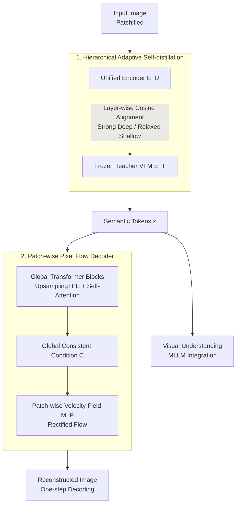

# UniFlow: A Unified Pixel Flow Tokenizer for Visual Understanding and Generation

## Metadata
- **Conference**: ICLR 2026
- **arXiv**: [2510.10575](https://arxiv.org/abs/2510.10575)
- **Code**: Not released
- **Area**: Visual Understanding & Generation / Unified Tokenizer
- **Keywords**: Unified tokenizer, visual encoder, flow matching, self-distillation, image reconstruction and generation

## TL;DR

A universal unified tokenizer, UniFlow, is proposed. It preserves semantic understanding through hierarchical adaptive self-distillation and achieves high-fidelity reconstruction using a lightweight patch-wise pixel flow decoder. It achieves a win-win in understanding and generation across 13 benchmarks; the 7B UniFlow-XL outperforms the 14B TokenFlow-XL by 6.05% using 40% less data.

## Background & Motivation

Visual understanding and generation are the two core tasks of computer vision. Currently, the field faces a **dilemma for unified tokenizers**:

**Dual-encoder schemes** (e.g., TokenFlow): Utilizes a semantic encoder plus a pixel encoder, leading to model redundancy and training inefficiency.

**Frozen VFM + Latent Diffusion Decoders** (e.g., EMU2, BLIP3-o): Inherits understanding capabilities, but the semantic encoder fails to model fine-grained details and is limited by the ceiling of pre-trained VAEs.

**Unified encoder fine-tuning schemes** (e.g., VILA-U, UniTok): Fine-tunes the encoder on a pixel decoder after initialization. However, conflicts between high-level semantics and low-level reconstruction objectives lead to degradation in understanding capabilities.

**Key Challenge**: The inherent conflict between high-level semantic abstraction and low-level pixel reconstruction. How can strong semantic understanding and high-fidelity reconstruction be achieved simultaneously within a single tokenizer?

## Method

### Overall Architecture

UniFlow transforms a pre-trained visual encoder into a unified tokenizer capable of both understanding and reconstruction. The unified encoder $\mathcal{E}_U$ encodes semantic tokens under self-distillation constraints. These tokens are simultaneously fed into an MLLM for visual understanding and a lightweight patch-wise pixel flow decoder $\mathcal{D}_{\text{flow}}$ to reconstruct the image directly in pixel space. It does not introduce a second encoder or rely on a pre-trained VAE. The entire adaptation requires only 30 epochs of training on ImageNet and can be grafted onto any VFM or MLLM visual backbone. The following diagram illustrates the complete data flow from input image to semantic tokens, branching into understanding and reconstruction paths:

### Key Designs

**1. Hierarchical Adaptive Self-distillation: Preventing the Reconstruction Objective from Eroding Semantic Understanding**

The unified encoder must retain the teacher VFM's semantics while creating space for modeling details for downstream reconstruction. These goals are naturally in conflict—if all layers are forced to align with the teacher, details cannot be learned; if constraints are relaxed, semantics degrade. UniFlow observes that deeper layers handle semantic disambiguation while shallower layers handle fine-grained details. Therefore, distillation intensity should be layer-wise rather than uniform: stronger retention constraints are applied to deeper layers, while shallower layers are granted more flexibility. It uses a frozen teacher $\mathcal{E}_T$ to supervise the student $\mathcal{E}_U$, with weights adaptively assigned per layer as $w_l = \frac{w_l^{\text{base}} \cdot \exp(\beta \cdot \alpha_l)}{\sum_{k=1}^{L} w_k^{\text{base}} \cdot \exp(\beta \cdot \alpha_k)}$. The layer-wise prior $w_l^{\text{base}} = l/L$ assigns higher base weights to deeper layers, and the alignment penalty $\alpha_l$ (the average cosine distance between student and teacher tokens at layer $l$) allows layers with poorer alignment to receive more temporary attention, with $\beta$ controlling the intensity of this adaptation. The final distillation loss is the weighted layer-wise cosine distance $\mathcal{L}_{\text{dist}} = \sum_{l=1}^{L} w_l \cdot \left(1 - \frac{1}{S} \sum_{i,j} \frac{\langle \mathbf{H}_U^{(l,i,j)}, \mathbf{H}_T^{(l,i,j)} \rangle}{\|\mathbf{H}_U^{(l,i,j)}\| \|\mathbf{H}_T^{(l,i,j)}\|}\right)$. In this way, deep layers guard semantics while shallow layers freely fill in details, avoiding the fine-tuning degradation seen in VILA-U/UniTok.

**2. Patch-wise Pixel Flow Decoder: Bypassing the VAE Ceiling for Direct Pixel Reconstruction**

Most existing unified schemes attach diffusion or flow decoders to the latent space of a pre-trained VAE, which locks the reconstruction upper bound to the VAE's quality. UniFlow instead learns the velocity field directly in pixel space. Based on Rectified Flow, it defines a linear interpolation path between the clean image and noise: $\mathbf{x}_t^{(i,j)} = (1-t)\mathbf{x}^{(i,j)} + t \cdot \epsilon^{(i,j)},\ t \in [0,1]$. A lightweight MLP then predicts the velocity field $v_\theta(\mathbf{x}_t^{(i,j)}, t, \mathbf{c}^{(i,j)})$ patch by patch. Since the velocity field directly fits the linear mapping from noise to target, a single sampling step during inference can reconstruct a patch. Patch-wise decoding breaks down the complex distribution of the whole image into local sub-distributions, simplifying the learning objective and improving training efficiency. However, the lack of long-range interaction between patches can leave grid-like seam artifacts. To address this, a series of $K$ Global Transformer Blocks (each containing self-attention + FFN) is added before condition injection. This allows upsampled tokens to exchange information before distributing conditions: $\mathbf{C} = \mathcal{GTB}(\mathcal{P}_{\text{up}}(\mathbf{z}) + \mathbf{PE})$, ensuring that each patch's decoding is informed by global context. Ablations show that as GTB layers increase from 0 to 6, grid artifacts disappear and flow loss converges faster.

### Loss & Training

The total objective is a weighted sum of the distillation and flow matching terms: $\mathcal{L}_{\text{total}} = \lambda_d \mathcal{L}_{\text{dist}} + \lambda_f \mathcal{L}_{\text{flow}}$. The flow matching loss is a velocity field regression: $\mathcal{L}_{\text{flow}} = \mathbb{E}\left[\|v_\theta(\mathbf{x}_t^{(i,j)}, t, \mathbf{c}^{(i,j)}) - (\epsilon^{(i,j)} - \mathbf{x}^{(i,j)})\|_2^2\right]$. Compared to VQ-GAN based systems that require a combination of GAN, L1, L2, and LPIPS losses, UniFlow completes reconstruction supervision with a single flow matching loss. This makes training more stable and parameter tuning easier, contributing to its ability to complete universal adaptation within 30 epochs.

## Experimental Results

### Key Experimental Results (Image Reconstruction on 256×256 ImageNet-1K)

| Method | Type | Downsampling Ratio | rFID ↓ |
|------|------|---------|--------|
| SD-VAE 3 | Generative Specialized | 8 | 0.20 |
| FLUX-VAE | Generative Specialized | 8 | 0.18 |
| UniTok | Unified | 16 | 0.41 |
| TokenFlow | Unified | 16 | 1.37 |
| **Ours (UniFlow-InternViT)** | **Unified** | 14 | **0.26** |
| **Ours (UniFlow-DINOv2)** | **Unified** | 14 | 0.54 |

UniFlow(InternViT) achieves SOTA among unified tokenizers with an rFID of 0.26 (UniTok 0.41, Gain: ↓0.15), approaching the performance of generative specialized tokenizers.

### Main Results (Multimodal Understanding - LLaVA-v1.5 Setting)

| Method | LLM | POPE | GQA | TQA | MMB | MME-P | Avg |
|------|-----|------|-----|-----|-----|-------|-----|
| LLaVA-1.5 | Vicuna-7B | 85.9 | 62.0 | 46.1 | 64.3 | 1510.7 | - |
| Janus | DeepSeek-1.3B | 87.0 | 59.1 | - | 69.4 | 1338.0 | - |
| **UniFlow-LV** | Vicuna-7B | **High** | **High** | **High** | **High** | **High** | **SOTA** |

7B UniFlow-XL outperforms 14B TokenFlow-XL by 6.05% on the overall average understanding benchmark using 40% less training data.

### Image Generation

The gFID (without guidance) is 0.09 better than UniTok, validating competitive generation quality.

### Key Findings

1.  **Win-win for Understanding and Generation**: UniFlow improves performance in both directions simultaneously, breaking the traditional trade-off.
2.  **Encoder Universality**: Effective across four encoders (CLIP, SigLIP2, DINOv2, InternViT), with InternViT performing best.
3.  **High Training Efficiency**: Universal adaptation completed in 30 epochs on ImageNet, surpassing TokenFlow with 40% less data.
4.  **No VAE Constraint**: Modeling directly in pixel space allows for a higher reconstruction ceiling.
5.  **Effective Patch-wise Strategy**: Simplifies data distribution and improves training efficiency, while Global Transformers eliminate grid artifacts.

## Highlights & Insights

- The hierarchical adaptive self-distillation design is elegant, dynamically balancing semantic retention and detail adaptation.
- The patch-wise pixel flow decoder is a novel concept that directly bypasses the VAE ceiling.
- Global Transformer Blocks effectively eliminate grid artifacts caused by patch-wise decoding.
- A universal adaptation paradigm that can be grafted onto any pre-trained encoder.
- Experiments cover 13 benchmarks and 7 tasks, fully validating multi-task capabilities.

## Limitations & Future Work

- The number of inference steps for the flow decoder might impact reconstruction speed; this trade-off is not discussed in detail.
- The downsampling ratio is 14 (for CLIP/DINOv2/InternViT), which is different from the common 8 or 16; care is needed regarding fairness in comparisons.
- While generation quality is better than UniTok, a gap remains compared to the best generative specialized tokenizers (FLUX-VAE rFID 0.18).
- Not yet validated on video generation tasks.
- Scalability and global consistency of the patch-wise strategy at higher resolutions remain to be explored.

## Related Work & Insights

- **Generative Specialized Tokenizers**: VQ-GAN, SD-VAE series, FlowMo, SelfTok — good reconstruction but weak semantics.
- **Unified Tokenizers**: VILA-U, UniTok, QLIP (fine-tuning conflicts), TokenFlow (dual-encoder redundancy), DualToken.
- **Diffusion/Flow Decoders**: l-DeTok, FlowMo, SelfTok — limited by pre-trained VAE latent space.
- **Self-distillation**: DualToken, TokLIP — often only distills the final layer or requires large-scale contrastive learning.

## Rating

- **Novelty**: ⭐⭐⭐⭐⭐ — Combinatorial innovation of patch-wise pixel flow decoding and hierarchical adaptive self-distillation.
- **Technical Depth**: ⭐⭐⭐⭐⭐ — Sophisticated method design with simple and effective loss functions.
- **Experimental Thoroughness**: ⭐⭐⭐⭐⭐ — 13 benchmarks, 7 tasks, 4 encoders, and multiple baselines.
- **Value**: ⭐⭐⭐⭐⭐ — Universal adaptation paradigm achievable in 30 epochs, highly practical.

<!-- RELATED:START -->

## Related Papers

- [\[ICLR 2026\] S2R-HDR: A Large-Scale Rendered Dataset for HDR Fusion](s2r-hdr_a_large-scale_rendered_dataset_for_hdr_fusion.md)
- [\[ICLR 2026\] Rethinking Continual Learning with Progressive Neural Collapse](rethinking_continual_learning_with_progressive_neural_collapse.md)
- [\[ICLR 2026\] Revisiting Weight Regularization for Low-Rank Continual Learning](revisiting_weight_regularization_for_low-rank_continual_learning.md)
- [\[ICLR 2026\] SERE: Similarity-based Expert Re-routing for Efficient Batch Decoding in MoE Models](sere_similarity-based_expert_re-routing_for_efficient_batch_decoding_in_moe_mode.md)
- [\[AAAI 2026\] StepFun-Formalizer: Unlocking the Autoformalization Potential of LLMs Through Knowledge-Reasoning Fusion](../../AAAI2026/model_compression/stepfun-formalizer_unlocking_the_autoformalization_potential_of_llms_through_kno.md)

<!-- RELATED:END -->
