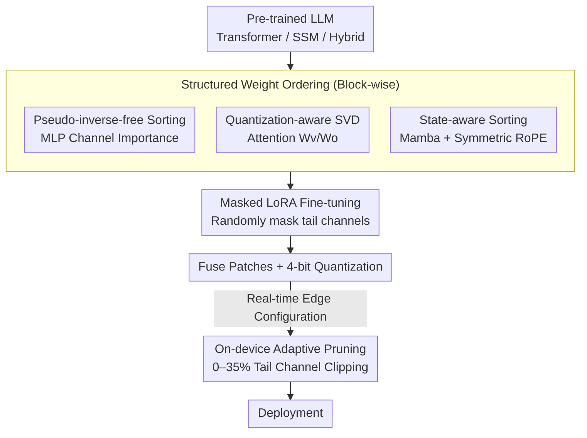

# UniQL: Unified Quantization and Low-Rank Compression for Adaptive Edge LLMs

**Conference**: ICLR 2024 (Note: Input stated ICLR 2026, keeping as-is)  
**OpenReview**: [https://openreview.net/forum?id=iOGu4wtDTF](https://openreview.net/forum?id=iOGu4wtDTF)  
**Code**: https://github.com/enyac-group/UniQL (To be open-sourced)  
**Area**: Model Compression  
**Keywords**: Post-training quantization, structured pruning, low-rank decomposition, edge LLMs, state space models  

## TL;DR
UniQL unifies post-training quantization and structured low-rank pruning into a "compute once in cloud, trim as needed on edge" pipeline. By employing pseudo-inverse-free weight ordering, quantization-aware SVD, and state-aware ordering, it enables Transformer, SSM, and hybrid models to configure 0–35% pruning rates in real-time on-device based on system load. After a single compression, the method achieves 4×–5.7× memory compression and 2.7×–3.4× throughput improvement while maintaining accuracy close to the original model.

## Background & Motivation

**Background**: Deploying billion-parameter LLMs on edge devices like VR/AR glasses and smartphones primarily relies on two paths: low-bit quantization (AWQ, GPTQ) for storage reduction and structured pruning (SliceGPT, MoDeGPT) for parameter reduction. Usually, these are performed independently, resulting in a fixed-size compressed model.

**Limitations of Prior Work**: Memory on edge devices is a shared resource dynamically scheduled by the OS, meaning availability fluctuates with system load. A fixed-size pre-compressed model may fail to load during high-load periods. Re-compressing on the fly is unrealistic as quantization/pruning takes hours on cloud GPUs. Existing alternatives like storing multiple pre-compressed versions are storage-intensive, while elastic training (Flextron, LLaMaFlex) requires significant GPU resources and curated data, often targeting specific models with poor generalizability.

**Key Challenge**: Edge devices require "runtime-adjustable elastic dimensions," but existing compression paradigms produce "fixed dimensions set during training/compression." This fundamental mismatch exists between demand and output, while current elastic methods rely on expensive training or heavy re-compression.

**Goal**: Under the post-training setting (where cloud GPUs and labeled data are limited), design a unified framework that completes quantization and structured pruning simultaneously on a single server GPU. The framework must support Transformer, SSM, and hybrid architectures while allowing the final model to support arbitrary edge-configured pruning rates.

**Key Insight**: If weights in each layer are ordered by "importance," with the least significant channels moved to the tail, the edge device can simply "clip" columns to achieve any pruning rate without re-computation. The difficulty lies in ensuring the sorting algorithm is inexpensive (no pseudo-inverse), quantization-friendly, and sensitive to State Space Model (SSM) structures like state matrices.

**Core Idea**: Utilize a one-time cloud pipeline including "structured weight ordering + quantization-aware decomposition + masked fine-tuning" to bake elasticity into weight arrangements, delaying the "size selection" decision to edge runtime.

## Method

### Overall Architecture

The heavy lifting of UniQL is performed once in the cloud; the edge device only performs the lightweight action of "selecting a pruning rate and clipping tail channels" based on current load. The cloud pipeline consists of four steps: group weights within blocks, collect channel correlations from a calibration set, reorder channels by importance (MLP via pseudo-inverse-free sorting, Attention $W_v/W_o$ via quantization-aware SVD, Mamba via state-aware sorting); then perform a single masked LoRA fine-tuning on the **unpruned** sorted model by randomly masking tail channels to ensure robustness across pruning rates; consolidate patches and apply 4-bit quantization; finally, deploy to the edge. The complexity relative to the number of compression rates is $O(1)$, serving all pruning rates with one pass, whereas methods like MoDeGPT or SVD-LLM are $O(n)$.

### Key Designs

**1. Pseudo-inverse-free Structured Weight Ordering: One Sort for All Rates**

To support on-demand pruning, channels must be ordered by moving less important ones to the tail. Standard approaches (e.g., MoDeGPT) use the Moore-Penrose pseudo-inverse to compute ordering, which provides error bounds but has major flaws: $O(n^3)$ complexity for $n$-order matrices (MLP intermediate dimension $D_{int}$ in Llama-3-8B takes 20 minutes for a single pseudo-inverse); requirement for FP64 for numerical stability; and most importantly, the inverse breaks pruning equivalence $(W')^\dagger \neq (W^\dagger)'$, requiring re-computation for every pruning rate.

UniQL uses a correlation-driven, pseudo-inverse-free sorting for MLPs. It collects intermediate activations $X_{int}=\sigma(XW_g)\odot XW_u$ from the calibration set, calculates the correlation matrix $C=X_{int}^\top X_{int}$, and uses the ridge leverage score $\mathrm{diag}\big(C(C+\lambda I)^{-1}\big)$ (with $\lambda=1$) as the importance score. This constructs a column permutation matrix $S_m$ to reorder $W_u$, $W_g$ output columns, and $W_d$ input rows. This process avoids pseudo-inverses and gradients, making matrix decomposition 22× faster than MoDeGPT and 1.8× faster than SVD-LLM.

**2. Quantization-aware SVD (QSVD): Merging Singular Values into U**

Attention weights $W_v$ and $W_o$ are jointly decomposed using activation-weighted SVD: $C^{1/2}W_v W_o = U_v \Sigma_v V_v^\top W_o = U_v U \Sigma V^\top$. Low-bit (INT4) quantization is extremely sensitive to value distributions within quantization groups. Standard SVD-LLM ($W=U\Sigma\cdot\Sigma V$) or MoDeGPT ($W=U(\Sigma V)$) assigns $\Sigma$ to the $V$ side, introducing long-tail distributions into quantization groups and exploding errors.

UniQL merges $\Sigma$ into $U$: $W=(U\Sigma)V$, such that the $i$-th column of $U$ is scaled by $\sigma_i$. Since each quantization group shares a scaling factor, $\sigma_i$ naturally acts as this factor **without distorting intra-group distributions**. The long-tail is absorbed by the scaling factor, leaving the quantizer with flat, quantization-friendly matrices. Ablations show this "simple observation" yields a 7.5% accuracy gain (60.2%→67.7%) for Llama-3.1-8B at 4-bit with 25% pruning.

**3. State-aware Sorting + Symmetric RoPE: Handling SSM and Attention Structures**

SSM (Mamba) blocks are sensitive to state matrices. Applying standard sorting leads to significant accuracy drops. UniQL splits Mamba blocks into two parts: $\{W_B, W_C\}$ for SSM input masks $M$, where $B$ is discretized by $\Delta$ ($(\Delta B)^g=\Delta^g\otimes B^g$), necessitating sorting scores derived from discretized correlations $\Delta C_B^g$ and $C_C^g$. For $\{W_z, W_x, W_o\}$, **state-aware** sorting is proposed—calculating correlations $C_H=H^\top H$ directly from SSM states $H$ to reflect true channel importance in the state space.

For Attention, structured sorting of $W_q$ and $W_k$ disrupts positions, causing RoPE sin/cos index mismatches. UniQL uses symmetric sorting $s_{sym}=s_1+s_2$ (splitting head dimensions into halves that share sorting), requiring only half the index vectors. This is integrated into a custom kernel that handles index-based RoPE embedding collection and rotation, reducing memory access and decreasing latency by 10% on Llama-3.1-8B.

**4. Masked LoRA Fine-tuning + Edge Adaptive Pruning**

Deploying directly after sorting and quantization still incurs accuracy loss. UniQL does not fine-tune for a fixed rate; instead, it performs masked LoRA fine-tuning on the **unpruned sorted full model**. Using Block Influence scores to calculate layer-wise pruning rates $r_l$ for preset global rates ($P_{15}, P_{20}, \dots$), the training step randomly samples $P_t\sim P$ and masks tail channels during the forward pass. This makes the model robust to an entire family of pruning rates.

In deployment, patches are fused, and per-group symmetric uniform quantization is applied (INT4, group size 128, based on GPTQ, with Hadamard matrices fused into weights). On-device, the system shrinks MLP $D_{int}$, Attention $D_{hd}$, and Mamba $D_s/D_{hd}$ based on load. INT4 weights are unpacked, clipped, and re-packed into INT32 for 4-bit kernels. 

### Loss & Training
Fine-tuning uses LoRA-based recovery instruction tuning with standard language modeling loss. The key is **random pruning rate sampling**: each training step masks channels based on $P_t$ from the preset set $P$. Correlation matrices and GPTQ Cholesky decompositions use FP32, while other computations use BF16.

## Key Experimental Results

### Main Results

Once compressed, providing multiple pruning rates on-device (4-bit + FT, Table 4), compared to SVD-LLM (single rate):

| Pruning Rate | Size Reduction | Llama-3.1-8B | Qwen-2.5-7B | Nemotron-H-8B | Mamba2-8B |
|--------------|----------------|--------------|-------------|---------------|-----------|
| FP16 (0%)     | 0×             | 74.0%        | 72.4%       | 76.0%         | 70.6%     |
| UniQL 0%     | 4×             | 73.6%        | 72.4%       | 73.3%         | 69.3%     |
| UniQL 15%    | 4.7×           | 71.4%        | 68.1%       | 70.5%         | 65.8%     |
| UniQL 25%    | 5.3×           | 67.7%        | 64.0%       | 64.7%         | 61.8%     |
| UniQL 35%    | 6.1×           | 62.7%        | 58.1%       | 59.0%         | 57.7%     |

At 15% pruning, accuracy remains within 5% of the original model across all four architectures. Compared to structured pruning (Table 2, 25% rate), UniQL outperforms SVD-LLM (69.6% vs 59.5% on Llama-3.1-8B) and stabilizes Qwen-2.5-7B where MoDeGPT failed numerically.

Compression Time (Table 5, A6000):

| Method   | Decomp. Only | + Fine-tuning | Complexity |
|----------|--------------|---------------|------------|
| MoDeGPT  | 7h03m        | 7h03m         | $O(n)$     |
| SVD-LLM  | 0h35m        | 16h25m        | $O(n)$     |
| UniQL    | 0h19m        | 6h59m         | $O(1)$     |

### Ablation Study

Contribution of components to accuracy (Table 10, 4-bit, 25% pruning):

| Configuration            | Llama-3.1-8B | Qwen-2.5-7B | Description                   |
|--------------------------|--------------|-------------|-------------------------------|
| +FT +PTQ (w/o QSVD)      | 60.2%        | 61.0%       | Missing Quant-aware SVD       |
| +FT +PTQ +QSVD (Full)    | 67.7%        | 64.0%       | Full model                    |
| FP16 25% w/o FT          | 67.0%        | 62.1%       | No masked fine-tuning         |
| FP16 25% +FT             | 69.6%        | 65.8%       | With masked fine-tuning       |

### Key Findings
- **QSVD is the primary contributor**: At 4-bit/25% pruning, QSVD improves Llama-3.1-8B by 7.5%—absorbing singular values into scaling factors is crucial for low-bit accuracy.
- **Masked FT is stable and effective**: Provides roughly 3% gain across different precisions and models.
- **Significant edge acceleration**: On Nano 8G, Qwen-2.5-7B TPOT is 75.8ms vs TAO-HQQ's 129.8ms (1.7× speedup); at 35% pruning, it reaches 55.5ms (2.1×). Llama-3.1-8B reduces from 16GB (FP16) to 2.8GB (4-bit + 35% pruning), smaller than TRT-AWQ (5.8GB) due to 4-bit embedding/head layers.

## Highlights & Insights
- **Delaying size selection to runtime**: Ordering once and clipping on-edge allows a single model to adapt to real-time load, bypassing the high cost of multiple versions or elastic training.
- **Singular values as scaling factors**: QSVD absorbs the long-tail distribution into scale factors naturally, a zero-cost algebraic rearrangement providing a "free lunch" in accuracy.
- **Unified architecture support**: Successfully handles Transformer, SSM, and hybrid models within one framework; state-aware sorting specifically addresses Mamba's sensitivities.

## Limitations & Future Work
- Social risks: Wider edge deployment might increase the risk of misused privacy or misleading content.
- Pruning cap: Accuracy drops significantly beyond 35% pruning.
- Evaluation depth: Primary focus on 5 zero-shot benchmarks; lacks deep evaluation of generation quality, long-context, or instruction following.
- Distribution shift: Sorting depends on calibration data; shifts in real deployment distributions may impact importance estimation.

## Related Work & Insights
- **vs MoDeGPT**: UniQL avoids $O(n^3)$ pseudo-inverses, is 22× faster, provides $O(1)$ elasticity, and improves numerical stability on ill-conditioned matrices.
- **vs SVD-LLM**: UniQL is quantization-friendly (QSVD) and uses masked FT to cover a range of pruning rates instead of a fixed target.
- **vs Flextron (Elastic Training)**: UniQL is a post-training method requiring significantly less resource and data while supporting SSM/Hybrid architectures inherently.

## Rating
- Novelty: ⭐⭐⭐⭐ First to unify PTQ and structured pruning with edge-configurable rates across three major architectures.
- Experimental Thoroughness: ⭐⭐⭐⭐ Broad model coverage and real edge results; however, task diversity is limited.
- Writing Quality: ⭐⭐⭐⭐ Clear pipeline and diagrams; complete mathematical framework.
- Value: ⭐⭐⭐⭐⭐ Directly addresses the edge dynamic memory bottleneck; high engineering value for adaptive deployment.

<!-- RELATED:START -->

## Related Papers

- [\[ICLR 2026\] GlowQ: Group-Shared Low-Rank Approximation for Quantized LLMs](glowq_group-shared_low-rank_approximation_for_quantized_llms.md)
- [\[ICLR 2026\] SERQ: Saliency-Aware Low-Rank Error Reconstruction for LLM Quantization](serq_saliency-aware_low-rank_error_reconstruction_for_llm_quantization.md)
- [\[ICLR 2026\] Towards Quantization-Aware Training for Ultra-Low-Bit Reasoning LLMs](towards_quantization-aware_training_for_ultra-low-bit_reasoning_llms.md)
- [\[ICLR 2026\] E²LoRA: Efficient and Effective Low-Rank Adaptation with Entropy-Guided Adaptive Sharing](e²lora_efficient_and_effective_low-rank_adaptation_with_entropy-guided_adaptive_.md)
- [\[ICLR 2026\] SliderQuant: Accurate Post-Training Quantization for LLMs](sliderquant_accurate_post-training_quantization_for_llms.md)

<!-- RELATED:END -->
