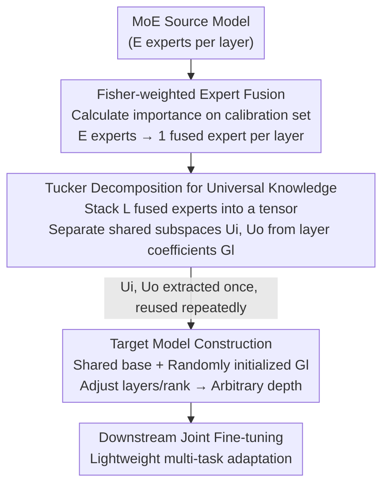

# UNITE: Universal Knowledge Integration from Task-Specific Experts

**Conference**: ICLR 2026  
**OpenReview**: [https://openreview.net/forum?id=WnW0zndglL](https://openreview.net/forum?id=WnW0zndglL)  
**Code**: None  
**Area**: Model Compression  
**Keywords**: Mixture-of-Experts, Universal Knowledge Extraction, Tucker Decomposition, Fisher Information, learngene

## TL;DR
Addressing the issues of "fragmented and cross-layer redundant" expert knowledge in Mixture-of-Experts (MoE) models, UNITE first uses Fisher information to weighted-fuse multiple experts per layer into a single expert, then applies Tucker decomposition to decouple cross-layer shared low-rank input/output subspaces (as "universal knowledge / learngene") from layer-specific coefficients. Finally, this set of shared subspaces is extracted once and reassembled repeatedly to construct lightweight target models of any depth—outperforming random initialization baselines by over +6% on reasoning tasks with only a fraction of the parameters compared to compression baselines.

## Background & Motivation

**Background**: Modern Large Language Models (LLMs) extensively adopt the Mixture-of-Experts (MoE) architecture, where each token activates only one or two out of dozens of experts via top-1 or top-2 routing. This sparse activation results in less than 5–10% of parameters being used per forward pass, providing significant computational and scalability benefits that allow trillion-parameter models to operate at manageable inference costs.

**Limitations of Prior Work**: The cost of sparse activation is that for any given input, the knowledge of the vast majority of experts remains "idle," and expert knowledge is highly fragmented across different layers and experts. Worse, redundancy occurs not just within layers—many layers implement overlapping or functionally similar transformations (prior work found that cross-layer parameter sharing, like in ALBERT, incurs almost no loss in accuracy). In other words, MoE models hide many reusable structures buried under routing sparsity and inter-layer redundancy.

**Key Challenge**: Previous research (gradient sensitivity, loss change tracking, Data Shapley, etc.) primarily focused on "diagnosing" redundancy or assessing parameter importance. While they reveal overlapping/compressible structures, these methods remain at the **identification** stage—providing importance scores either highly scattered across individual parameters or aggregated to the whole-layer level. They lack a mechanism to **transform these findings into systematically reusable knowledge**. In short, while earlier works knew "shared structures exist," no one had actually extracted and reused them repeatedly.

**Goal**: The authors break the problem into two sub-problems: (1) how to **integrate** fragmented expert knowledge within a layer into a compact representation; (2) how to **decouple** the truly universal, cross-task transferable parts from layer-specific local variations and verify their reusability.

**Key Insight**: Leveraging an analogy to human learning—humans do not learn by rote memorization of isolated facts but by distilling experiences into reasoning principles (e.g., logical deduction learned from math transfers to physics and computer science). The authors hypothesize that while MoE experts specialize, their parameters are not entirely independent and likely contain overlapping, redundant, and recurring transformations that implicitly encode transferable patterns. If such "universal knowledge" exists, it can serve as a compact substrate to be extracted once and reused repeatedly, echoing the philosophy of learngene (heritable structural knowledge units).

**Core Idea**: Use **Fisher-weighted fusion (to eliminate intra-layer fragmentation) + Tucker decomposition (to decouple inter-layer shared subspaces)** to transform fragmented MoE expert parameters into a compact, reusable "universal knowledge" (shared projection matrices $U_o, U_i$), which is then used for the one-time, flexible reconstruction of target models at various depths.

## Method

### Overall Architecture

UNITE addresses whether "universal knowledge" exists within MoE and if it can be extracted and reused. The pipeline consists of three sequential steps: **first fusing fragmented experts within layers, then decomposing shared subspaces across layers, and finally reassembling target models using these shared subspaces**. The input is a pre-trained MoE source model (e.g., Mixtral-8×7B), and the output is a family of target models that can be flexibly instantiated under different compute budgets while sharing the same set of universal knowledge.

Specifically: First, Fisher information scores for each expert are calculated on a general-domain calibration set (Wikitext-2). Multiple experts per layer are fused into one based on these scores, resulting in $L$ fused experts for an $L$-layer model. Second, these $L$ fused expert weights are stacked into a third-order tensor for Tucker decomposition, separating cross-layer shared low-rank input/output projection matrices $U_i, U_o$ (the "universal knowledge / learngene") and layer-specific core tensor coefficients $\mathcal{G}_l$. Third, $U_o$ and $U_i$ are fixed as the common base for all layers, and Feed-Forward modules are reconstructed with randomly initialized layer-specific coefficients $\mathcal{G}_l$. By adjusting the number of layers $L'$ and the Tucker rank, target models of variable sizes are built and then jointly fine-tuned on downstream tasks.

### Key Designs

**1. Fisher-weighted Expert Fusion: Eliminating Intra-layer Fragmentation via Parameter Sensitivity**

The most naive way to integrate experts within a layer is to simply average the $E$ experts: $W^{avg}_l = \frac{1}{E}\sum_{i=1}^{E} W_{l,i}$. However, this assumes all experts are equally important, whereas in practice, a few experts dominate predictions while many are rarely activated. Uniform averaging dilutes key information with noise from low-frequency experts. UNITE uses Fisher information to quantify the importance of each expert: given a calibration set $D$, the Fisher information of expert $i$ is $F_{l,i} = \mathbb{E}_{(x,y)\sim D}[\nabla_{\theta_{l,i}} \log p(y|x;\theta)\, \nabla_{\theta_{l,i}} \log p(y|x;\theta)^\top]$. Intuitively, experts with higher Fisher scores have a stronger impact on the likelihood and encode more critical knowledge.

Fisher-weighted fusion is performed as: $W^f_l = \sum_{i=1}^{E} \alpha_{l,i} W_{l,i}$, where $\alpha_{l,i} = F_{l,i} / \sum_{j=1}^{E} F_{l,j}$. This ensures information-rich experts receive higher weights, while noise from rare experts is suppressed. The resulting single expert becomes a compact and comprehensive "summary" of the layer's knowledge. A crucial engineering choice is using a **domain-general and diverse** calibration set (Wikitext-2) to ensure the estimated importance reflects broadly transferable signals rather than overfitting a specific downstream task. Ablations show that simply replacing uniform averaging with Fisher weighting improves PIQA from 0.5092 to 0.6289 (nearly +12%).

**2. Tucker Decomposition to Extract Universal Knowledge: Decoupling Shared Subspaces from Layer-specific Changes**

Intra-layer fusion solves fragmentation, but cross-layer redundancy remains. To identify truly transferable compact components, a "cross-layer" perspective is needed. UNITE stacks each fused expert weight $W^f_l \in \mathbb{R}^{d_o \times d_i}$ along $L$ layers into a third-order tensor $\mathcal{W} \in \mathbb{R}^{L \times d_o \times d_i}$, then applies Tucker decomposition: $\mathcal{W} \approx \mathcal{G} \times_1 U_L \times_2 U_o \times_3 U_i$. Here, $U_L \in \mathbb{R}^{L \times r_L}$ represents layer-specific coefficients, $\mathcal{G} \in \mathbb{R}^{r_L \times r_o \times r_i}$ is a core tensor encoding cross-dimensional interactions, and $U_o \in \mathbb{R}^{d_o \times r_o}, U_i \in \mathbb{R}^{d_i \times r_i}$ are projection matrices defining the output/input low-rank subspaces.

The key insight is that this decomposition naturally separates the "shared" from the "exclusive": $U_o$ and $U_i$ are universal projection bases common to all layers, while $\mathcal{G}$ and $U_L$ modulate these bases to capture layer-specific variations. The weight for layer $l$ can be reconstructed as $W^f_l \approx U_o\, \mathcal{G}_l\, U_i^\top$, where $\mathcal{G}_l = \sum_{k=1}^{r_L} U_L[l,k]\, \mathcal{G}_{k,:,:}$. Consequently, the authors define $\{U_o, U_i\}$ as the extracted **universal knowledge (learngene)**—they are shared low-dimensional subspaces reused across layers. $\mathcal{G}_l$ carries layer-specific changes, allowing each layer to adapt its functional role on the shared base. Tucker is preferred over CP or SVD because CP imposes a single shared rank and oversimplifies interactions, while SVD cannot model multi-way correlations. Only Tucker recovers mode-wise shared subspaces while preserving layer-specific variations, outperforming CP and SVD by over +10% on ARC-Easy and PIQA.

**3. Target Model Construction: Extract Once, Reassemble into Any Depth**

The key to verifying reusability is how the universal knowledge is "used." UNITE's approach is straightforward: the $U_o, U_i$ extracted once from the source model are treated as fixed bases shared by all layers. Each layer is assigned a **randomly initialized** layer-specific coefficient $\mathcal{G}_l$. The Feed-Forward module is reconstructed as $\hat{W}_l = U_o\, \mathcal{G}_l\, U_i^\top$, followed by joint supervised fine-tuning (SFT) of all parameters (including $U_o, U_i, \mathcal{G}_l$) on downstream data. The shared base ensures the reuse of universal structures across all layers, while the randomly initialized $\mathcal{G}_l$ provides the flexibility to adapt to downstream tasks.

The brilliance of this reconstruction is its **once-for-all** capability: universal knowledge is extracted from the source model only once. By changing the number of layers $L' \le L$ and adjusting the Tucker rank $(r_L, r_o, r_i)$, a family of target models of different sizes can be created, all relying on the same set of universal components—**without re-extraction or retraining**. This contrasts sharply with distillation or compression methods, which require expensive retraining for every new scale without guaranteed consistent improvement.

### Loss & Training
After initialization, all parameters $U_o, U_i, \mathcal{G}_l$ of the target model are jointly fine-tuned (SFT) on downstream datasets using accuracy as the evaluation metric. The default Tucker rank is 512 (with experiments on {128, 256, 512}). Target model depths are chosen from {2, 4, 6, 8, 10} to cover various parameter budgets. Fisher information is calculated on Wikitext-2. "From-scratch" baselines are pre-trained on 1B tokens before fine-tuning.

## Key Experimental Results

Validation was performed on three representative MoE source models: Mixtral-8×7B (8 experts, top-2), DeepSeek-MoE-16B-Base (16 experts), and Qwen3-MoE-30B (30B). Downstream coverage includes 7 benchmarks: ARC-C/ARC-E (scientific reasoning), HellaSwag/Winogrande (common sense and logic), OBQA/PIQA (scientific and physical common sense), and GLUE-RTE (Natural Language Inference).

### Main Results

| Comparison | Dataset | UNITE | Baseline | Gain/Notes |
|--------|------|------|----------|------|
| vs Random Init | ARC-C | — | — | +5.5% / +8.5% / +9.5% for Mixtral/DeepSeek/Qwen |
| vs Pre-training | PIQA | 0.631 (Mixtral) | 0.505 (BERT-Large) | >+12% with fewer parameters |
| vs Compression | OBQA | 0.476 (Qwen, 360M) | 0.474 (Compressed, 1.31B) | Equal accuracy at ~1/4 size |
| vs Comp + BERT | PIQA | 0.629 (D-Seek, 317M) | 0.625 (Comp 990M) / 0.505 (BERT-L 340M) | Smaller and stronger |
| Data Efficiency | ARC-E | 0.397 | 0.268 (Best w/ 20B token pre-train) | Significantly exceeds without massive pre-training |
| Convergence | ARC-E | Over 0.36 at epoch 4 | Random < 0.27 even at epoch 10 | Converges in 3–5 epochs |

### Ablation Study

| Dimension | Configuration | ARC-E | PIQA | OBQA | Description |
|------|------|------|------|------|------|
| Fusion Strategy | Uniform Avg | 0.3378 | 0.5092 | 0.4720 | Uniform average dilutes key experts |
| Fusion Strategy | UNITE (Fisher) | 0.3970 | 0.6289 | 0.5020 | ARC-E +5.9%, PIQA +12% |
| Decomposition | CP | 0.2681 | 0.5136 | 0.3020 | Single rank oversimplifies interactions |
| Decomposition | SVD | 0.2668 | 0.5027 | 0.2860 | Cannot model multi-way correlations |
| Decomposition | UNITE (Tucker) | 0.3970 | 0.6289 | 0.5020 | Optimal, >+10% better than CP/SVD |

Target model depth (Qwen3-based, sharing same universal knowledge): 2 layers (360M) → ARC-E 0.3548, PIQA 0.6148; 10 layers (552M) → ARC-E 0.4584, PIQA 0.6464. Tucker rank: rank-128 → ARC-E 0.386, rank-512 → 0.4262 (+4.0%).

### Key Findings
- **Fisher-weighted fusion and Tucker decomposition are both indispensable**: Replacing them with uniform averaging or CP/SVD causes drops of around 10%, showing that "importance-based fusion" and "mode-wise shared subspace separation" are both essential.
- **Gains from depth are task-dependent**: Reasoning tasks (ARC-Easy) benefit significantly from depth (0.3548 → 0.4584), whereas Winogrande and RTE remain largely flat across depths—deeper models favor complex reasoning while shallower ones suffice for surface/local reasoning. Intermediate depths (6–8 layers) provide a good trade-off.
- **Tucker rank acts as an accuracy-compactness knob**: Larger ranks generally improve accuracy but with diminishing returns (e.g., +1.5% on HellaSwag). Rank-512 achieves the highest accuracy at a moderate cost.
- **Once-for-all is the fundamental advantage over compression/distillation**: Universal knowledge is extracted once, and target models of different scales can be instantiated with near-zero additional cost, unlike compression/distillation which requires retraining for every scale.

## Highlights & Insights
- **From "redundancy diagnosis" to "universal knowledge reuse"**: While previous works identified important parameters or redundant structures, UNITE is the first to provide a mechanism to transform these structures into **systematically reusable knowledge units** (shared subspaces $U_o, U_i$).
- **Tucker decomposition as a natural "shared vs exclusive" separator**: Stacking $L$ layers into a tensor allows Tucker factor matrices to naturally map to cross-layer shared bases, while the core tensor maps to layer-specific variations. This alignment between the mathematical tool and the problem structure is the core of its success.
- **Implementing Learngene for highly modular structures**: While previous learngene/learnware research focused on dense architectures like CNNs and ViTs at the layer/block level, UNITE brings the concept to the fine-grained, cross-layer level of MoE.
- **Transferable Trick**: The combination of "Fisher-based weighted fusion of isomorphic sub-modules + Tucker decomposition of stacked instances" can theoretically be generalized to any architecture with many isomorphic modules, such as multi-head attention, multiple adapters, or multi-task heads.

## Limitations & Future Work
- **Calibration Set Dependency**: The quality of universal knowledge depends on Fisher information, which depends on the choice of the calibration set (Wikitext-2). If the set is biased, the "universal" knowledge may not be truly universal, affecting cross-domain transfer.
- **Relatively Low Absolute Accuracy**: Target model accuracy on most benchmarks remains in the 0.3–0.6 range. It is "stronger than random init or similarly sized pre-trained models" but still distant from state-of-the-art large models. It is positioned as an efficient initializer rather than a performance SOTA.
- **Randomized Layer Coefficients**: $\mathcal{G}_l$ requires downstream fine-tuning. If there were a way to also inherit good initializations for $\mathcal{G}_l$ from the source model, data efficiency might improve further.
- **Interpretability of "Universal Knowledge"**: While the paper proves $U_o, U_i$ are reusable and effective, it lacks an analytical dive into what specific "reasoning structures" are actually encoded in these shared subspaces.

## Related Work & Insights
- **vs Importance Scoring/Pruning**: Those methods identify "which parameters are important" for compression, but importance is often scattered or restricted to layers. UNITE **extracts** these structures as reusable units.
- **vs Model Compression (Delta Decompression)**: Compression usually requires separate retraining for each scale. UNITE allows for the zero-cost creation of models at any depth (once-for-all) and matches compressed accuracy with ~1/4 the parameters on OBQA/PIQA.
- **vs Learngene / Learnware**: Shares the "reusable knowledge" paradigm but moves beyond block-level dense models to fine-grained, cross-layer reuse in modular MoE architectures.
- **vs Knowledge Distillation / PEFT**: While KD and PEFT focus on task adaptation, UNITE focuses on extracting **structural knowledge units stable across architectures and tasks**.

## Rating
- Novelty: ⭐⭐⭐⭐⭐ First to push "MoE redundancy diagnosis" to "systematic universal knowledge reuse" using a perfect fit of Fisher and Tucker.
- Experimental Thoroughness: ⭐⭐⭐⭐ Three source models × 7 benchmarks × three criteria, with complete ablations; however, absolute accuracy is low and comparisons to stronger baselines are missing.
- Writing Quality: ⭐⭐⭐⭐ Clear motivation with the human learning analogy; well-explained formulas and workflows.
- Value: ⭐⭐⭐⭐ Provides a principled and scalable path for reusing MoE knowledge to build lightweight models; once-for-all property is practical.

<!-- RELATED:START -->

## Related Papers

- [\[ICCV 2025\] Integrating Task-Specific and Universal Adapters for Pre-Trained Model-based Class-Incremental Learning](../../ICCV2025/model_compression/integrating_task-specific_and_universal_adapters_for_pre-trained_model-based_cla.md)
- [\[ICLR 2026\] Unveiling Super Experts in Mixture-of-Experts Large Language Models](unveiling_super_experts_in_mixture-of-experts_large_language_models.md)
- [\[ACL 2026\] SAMoRA: Semantic-Aware Mixture of LoRA Experts for Task-Adaptive Learning](../../ACL2026/model_compression/samora_semantic-aware_mixture_of_lora_experts_for_task-adaptive_learning.md)
- [\[ICLR 2026\] A universal compression theory for lottery ticket hypothesis and neural scaling laws](a_universal_compression_theory_for_lottery_ticket_hypothesis_and_neural_scaling_.md)
- [\[ICLR 2026\] Alignment-Enhanced Integration of Connectivity and Spectral Sparsity in Dynamic Sparse Training of LLM](alignment-enhanced_integration_of_connectivity_and_spectral_sparsity_in_dynamic_.md)

<!-- RELATED:END -->
