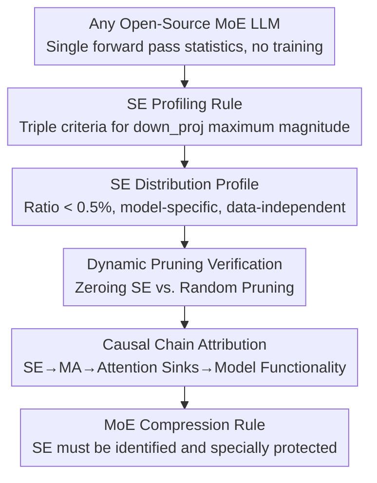

# Unveiling Super Experts in Mixture-of-Experts Large Language Models

**Conference**: ICLR 2026  
**arXiv**: [2507.23279](https://arxiv.org/abs/2507.23279)  
**Code**: [GitHub](https://github.com/ZunhaiSu/Super-Experts-Profilling)  
**Area**: Model Compression / MoE / LLM Analysis  
**Keywords**: Mixture-of-Experts, super experts, massive activations, attention sinks, expert pruning, model compression

## TL;DR

This paper identifies and systematically investigates "Super Experts" (SE) in MoE LLMs—an extremely small subset of experts crucial for model inference, which drive massive activations and attention sinks through extreme activation outliers in `down_proj`.

## Background & Motivation

MoE LLMs (such as DeepSeek, Qwen3, and Mixtral) achieve powerful learning capabilities through dynamic routing and sparse activation. Existing expert-level compression methods utilize importance differences for pruning, merging, or quantization, but often rely on heuristic metrics to identify key experts, lacking a deep understanding of expert heterogeneity.

Core Problem: **Does a tiny, extremely critical subset of experts exist? What are their operational mechanisms?**

## Method

### Overall Architecture

This paper does not propose a new model but unveils Super Experts (SE) through a three-step analysis: "Locate, Ablate, and Attribute." First, a lightweight profiling rule automatically locates the few SEs in `down_proj` outputs and characterizes their sparse and stable distribution (corresponding to Designs 1 and 2, §3 Location Stage). Second, dynamic pruning is used to quantify the actual impact of these experts on various tasks (Design 3, §4 Ablation Stage). Finally, through residual connections, SEs are linked with massive activations (MA) and attention sinks into a complete causal chain (Design 4, §5 Attribution Stage). This entire process does not require training and can be completed with a single forward pass. The conclusion establishes a "hard rule" for MoE compression: SEs must receive special protection.

### Key Designs

**1. SE Profiling Rule: Picking the "Needle" from the Expert Haystack**

Hidden states of MoE LLMs contain massive activations (MA)—extreme outliers where activation values in certain dimensions are hundreds of thousands of times larger than surrounding values. The authors found that these MAs are not spontaneous but are continuously generated by a few experts at the `down_proj` output and accumulated through residual connections. To automatically select these experts, the authors track the maximum output magnitude $a_{l,e}$ of each expert at every layer's `down_proj`. An expert $(l,e)$ is identified as an SE if it satisfies three conditions: $a_{l,e} > P_{99.5}$ (above the 99.5th percentile of all magnitudes), $a_{l,e} > \frac{1}{10}a_{\max}$ (not less than one-tenth of the global maximum magnitude), and $l\in L$ (the layer actually produces MA), where $P_{99.5}=\text{Percentile}_{99.5}(\mathcal{A})$. These conditions exclude common high-activation experts and ensure the selected ones are the true sources of MA. This criterion can be calculated in a single forward pass.

**2. SE Distribution Profile: Extremely Rare but Highly Stable**

Applying the profiling rule to various MoE models yielded counter-intuitive conclusions: the proportion of SEs is generally below 0.5%, with most models having only a single-digit number of them. Qwen3-30B-A3B has only 3 SEs out of 6144 experts (0.05%, Top 1 max activation 744.0), DeepSeek-R1 has 10 out of 15677 (0.06%, 616.0), DeepSeek-V2-Lite has 2/1782 (0.11%, 1424.0), and Mixtral-8x7B has 1/256 (0.39%, 5600.0). Crucially, this list is **model-specific** but **data-independent**: SEs remain almost identical across vastly different datasets like C4, WikiText-2, C-Eval, GSM8K, and HumanEval. This suggests SEs are inherent structures formed during pre-training rather than temporary activations triggered by specific data.

**3. Dynamic Pruning Verification: Removing Three Experts Collapses Mathematical Ability**

Rarity alone does not prove importance. The authors used dynamic pruning as a control experiment to quantify their causal role: zeroing SE outputs during inference and comparing this to "randomly pruning the same number of ordinary experts." The results were stark—after pruning the 3 SEs in Qwen3-30B-A3B, the average score dropped from 70.22 to 55.00 (-21.68%), with GSM8K collapsing from 89.61 to 42.38 (-52.71%) and MMLU dropping from 77.82 to 56.03. In contrast, randomly pruning 3 ordinary experts had almost no impact (average 70.36, GSM8K 89.84). For reasoning models, pruning 10 SEs from DeepSeek-R1 caused Pass@1 on AIME and Math-500 to approach zero. This proves that 0.05% of experts carry functionality far exceeding their proportion, demonstrating an extremely long-tailed importance distribution in MoE.

**4. Causal Chain Attribution: SE is the Master Switch for Attention Sinks**

The final step analyzes why SEs are so important within the Transformer mechanism. The authors discovered that SEs produce extremely strong activations precisely on attention sink tokens (usually initial tokens). These activations accumulate into MA via residual connections, and MA serves as the physical basis for attention sinks. Sink tokens can stably absorb large amounts of attention because they carry the distinct feature of MA. Thus, if SEs are compressed, the chain collapses: MA disappears, attention sinks fail, attention score distributions become disordered, and model functionality breaks down. This **SE → MA → Attention Sinks → Model Functionality** causal chain explains why such a minor perturbation leads to such drastic performance collapse.

## Experiments

### Main Results: Non-Reasoning Models

| Metric | Qwen3-30B Baseline | Pruned SE | Gain | Random Pruned | Gain |
|------|-------------|-------|-------|-------|-------|
| Avg. | 70.22 | 55.00 | -21.68% | 70.36 | -0.20% |
| GSM8K | 89.61 | 42.38 | -52.71% | 89.84 | +0.26% |
| MMLU | 77.82 | 56.03 | -28.00% | 77.84 | +0.03% |

### Reasoning Model Results

Pruning 10 SEs from DeepSeek-R1:
- AIME/Math-500 Pass@1 dropped to nearly 0.
- Mathematical reasoning capability completely collapsed.

### Ablation Study

- Layer-wise SE Pruning: Pruning SEs in a single layer eliminates that layer's contribution to MA.
- Full SE Pruning: MA completely disappears.

### Stability across Datasets

SE distributions are highly consistent across C4, WikiText-2, C-Eval, GSM8K, and HumanEval, verifying data independence.

## Highlights

- First systematic discovery and definition of "Super Experts" in MoE LLMs.
- Reveals a complete causal chain: SE → MA → Attention Sinks → Model Functionality.
- Provides an automated SE profiling tool for rapid localization.
- Offers significant guidance for MoE compression: SEs must be treated specially.

## Limitations & Future Work

- The fundamental reason why SEs form during pre-training remains unclear.
- Only open-source MoE models were analyzed; the situation in closed-source models (e.g., GPT-4) is unknown.
- Protection strategies for SEs (e.g., allocating higher bit budgets) were only briefly discussed.
- Whether a more balanced MoE training mechanism without SEs can be designed was not explored in depth.

## Related Work & Insights

- **MoE Models**: DeepSeek (Guo et al., 2025), Qwen (Yang et al., 2025), Mixtral.
- **Expert-level Compression**: Expert importance measurements based on frequency, routing scores, and reconstruction loss.
- **Massive Activations**: Identified by Sun et al. (2024) but the cause within MoE was unexplained.
- **Attention Sinks**: Identified by Xiao et al. (2023) where initial tokens receive abnormally high attention.

## Rating

- Novelty: ⭐⭐⭐⭐⭐ — First discovery and systematic study of Super Experts in MoE.
- Theoretical Depth: ⭐⭐⭐⭐ — Deep causal analysis but lacks formalized theoretical explanation.
- Experimental Thoroughness: ⭐⭐⭐⭐⭐ — Comprehensive validation across multiple models, tasks, and datasets.
- Value: ⭐⭐⭐⭐⭐ — Directly guides MoE compression strategies.
- Writing Quality: ⭐⭐⭐⭐ — Clear, incremental analysis structure.

<!-- RELATED:START -->

## Related Papers

- [\[ICLR 2026\] MoBE: Mixture-of-Basis-Experts for Compressing MoE-based LLMs](mobe_mixture-of-basis-experts_for_compressing_moe-based_llms.md)
- [\[ICLR 2026\] Coupling Experts and Routers in Mixture-of-Experts via an Auxiliary Loss](coupling_experts_and_routers_in_mixture-of-experts_via_an_auxiliary_loss.md)
- [\[ICLR 2026\] LD-MoLE: Learnable Dynamic Routing for Mixture of LoRA Experts](ld-mole_learnable_dynamic_routing_for_mixture_of_lora_experts.md)
- [\[ICLR 2026\] Efficient Quantization of Mixture-of-Experts with Theoretical Generalization Guarantees](efficient_quantization_of_mixture-of-experts_with_theoretical_generalization_gua.md)
- [\[ICML 2026\] DAG-MoE: From Simple Mixture to Structural Aggregation in Mixture-of-Experts](../../ICML2026/model_compression/dag-moe_from_simple_mixture_to_structural_aggregation_in_mixture-of-experts.md)

<!-- RELATED:END -->
