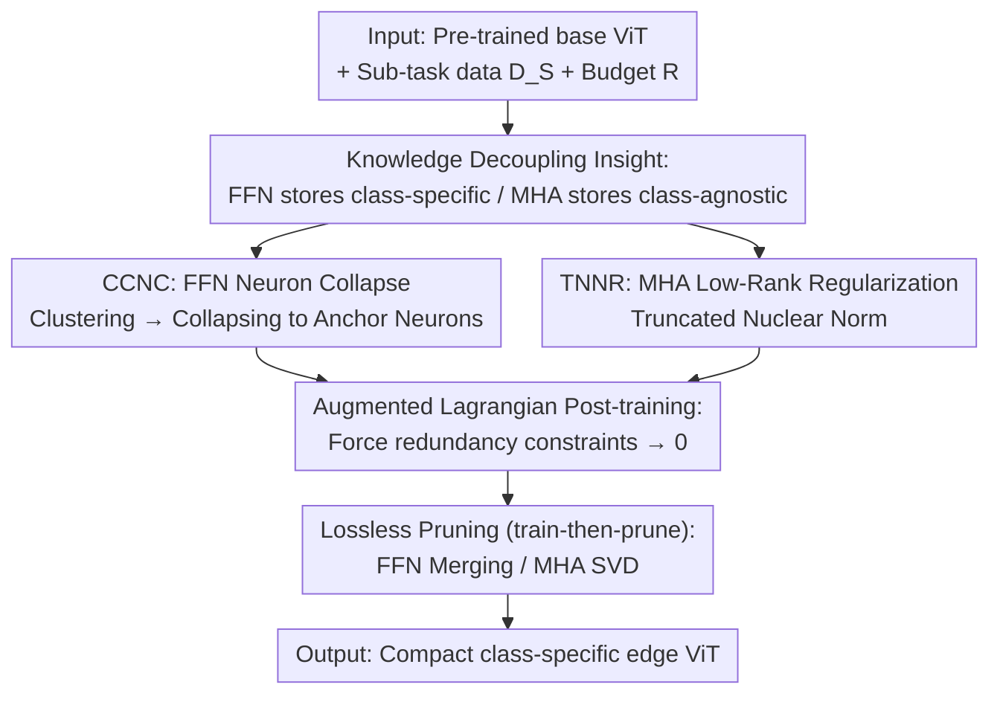

# Vulcan: Tailoring Compact Class-Specific Vision Transformers for Edge Intelligence

**Conference**: ICLR 2026  
**OpenReview**: [https://openreview.net/forum?id=0xE0kNdGIz](https://openreview.net/forum?id=0xE0kNdGIz)  
**Code**: Available (as noted in paper, link in OpenReview)  
**Area**: Model Compression  
**Keywords**: Vision Transformers, Structured Pruning, Class-Specific Models, Edge Deployment, Knowledge Decoupling

## TL;DR
Vulcan discovers that the Feed-Forward Network (FFN) in a ViT stores "class-specific knowledge" while the Multi-Head Attention (MHA) stores "class-agnostic patterns." It proposes a "train-then-prune" post-training method that collapses FFN neurons toward high-activation anchor neurons and uses Truncated Nuclear Norm Regularization (TNNR) to compress MHA projection matrices into low-rank structures. This approach yields compact edge ViTs (20%–40% of the original size) that认-target classes with nearly lossless accuracy—sometimes outperforming the original ViT on specific classes by up to 15.12%.

## Background & Motivation
**Background**: Deploying large Vision Transformers (ViTs) on edge devices like drones or vehicle sensors requires compression. Common techniques include quantization, knowledge distillation, and unstructured/structured pruning. Structured pruning is particularly edge-friendly as it produces "regularly shaped" models that do not require specialized hardware accelerators.

**Limitations of Prior Work**: Existing compression methods typically aim to preserve "all-classes knowledge." However, edge scenarios often only require a small subset of classes (e.g., a vehicle sensor needs to identify cars, signs, and traffic lights, not flowers or insects). Irrelevant knowledge consumes capacity and can distract the model, leading to sub-optimal performance on relevant target classes.

**Key Challenge**: To prune "class-specific" models, one must understand where class-specific knowledge is actually distributed within ViT modules—an unresolved explainability problem. Furthermore, traditional pruning follows a "prune-then-train" paradigm: removing weights based on importance scores and then fine-tuning. However, "unimportant" does not mean "disposable," and direct weight removal at high pruning rates causes **irreversible knowledge loss**.

**Goal**: Given a resource budget (parameters/GFLOPs), derive a compact edge ViT that serves a target class subset $S$ from a general pre-trained base ViT.

**Key Insight**: Through activation-driven analysis on DeiT-Base, the authors found that FFN neurons possess high human-identifiable interpretability (shallow layers capture textures/backgrounds; deep layers capture semantic categories like "snakes"). Conversely, data-agnostic SVD pruning on MHA's QK/VO dimensions often outperformed data-driven scoring methods. These observations suggest a **knowledge decoupling** architecture.

**Core Idea**: Since FFNs store class-specific knowledge and MHAs store class-agnostic patterns, they should be treated differently. Instead of "prune-then-train," Vulcan uses "train-then-prune": it forces redundancy into the model during post-training (clumping FFN neurons and making MHA matrices low-rank) and then losslessly removes that redundancy.

## Method

### Overall Architecture
Vulcan is a pruning-oriented post-training method. The input consists of a pre-trained base ViT $M_B$, data $D_S$ for the target sub-task $S$, and a resource budget (overall pruning rate $R$). The output is a compact edge ViT $M_E$. The workflow entails: analyzing knowledge decoupling, applying dual redundancy constraints during a joint post-training phase via Augmented Lagrangian, and finally performing lossless pruning.

### Key Designs

**1. Knowledge Decoupling Insight: FFN for Class-Specific, MHA for Class-Agnostic**
The authors justify this decoupling through two experiments. For FFN: based on the formula $\mathrm{FFN}^{(l)}(X)=\sum_{i=1}^{e_l}\sigma(Xn_1^{(l,i)})\otimes n_2^{(l,i)}$, the activation magnitude of a neuron represents its weight on the output. Visualizing the Top-25 images for neurons in the deeper layers revealed specialized recognition for specific categories (e.g., snakes), suggesting **FFN as the reservoir for class-specific knowledge**. For MHA: data-independent SVD pruning on QK/VO dimensions was consistently superior to data-driven scoring, implying **MHA stores class-agnostic patterns**.

**2. CCNC: Class-Centric Neuron Collapse for FFN**
To address the redundancy of non-target neurons in the FFN, CCNC first performs k-means clustering on FFN neurons within each block. All neurons in a cluster are forced to collapse toward a high-activation **anchor neuron** $\hat n_k^{(l)}$. Activations are calculated using target sub-task data: $a^{(l,i)}=\sum_j\sigma(X[j]\cdot n_1^{(l,i)})$. The number of clusters $K^{(l)}$ is determined adaptively based on the activation distribution and the global pruning rate:

$$K^{(l)}=\sum_{i=1}^{e_l}\mathbb{I}\!\left(a^{(l,i)}>\Phi\!\left(A^{(l)},\big\lceil(\textstyle\sum_{j}e_j)\times R\big\rceil\right)\right)$$

During post-training, a collapse loss $L_{\text{collapse}}$ forces weights to congregate at the anchor.

**3. TNNR: Truncated Nuclear Norm Regularization for MHA**
To enable lossless SVD pruning in MHA, TNNR actively injects a low-rank structure into $W_Q^{(l,h)}$ and $W_V^{(l,h)}$. The rank budget per head is determined by the **effective rank** $E(W)$, allowing the model to adaptively allocate capacity. The method penalizes only the "tail" singular values that are destined for removal:

$$L_{\text{rank}}=\sum_{l=1}^{L}\sum_{h=1}^{H_l}\left(\sum_{i=q'_l+1}^{q_l}\sigma_{Q}^{(l,h,i)}+\sum_{i=v'_l+1}^{v_l}\sigma_{V}^{(l,h,i)}\right)$$

This forces the unwanted singular values toward zero.

**4. Augmented Lagrangian Post-training & Lossless Pruning**
Vulcan incorporates the task loss $L_T$ and the two redundancy constraints into an **Augmented Lagrangian** objective. Learnable multipliers $\lambda_1, \lambda_2$ (updated via gradient ascent) force the constraints to zero:

$$L=L_T+\sum_{l,k,i}\Big(\lambda_1|\nu_k^{(l,i)}-\hat\nu_k^{(l)}|+\lambda_2(\nu_k^{(l,i)}-\hat\nu_k^{(l)})^2\Big)+\sum_{l,h,i}\Big(\lambda_1\sigma+\lambda_2\sigma^2\Big)$$

Once $L_{\text{collapse}} \to 0$ and $L_{\text{rank}} \to 0$, pruning becomes **lossless**. FFN neurons in the same cluster are merged by summing their second-layer weights, while MHA matrices are reconstructed using truncated SVD.

### Loss & Training
The final objective is the Augmented Lagrangian $L$ above. Multipliers are updated with penalty parameter $\rho$ (default 1.0). Post-training uses a batch size of 256, a learning rate of $10^{-4}$, and the AdamW optimizer. Pruned dimensions are aligned to multiples of 8 for edge hardware acceleration.

## Key Experimental Results

### Main Results
Sub-tasks with 25/50/100 classes were constructed using DeiT-Base on ImageNet-1K. Accuracy (Top-1 %) at pruning rates $R=0.60$ and $R=0.80$:

| Method | 25-class Avg (R=0.6) | 100-class Avg (R=0.6) | 25-class Avg (R=0.8) | 100-class Avg (R=0.8) |
| :--- | :---: | :---: | :---: | :---: |
| DeiT-Base (Original) | 81.05 | 81.06 | 81.05 | 81.06 |
| X-Pruner | 92.64 | 86.03 | 85.74 | 74.95 |
| MDP | 92.64 | 83.27 | 85.47 | 65.69 |
| **Vulcan** | **95.60** | **89.25** | **93.04** | **83.29** |

At $R=0.80$, Vulcan preserves 93.30% of the fine-tuned base model's accuracy while outperforming the original base model by up to 15.12%.

Efficiency (Jetson Orin NX):
- **Vulcan(0.60)**: 34.09M Param, 6.77 GFLOPs (61.47% reduction), **2.16x speedup**.
- **Vulcan(0.80)**: 16.96M Param, 3.26 GFLOPs (81.45% reduction), **3.02x speedup**.

### Ablation Study
(DeiT-Base, R=0.60):
- **w/o CCNC**: Accuracy drops by 84.25% (indicates FFN knowledge is critical and non-redundant without collapse).
- **w/o TNNR**: Accuracy drops by 16.15% (MHA is naturally low-rank, but TNNR helps).
- **w/o anchor**: Collapsing to random neurons drops accuracy by 4.56%.

### Key Findings
- **CCNC is the primary contributor**: The catastrophic drop without CCNC proves that class-specific knowledge is housed in the FFN and cannot be simply pruned without prior condensation.
- **Inherent MHA Low-Rankness**: MHA capacity is naturally redundant, allowing data-agnostic compression with minimal loss.
- **Robustness**: Performance is insensitive to the penalty hyperparameter $\rho \in [0.1, 10.0]$.

## Highlights & Insights
- **Explainability as a Tool**: Vulcan converts the interpretability of neurons into a concrete pruning strategy (FFN vs. MHA分治).
- **Paradigm Shift**: It replaces the traditional "prune-then-train" with "train-then-prune," ensuring pruned weights are truly redundant rather than just "less important."
- **Performance Gain via Focus**: Removing irrelevant class knowledge acts as a form of regularization, allowing the edge ViT to exceed the accuracy of the base model on target tasks.

## Limitations & Future Work
- **Static Class Sets**: Requires knowing target classes $S$ beforehand; dynamic or open-world scenarios would require re-derivation.
- **Training Overhead**: Post-training with Augmented Lagrangian is more computationally expensive than simple one-shot pruning.
- **Architectural Scope**: While tested on DeiT and Swin, further verification is needed for more diverse architectures (e.g., hybrid Conv-ViT).

## Related Work & Insights
- Vulcan outperforms hand-crafted edge architectures (like EfficientViT) by inheriting knowledge from large pre-trained ViTs.
- Unlike traditional structured pruning (X-Pruner, DC-ViT), Vulcan avoids irreversible loss at high pruning rates through the "train-then-prune" mechanism.

## Rating
- Novelty: ⭐⭐⭐⭐⭐ 
- Experimental Thoroughness: ⭐⭐⭐⭐⭐ 
- Writing Quality: ⭐⭐⭐⭐ 
- Value: ⭐⭐⭐⭐⭐ 

<!-- RELATED:START -->

## Related Papers

- [\[ICLR 2026\] Faster Vision Transformers with Adaptive Patches](faster_vision_transformers_with_adaptive_patches.md)
- [\[AAAI 2026\] Compensating Distribution Drifts in Class-incremental Learning of Pre-trained Vision Transformers](../../AAAI2026/model_compression/compensating_distribution_drifts_in_class-incremental_learning_of_pre-trained_vi.md)
- [\[ICLR 2026\] Thicker and Quicker: A Jumbo Token for Fast Plain Vision Transformers](thicker_and_quicker_the_jumbo_token_for_fast_plain_vision_transformers.md)
- [\[ICLR 2026\] UNITE: Universal Knowledge Integration from Task-Specific Experts](unite_universal_knowledge_integration_from_task-specific_experts.md)
- [\[ICLR 2026\] Learnable Sparsity for Vision Generative Models](learnable_sparsity_for_vision_generative_models.md)

<!-- RELATED:END -->
## Related Papers

- [\[ICLR 2026\] TP-Spikformer: Token Pruned Spiking Transformer](tp-spikformer_token_pruned_spiking_transformer.md)
- [\[ICLR 2026\] RAPID$^3$: Tri-Level Reinforced Acceleration Policies for Diffusion Transformer](rapid3_tri-level_reinforced_acceleration_policies_for_diffusion_transformer.md)
- [\[ICLR 2026\] Plug-and-Play Fidelity Optimization for Diffusion Transformer Acceleration via Cumulative Error Minimization](plug-and-play_fidelity_optimization_for_diffusion_transformer_acceleration_via_c.md)
- [\[ICLR 2026\] Otters: An Energy-Efficient Spiking Transformer via Optical Time-to-First-Spike Encoding](otters_an_energy-efficient_spiking_transformer_via_optical_time-to-first-spike_e.md)
- [\[CVPR 2026\] ThinkingViT: Matryoshka Thinking Vision Transformer for Elastic Inference](../../CVPR2026/model_compression/thinkingvit_matryoshka_thinking_vision_transformer_for_elastic_inference.md)

<!-- RELATED:END -->
