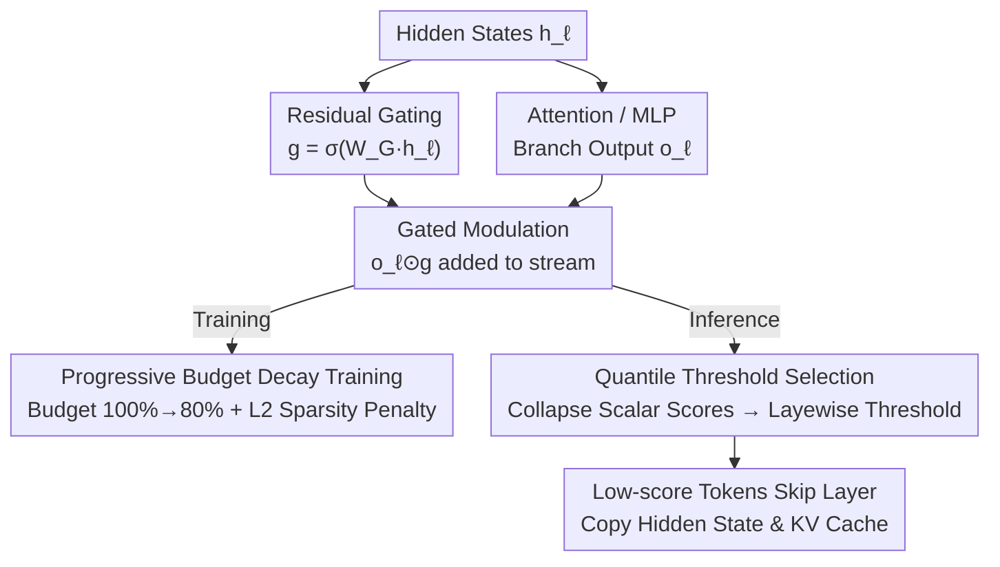

# What Layers When: Learning to Skip Compute in LLMs with Residual Gates

**Conference**: ICLR 2026  
**arXiv**: [2510.13876](https://arxiv.org/abs/2510.13876)  
**Area**: Model Compression  
**Keywords**: Residual Gating, token-level layer skipping, adaptive depth, GateSkip, inference acceleration

## TL;DR

GateSkip is proposed—inserting a sigmoid-linear gate at the output of each Attention/MLP branch in a decoder-only Transformer. During fine-tuning, gate sparsity and the language modeling objective are jointly learned. During inference, low-importance tokens are deterministically skipped based on a quantile threshold of gate values, achieving token-level layer-wise adaptive depth. On Llama 8B, it saves 15% computation while maintaining >90% accuracy. For instruction-tuned models, full computation actually improves accuracy, and ~50% savings still match the baseline. It is orthogonal and combinable with INT4 quantization, structured pruning, and self-speculative decoding.

## Background & Motivation

**Background**: Current LLMs allocate the same amount of computation for every token at every layer, regardless of token difficulty or layer importance. This uniform allocation causes significant waste in latency-sensitive and resource-constrained scenarios. Adaptive compute attempts to dynamically adjust the computation depth for each token. Mainstream directions are categorized into two types: Routing (Mixture-of-Depths, MoD) and Early Exit.

**Limitations of Prior Work**: Routing methods (e.g., MoD) place a router at each layer to make discrete top-k decisions to determine which tokens to skip. Such hard routing leads to unstable training, requires complex load balancing losses, and mostly requires introduction during the pre-training stage, making it difficult to add post-hoc. Early exit methods add auxiliary LM heads at intermediate layers, stopping early when a confidence threshold is met. However, auxiliary heads alter the distribution of pre-trained hidden states, are difficult to calibrate, and exhibit a sharp performance drop in long-sequence generation tasks.

**Key Challenge**: Existing adaptive depth methods either rely on discrete decisions leading to unstable training or require modifications to the pre-training process, making them difficult to add to existing models lightly. The key requirement is a mechanism that is differentiable, can be added post-training, and enables deterministic skipping during inference.

**Key Insight**: The authors observe that the residual stream of a Transformer is itself a control channel for information transfer—the output of each layer is added back via $h_{\ell+1} = h_\ell + o_\ell$. By multiplying a learnable gate before adding $o_\ell$ back, the contribution of each layer to the residual stream can be controlled continuously. Differentiable gates during training ensure stable gradients, while thresholding gate values during inference provides deterministic skip/no-skip decisions.

**Core Idea**: Placing a sigmoid-linear gate at the exit of the residual stream converts the discrete routing problem into a continuous differentiable gating learning problem. The model learns sparse gating while maintaining language modeling quality during training and performs token-level layer skipping based on ranked gate values during inference.

## Method

### Overall Architecture

GateSkip addresses the waste caused by LLMs spending the same computational budget on every token at every layer. It inserts a lightweight gate at the **exit** of each Attention and MLP branch in a standard decoder-only Transformer. The gate reads the current hidden state and outputs a sigmoid value, deciding how much of the branch's output is worth adding back to the residual stream. The process follows three steps: first, inserting the gate into the residual stream (Mechanism); second, jointly optimizing the gates and the backbone during training to balance "language modeling quality" and "gate sparsity" (using progressive budget decay); third, collapsing each token's gate values into a scalar importance score during inference and skipping low-importance tokens based on per-layer quantile thresholds. Hidden states and KV caches of skipped tokens are passed directly to the next layer. The continuous differentiability during training ensures stable gradients, while discrete thresholds during inference ensure actual computational savings, decoupling the two stages as the fundamental reason GateSkip is more stable than MoD or early exit.

### Key Designs

**1. Residual Gating: Placing a sigmoid gate at the residual exit to make "skipping" continuously learnable**

Standard residual connections are $h_{\ell+1} = h_\ell + o_\ell$, where the module output $o_\ell$ is unconditionally added back, causing wasteful "full computation." GateSkip multiplies a learnable gate before addition: $h_{\ell+1} = h_\ell + o_\ell \odot g_\ell(h_\ell)$, where $g_\ell(h_\ell) = \sigma(W_G h_\ell + b)$ is a linear projection with sigmoid activation. $W_G \in \mathbb{R}^{H \times H}$ allows gate outputs to be as wide as the hidden dimension, achieving fine-grained dimension-wise regulation rather than a global switch. The bias $b$ is initialized to a large positive value ($\sigma(b)\approx 1$), so gates are nearly fully open at the start of training, keeping model behavior close to the original pre-trained weights and avoiding disruption of learned representations.

This step bypasses the instability of discrete top-k routing in MoD: sigmoid outputs in $[0,1]$ are continuous and differentiable with smooth gradients. Placing the gate at the **exit** rather than the entry is intentional—it learns "how much of the calculated module output is worth adding," receiving gradient signals from downstream of the module. Entry-level gating must "blindly guess" whether to enter the module, which caused generation accuracy to collapse to 1.0 in ablations (see below).

**2. Progressive Budget Decay Training: Allowing the model to learn importance before adapting to aggressive skipping**

Differentiable gates allow training, but to truly learn "who to skip," the model must experience skipping during training. The difficulty is that if training starts with a high skip rate, the model is forced to drop tokens before the gates have learned to identify importance, leading to instability. GateSkip linearly decays the retention budget from $b_1 = 1.0$ to $b_2 = 0.8$, i.e., $b_t = b_1 - (b_1 - b_2)\frac{t}{T_{\text{total}}}$. Actual token skipping using quantile thresholds is performed throughout training, but gradients only pass through retained tokens. This allows the model to build a foundation for importance judgment under near-full computation before gradually adapting to skipping, while the backbone is jointly fine-tuned to encode importance cues into hidden states.

**3. Quantile Threshold Token Selection: Converting continuous gate values into deterministic skip decisions during inference**

Learned gates are continuous, but inference requires hard skipping to save computation. At each layer $\ell$, GateSkip collapses the gate vector for each token into a scalar importance score $\bar{g}_{\ell,i} = \frac{1}{H}\sum_k g_\ell(h_\ell)_{i,k}$. A quantile threshold $\tau = \text{Quantile}(\{\bar{g}_{\ell,i}\}, 1-\hat{b})$ is then calculated over all token scores in that layer, where $\hat{b}$ is the fixed retention budget during inference. Tokens with scores below $\tau$ skip the layer, and their hidden states and KV caches are copied to the next layer.

Quantiles are used instead of global fixed thresholds because gate distributions are observed to be **narrow within layers but varied between layers**. Quantile thresholding naturally adapts to these variations per layer, avoiding the need for per-layer calibration. This translates continuous importance into deterministic skip decisions, enabling GateSkip to produce a smooth "accuracy-efficiency" curve in generation tasks, unlike early exit methods that fail on long sequences.

### Loss & Training

The total training loss is $\mathcal{L} = \mathcal{L}_{CE} + \lambda_S \mathcal{L}_S$. The first term is standard next-token prediction cross-entropy. The second is a gate sparsity penalty using L2 distance: $\mathcal{L}_S = \frac{1}{N_L H}\sum_\ell \sum_k \|g_\ell(h_\ell)_k\|_2$, encouraging gate values toward zero. $\lambda_S = 0.1$ is used. Ablations show L2 loss outperforms L1 and KL-divergence variants—L1 has stronger log-likelihood at zero skips but drops faster when skipping, while KL-divergence performs best at zero skips but collapses at even small skip rates. All parameters (backbone + gates) are updated jointly using AdamW.

## Key Experimental Results

### Main Results: Comparison with Prior Adaptive Compute Methods (Llama-3.2-1B)

| Method | Gen Task 0% Skip | Gen Task 15% Skip | Gen Task 25% Skip | Log-Likelihood 0% | Log-Likelihood 30% |
|------|:---:|:---:|:---:|:---:|:---:|
| Original Llama-1B | **30.97** | - | - | 49.12 | - |
| Random Skipping | - | 1.67 | 0.67 | - | 23.62 |
| CALM (saturation) | 3.43 | 3.43 | 3.43 | 30.73 | 30.73 |
| FREE (saturation) | 11.57 | 11.57 | 11.57 | 36.02 | 36.02 |
| LayerSkip | 10.65 | 10.65 | 10.65 | 38.25 | **38.25** |
| MoD | 20.83 | 3.96 | 2.91 | 44.18 | 29.33 |
| **GateSkip (Ours)** | 23.53 | **22.14** | **17.67** | 47.35 | 31.74 |

GateSkip significantly outperforms all baselines in generation tasks: at 15% skip, it achieves 22.14% accuracy, which is 5.6x higher than MoD and over 6x higher than CALM/FREE. The generation accuracy of CALM, FREE, and LayerSkip does not change with the skip rate (as their adaptive mechanisms essentially fail during long-sequence generation), while GateSkip exhibits a smooth accuracy-efficiency curve.

### Ablation Study

| Design Choice | Gen @ 15% Skip | Log-Likelihood @ 15% | Description |
|----------|:---:|:---:|------|
| **Vector Gate (Default)** | **23.2** | **37.8** | Dimension-wise gating, full model |
| Scalar Gate | 20.4 | 36.8 | Accuracy drops 2.8, too coarse |
| Shared Gate | 20.7 | 38.4 | Inter-layer differences are erased |
| Only Skip Attention | 14.9 | 37.5 | MLP layers also contain redundancy |
| Only Skip MLP | 7.8 | 32.0 | Skipping MLP has a larger impact |
| MLP Gate (Non-linear)| 18.5 | 33.9 | Extra parameters lead to overfitting |
| Gate at Entry | 1.0 | 35.7 | **Catastrophic failure**—cannot receive gradients from output |
| Frozen Backbone | 12.7 | 37.5 | Backbone adaptation is crucial for skipping |

The most critical finding: gate placement (Exit vs. Entry) is massive (23.2 vs 1.0). This validates the core hypothesis: gates need downstream gradient signals from the module's output to learn what computation can be skipped.

### Scale Scalability

| Model | Gen @ 0% | Gen @ 15% | Gen @ 25% | Accuracy Retention @ 15% |
|------|:---:|:---:|:---:|:---:|
| Llama-3.2-1B | 26.8 | 23.2 | 19.8 | 86.6% |
| Llama-3.2-3B | 45.0 | 43.3 | 42.1 | 96.2% |
| Llama-3.1-8B | 57.3 | 55.0 | 53.6 | 96.0% |
| Gemma-2-2B | 38.0 | 36.1 | 34.8 | 95.0% |

Larger models retain accuracy better at the same skip rate. Llama 3B maintains 96.2% accuracy at 15% skip, indicating higher proportions of redundant computation in larger models. Consistency across architectures (Llama vs Gemma) validates the generality of the method.

### Instruction-Tuned Models (Llama-3B-Instruct)

| Setting | Gen Task | Log-Likelihood |
|------|:---:|:---:|
| Original Llama-3B-Instruct | 36.5 | 46.3 |
| + Random Skipping @ 20% | 0.5 | 34.7 |
| + **GateSkip @ 0% (Full)** | **49.0 (+12.5)** | 36.7 |
| + GateSkip @ 20% | 49.0 | 38.8 |
| + GateSkip @ 30% | 45.6 | 32.9 |
| + GateSkip @ 45% | 35.0 | 31.0 |

An intuitive discovery: on instruction-tuned models, GateSkip in full computation mode actually improves over the baseline by 12.5 points. This suggests the gates act as an adaptive regularizer—suppressing unnecessary computational noise. Even with 20% of computation skipped (49.0), it still outperforms the baseline without gating (36.5).

### Orthogonality with Efficiency Technologies

| Combination | Gen @ 0% | Gen @ 25% | LL @ 15% |
|------|:---:|:---:|:---:|
| GateSkip (32-bit) | 45.0 | 42.1 | 35.6 |
| GateSkip + INT4 Quantization | 42.5 | 41.0 | 35.6 |
| GateSkip + ShortGPT Pruning | - | - | 31.1 |
| GateSkip + Self-Speculative Decoding | - | - | 39.4 |

INT4 quantization maintains 94.4% of generation accuracy with unchanged log-likelihood. The combination with self-speculative decoding reaches an LL of 39.4 at 15-30% savings (better than GateSkip alone at 37.8). This confirms GateSkip is stackable with various orthogonal technologies.

### Key Findings

- Gate placement is the most critical design: Exit vs. Entry shows a 20-point accuracy difference at 5% skip (25.5 vs 5.5); entrance gating almost completely fails.
- Vector gates are significantly better than scalar gates (+2.8), showing dimension-wise control of information flow is more effective than a global switch.
- Joint backbone fine-tuning is essential (10.5-point difference vs frozen backbone)—the backbone needs to adaptively encode importance cues into hidden states for gates to read.
- Learned sparsity patterns are interpretable: BOS tokens consistently receive the highest gate values in early layers (acting as information anchors), punctuation maintains high values across layers (information aggregation), and deep layer gates selectively focus on content words.
- End-to-end latency: On vLLM, 50% token skipping corresponds to a 16.3% throughput increase (2698→3141 tokens/s), and 70% corresponds to a 35% increase.

## Highlights & Insights

- **Residual stream as an active control mechanism**: Conventionally, residual connections are viewed as passive auxiliary channels for gradient propagation. GateSkip proves that adding gates at the exit of the residual stream allows for fine-grained adaptive depth control, opening a low-intrusion direction for Transformer efficiency optimization.
- **Instruction Tuning + Gating = Unexpected Accuracy Gain**: This is the most counter-intuitive finding. Gating doesn't just reduce computation; it acts as an adaptive regularizer, suppressing layer outputs that contribute negatively to the final output. This implies the existence of "harmful computation" in Transformers, rather than just "redundant computation."
- **Elegant Decoupling of Differentiable Training and Deterministic Inference**: Continuous sigmoid values during training ensure smooth gradients, while quantile thresholds during inference convert them into hard skip decisions. This "continuous training, discrete inference" paradigm is more stable than MoD's straight-through estimator and simpler than early exit confidence calibration.
- **Gate Values as Explainability Tools**: Gate values directly reflect "which token is important in which layer." The discovery of BOS tokens as information anchors in early layers (echoing recent "attention sink" research) serves as a free byproduct for analyzing information flow in Transformers.

## Limitations & Future Work

- **Scale limitations**: Verified only up to 8B parameters; lack of experiments on 70B+ models where redundancy might be higher and GateSkip gains more significant.
- **Task scope**: Tested only on English reasoning and language modeling; lacks validation on multimodal (VLM), code generation, or long-context (>128K) scenarios.
- **Limited end-to-end acceleration**: The paper primarily reports theoretical FLOP savings. Real-world throughput gains (16-35%) are lower than theoretical values (50-70%), indicating that engineering overhead for token masking and KV cache copying is non-negligible.
- **Gating granularity**: Currently token×layer; token×head granularity could be explored to allow differential skipping of attention heads.
- **Lack of dynamic budget scheduling**: Currently uses a fixed budget per layer, but layers have different redundancy levels. Dynamic budgets per layer based on input content might further improve efficiency.

## Related Work & Insights

- **vs Mixture-of-Depths (MoD)**: MoD uses discrete top-k routers requiring load balancing losses and unstable training; GateSkip uses continuous sigmoid gates for stable training and later discretizes for inference. GateSkip crushes MoD by 5-10x in generation tasks.
- **vs LayerSkip/CALM/FREE**: These adaptive mechanisms essentially fail during long-sequence generation (accuracy does not change with skip rate). GateSkip's token-level gating is calculated independently per token during generation, avoiding this failure mode.
- **vs Early Exit**: Early exit requires extra LM heads and changes hidden state distributions; GateSkip adds only lightweight linear layers (0.004%-4% parameter overhead) without altering the representation space.

## Rating

- Novelty: ⭐⭐⭐⭐ The residual gating idea is simple and elegant; the decoupling of "continuous training, discrete inference" is clever, though gating itself is not a new concept.
- Experimental Thoroughness: ⭐⭐⭐⭐⭐ 4 model scales × 2 architectures × Generation+LL evaluation × Complete ablations × 3 orthogonal technology combinations × End-to-end latency tests × Explainability analysis. Very comprehensive.
- Writing Quality: ⭐⭐⭐⭐⭐ Methodology descriptions are concise and clear, experiments are well-organized, and each ablation choice has clear reasoning.
- Value: ⭐⭐⭐⭐⭐ Directly practical for high-efficiency LLM inference; post-training addition and compatibility with quantization/pruning lower the engineering barrier significantly.

<!-- RELATED:START -->

## Related Papers

- [\[ICLR 2026\] Knowledge Distillation for Large Language Models through Residual Learning](knowledge_distillation_for_large_language_models_through_residual_learning.md)
- [\[ICLR 2026\] Compute-Optimal Quantization-Aware Training](compute-optimal_quantization-aware_training.md)
- [\[ICLR 2026\] Rethinking Residual Errors in Compensation-based LLM Quantization](rethinking_residual_errors_in_compensation-based_llm_quantization.md)
- [\[ICML 2026\] RaBiT: Residual-Aware Binarization Training for Accurate and Efficient LLMs](../../ICML2026/model_compression/rabit_residual-aware_binarization_training_for_accurate_and_efficient_llms.md)
- [\[ICLR 2026\] MaskPro: Linear-Space Probabilistic Learning for Strict (N:M)-Sparsity on LLMs](maskpro_linear-space_probabilistic_learning_for_strict_nm-sparsity_on_llms.md)

<!-- RELATED:END -->
