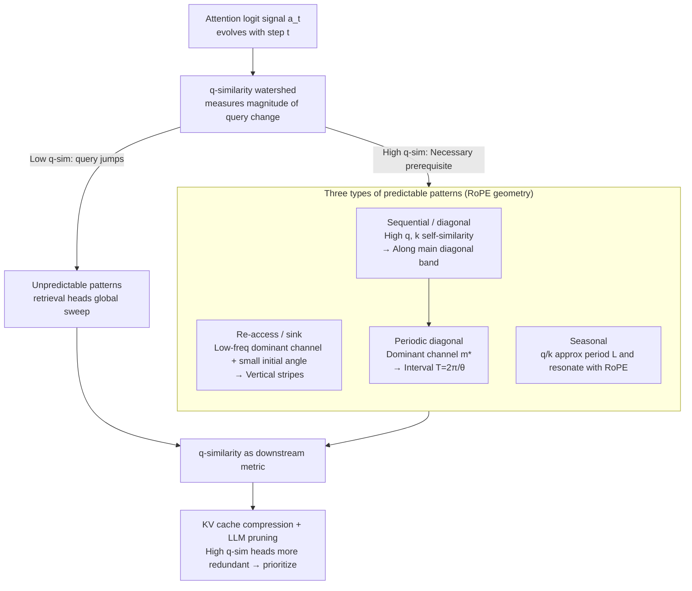

# Why Attention Patterns Exist: A Unifying Temporal Perspective Analysis

**Conference**: ICLR 2026  
**arXiv**: [2601.21709](https://arxiv.org/abs/2601.21709)  
**Code**: [GitHub](https://github.com/MIRALab-USTC/LLM-TAPPA)  
**Area**: Model Compression / Attention Mechanism Analysis / LLM Inference Acceleration  
**Keywords**: attention patterns, temporal analysis, RoPE, query self-similarity, KV cache compression, LLM pruning

## TL;DR

Ours proposes the TAPPA framework, which provides a unified explanation for the formation mechanisms of various attention patterns in LLMs (attention sink, diagonal, periodicity, etc.) from a temporal continuity perspective. It introduces the query self-similarity (q-similarity) metric to guide KV cache compression and model pruning tasks.

## Background & Motivation

Attention heads in LLMs exhibit diverse structured patterns:
- **Attention sinks**: The first token receives abnormally high attention.
- **Diagonal patterns**: Focusing on adjacent tokens.
- **Retrieval heads**: Scanning the context globally.
- **Periodic patterns**: Repeatedly focusing at fixed intervals.

Prior research typically analyzes individual patterns, lacking a unified explanation. The Core Problem is: **Under the same attention formula, what factors determine why different heads adopt different attention patterns?**

## Method

### Overall Architecture

TAPPA (Temporal Attention Pattern Predictability Analysis) translates the question of "where attention patterns come from" into a time-series problem. In autoregressive decoding, the attention logit $a_t$ towards a certain position is viewed as a signal evolving over decoding steps $t$. Whether a head's attention is "structured" depends on the continuity of this signal along the temporal direction. Following this line, TAPPA first categorizes all heads into two types: **predictable patterns** (where high-score positions drift smoothly with $t$ and are extrapolatable) and **unpredictable patterns** (which jump across steps and lack temporal consistency, typical of retrieval heads). For the predictable branch, it uses query/key self-similarity and the rotational geometry of RoPE to derive specific shapes (re-access/attention sink, sequential diagonal, periodic diagonal, seasonal). The core variable governing everything is **query self-similarity (q-similarity)**, i.e., the similarity of queries between adjacent decoding steps. Finally, this theoretically derived q-similarity is applied as a decision metric for downstream compression, validating the theory's utility in KV cache compression and model pruning.

### Key Designs

**1. q-similarity: Compressing "Random vs. Structured" into a Measurable Watershed**

To explain why some heads are chaotic while others are regular and predictable, a calculable criterion is needed. Proposition 4.1 provides a lower bound: if the difference between adjacent queries $\|q_{t+1}-q_t\|$ is large and not orthogonal to the rotated key, the bitwise difference of attention logits must be significant, $\|a_{t+1}-a_t\|_\infty \geq c_1\|q_{t+1}-q_t\| - c_2$. In other words, when the query changes drastically (low q-similarity), the attention must jump randomly without forming stable patterns (retrieval heads). Conversely, **high q-similarity is a necessary prerequisite for any predictable pattern to emerge**. This integrates all subsequent structured patterns under a single sufficient condition, allowing q-similarity to serve as a lightweight downstream metric—calculating only the similarity between adjacent queries without training or complex scoring.

**2. Deriving Geometric Shapes of Three Predictable Patterns via q-similarity + RoPE**

Knowing "high q-similarity is necessary" is insufficient; the specific shapes and intervals of predictable heads must be defined. TAPPA provides a set of sufficient conditions for the predictable branch, deriving three shapes using the same variables (query/key self-similarity + RoPE rotation):

- **Re-access / attention sink** (Theorem 5.1, vertical stability): When the query is highly self-similar and the head is dominated by a **low-frequency RoPE channel**, the attention logit remains nearly constant over time $|a_{t+1,i}-a_{t,i}|$. Geometrically, the angle $\phi_{t,i}^{(m)}$ between query and key $k_i$ is small, the cosine term after rotation approaches 1 and drifts slowly with $t$. Consequently, the same position $i$ receives high scores across multiple steps, forming vertical "re-access" stripes, i.e., sinks.
- **Sequential / diagonal** (Theorem 5.2): When both query and key exhibit high self-similarity ($\|q_{t+1}-q_t\|\leq\varepsilon$, $\|k_{i+1}-k_i\|\leq\varepsilon$), logits shifting synchronously along the diagonal are nearly equal, $|a_{t+1,i+1}-a_{t,i}|\leq C\varepsilon$. Since RoPE only encodes relative positions, shifting both query and key by one step keeps the relative angle constant, preserving the interaction and stretching the attention into a stable band along the main diagonal.
- **Periodic diagonal** (Theorem 5.3, refinement of sequential): When a dominant channel $m^\star$ exists, multiple diagonals appear, repeating at a fixed interval $T=\frac{2\pi}{\theta_{m^\star}}=2\pi c^{2m^\star/d}$ (where $c$ is the RoPE base). This provides a verifiable prediction: moving the dominant channel to a low-index (high-frequency) position should cause periodic diagonals to appear, and decreasing the base $c$ should shorten the interval—subsequent experiments confirm these phenomena.
- **Seasonal** (Theorem 5.4, looser than diagonal): When query/key approximately repeat with period $L$ and $L$ resonates with the dominant RoPE frequency, logits separated by $L$ steps remain close, $|a_{t+L,i}-a_{t,i}|\leq C_1(\varepsilon_q+\varepsilon_k)+C_2\delta$. This quantifies the deviation of "returning to a similar distribution every $L$ steps" via periodic errors $\varepsilon_q, \varepsilon_k$ and resonance mismatch $\delta$.

These four cases share the same reasoning framework—**high self-similarity ensures temporal continuity, and RoPE frequency structure determines specific geometry**—which is key to TAPPA's "unified" explanation rather than labeling phenomena individually.

**3. q-similarity as a Decision Metric for Downstream Compression**

Since q-similarity determines whether a head is predictable and whether its attention is stable across steps, it naturally serves as a head-level redundancy metric. Heads with high q-similarity exhibit stable attention and high information redundancy, allowing for more aggressive KV cache compression or prioritized removal during pruning. Conversely, low q-similarity heads are allocated more budget. This approach requires no extra training or complex scoring, relying simply on adjacent query similarity, which explains why a simple metric consistently outperforms baselines in experiments.

## Key Experimental Results

### Main Results: KV Cache Compression (LongBench)

| Method | Budget=512 | Average Score |
|------|-----------|--------|
| StreamingLLM | — | 41.75 |
| H2O | — | 44.39 |
| SnapKV | — | 46.92 |
| CAKE | — | 47.19 |
| **TAPPA** | — | **47.55** |
| Full cache | — | 49.06 |

The simple q-similarity-based metric of TAPPA consistently outperforms all baseline methods.

### LLM Pruning

On Llama-3.1-8B and Qwen-2.5-7B:
- q-similarity guided pruning outperforms unguided uniform pruning.
- Pruning high q-similarity heads has a smaller impact on performance.

### Ablation Study (Theoretical Verification)

1. **Dominant Channel Relocation**: Moving dominant channels from index 124 in Qwen2.5 to indices 2/3/5 successfully generated periodic diagonals as theoretically predicted.
2. **RoPE Base Adjustment**: Changing $c = 1,000,000 \to 100,000$ shortened the diagonal interval, consistent with the theoretical prediction of $T = 2\pi / \theta_{m^\star}$.
3. **q-similarity Distribution**: Analysis across layers, heads, models, and datasets verified the universal existence of high and low continuity heads.

### Key Findings

1. q-similarity is the key factor distinguishing predictable from unpredictable attention patterns.
2. Re-access patterns require high q-similarity and a low-frequency RoPE dominant channel.
3. Sequential patterns require high q-similarity and high k-similarity.
4. Periodic diagonal intervals are determined by the frequency of the dominant RoPE channel.
5. q-similarity is a simple yet effective metric for downstream tasks.

## Highlights & Insights

- First to unify the explanation of multiple attention patterns from a temporal continuity perspective.
- Four theorems provide rigorous mathematical analysis.
- The q-similarity metric is extremely simple yet consistently effective.
- Precise theoretical validation through controlled experiments (relocating channels/adjusting RoPE base).

## Limitations & Future Work

- Theoretical analysis assumes measurable query/key self-similarity, but these vary with context in practice.
- Relatively less analysis is provided for unpredictable patterns (e.g., retrieval heads).
- Seasonal patterns require RoPE resonance conditions, which might have limited applicability in practice.
- Downstream task improvements are consistent but marginal (~0.5-1 point).

## Related Work & Insights

- **Attention Patterns**: Attention sink (Xiao et al., 2023); retrieval heads (Wu et al., 2024).
- **RoPE Analysis**: Barbero et al. (2025) attributed diagonals to high-frequency RoPE components.
- **KV Cache Compression**: H2O, SnapKV, PyramidKV, MInference.
- **Input Dynamics**: AttentionPredictor (Yang et al., 2025); Lee et al. (2024).

## Rating

- Novelty: ⭐⭐⭐⭐⭐ — The unified theoretical framework is a major contribution.
- Theoretical Depth: ⭐⭐⭐⭐⭐ — Rigorous derivation of four theorems.
- Experimental Thoroughness: ⭐⭐⭐⭐ — Excellent theoretical validation; downstream tasks are somewhat simplistic.
- Value: ⭐⭐⭐⭐ — q-similarity is simple and practical.
- Writing Quality: ⭐⭐⭐⭐⭐ — Clear, elegant, and excellent visualization.

<!-- RELATED:START -->

## Related Papers

- [\[ICLR 2026\] Many Eyes, One Mind: Temporal Multi-Perspective and Progressive Distillation for Spiking Neural Networks](many_eyes_one_mind_temporal_multi-perspective_and_progressive_distillation_for_s.md)
- [\[ICLR 2026\] AgilePruner: An Empirical Study of Attention and Diversity for Adaptive Visual Token Pruning in LVLMs](agilepruner_an_empirical_study_of_attention_and_diversity_for_adaptive_visual_to.md)
- [\[ICLR 2026\] TurboBoA: Faster and Exact Attention-aware Quantization without Backpropagation](turboboa_faster_and_exact_attention-aware_quantization_without_backpropagation.md)
- [\[ICCV 2025\] Representation Shift: Unifying Token Compression with FlashAttention](../../ICCV2025/model_compression/representation_shift_unifying_token_compression_with_flashattention.md)
- [\[ICLR 2026\] Enhancing Multivariate Time Series Forecasting with Global Temporal Retrieval](enhancing_multivariate_time_series_forecasting_with_global_temporal_retrieval.md)

<!-- RELATED:END -->
