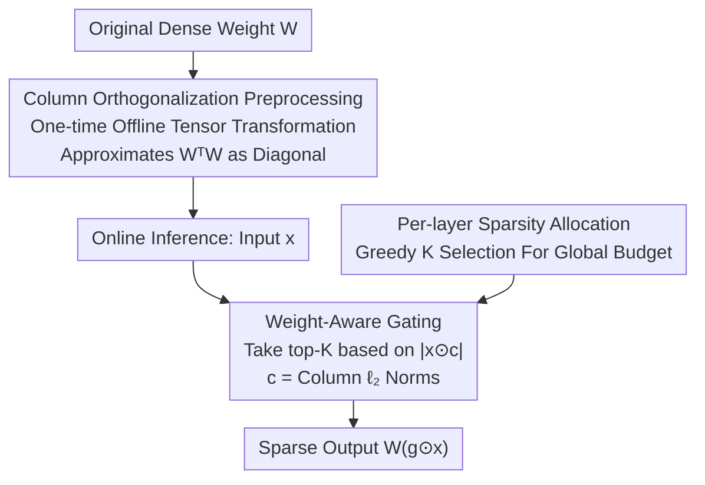

# WINA: Weight Informed Neuron Activation for Accelerating Large Language Model Inference

**Conference**: ICLR 2026  
**OpenReview**: [https://openreview.net/forum?id=l7Vb3yxmuz](https://openreview.net/forum?id=l7Vb3yxmuz)  
**Code**: https://github.com/microsoft/wina  
**Area**: Model Compression / LLM Efficiency  
**Keywords**: Sparse Activation, Training-free Acceleration, Weight-aware Gating, Approximate Error Bound, Inference Acceleration

## TL;DR
WINA incorporates "weight column norm" and "hidden state magnitude" into the gating criterion for training-free sparse activation. By selecting top-K neurons using $|x_i \cdot c_i|$ instead of merely $|x_i|$, it provides a theoretically tighter approximate error upper bound. It achieves higher accuracy than TEAL/CATS/R-Sparse at identical sparsity levels on Llama/Mistral/Phi-4, with significant advantages at extreme sparsity levels such as 65%.

## Background & Motivation
**Background**: Accelerating LLM inference follows two main paths. One is architectural modification (MoE, distillation) to activate sub-networks per token, which requires heavy (re-)training. The other is **training-free sparse activation**, which preserves the original dense model and dynamically zeros out neurons/weights during inference based on a specific criterion. This approach is plug-and-play and compatible with existing models. TEAL, CATS, Q-Sparse, and R-Sparse belong to the latter category.

**Limitations of Prior Work**: Current training-free methods almost exclusively use a **single criterion**: the top-K hidden state magnitude $|x_i|$. These methods ignore the role of the weight matrix $W$ in forward propagation. The impact of an activation $x_i$ on the next layer's output depends not only on $|x_i|$ but also on the magnitude of the corresponding weight column $W_{:,i}$. Relying solely on $|x_i|$ leads to the **discarding of high-impact activations with small magnitudes but heavy weights, while retaining low-impact activations with large magnitudes but light weights**. As sparsity increases, approximate errors accumulate, causing a sharper drop in accuracy than necessary.

**Key Challenge**: Sparse activation essentially represents a trade-off between efficiency and output quality. The key to this trade-off is **retaining the activations that contribute most to the output**. Since "contribution" is determined by both $x_i$ and $W_{:,i}$, looking only at activation magnitude inevitably leads to suboptimal choices.

**Goal**: Design a training-free, plug-and-play, architecture-agnostic gating criterion that incorporates weight information to (1) more accurately estimate the impact of each activation on downstream layers, and (2) provide a tighter theoretical upper bound for approximate error compared to existing methods.

**Key Insight**: Returning to the fundamental objective—the sparse output $W(g\odot x)$ should approximate the original output $Wx$ as closely as possible, i.e., $\min_g \|Wx - W(g\odot x)\|_2$. Analyzing this objective reveals that the error introduced by zeroing the $i$-th dimension is proportional to $|x_i|\cdot\|W_{:,i}\|_2$. Thus, the weight column norm naturally belongs in the selection criterion.

**Core Idea**: Use $|x_i \cdot \|W_{:,i}\|_2|$ instead of $|x_i|$ for top-K gating. In short, "weighted activation intensity" determines which neurons to activate.

## Method

### Overall Architecture
WINA's objective is to zero out dimensions in the input vector $x$ that contribute least to the output at each layer, constructing a sparse sub-network while minimizing the distance between $Wx$ and $W(g\odot x)$. This is divided into three components: first, **offline weight column orthogonalization** (one-time preprocessing to satisfy theoretical guarantees); second, **online top-K selection** using the weight-aware criterion $|x\odot c|$ to construct the binary gate $g$; third, **per-layer sparsity allocation** to minimize global performance degradation under a given budget. The process involves no gradient updates; the gate is determined in closed-form and is applicable to attention, MLP, residual, and even quantized layers.

### Key Designs

**1. Weight-Aware Gating Function: Determining activation through "Activation Magnitude × Weight Column Norm"**

This is the core of WINA. Existing methods define the gate as $g_i = 1$ if and only if $|x_i|$ is within the top-K of $|x|$, ignoring weights. WINA modifies this to:

$$[g_{\text{WINA}}]_i = \begin{cases} 1 & |x_i c_i| \text{ is in top-K of } |x\odot c| \\ 0 & \text{otherwise} \end{cases}$$

where $c\in\mathbb{R}^n$ represents the **column-wise $\ell_2$ norms** of weight matrix $W$, $c_i=\|W_{:,i}\|_2$, and $\odot$ denotes the element-wise product. The intuition is straightforward: zeroing the $i$-th dimension introduces a perturbation proportional to $\|x_i W_{:,i}\|_2 = |x_i|\cdot\|W_{:,i}\|_2$. Thus, the dimensions that should be preserved are those where this product is largest. This avoids wasting K-slots on activations that have large magnitudes but minimal impact due to small weight columns. The choice of $K$ is flexible and can be shared across layers or fine-tuned per layer.

**2. Column Orthogonalization Preprocessing: Realizing theoretical guarantees via offline transformation**

WINA aims for a **provably optimal/tighter error bound**. Lemma 3.1 proves that when $W$ satisfies column orthogonality ($W^\top W$ is diagonal), the WINA gate selecting top-K based on $|x_i\cdot\|W_{:,i}\|_2|$ is the **optimal solution** for the single-layer problem $\min_g\|Wx-W(g\odot x)\|_2$. Theorem 3.2 extends this to $L$-layer linear networks, providing a separable output deviation upper bound $E(x;G)\le U(x;G)$, and proving that minimizing $U$ is equivalent to selecting the top $k$ coordinates weighted by squared column norms, i.e., $G_{\text{WINA}}=\arg\min_G U(x;G)$.

However, LLM weights are not naturally orthogonal. WINA utilizes an efficient **one-time offline tensor transformation** (Ashkboos et al., 2024a) to enforce column orthogonality. This step is lightweight and **does not change the model's functional expression** (equivalent transformation), but it ensures theoretical assumptions hold approximately on real models.

**3. Per-layer Sparsity Allocation: Greedily distributing sparsity under a global budget**

Uniformly distributing a global sparsity target (e.g., 50%) across all layers is suboptimal, as different layers vary in sensitivity. WINA adopts the **greedy algorithm** proposed by TEAL: given a global sparsity goal, it iteratively configures per-layer sparsity rates to satisfy the budget while minimizing overall performance loss (layer-specific sparsity). Combined with the architecture-agnostic nature of the criterion, WINA can apply this allocation consistently across attention, MLP, and residual connections. In contrast, CATS is limited to the SwiGLU of gated MLPs and cannot reach high model-level sparsity levels like 50% or 65%.

## Key Experimental Results

### Main Results
Evaluated on Llama-2-7B, Llama-3-8B, Mistral-7B, and Phi-4-14B using lm-evaluation-harness across Common-sense Reasoning (PIQA/ARC/WinoGrande/HellaSwag/SciQ/OBQA/BoolQ), MMLU, GSM8K, and HumanEval. Baselines include training-free methods CATS, R-Sparse, and TEAL, all using per-layer sparsity allocation for a fair comparison of global budgets.

Average Common-sense Reasoning Accuracy (Selected, higher is better):

| Model | Sparsity | CATS | R-Sparse | TEAL | WINA |
|------|--------|------|----------|------|------|
| Llama-2-7B | 0% (Full) | — | — | — | 69.72 |
| Llama-2-7B | 25% | 68.04 | 69.48 | 69.52 | **69.59** |
| Llama-2-7B | 50% | —† | 67.03 | 67.58 | **68.79** |
| Llama-2-7B | 65% | —† | 59.37 | 61.07 | **65.14** |
| Llama-3-8B | 25% | 69.57 | 72.56 | 72.82 | **73.09** |
| Llama-3-8B | 65% | —† | 56.57 | 62.02 | **65.63** |
| Mistral-7B | 50% | —† | 68.70 | 71.93 | **72.45** |

† CATS can only sparsify MLP layers and cannot reach 50%/65% model-level sparsity. At 65% sparsity for Llama-2-7B, WINA outperforms R-Sparse by +5.77% and TEAL by +4.07%. For Llama-3-8B at 65%, WINA is +3.61% higher than TEAL and +9.06% higher than R-Sparse. notably, WINA's score of 73.09% at 25% sparsity for Llama-3-8B **slightly exceeds the full model (72.99)**, suggesting that mild sparsity can have a regularizing effect.

### Synthetic Validation Experiment (Error Bound)
Direct measurement of $\ell_2$ deviation before and after sparsity on a randomly initialized network with enforced column orthogonality (20 random seeds, lower is better):

| Theory | Method | 25% | 40% | 50% | 65% |
|------|------|-----|-----|-----|-----|
| Lemma 3.1 | CATS/TEAL | 1.68 | 3.41 | 4.86 | 7.55 |
| Lemma 3.1 | R-Sparse | 1.72 | 3.48 | 5.01 | 7.75 |
| Lemma 3.1 | **WINA** | **0.70** | **1.73** | **2.70** | **4.75** |
| Theorem 3.2 | CATS/TEAL | 0.73 | 1.44 | 2.04 | 3.02 |
| Theorem 3.2 | **WINA** | **0.38** | **0.76** | **1.09** | **1.76** |

WINA provides the lowest approximate error across all sparsity levels and theoretical settings, **approximately 50% lower than competitors**, consistent with theoretical guarantees.

### Key Findings
- **Weight Information is the Source of Advantage**: Changing the criterion from $|x|$ to $|x\odot c|$ roughly halves the approximate error in synthetic experiments; this is the root of WINA's accuracy gains.
- **Greater Advantage at Extreme Sparsity**: Methods perform similarly at 25% sparsity, but the gap between WINA and TEAL/R-Sparse widens to +4~9% at 65%. The weight-aware criterion prioritizes truly high-impact activations when K-slots are limited.
- **The Ceiling of CATS**: CATS only affects SwiGLU/MLP, preventing high model-level sparsity. WINA's architecture-agnostic per-layer allocation proves more practical in high-sparsity regimes.
- **Compatibility with Quantization**: Experiments confirm WINA remains effective at 4-bit and 8-bit. Triton kernels show competitive actual speedups compared to TEAL.

## Highlights & Insights
- **Minimal Change, Maximum Impact**: Changing the top-K selection from $|x_i|$ to $|x_i|\cdot\|W_{:,i}\|_2$ is a minor modification that requires zero training yet delivers provably tighter error bounds and superior accuracy.
- **Bridging Theory and Engineering**: Recognizing that orthogonality is a prerequisite for the tighter bound, the authors use offline transformations to satisfy the assumption without altering model behavior.
- **Portability**: Being architecture-agnostic and orthogonal to quantization means this "weight-aware top-K" criterion can be directly applied to MoE routing, KV cache sparsity, or attention head pruning.

## Limitations & Future Work
- **Dependency on Column Orthogonalization**: The theoretical guarantees rely on column orthogonality, achieved via offline transformation. When transformation fails to produce good orthogonality (e.g., specific layer structures), the guarantees may weaken.
- **Linear Layer Constraints**: Proofs for Lemmas and Theorems assume linear layers. Error propagation through non-linear activations and LayerNorm relies primarily on empirical results.
- **Acceleration via Triton Kernels**: Actual wall-clock speedup depends heavily on kernel implementations. While kernels are provided, systematic evaluation of end-to-end throughput/latency is relatively sparse.
- **Future Directions**: Extending weight-aware gating to consider cross-layer coupling or combining it with lightweight learnable calibration might further bridge the gap with full models at extreme sparsity.

## Related Work & Insights
- **vs TEAL**: TEAL extends magnitude-based sparsity to all layers for high model-level sparsity but ignores weights. WINA upgrades the criterion to $|x\odot c|$ within the TEAL framework, achieving tighter bounds and better high-sparsity accuracy.
- **vs CATS**: CATS performs sparse activation on MLP SwiGLU. While effective, it is **layer-specific** and cannot reach high model-level sparsity. WINA is architecture-agnostic.
- **vs R-Sparse**: R-Sparse supports per-layer training-free sparsity but lacks the tight approximate error guarantees of WINA, leading to significant accuracy drops at 65% sparsity.
- **vs Model Pruning / MoE**: Traditional pruning requires fine-tuning, and MoE requires training learnable routers. WINA is entirely training-free and plug-and-play.

## Rating
- Novelty: ⭐⭐⭐⭐ Simple but pivotal change; incorporates weight information with solid theoretical backing.
- Experimental Thoroughness: ⭐⭐⭐⭐ Covers various model families, tasks, and sparsity levels. Includes synthetic verification and quantization compatibility.
- Writing Quality: ⭐⭐⭐⭐ Clear logical flow from motivation to theory to experiment.
- Value: ⭐⭐⭐⭐⭐ Training-free, architecture-agnostic, and compatible with quantization; highly practical for existing LLM deployments.

<!-- RELATED:START -->

## Related Papers

- [\[CVPR 2026\] Otil: Accelerating Diffusion Model Inference via Communication-Efficient Multi-GPU Parallelism](../../CVPR2026/model_compression/otil_accelerating_diffusion_model_inference_via_communication-efficient_multi-gp.md)
- [\[ICLR 2026\] Large Language Model Compression with Global Rank and Sparsity Optimization](large_language_model_compression_with_global_rank_and_sparsity_optimization.md)
- [\[ICLR 2026\] PASER: Post-Training Data Selection for Efficient Pruned Large Language Model Recovery](paser_post-training_data_selection_for_efficient_pruned_large_language_model_rec.md)
- [\[AAAI 2026\] Consensus-Aligned Neuron Efficient Fine-Tuning Large Language Models for Multi-Domain Machine Translation](../../AAAI2026/model_compression/consensus-aligned_neuron_efficient_fine-tuning_large_language_models_for_multi-d.md)
- [\[ICLR 2026\] ES-dLLM: Efficient Inference for Diffusion Large Language Models by Early-Skipping](es-dllm_efficient_inference_for_diffusion_large_language_models_by_early-skippin.md)

<!-- RELATED:END -->
