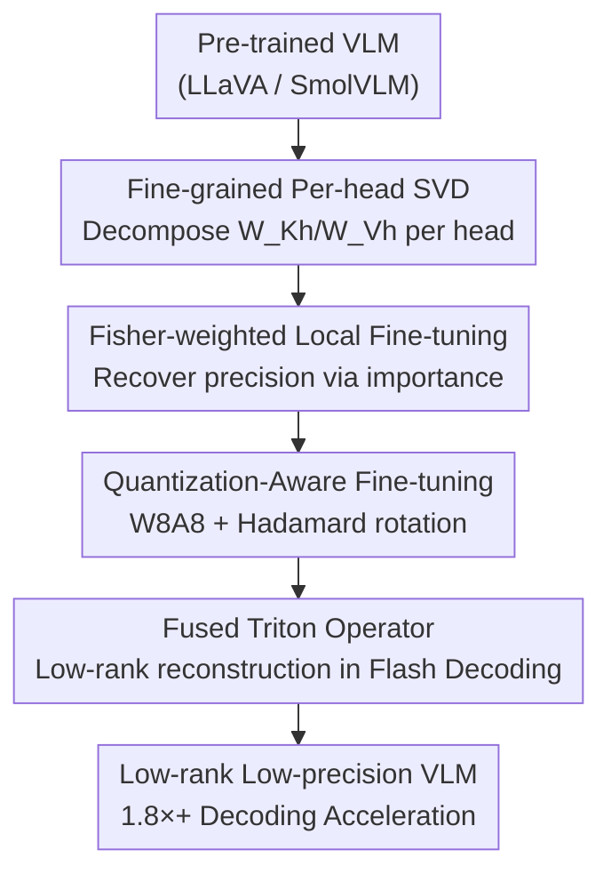

# WSVD: Weighted Low-Rank Approximation for Fast and Efficient Execution of Low-Precision Vision-Learning Models

**Conference**: ICLR 2026  
**Paper**: Published as a conference paper at ICLR 2026  
**Code**: https://github.com/SAI-Lab-NYU/WSVD (Available)  
**Area**: Model Compression / LLM Efficiency  
**Keywords**: Low-Rank Approximation, SVD, Weighted Fine-tuning, Quantization-Aware Training, VLM Decoding Acceleration

## TL;DR
WSVD replaces traditional SVD performed on the entire K/V projection matrix with a "per-head" SVD approach, restores precision through Fisher importance-weighted fine-tuning, layers W8A8 quantization, and implements a Triton operator that fuses low-rank reconstruction directly into Flash Decoding. This achieves a real-world decoding speedup of over 1.8× compared to Flash Decoding for Vision-Language Models (VLMs) with almost no loss in accuracy.

## Background & Motivation
**Background**: SVD low-rank decomposition is a mainstream method for reducing the overhead of large models (LLMs/VLMs). A common practice is to decompose the Q/K/V projection matrix $W$ in self-attention into two low-rank matrices $W \approx AB$, thereby reducing parameters and storage. When applied to KV caches, $W_K = A_K B_K$ allows the cache to store only the low-dimensional latent $C_K = X A_K$, which is then reconstructed as $K = C_K B_K$ during decoding. Theoretically, this saves both VRAM and I/O.

**Limitations of Prior Work**: The authors observed a counter-intuitive phenomenon on real systems: after applying SVD to QKV, decoding latency often does not decrease and sometimes even exceeds that of the uncompressed original model. VLM image token sequences are long and KV caches are massive, making decoding **memory-bound**. When reconstructing $K_h = C_K B_{Kh}$ for each head from a shared latent $C_K$, every head must re-read the entire large latent $C_K$, which actually increases memory traffic.

**Key Challenge**: Conventional SVD decomposes the entire matrix into a single latent $C_K$ (size $L \times R$) **shared by all heads**. Reconstructing any single head requires touching the entire $C_K$, resulting in an effective memory access of $\eta_{svd}=LR$ and computation of $\gamma_{svd}=LRH$ per head. This amplifies memory access, and the storage savings are consumed by the reconstruction overhead.

**Goal**: (1) Identify a low-rank computation pattern that truly reduces decoding latency; (2) Compensate for accuracy loss caused by aggressive low-rank approximation; (3) Layer quantization on top of low-rank decomposition to create fast and accurate low-precision VLMs.

**Key Insight**: Since the problem stems from the "shared latent being too large, requiring every head to read it all," the decomposition granularity should be refined—**perform SVD for each head individually**. This ensures each head only reconstructs from its own small latent $C_{Kh}$, eliminating redundant memory access at the source.

**Core Idea**: A four-part suite consisting of "per-head SVD + Fisher-weighted fine-tuning + quantization-aware fine-tuning + fused operators" transforms low-rank decomposition from "theoretically efficient but practically slow" into "measurable real-world decoding acceleration."

## Method

### Overall Architecture
WSVD is a three-stage offline transformation pipeline that takes a pre-trained VLM as input and outputs an equivalent low-rank, low-precision model with extremely fast decoding. **Step 1** performs SVD on the K/V (and Q) projection matrices of each attention head individually, obtaining small per-head low-rank matrices and latents. **Step 2** uses Fisher importance to weight each weight element, performing local weighted fine-tuning on the low-rank matrices to recover accuracy lost during per-head decomposition. **Step 3** layers W8A8 quantization on the low-rank weights and performs local quantization-aware fine-tuning (QAT), using Hadamard rotations to suppress outliers. These three steps require only 256 ScienceQA calibration samples and very few steps. During inference, a fused Triton operator integrates low-rank reconstruction directly into the Flash Decoding pipeline, allowing low-rank latents to be consumed on-chip and discarded without writing back to VRAM.

### Key Designs

**1. Fine-grained Per-head SVD: Splitting "One Big Shared Latent" into "Small Per-head Latents"**

This is the fundamental strategy WSVD uses to solve the "low-rank is slower" issue. Conventional schemes decompose the entire $W_K \in \mathbb{R}^{E \times H_{tot}}$ via SVD to get $W_K=A_K B_K$ where $A_K \in \mathbb{R}^{E \times R}$, caching a shared latent $C_K=XA_K \in \mathbb{R}^{L \times R}$. Reconstructing the $h$-th head $K_h=C_K B_{Kh}$ requires accessing the full $C_K$, with per-head memory access $\eta_{svd}=LR$ and computation $\gamma_{svd}=LRH$. WSVD instead decomposes each head's sub-matrix $W_{Kh} \in \mathbb{R}^{E \times H}$ individually as $W_{Kh}=A_{Kh}B_{Kh}$, where the rank $r$ is derived from the $H$ singular values of $W_{Kh}$. Since head dimension $H \ll E$, the per-head rank $r$ is typically much smaller than the global rank $R$. Each head caches only its own small latent $C_{Kh}=XA_{Kh} \in \mathbb{R}^{L \times r}$. Reconstructing $K_h=C_{Kh}B_{Kh}$ only touches its own latent, reducing memory access to $\eta_{wsvd}=Lr$ and computation to $\gamma_{wsvd}=LrH$. Both are reduced by a factor of $r/R$ compared to conventional SVD:

$$\frac{\gamma_{wsvd}}{\gamma_{svd}}=\frac{\eta_{wsvd}}{\eta_{svd}}=\frac{r}{R},\quad r \ll R$$

The parameter count per head drops from $\alpha_{orig}=EH$ to $\alpha_{wsvd}=Er+rH$, and the KV-cache drops from $\eta_{orig}=LH$ to $Lr$. This corresponds to a parameter ratio $\rho_1=(1+H/E) \cdot r/H$ and a cache ratio $\rho_2=r/H$. The trade-off is that per-head decomposition **amplifies approximation error**, making accuracy harder to control—which the next design addresses.

**2. Fisher-weighted Local Fine-tuning: "Priority Protection" for Critical Weights**

Standard SVD truncation treats all weights equally. However, prior work notes that large models contain high-sensitivity "superweights." Per-head SVD further amplifies these errors. WSVD estimates an importance score for each weight element to weight the low-rank fitting. Importance is initially approximated using gradient magnitudes $G_K=\mathbb{E}_{x \sim D}|\nabla_{W_K}\ell(W;x)|$, then refined using the Fisher Information Matrix (FIM) by performing a second-order Taylor expansion of the expected loss and approximating the Hessian as diagonal. This yields element-wise Fisher scores $F_K=\mathbb{E}_{x \sim D}[g_K(x) \odot g_K(x)]$, where $g_K(x)=\nabla_{W_K}\ell(W;x)$. The fitting objective becomes a weighted Frobenius error:

$$\min_{A_{Kh},B_{Kh}}\ \sum_h \left\| F_{Kh}^{1/2} \odot (W_{Kh}-A_{Kh}B_{Kh})\right\|_F^2$$

This objective has no analytical solution and is solved by fine-tuning $A_{Kh}, B_{Kh}$ until convergence. Unlike FWSVD's coarse approach of assigning one Fisher weight per row, WSVD uses **element-wise** weights, refining protection to individual weights. This framework also applies to $W_Q, W_V$, and FFN layers.

**3. QAT + Hadamard Outlier Suppression: Low Precision without Collapse**

To further compress the model, WSVD adds W8A8 quantization to low-rank weights and activations. The difficulty lies in channel-wise outliers in the input $X$ and latents $C_K, C_V$. WSVD introduces two orthogonal matrices $S_1, S_2$ ($S_1$ is a predefined Hadamard matrix with binary elements) for "rotational smoothing," rewriting the QKV calculation for each head into a quantization-friendly form:

$$Y_h=(XS_1^\top)(S_1 A_h S_2^\top)(S_2 B_h) \approx Q(XS_1^\top)\,Q(S_1 A_h S_2^\top)\,Q(S_2 B_h)$$

where $S_1^\top S_1=S_2^\top S_2=I$ and $Q(\cdot)$ is the quantization operator. Subsequently, a Fisher-weighted QAT objective joints fine-tunes $S_2, A_h, B_h$ to combat quantization noise: $\min\ \|(F'_h)^{1/2} \odot (S_1W_h-Q(S_1A_hS_2^\top)Q(S_2B_h))\|^2$. $S_1$ is fixed as an exact Hadamard matrix, while $S_2$ is updated using a Cayley optimizer. Because only **local** QAT (50 steps) is performed, the overhead is much lower than end-to-end fine-tuning.

**4. Fused Triton Operator: Embedding Reconstruction into Flash Decoding**

While the first three steps are algorithmic, this step is the system design that brings "real-world" speedup. In a naive PyTorch implementation, reconstructing $K_h=C_{Kh}B_{Kh}$ materializes the full $K_h \in \mathbb{R}^{L \times H}$ and writes it back to VRAM, before reading it back for attention calculation. This causes I/O and peak VRAM to skyrocket, sometimes exceeding the original model. WSVD uses Triton to write a fused operator that embeds low-rank reconstruction into the Flash Decoding pipeline: at the tile level, it streams a small tile of $C_{Kh}$ from VRAM (step 1), loads the up-projection weight $B_{Kh}$ on-chip once (step 2), and temporarily constructs $K_{h,t}=C_{Kh,t}B_{Kh}$ in registers/shared memory (step 3). It then immediately computes $q_h K_{h,t}^\top$ with the query tile, updates the online softmax, and multiplies by the corresponding value tile (step 4). The entire process (reconstruction—qK accumulation—softmax—multiply V) happens in one kernel. Intermediate tensors stay on-chip, and VRAM usage scales only with tile size. The V-path up-projection $B_{Vh}$ is further fused into the output projection (following Palu). Parallelism spans both tile and head levels to saturate the GPU.

### Loss & Training
The two-stage local optimization uses only 256 ScienceQA calibration samples. The weighted fine-tuning stage uses Adam (lr $1 \times 10^{-4}$) for 100 steps. The QAT stage uses Adam (lr $1 \times 10^{-5}$) to update $A_h, B_h$ and a Cayley optimizer for $S_2$ for 50 steps, with $S_1$ fixed. Total overhead is negligible.

## Key Experimental Results

Setup: 5 VLMs (LLaVA-v1.5 7B/13B, LLaVA-Next 7B/13B, SmolVLM-Instruct 2B), evaluated on ScienceQA-IMG and SEED-Bench-IMG against SVD baselines (ASVD / SVD-LLM / QSVD) and quantization baselines (DuQuant / QVLM / QASVD), hardware H100 (accuracy) + RTX 4090/5090 (latency).

### Main Results

Accuracy at different parameter ratios $\rho_1$ under FP16 (Average; WSVD-noQ denotes per-head SVD + weighted fine-tuning):

| Model | Metric | ASVD | SVD-LLM | QSVD-noQ | WSVD-noQ |
|------|------|------|---------|----------|----------|
| LLaVA-v1.5 7B | Avg. (5 levels of ρ₁ × 2 datasets) | 42.05% | 58.47% | 62.64% | **64.10%** |
| LLaVA-Next 13B | Avg. | 70.43% | 70.94% | 71.44% | **72.17%** |
| SmolVLM 2B | Avg. (3 levels of ρ₁) | 8.96% | 19.01% | 55.64% | **65.42%** |

Comparison with quantization baselines (W8A4) under low precision (W8A8, $\rho_1=\rho_2 \approx 50\%$), averaged across 4 LLaVA models:

| Method | Avg. ↑ | Note |
|------|--------|------|
| QASVD | 54.78% | ASVD + QuaRot |
| QVLM | 59.09% | VLM Quantization |
| DuQuant | 63.31% | Quantization Baseline |
| QSVD | 66.07% | SVD + Quantization Baseline |
| **WSVD** | **67.10%** | Fewer parameters, same cache |
| FP16 | 68.23% | Upper bound, WSVD drop ~1% |

Decoding latency (LLaVA-Next 7B, batch=16, seq=8192, normalized speedup):

| Method | RTX 4090 | RTX 5090 |
|------|----------|----------|
| Eager Attention | 1× | 1× |
| Palu | 1.8× | 1.9× |
| Flash Decoding | 3.8× | 4.3× |
| **WSVD-noQ** | **10.5×** | **9.5×** |

Compared to Flash Decoding, WSVD-noQ achieves 1.8×+ real decoding speedup.

### Ablation Study

| Configuration | ScienceQA-IMG (Next 7B) | Note |
|------|------|------|
| WSVD-noFT (ρ₁=50%) | 66.46% | Standard SVD, no weighted tuning |
| WSVD-noQ (ρ₁=50%) | 67.87% | With Fisher-weighted tuning, +1.4% |
| W/o QAT (W8A8, avg) | 68.79% | Quantization without local QAT |
| WSVD (W8A8, avg) | 69.10% | With local QAT, restores accuracy |

### Key Findings
- **Per-head SVD is the source of latency gains**: Conventional full-matrix SVD actually slows down decoding compared to uncompressed models. Per-head decomposition replaces "one big shared latent" with "small per-head latents," reducing memory access and compute by $r/R$. Combined with fused operators, this provides 10.5× / 9.5× real speedup.
- **Weighted fine-tuning and QAT play distinct roles**: The more aggressive $\rho_1$ is (e.g., 50%), the greater the benefit of Fisher-weighted fine-tuning. Local QAT consistently restores points lost to quantization. Both are necessary to target low-rank and quantization errors respectively.
- **Low-rank occasionally outperforms FP16**: LLaVA-Next 13B slightly outperformed FP16 on ScienceQA-IMG at $\rho_1 \le 70\%$ (73.57% vs FP16's baseline, +0.3%). The authors speculate that low-rank approximation might implicitly mitigate hallucinations.

## Highlights & Insights
- **Engineering closed-loop**: The paper doesn't stop at "SVD saves FLOPs." It profiles the RTX 4090 to find that SVD actually increases latency, identifies memory access amplification as the bottleneck, and designs per-head decomposition. This "bottleneck-to-algorithm" approach is highly effective.
- **Element-wise Fisher weights**: Defining the target as $\|F^{1/2} \odot (W-AB)\|_F^2$ provides protection at a grain size much finer than FWSVD's row-wise weighting. This can be migrated to low-rank compression of any linear layer.
- **Fused kernel integration**: Fusing reconstruction into Flash Decoding such that latents are consumed on-chip is the "universal cure" for the efficiency gaps in low-rank methods.

## Limitations & Future Work
- Both weighted fine-tuning and QAT rely on calibration data (256 samples). The accuracy of Fisher importance and the required sample size under distribution shifts are not fully explored.
- Evaluation is concentrated on VQA benchmarks (ScienceQA-IMG, SEED-Bench-IMG). Robustness on long-text generation, OCR, or fine-grained grounding tasks is unknown.
- The "low-rank mitigates hallucinations" claim is an observation rather than a mechanically verified conclusion.
- The fused operator is a hand-written Triton kernel for Flash Decoding. Porting to other attention implementations (like PagedAttention) or non-NVIDIA hardware requires significant engineering.

## Related Work & Insights
- **vs ASVD / SVD-LLM**: These perform SVD on the full Q/K/V matrix. While ASVD considers outliers and SVD-LLM minimizes truncation loss, the shared latent still amplifies decoding memory access. WSVD accelerates decoding by using per-head decomposition.
- **vs FWSVD**: FWSVD uses row-wise Fisher weights. WSVD uses element-wise weights for finer protection.
- **vs Palu (QSVD)**: Palu uses group-head SVD and operator optimization. WSVD uses finer-grained per-head SVD and a more deeply integrated fused kernel in Flash Decoding for lower latency.
- **vs QuaRot / DuQuant**: Pure quantization methods only reduce precision, not rank. WSVD combines low-rank with quantization, saving more parameters while maintaining higher accuracy for the same cache size.

## Rating
- Novelty: ⭐⭐⭐⭐ Per-head SVD combined with element-wise Fisher weighting and fused operators directly addresses real-world latency pain points.
- Experimental Thoroughness: ⭐⭐⭐⭐ 5 VLMs, 2 types of baselines, precision + latency metrics, and clear ablations.
- Writing Quality: ⭐⭐⭐⭐ Logical flow from system profiling to algorithmic solution; clear derivations.
- Value: ⭐⭐⭐⭐ Provides a practical, measurable speedup for VLM deployment with an open-source implementation.

<!-- RELATED:START -->

## Related Papers

- [\[ICLR 2026\] GlowQ: Group-Shared Low-Rank Approximation for Quantized LLMs](glowq_group-shared_low-rank_approximation_for_quantized_llms.md)
- [\[ICLR 2026\] STaMP: Sequence Transformation and Mixed Precision for Low-Precision Activation Quantization](stamp_sequence_transformation_and_mixed_precision_for_low-precision_activation_q.md)
- [\[ICLR 2026\] Taming Momentum: Rethinking Optimizer States Through Low-Rank Approximation](taming_momentum_rethinking_optimizer_states_through_low-rank_approximation.md)
- [\[ICLR 2026\] UniQL: Unified Quantization and Low-Rank Compression for Adaptive Edge LLMs](uniql_unified_quantization_and_low-rank_compression_for_adaptive_edge_llms.md)
- [\[NeurIPS 2025\] QSVD: Efficient Low-Rank Approximation for Unified Query-Key-Value Weight Compression](../../NeurIPS2025/model_compression/qsvd_efficient_low-rank_approximation_for_unified_query-key-value_weight_compres.md)

<!-- RELATED:END -->
