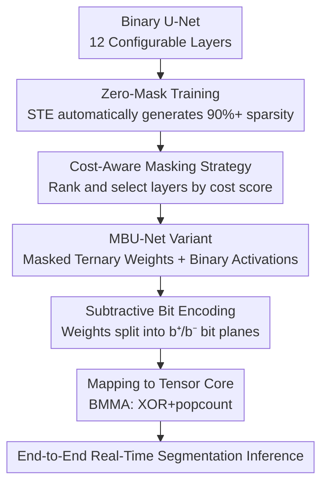

# Zeros Can Be Informative: Masked Binary U-Net for Image Segmentation on Tensor Cores

**Conference**: ICLR 2026  
**Paper**: [OpenReview](https://openreview.net/forum?id=zeros-can-be-informative) (⚠️ Link subject to original)  
**Code**: https://github.com/ChunshuWu/MBU-Net  
**Area**: Model Compression / Quantization / Efficient Inference  
**Keywords**: Binary Neural Networks, Ternary Quantization, U-Net, Tensor Core, Real-time Segmentation

## TL;DR
The authors observe that adding an explicit "zero" state to the weights of a binary U-Net allows sparsity to reach 90%+ while significantly recovering accuracy. Consequently, they propose **MBU-Net**, which selects key layers for zero-masking based on "cost-effectiveness" and maps these masked binary weights directly to GPU binary Tensor Cores (BMMA) using a "subtractive bit encoding" scheme. It achieves near full-precision accuracy (average 3% drop) while providing a 2.04× speedup and 3.54× energy reduction compared to FP16 U-Net across three segmentation datasets.

## Background & Motivation

**Background**: Edge scenarios such as AR/VR, drones, and autonomous driving require real-time (e.g., 60 Hz), low-power (a few watts) high-resolution image segmentation. Compared to heavy models like ViT/SAM, U-Net is more cost-effective in terms of accuracy/efficiency due to its encoder-decoder structure and skip connections. However, running real-time high-resolution video still exceeds the computational, memory, and power budgets of edge devices. Quantization—specifically binary networks that compress both weights and activations to 1-bit—is the most aggressive path for efficiency, as MAC (multiply-accumulate) operations degrade into hardware-friendly XNOR/XOR + popcount bitwise operations.

**Limitations of Prior Work**: Extreme quantization faces two major hurdles. First, **Accuracy Collapse**: Pure binary representation forces weights into $\{-1, +1\}$, compelling every connection to "take a stand" without a neutral state to suppress uncertain or noisy signals. This is particularly damaging for dense prediction tasks like U-Net (in the paper, pure Binary achieves only 0.662 Dice on Carvana, whereas full precision reaches 0.997). Second, **Deployment Difficulty**: Many binary/ternary methods are merely algorithmic proofs-of-concept or designed for custom FPGA/ASIC datapaths. High-performance end-to-end U-Net implementations on general-purpose GPUs are almost non-existent, particularly regarding Tensor Core utilization.

**Key Challenge**: There is a direct trade-off between the "hardware-friendliness" and "accuracy viability" of binary networks. Furthermore, even if accuracy is recovered algorithmically, general-purpose GPUs lack off-the-shelf kernels to efficiently execute "masked binary" weights—BMMA (binary Tensor Core instructions) exist but are experimental, unexposed by cuBLAS/cuDNN, and largely remain idle.

**Goal**: The objective is split into two sub-problems: (1) How to achieve near full-precision accuracy and near binary efficiency for U-Net in segmentation tasks? (2) How to deliver this efficiency on common GPUs without relying on specialized accelerators?

**Key Insight**: The authors made two critical empirical observations. **Observation 1**: Adding a zero-mask to binary weights during training not only recovers accuracy significantly but also leads to spontaneous extreme sparsity—sparsity in many layers exceeds 90%, and some exceed 95%, far outnumbering $+1/-1$ states. This suggests a vast amount of signals should naturally be suppressed by "zero." **Observation 2**: An exhaustive sweep of 4,000 layer-wise quantization configurations revealed that the impact of masking any single layer on accuracy is roughly equal (quantization sensitivity is uniform across layers).

**Core Idea**: Since the zero state is a scarce "accuracy patch" and the contribution of each layer is similar, the strategy is to **prioritize masking "cheap" layers**—trading minimal additional computation for maximal accuracy gains (e.g., transposed convolution layers have minimal computation but are crucial for accuracy). These masked binary weights are then executed using subtractive bit encoding within native binary Tensor Core instructions.

## Method

### Overall Architecture

MBU-Net abstracts a U-Net into **12 configurable layers** (4 encoder double-convs down-C1~4, 4 decoder transposed convs up-CT1~4, and 4 decoder double-convs up-T1~4). Each layer can be either "pure binary" or "masked ternary," creating a design space of $2^{12}$. The pipeline consists of two stages: The **Algorithm Side** uses the two empirical observations and a **Cost-Aware Masking Strategy** to select which layers to mask from the design space, yielding a family of MBU-Net variants. The **System Side** then uses **Subtractive Bit Encoding** to map the masked binary weights (with binary activations) to GPU BMMA instructions, creating an end-to-end high-throughput kernel for A100/H100/Jetson Orin/2080 Ti.

### Key Designs

**1. Zero-Mask Training: Providing a Neutral "Silent" State for Binary Weights**

To address the issue where pure binary connections are forced to react to noise, the authors introduce an explicit zero state, expanding weights from binary $\{-1, +1\}$ to ternary $\{-1, 0, +1\}$, while **activations remain binary** (crucial for bit encoding). Zero-masking is not hand-tuned via thresholds but generated automatically during training via STE (Straight-Through Estimator). The effect is twofold: accuracy is significantly recovered (Carvana Dice 0.662 for pure Binary vs. 0.981 for MBU-Net), and weights become highly sparse spontaneously (averaging >80% zeros, with some >95%). This supports the thesis: "zeros can be informative"—many signals that should be suppressed are silenced by the neutral zero state, leaving only a few critical ±1 connections.

**2. Cost-Aware Masking Strategy: Spending the Masking Budget on "Cheapest" Layers**

Masking is beneficial but not free; ternary layers require more computation/storage than pure binary ones. Masking all layers doubles the operation count (Fig 3b: full mask >0.12 TOPs vs. light mask 0.08 TOPs for similar accuracy). Building on Observation 2 (uniform quantization sensitivity, Fig 3c), the authors suggest: **don't mask every layer; prioritize the "cheapest" ones.** A weighted cost score is defined for each layer $l$:

$$s^l_{cost} = w_{op}\hat{n}^l_{op} + w_{param}\hat{n}^l_{param}$$

where $\hat{n}^l_{op}$ and $\hat{n}^l_{param}$ are normalized operations and parameters, and $w_{op}+w_{param}=1$ is a hyperparameter (default 0.5). Layers are ranked by $s_{cost}$ to form a "priority list." One can then move along the Pareto frontier by masking layers starting from the lowest cost. Transposed convolutions are ideal targets because their computation is 1-2 orders of magnitude lower than other layers, yet they are vital for accuracy.

**3. Subtractive Bit Encoding: Splitting Ternary Weights for BMMA Reuse**

To solve the system bottleneck—Tensor Core binary instructions only support XOR + popcount and cannot natively handle "ternary weights with zeros × binary activations"—the authors decompose each ternary weight into the difference of two binary bit-planes: $b_i = b^{pos}_i - b^{neg}_i$, where $b^{pos}_i, b^{neg}_i \in \{0, 1\}$ (i.e., +1 is (1,0), -1 is (0,1), and 0 is (0,0)). The MAC of binary activation $a$ and ternary weight $b$ is then expressed via bitwise operations:

$$a \cdot b = n + \text{popc}(a' \oplus b^{neg}) - \text{popc}(a' \oplus b^{pos})$$

Using XOR instead of XNOR ensures compatibility with Tensor Core's built-in instructions. A masked layer is executed as two binary WMMA/BMMA operations on two bit-planes. The kernel operates on bit-tiles of $8\times8\times128$ at the warp level, accumulating $C_{pos}$ and $C_{neg}$. These are subtracted to get result $R$, followed by a threshold comparison $A_{out} \leftarrow (R \ge \theta)$ that fuses BatchNorm, bias, and binary activation.

### Loss & Training
Training follows standard BNN paradigms: activations use $x_b = \text{sign}(x)$, weights use ternary quantization, and STE approximates gradients. The cost-aware strategy is applied post-training to determine inference configurations. The first and last convolutional layers remain in full precision.

## Key Experimental Results

Experiments used A100 / H100 / Jetson Orin Nano / RTX 2080 Ti across Carvana (vehicle), ISIC (skin lesion), and Nuclei (cell nuclei) datasets.

### Main Results: Accuracy Comparison (Dice / IoU / F1)

| Configuration (W-A) | Carvana Dice | ISIC Dice | Nuclei Dice | Description |
|------|------|------|------|------|
| Full Precision | 0.997 | 0.771 | 0.867 | FP32/FP16 |
| INT8 | 0.994 | 0.763 | 0.823 | 8-bit |
| INT4 | 0.989 | 0.753 | 0.819 | 4-bit |
| **MBU-Net** | **0.981** | **0.750** | **0.817** | Masked Ternary W + Binary A |
| Binary | 0.662 | 0.560 | 0.434 | Pure Binary (Collapsed) |

MBU-Net drops only 0.029 / 0.037 / 0.024 (Dice/IoU/F1) on average compared to FP, while pure Binary collapses to 0.662 Dice on Carvana.

### Efficiency Comparison (Average gain relative to baseline)

| Baseline | Speedup (MBU-Net) | Energy Reduction (MBU-Net) |
|------|------|------|
| FP32 U-Net | 4.83× | 8.53× |
| FP16 U-Net | 2.04× | 3.54× |
| INT8 (A100, TensorRT) | 1.52× | 2.09× |
| INT4 (A100, TensorRT) | 2.23× | 2.63× |

### Ablation Study

| Configuration | Key Finding | Description |
|------|---------|------|
| Full vs. Light Masking | Full >0.12 TOPs, Light 0.08 TOPs (Similar Accuracy) | Masking all layers is unnecessary (~2× ops wasted). |
| Layer-wise Shapley Gain | Contribution is roughly equal across layers. | Justifies "cheapest layer first" strategy. |
| Transposed Convs | Low ops but high accuracy impact. | High-ROI masking target. |
| Higher Bit-width W | Marginal gains over masked binary. | Shows ternary masking is nearly sufficient. |

### Key Findings
- **Zero state is the primary driver of accuracy recovery**: The only difference between pure Binary and MBU-Net is the explicit zero, yet it yields a massive +0.32 Dice gain on Carvana.
- **Sparsity is a significant byproduct**: Over 80% of weights are zero on average, meaning very few connections carry information.
- **Mask the cheap layers**: Due to uniform sensitivity, masking low-cost layers (especially transposed convs) approximates full-mask accuracy while saving nearly half the operations.
- **Hardware Counter-intuition**: H100 (Hopper) removed native BMMA support, causing MBU-Net/Binary to be slower than FP16 on this specific platform.

## Highlights & Insights
- **Reframing "zeros as informative"**: Treating sparsity not as a side-effect but as an active noise-suppression mechanism is clever. It adds a "silent" gear to the network, improving accuracy and sparsity simultaneously.
- **Subtractive bit encoding is the key for deployment**: By representing $b = b^{pos} - b^{neg}$ and utilizing XOR, the algorithm's benefits are realized on GPUs without specialized hardware.
- **Generality of the Cost-Aware Strategy**: Given uniform sensitivity but varying costs, ranking by ROI is a scheduling paradigm applicable to mixed-precision quantization or structural pruning.

## Limitations & Future Work
- **Dependency on BMMA Support**: Efficiency relies on binary Tensor Core instructions, which are absent in newer architectures like Hopper (H100).
- **Binary Activations Only**: Masking was only applied to weights; whether masking activations could further improve accuracy was not fully explored.
- **Manual Hyperparameters for Cost Scores**: The 0.5/0.5 weighting is empirical. Adaptive selection for different models is needed.
- **Limited to Small Segmentation**: Tested on 16M parameter U-Nets; validity on larger models or generative U-Nets (DDPM) is unproven.

## Related Work & Insights
- **vs. Pure BNNs (XNOR-Net)**: Pure BNNs collapse on U-Net; MBU-Net recovers accuracy via the zero state and subtractive bit encoding without sacrificing hardware friendliness.
- **vs. Ternary/Mixed Quantization (TTQ / TWN)**: Previous works lack end-to-end GPU implementations or specific U-Net layer-wise analysis; MBU-Net bridges the gap between algorithm and BMMA deployment.
- **vs. Large Models (SAM / ViT)**: While SAM/ViT offer higher accuracy, MBU-Net targets edge deployment where the power/latency of larger models is prohibitive.

## Rating
- Novelty: ⭐⭐⭐⭐ Reinterpretation of "zeros" + subtractive bit encoding implementation.
- Experimental Thoroughness: ⭐⭐⭐⭐ Covered 4 platforms and 3 datasets, though lacks large-scale model extrapolation.
- Writing Quality: ⭐⭐⭐⭐ Clear logic flow (observation -> strategy -> deployment).
- Value: ⭐⭐⭐⭐ High engineering value for deploying real-time segmentation on edge GPUs.

<!-- RELATED:START -->

## Related Papers

- [\[ICLR 2026\] BEP: A Binary Error Propagation Algorithm for Binary Neural Networks Training](bep_a_binary_error_propagation_algorithm_for_binary_neural_networks_training.md)
- [\[AAAI 2026\] BD-Net: Has Depth-Wise Convolution Ever Been Applied in Binary Neural Networks?](../../AAAI2026/model_compression/bd-net_has_depth-wise_convolution_ever_been_applied_in_binary_neural_networks.md)
- [\[ICML 2026\] Selective Coupling of Decoupled Informative Regions: Masked Attention Alignment for Data-Free Quantization of Vision Transformers](../../ICML2026/model_compression/selective_coupling_of_decoupled_informative_regions_masked_attention_alignment_f.md)
- [\[ICLR 2026\] TD-MoE: Tensor Decomposition for MoE Models](td-moe_tensor_decomposition_for_moe_models.md)
- [\[ICLR 2026\] LeSTD: LLM Compression via Learning-based Sparse Tensor Decomposition](lestd_llm_compression_via_learning-based_sparse_tensor_decomposition.md)

<!-- RELATED:END -->
