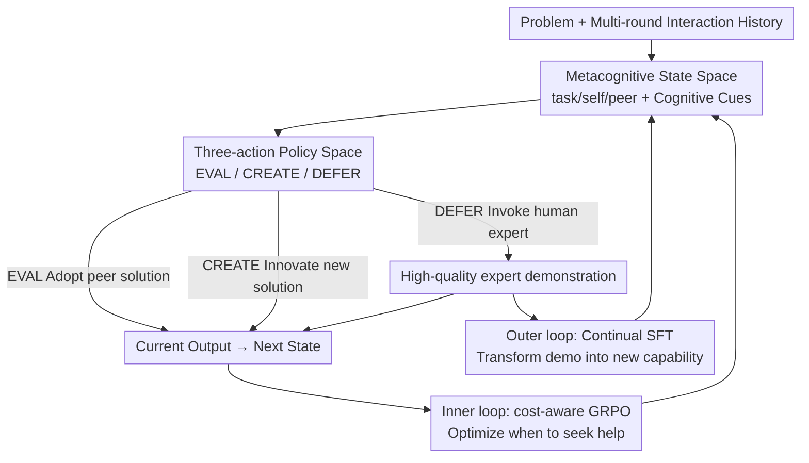

# Adaptive Collaboration with Humans: Metacognitive Policy Optimization for Multi-Agent LLMs with Continual Learning

**Conference**: ICLR2026  
**OpenReview**: [https://openreview.net/forum?id=IKVUB9Exuc](https://openreview.net/forum?id=IKVUB9Exuc)  
**Code**: https://github.com/USC-Melady/HILA.git  
**Area**: Multi-Agent / Human-in-the-Loop / LLM Collaboration  
**Keywords**: Multi-agent systems, human-in-the-loop, metacognitive policies, GRPO, continual learning

## TL;DR
The HILA framework is proposed to enable multi-agent LLMs to learn a set of "metacognitive policies"—judging when to solve problems independently and when to defer to human experts. By using Dual-Loop Policy Optimization, it decouples the optimization of "when to ask" (inner-loop reinforcement learning) from "how to gain capability from assistance" (outer-loop continual learning), consistently outperforming existing autonomous multi-agent systems on benchmarks such as mathematical reasoning.

## Background & Motivation
**Background**: The gains from scaling up single LLMs are diminishing. The next step lies in "strengthening through collaboration"—Multi-Agent Systems (MAS) allow multiple agents to cooperate through protocols such as debate, topology control, and workflow graph optimization to solve complex reasoning tasks that a single model cannot handle.

**Limitations of Prior Work**: Purely autonomous MAS are essentially "closed-world" systems. Regardless of how sophisticated the interaction protocols are, the knowledge ceiling of all agents is locked by the pre-training corpus—they can only reorganize existing information and cannot generate new knowledge or adapt to contexts outside the training data. Once a task requires real-time information, domain expertise, or reasoning patterns unseen during training, internal discussions cannot bridge the gap, often leading to collective failure.

**Key Challenge**: To break the knowledge ceiling, the only principled solution is to introduce external human experts. However, existing human-in-the-loop systems treat humans as "passive oracles/sub-task supervisors," leaving two key problems unresolved: **when to ask** often degrades into heuristic rules like "low confidence thresholds" rather than a learned strategy; **how to grow** treats human feedback as "one-time patches" that are discarded after use, failing to transform it into long-term capabilities.

**Goal**: To enable agents not just to "insert humans into the loop," but to learn a set of metacognitive policies. This allows them to weigh "risk of failure vs. cost of asking" to decide when to seek help under uncertainty and to consolidate each expert feedback into persistent reasoning capabilities.

**Key Insight**: The key lies not in whether the agent can interact with humans, but in whether it can interact **strategically and intelligently**. This requires a metacognitive strategy that performs high-level reasoning about "self-capability + peer-capability" and decouples the optimization of short-term decision-making and long-term growth.

**Core Idea**: A learnable metacognitive strategy (EVAL/CREATE/DEFER) replaces manual confidence thresholds to decide when to defer. Dual-loop optimization is then used to treat deferral events as both immediate reward signals and supervised samples for continual learning, thereby transforming "closed-world" MAS into a "continually evolving open-world" system.

## Method

### Overall Architecture
HILA (Human-In-the-Loop Multi-Agent Collaboration) models human-machine collaboration as a **Metacognitive Markov Decision Process** (Meta-MDP): the decision object is not low-level text generation, but high-level cognitive strategies like "solving independently vs. seeking expert help." In multi-round collaboration, $N$ agents share the same cognitive state $s_t$ in each round, independently sample a metacognitive action from policy $\pi_\theta(a|s_t)$, and execute them in parallel; action results are aggregated into the next state $s_{t+1}$.

The system consists of two coupled parts: the **front-end** is the HILA three-action collaboration protocol (Autonomous execution → Metacognitive evaluation → Strategic deferral), defining how agents observe states and choose between EVAL/CREATE/DEFER; the **back-end** is the Dual-Loop Policy Optimization (DLPO) training paradigm, which optimizes these metacognitive behaviors—the **inner loop** uses cost-aware GRPO to refine the "when to defer" decision online, and the **outer loop** stores expert demonstrations triggered by DEFER as offline supervised samples for continual learning to directly raise the reasoning capability ceiling of the base model. The joint optimization of both loops forms a "Student-Teacher" dynamic: the student strategically asks for help and systematically internalizes each guidance as their own capability.

### Key Designs

**1. Metacognitive State Space: Enabling strategies based on global collaboration context rather than a single local response**

The pain point is: if the decision to seek help is based only on the agent's latest response, key information like "peer consistency" and "self-reliability" is lost, leading to biased judgments. HILA designs the policy state $s_t$ as a concatenation of three types of contexts: task context $x_t^{task}$ (original problem + interaction history, defining goals), self context $x_t^{self}$ (own latest solution + local reasoning state, reflecting confidence), and peer context $x_t^{peer}$ (other agents' answers, providing corroboration via consistency/conflict/alternative paths). Additionally, three sets of **structured cognitive cues** can be concatenated: social consensus cues $z_t^{soc}$ (convergence vs. conflict), metacognitive monitoring cues $z_t^{mon}$ (local reliability of current solution), and cognitive control cues $z_t^{ctrl}$ (usefulness of continued internal thinking vs. escalation to deferral). Formally:

$$s_t = \mathrm{concat}\big(x_t^{task}, x_t^{self}, x_t^{peer}, z_t^{soc}, z_t^{mon}, z_t^{ctrl}\big)$$

These cues are calculated from observable interaction trajectories using lightweight parsing/rule-based heuristics, **without introducing additional learnable modules or external supervision**. This gives the meta-policy an explicit, decision-oriented state abstraction while keeping the structured part lightweight and auxiliary.

**2. Three-action Policy Space: Making "Exploitation / Exploration / Deferral" discrete high-level cognitive choices**

Existing methods embed seeking help within an implicit threshold, leaving agents with no explicit "collaboration stance." HILA defines the action space as $A=\{a_{eval}, a_{create}, a_{defer}\}$, corresponding to three distinct cognitive stances. **EVAL (Exploiting collective knowledge)** is a convergent/synthesizing stance: the agent selects and endorses one solution proposed by peers in the current round, reinforcing high-quality, consensus-based solutions. **CREATE (Creative exploration)** is a divergent stance: the agent judges the current solution pool insufficient and generates a new `(Choice, Reason)` solution sequence from scratch to break cognitive inertia or correct group-shared errors. **DEFER (Risk mitigation + Knowledge enhancement)** is the highest level of metacognitive awareness—acknowledging the system's own capability boundaries: triggered when the agent evaluates task uncertainty/difficulty to exceed the collective reliability, it invokes an external human expert and uses the high-quality demonstration as the current output. During execution, the round output is routed by action:

$$y_{i,t} = \begin{cases} g_\theta(s_t), & a_{i,t}\in\{a_{eval}, a_{create}\}\\ y_{human,t}, & a_{i,t}=a_{defer}\end{cases}$$

The brilliance of DEFER is that it **serves dual roles**: it is both immediate risk mitigation by overriding flawed solutions and an entry point for injecting new knowledge into the outer-loop continual learning—humans are no longer passive oracles but drivers of system evolution.

**3. Inner Loop: Cost-aware GRPO to learn "when to seek help"**

Autonomous problem-solving is "high risk, high reward," while seeking expert help is "low risk but constrained," a trade-off naturally suited for reinforcement learning. The inner loop uses Group Relative Policy Optimization (GRPO) to optimize the high-level policy $\pi_\theta(a|s_t)$. The key is that the reward function must encode both "correctness" and "action cost":

$$R(s_t, a_t) = \begin{cases} R_{gt}(\hat{y}(a_t)), & a_t=\text{EVAL}\\ R_{gt}(\hat{y}(a_t)) - C_{create}, & a_t=\text{CREATE}\\ R_{gt}(\hat{y}_{human}(a_t)) - C_{defer}, & a_t=\text{DEFER}\end{cases}$$

where $R_{gt}$ is the task correctness reward (e.g., binary), and $C_{create}$ and $C_{defer}$ are small adjustable penalties satisfying $C_{defer} > C_{create}\ge 0$. Correctness remains the primary signal, but when multiple action outcomes are similarly good, the policy favors lower-cost actions. GRPO uses intra-group centralization to calculate advantage: $A(s_t, a_k)=R(s_t, a_k)-\frac{1}{K}\sum_j R(s_t, a_j)$. The policy gradient loss is $L_{PG}=-\mathbb{E}[A(s_t, a_t)\log\pi_\theta(a_t|s_t)]$, with KL penalty and entropy reward added for stability: $L_{Inner}=L_{PG}+\beta_{kl}L_{KL}-\beta_{ent}L_{Entropy}$.

**4. Outer Loop: Continual learning to transform "expert demonstrations" into new base model capabilities**

Inner-loop RL alone only improves "how to use existing capabilities" and cannot modify the knowledge ceiling of the base LLM—it optimizes decision policies without introducing fundamental new skills. The outer loop is specifically responsible for "expanding capability": it is activated by the DEFER action (indicating the agent identified a knowledge gap) and transforms the high-quality expert demonstration $y_{human}=(t_1,\dots,t_L)$ into an SFT sample, minimizing conditional cross-entropy $L_{SFT}(\theta)=-\sum_i \log\pi_\theta(t_i|s_t, t_{1:i-1})$. Thus, the inner loop decides "when to defer," and the outer loop teaches "what to learn from expert input." Finally, both loops are combined into a single objective using an indicator function to ensure SFT loss is applied only during DEFER:

$$L_{total}(\theta)=\mathbb{E}_{(s_t, a_t)}\big[L_{Inner}(\theta) + \lambda_{sft}\cdot \mathbb{I}(a_t=a_{defer})\cdot L_{SFT}(\theta)\big]$$

$\lambda_{sft}$ balances the two signals. A single agent trained this way is both "strategically shrewd" (knowing when to ask) and "continually gaining capability" (internalizing help into the base model).

## Key Experimental Results

### Main Results
Using LLaMA3-8B as the base, evaluations across mathematical reasoning (GSM8K / AMC / AIME), program synthesis (HumanEval), and general understanding (MMLU) were conducted, with GPT-4o-mini acting as a proxy for the "human expert." HILA outperformed the strongest autonomous multi-agent baselines across all benchmarks, with particularly significant gains in competition-level math (AMC/AIME).

| Method | Type | GSM8K | AMC | AIME | HumanEval | MMLU |
|------|------|-------|-----|------|-----------|------|
| Vanilla | Single-agent | 72.76 | 8.03 | 2.96 | 47.56 | 57.99 |
| LLM-Debate | Multi-agent | 83.52 | 19.28 | 5.56 | 57.72 | 67.59 |
| GPTSwarm | Multi-agent | 84.89 | 15.66 | 5.78 | 59.55 | 69.67 |
| AFlow | Multi-agent | 83.75 | 12.05 | 4.44 | 62.20 | 69.31 |
| **HILA** | Multi-agent | **89.86** | **35.83** | **9.37** | **72.15** | **73.62** |

Compared to the strongest autonomous baseline, AMC improved from approx. 20.5 to 35.83, and AIME from approx. 5.8 to 9.37, with absolute gains of about 3.7 to 15.4 points. Across four base models (Qwen2.5-7B/3B, LLaMA3-8B/3B) on GSM8K, HILA consistently took first place, with larger gains for weaker base models (+38.59 points on LLaMA3-3B vs. Vanilla).

### Ablation Study
Gradually strengthening the training mechanism (Initial Policy → +Inner GRPO → Complete DLPO) to decompose the contributions of "policy learning" and "capability growth":

| Configuration | GSM8K | AMC | MMLU | Description |
|------|-------|-----|------|------|
| HILA (Init Policy) | 88.15 | 33.33 | 68.30 | Unoptimized policy |
| HILA + GRPO | 88.38 | 32.50 | 70.47 | Only inner-loop policy optimization |
| HILA + DLPO | 89.86 | 35.83 | 73.62 | Plus outer-loop continual learning |

Adding only GRPO yielded limited overall improvements. Significant gains appeared only with the full DLPO, indicating that the gain cannot be explained solely by "better action selection"—the outer-loop supervision transforms deferral events into persistent reasoning capabilities.

### Key Findings
- **Outer loop is the main driver**: Replacing the base model in standard reasoning workflows with the DLPO-trained base resulted in consistent improvements (Vanilla 72.76→82.11, DyLAN 82.03→88.32), even **without** strategic deferral. This proves that expert demonstrations raise the general reasoning capability of the base LLM.
- **Training teaches the system to "ask less"**: As training progresses, the proportion of DEFER actions consistently decreased across benchmarks (GSM8K 29%→17%, MMLU 19%→5%), while EVAL increased significantly. GRPO makes agents more selective due to penalties, and DLPO makes deferral unnecessary as the base grows stronger.
- **Stronger experts yield higher gains**: Using GPT-3.5-Turbo → GPT-4o-mini → GPT-4o as the human proxy led to monotonic performance increases—HILA's benefits depend on both "learning when to defer" and "whom to defer to."
- **Trade-offs in collaboration scale/rounds**: Increasing the number of agents provides broader collective exploration with early gains that quickly reach diminishing returns while token costs soar; increasing interaction rounds shows non-monotonic behavior, with medium depth being optimal.

## Highlights & Insights
- **Upgrading "when to ask" from heuristics to learnable policies**: HILA transforms human-in-the-loop triggers into an RL decision on a Meta-MDP and explicitly encodes "help has a cost" via cost-aware rewards. This modeling is transferable to any scenario weighing "autonomy vs. assistance/tools/retrieval."
- **Dual-loop decoupling is the "Aha!" moment**: The inner loop manages the "use of existing capabilities" while the outer loop "grows new capabilities." By using an indicator function for SFT, human feedback is precisely applied to knowledge gaps rather than indiscriminate fine-tuning, ensuring high data efficiency.
- **DEFER serves two purposes**: The same action acts as immediate risk mitigation and as a data entry point for continual learning. This "decision as sampling" design avoids the need for a separate data collection pipeline.
- **Transferable Trick**: The stronger base model produced by the outer loop can be reused independently of the HILA protocol, effectively distilling multi-agent collaboration + human feedback into a better single model.

## Limitations & Future Work
- **"Human Experts" are LLM agents**: Experiments used GPTs to simulate humans. Noise, inconsistency, latency, and costs of real human experts are not modeled, leaving practical effectiveness in real human-in-the-loop scenarios unverified.
- **Structured cognitive cues rely on rule-based heuristics**: $z^{soc}/z^{mon}/z^{ctrl}$ may fail in open-ended, non-multiple-choice tasks where consensus or reliability is hard to formalize.
- **Hyperparameter sensitivity**: DEFER frequency is sensitive to $C_{create}/C_{defer}$ and $\lambda_{sft}$ penalties; no adaptive tuning scheme is provided.
- **Collaboration scalability**: Diminishing returns from larger collectives versus rising token costs require manual trade-offs in deployment.
- **Future Directions**: Making cognitive cues learnable, introducing an outer loop robust to human feedback noise, and making cost trade-offs adaptive (dynamically adjusting $C_{defer}$ by budget).

## Related Work & Insights
- **Vs. Autonomous MAS (LLM-Debate / DyLAN / GPTSwarm / AFlow)**: These rely on internal "collective introspection" to reorganize existing knowledge, but are locked by pre-training boundaries. HILA breaks the ceiling by strategically introducing external experts and learning from them.
- **Vs. Traditional Human-in-the-loop (Humans as oracles/supervisors)**: These use heuristics for triggers and treat feedback as temporary patches. HILA learns "when to ask" as a policy and "how to grow" as continual learning.
- **Vs. LLM-mediated MARL (Siedler & Gemp, 2025)**: Where LLMs act as natural language controllers to shape agent learning trajectories; HILA instead enables agents to actively judge when to hand over control to human experts.

## Rating
- Novelty: ⭐⭐⭐⭐ Innovative perspective by introducing metacognitive strategies + dual-loop decoupling into human-machine MAS.
- Experimental Thoroughness: ⭐⭐⭐⭐ Five benchmarks + four base models + extensive ablations, though "humans" are LLM proxies.
- Writing Quality: ⭐⭐⭐⭐ Clear motivation-method-experiment logic; formulas and tables are self-consistent.
- Value: ⭐⭐⭐⭐ Provides a principled framework for "continually evolving open-world agentic systems"; distillation of the base model via the outer loop is highly practical.

<!-- RELATED:START -->

## Related Papers

- [\[ICLR 2026\] AgentPO: Enhancing Multi-Agent Collaboration via Reinforcement Learning](agentpo_enhancing_multi-agent_collaboration_via_reinforcement_learning.md)
- [\[ICML 2026\] OMAC: A Holistic Optimization Framework for LLM-Based Multi-Agent Collaboration](../../ICML2026/multi_agent/omac_a_holistic_optimization_framework_for_llm-based_multi-agent_collaboration.md)
- [\[ICLR 2026\] Learning to Summarize by Learning to Quiz: Adversarial Agentic Collaboration for Long Document Summarization](learning_to_summarize_by_learning_to_quiz_adversarial_agentic_collaboration_for_.md)
- [\[ACL 2026\] ATLAS: Adaptive Trading with LLM AgentS Through Dynamic Prompt Optimization and Multi-Agent Coordination](../../ACL2026/multi_agent/atlas_adaptive_trading_with_llm_agents_through_dynamic_prompt_optimization_and_m.md)
- [\[ACL 2026\] MAGEO: From Experience to Skill — Multi-Agent Generative Engine Optimization via Reusable Strategy Learning](../../ACL2026/multi_agent/from_experience_to_skill_multi-agent_generative_engine_optimization_via_reusable.md)

<!-- RELATED:END -->
