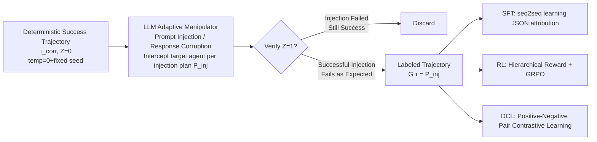

# Aegis: Automated Error Generation and Attribution for Multi-Agent Systems

**Conference**: ICLR 2026  
**OpenReview**: [https://openreview.net/forum?id=zqcYoxXiN3](https://openreview.net/forum?id=zqcYoxXiN3)  
**Code**: Open source (The paper commits to releasing all code/data/models)  
**Area**: Multi-Agent Systems / Error Attribution / Datasets & Benchmarks  
**Keywords**: Multi-Agent Systems, Error Attribution, Automated Data Synthesis, Error Injection, Contrastive Learning  

## TL;DR
Aegis uses an LLM manipulator to "actively inject" successful multi-agent trajectories into labeled failure trajectories, automatically generating 9,533 data entries labeled with "erroneous agent + error mode." This transforms the expensive manual labeling bottleneck into a scalable engineering problem and supports training error attribution models via SFT, RL, and contrastive learning.

## Background & Motivation
**Background**: LLM-based Multi-Agent Systems (MAS) have made significant progress in complex tasks like mathematical reasoning, scientific discovery, and software engineering by decomposing tasks into collaborative specialized agents. However, this "agentic decomposition" introduces structural fragility: a single agent's error can cascade and amplify along the interaction chain. Often, the observed final failure is far from the initial point of error, making root cause analysis and systematic debugging extremely difficult.

**Limitations of Prior Work**: Research in MAS error attribution is severely constrained by **data scarcity**. Existing benchmarks are surprisingly small—Who&When has only 184 labeled errors, MASFT analyzed just over 150 tasks to summarize 14 error patterns, and TRAIL contains only 148 trajectories. All rely on expert manual labeling of complex execution logs, which is costly and unscalable.

**Key Challenge**: This creates a "scalability deadlock"—the current error attribution capabilities of SOTA LLMs are limited and require large-scale, task-specific data to improve, yet manually producing such data is prohibitively expensive. Meanwhile, the AI community has used synthetic data to break data scarcity in fields like reasoning and code, but MAS error attribution remains a blank slate.

**Goal**: To transform the "manual labeling bottleneck" into a "scalable engineering problem" by automatically generating a large-scale, diverse, and label-reproducible dataset of MAS failure trajectories.

**Core Idea**: **Inverse Data Generation**—instead of laboriously labeling root causes from real failures, start from **known successful** trajectories and use an LLM manipulator to **actively inject** faults that align with error mode taxonomies. Because the faults are "manually injected," the ground-truth labels (which agent, what error) are **known by construction**, requiring no manual labeling.

## Method

### Overall Architecture
Aegis consists of two main components: a **Data Construction Pipeline** (left) that transforms successful trajectories into labeled failure trajectories, and **Learning Methods** (right) that train attribution models on this data using three paradigms. Data construction follows three phases: (1) collecting deterministic successful baseline trajectories across multiple MAS frameworks; (2) using an adaptive manipulator to inject targeted interventions, creating multiple failure variants for each baseline; (3) verifying results, retaining only trajectories that "fail as expected" with reliable labels. The final output covers 6 MAS frameworks + 6 benchmarks, producing 9,533 labeled error trajectories.

### Key Designs

**1. Problem Formalization: Defining error attribution as set prediction for "agent-error mode" pairs.** An MAS is denoted as $M$, consisting of $k$ agents $N=\{n_1,\dots,n_k\}$. A scheduling policy $\sigma:S\to N$ determines the active agent at each step, producing a trajectory $\tau=(s_0,a_0,\dots,s_T)$, evaluated by a binary function $Z(\tau)\in\{0,1\}$ ($Z=1$ indicates failure). When failure occurs, the ground-truth is a structured label $G(\tau)=\{(n^*_1,Y^*_1),(n^*_2,Y^*_2),\dots\}$, where $n^*_i$ is the responsible agent and $Y^*_i\subseteq Y$ is its set of error modes ($Y$ is a taxonomy of $M=14$ error modes). The diagnostic model is $f_\theta:\tau\mapsto\hat G(\tau)\approx G(\tau)$. This formalization turns vague "debugging" into a quantifiable, multi-label prediction task with multi-granularity evaluation.

**2. LLM Adaptive Manipulator: Context-aware injection of "realistic" faults.** The key for the manipulator $M_{\text{manip}}$ is to generate modifications that are **task-relevant and aligned with the error mode taxonomy**—injecting infinite loops in coding tasks or providing "reasonable but incorrect" calculations in math tasks. It randomly selects between two attack strategies: **Prompt Injection** (tampering with input states before an agent acts) and **Response Corruption** (replacing a correct output with an erroneous action). For each correct trajectory $\tau_{\text{corr}}$, a set of injection plans $P_{\text{inj}}=\{P^{(1)}_{\text{inj}},\dots,P^{(K)}_{\text{inj}}\}$ is defined, each specifying a set of $(n^*,Y^*)$ pairs. At each step, the manipulator intercepts the target agent and replaces the original action $a_t$ with a manipulated action $a'_t=M(s_t,\pi_{n_t},P^{(j)}_{\text{inj}})$. Injected faults are anchored to the **14 error modes of the MAST taxonomy** (empirically summarized from 150+ real failure trajectories), categorized into Specification Issues, Inter-Agent Misalignment, and Task Verification Failures, ensuring injected errors reflect real failure patterns.

**3. Non-intrusive wrapper + Verification to ensure label causality.** The implementation is based on the MASLab unified codebase, using techniques like monkey patching for non-intrusive wrapping to intercept target agent behavior **without modifying MAS source code**. To ensure causality, all agents use GPT-4o-mini with temperature 0 for deterministic execution, while the manipulator uses temperature 0.7 for diverse attacks. Only trajectories where $Z(\tau^{(j)}_{\text{inj}})=1$ (failed as expected) are kept, at which point $G(\tau^{(j)}_{\text{inj}})=P^{(j)}_{\text{inj}}$—the label equals the original injection plan, requiring no manual labeling. This "success-failure" paired structure is preserved, providing the foundation for the three learning paradigms, especially the positive-negative pairs in contrastive learning.

**4. Three Learning Paradigms: One dataset for three methods.** SFT treats attribution as a seq2seq task, minimizing $L_{\text{SFT}}(\theta)=-\sum_{(\tau,G(\tau))}\log p_\theta(o|x)$, training the LLM to generate JSON-formatted attribution directly from logs. RL utilizes **hierarchical rewards** for dense feedback: parsing outputs and GT into sets of attribute pairs, with a raw score $S_{\text{raw}}=c_{\text{bonus}}+\sum_{(\hat n,\hat y)}\text{score}(\hat n,\hat y)-S_{\text{dup}}-S_{\text{quant}}$. The scoring function assigns **non-repeatable partial points** for "complete pairs / agent only / error mode only / false positives" to prevent degenerate exploitation, and utilizes GRPO for optimization after normalizing with $R=S_{\text{raw}}/S_{\text{max}}$. CL introduces **Disentangled Contrastive Learning (DCL)**, treating trajectories as a bag of turns, using MIL attention to weight significant turns, and aligning them to an agent prototype bank $B_A$ and an error mode prototype bank $B_E$. The composite loss $L_{\text{DCL}}(\theta)=\lambda_{\text{cls}}L_{\text{cls}}+\lambda_{\text{con}}L_{\text{con}}+\lambda_{\text{hier}}L_{\text{hier}}$ handles multi-label classification, contrastive representation, and hierarchical consistency constraints.

## Key Experimental Results

### Main Results
On Aegis-Bench (100 sampled trajectories per benchmark for testing) + Who&When (OOD), reporting Pair/Agent/Error level Micro-F1 (µF1) and Macro-F1 (MF1), where Avg is the mean score (%):

| Model | Aegis Pair µF1 | Aegis Agent µF1 | Who&When Agent µF1 | Avg |
|------|------|------|------|------|
| Random | 0.33 | 4.54 | 1.06 | 4.08 |
| DCL (Ours, Small model) | 8.33 | 22.93 | 8.40 | 12.61 |
| Qwen2.5-14B-Instruct | 5.47 | 35.78 | 49.88 | 13.99 |
| **+ SFT (Aegis-SFT)** | **16.62** | **76.53** | 51.14 | **26.51** |
| + GRPO (Aegis-GRPO) | 6.84 | 49.74 | 54.43 | 18.41 |
| o3 | 7.86 | 40.31 | 53.10 | 20.24 |
| Gemini-2.5-Flash | 6.99 | 42.02 | 55.56 | 19.55 |
| Claude-Sonnet-4 | 7.68 | 40.73 | 44.76 | 18.16 |
| GPT-4.1 | 7.44 | 37.48 | 42.29 | 15.27 |

Aegis-SFT (26.51) outperforms all baselines, nearly doubling the base Qwen2.5-14B (13.99→26.51) and defeating proprietary models an order of magnitude larger (o3 at 20.24).

### Ablation Study
Ablation of DCL components (Avg decrease after removal):

| Variant | Avg | Description |
|------|------|------|
| DCL (Full) | 12.61 | — |
| only-mix head | 12.42 ↓ | Mixture head only |
| w/o intent | 10.16 ↓ | Without intent modeling |
| only-bilinear | 10.01 ↓ | Bilinear only |
| w/o consistency | 9.52 ↓ | Without hierarchical consistency (largest drop) |

Hierarchical consistency constraints ($L_{\text{hier}}$) contribute the most, validating the value of the disentangled and consistency-regularized design.

### Key Findings
- **Micro-F1 is significantly higher than Macro-F1**: Error modes follow a long-tail distribution; models excel at high-frequency failures but struggle with rare categories. Macro-F1 is the true metric for generalization.
- **Agent-level Accuracy > Error-level**: Identifying "who failed" is easier than diagnosing "why they failed," the latter requiring deeper semantic understanding.
- **Impact of Tasks/Architectures**: Performance is better on structured frameworks like Debate or AgentVerse and poorer on complex topologies like Dylan or MacNet. The more difficult the topology, the greater the Gain from Aegis fine-tuning.
- **Generalization**: Training solely on Aegis allows transfer to OOD Who&When, proving that the attribution capability learned from synthetic data is transferable.

## Highlights & Insights
- **Paradigm Shift in Data Generation**: Flipping "labeling root causes from real failures" (expensive, unscalable) to "injecting known faults starting from correct trajectories" (labels known by construction) is the key insight to break the scalability deadlock in MAS error attribution.
- **One Dataset, Three Paradigms**: The paired "success-failure" structure naturally fits SFT (input-target pairs), RL (multi-level reward signals), and CL (positive-negative pairs), making the data design highly reusable.
- **Small Model Comeback**: 7B–14B fine-tuned models match or exceed proprietary models an order of magnitude larger, suggesting that MAS error attribution relies more on "task-aligned data" than sheer model scale.
- **Non-intrusive Wrapper**: Using monkey patching to insert faults without changing MAS source code allows the pipeline to plug-and-play with arbitrary frameworks.

## Limitations & Future Work
- **Distribution Gap**: Injected errors may not fully cover failures that emerge spontaneously in the real world. While OOD generalization is positive, absolute scores (e.g., single-digit Who&When Pair µF1) remain low.
- **Low Absolute Performance Ceiling**: Even the best Aegis-SFT has a Pair-level µF1 of only 16.62, showing that precise joint "agent + error mode" attribution remains an unsolved challenge.
- **Dependency on MAST Taxonomy**: Error modes are anchored to 14 MAST categories; novel or cross-category failures might fall outside this classification.
- **Data Generation Reliance on GPT-4o-mini**: The base agent is singular; failure characteristics of agents with different capability levels may not be fully covered.
- The paper acknowledges that certain subtle failure modes (Figure 6) still cause all models (including their own) to fail, representing an open challenge.

## Related Work & Insights
- **MAS Error Attribution Benchmarks**: Who&When, MASFT, and TRAIL provided taxonomies and evaluations but were limited by small-scale manual labeling; Aegis fills the "large-scale automatic data" gap.
- **Automated Synthetic Data**: Inherits from challenger-solver self-play and closed-loop verification generation in reasoning and code domains. Aegis extends this technical line to MAS error attribution.
- **Distributed Systems Anomaly Detection**: Methodological backgrounds like tracing, root cause analysis, and topology-aware anomaly detection for large-scale service failures provide inspiration for MAS debugging.
- **Insight**: For any task where "labeling is expensive but the forward process is controllable," consider "reverse injection of known perturbations into correct samples" to create zero-cost labels. This approach can transfer to code defect localization, dialogue safety attribution, etc.

## Rating
- **Novelty**: ⭐⭐⭐⭐ The "reverse injection for verifiable labels" concept is a simple yet powerful way to break the data deadlock; DCL's disentanglement + hierarchical consistency is well-designed.
- **Experimental Thoroughness**: ⭐⭐⭐⭐ 6 frameworks × 6 tasks × 3 paradigms, covering small/medium/large models against 8 proprietary models, including OOD generalization and ablations. Very solid.
- **Writing Quality**: ⭐⭐⭐⭐ Clear problem formalization, organized three-phase pipeline and three-paradigm narrative, and an effective overview in Figure 1.
- **Value**: ⭐⭐⭐⭐ Open-sourcing 9,533 data entries + code + models provides important infrastructure for debuggable and reliable MAS research; however, absolute attribution accuracy is still low and far from practical utility.

<!-- RELATED:START -->

## Related Papers

- [\[ACL 2026\] Memory-Augmented LLM-based Multi-Agent System for Automated Feature Generation on Tabular Data](../../ACL2026/multi_agent/memory-augmented_llm-based_multi-agent_system_for_automated_feature_generation_o.md)
- [\[ACL 2025\] DocAgent: A Multi-Agent System for Automated Code Documentation Generation](../../ACL2025/multi_agent/docagent_a_multi-agent_system_for_automated_code_documentation_generation.md)
- [\[ACL 2026\] Seeing the Whole Elephant: A Benchmark for Failure Attribution in LLM-based Multi-Agent Systems](../../ACL2026/multi_agent/seeing_the_whole_elephant_a_benchmark_for_failure_attribution_in_llm-based_multi.md)
- [\[ACL 2026\] Towards Self-Improving Error Diagnosis in Multi-Agent Systems](../../ACL2026/multi_agent/towards_self-improving_error_diagnosis_in_multi-agent_systems.md)
- [\[ICLR 2026\] Stop Wasting Your Tokens: Towards Efficient Runtime Multi-Agent Systems](stop_wasting_your_tokens_towards_efficient_runtime_multi-agent_systems.md)

<!-- RELATED:END -->
