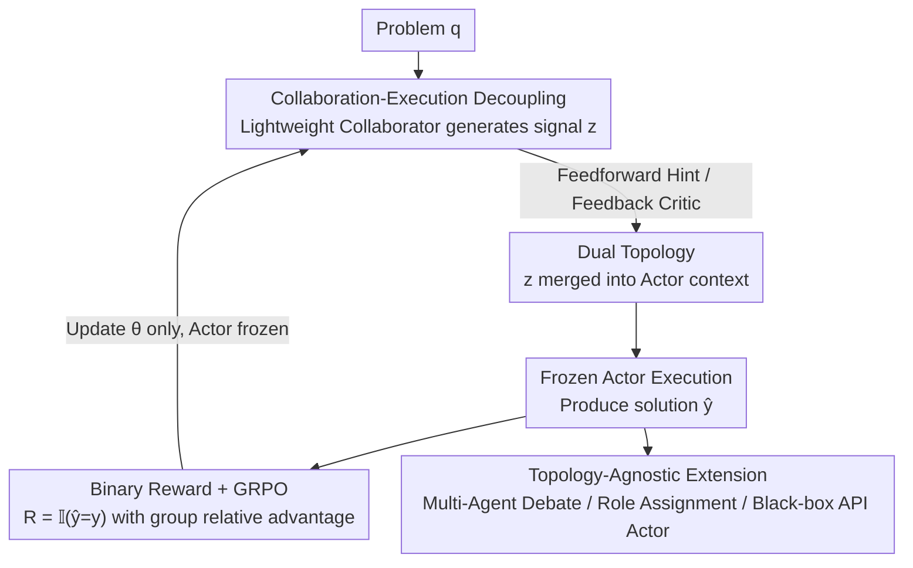

# AgentPO: Enhancing Multi-Agent Collaboration via Reinforcement Learning

**Conference**: ICLR2026  
**OpenReview**: [https://openreview.net/forum?id=5L8uyzjn2l](https://openreview.net/forum?id=5L8uyzjn2l)  
**Code**: https://github.com/sunlin-ai/agentpo  
**Area**: Multi-Agent / Reinforcement Learning / LLM Reasoning  
**Keywords**: Multi-agent collaboration, GRPO, Collaborative optimization, Fixed topology, Mathematical reasoning

## TL;DR
Instead of searching for multi-agent topologies, AgentPO freezes a powerful Actor within a fixed topology and uses Reinforcement Learning (GRPO) to train a lightweight Collaborator to learn "how to assist teammates." With only 500 training samples and 7.8% of the inference overhead of EvoAgent, it consistently outperforms strong baselines like Role Assignment and EvoAgent across multiple mathematical reasoning benchmarks.

## Background & Motivation
**Background**: LLM-based Multi-Agent Systems (MAS) solve complex problems beyond the capability of individual agents through division of labor. Current mainstream approaches fall into two categories: manual orchestration of agent workflows, which requires significant domain knowledge and prompt engineering; and automated search for optimal interaction topologies (e.g., ADAS, AFlow, GPTSwarm).

**Limitations of Prior Work**: Manual orchestration is fragile—LLMs are highly sensitive to prompts, and minor fluctuations in one agent can cascade through the workflow, destabilizing the system. Automated topology search faces combinatorial explosion; the number of possible topologies grows exponentially with the number of agents, making search soon infeasible and often failing to find truly effective collaborative structures.

**Key Challenge**: Both categories frame the problem as "What is the optimal agent topology?"—either by hand-crafting or searching. However, the topology itself is merely the skeleton; the system's performance is truly determined by **how agents interact**. Within a decent topology, if agents cannot coordinate effectively, even the best structure cannot be fully utilized. Experimental results in the paper show that "untrained hints can mislead the Actor, causing performance to drop below the single-model baseline."

**Goal**: To reformulate the research problem from "finding the optimal topology" to "given an effective topology, how to train agents to collaborate better and maximize overall system performance."

**Key Insight**: The authors observe that "task execution" and "collaborative assistance" can be decoupled within an MAS. A powerful model can focus on solving the problem (Actor), while a lightweight model specializes in learning "how to help it succeed" (Collaborator). Training only the small Collaborator avoids expensive architecture searches and the need to fine-tune models with tens or hundreds of billions of parameters.

**Core Idea**: Within a fixed topology, the Actor is frozen, and the lightweight Collaborator is trained via Reinforcement Learning using a binary "success/failure" reward. This allows the Collaborator to learn to provide effective hints, critiques, or suggestions, thereby enhancing the team's overall performance without altering the Actor's underlying capabilities.

## Method

### Overall Architecture
AgentPO aims to solve "how to train collaborative agents within a fixed topology." Its core is a **functional decoupling**: splitting an agent system into two roles—a learnable Collaborator (policy $\pi_\theta$, where $\theta$ is the optimization target) and a frozen Actor (policy $\pi_\phi$, where $\phi$ is fixed).

The process operates as follows: for a problem $q$, the Collaborator first generates an assistance signal $z \sim \pi_\theta(\cdot \mid c_\theta(q))$ based on problem-related context $c_\theta(q)$. This signal $z$ is concatenated with the original problem to form the Actor's augmented context. The Actor then produces a final solution $\hat{y} \sim \pi_\phi(\cdot \mid q, z)$. Finally, $\hat{y}$ is compared with the ground-truth answer $y$ to obtain a binary reward $R(\hat{y}, y) = \mathbb{I}(\hat{y} = y)$. This scalar reward serves as the learning signal to update the Collaborator's parameters $\theta$ via GRPO. Throughout this loop, the Actor remains a read-only "expert," while only the small "collaborator" is optimized.

The specific form of the assistance signal $z$ and the structure of context $c_\theta(q)$ are determined by the **topology**: in feedforward mode, the Collaborator is a "Hint Agent," while in feedback mode, it is a "Critic Agent." The framework can be applied directly to more complex fixed topologies like multi-agent debate and role assignment, as well as hybrid systems using black-box API models as Actors.

### Key Designs

**1. Collaboration-Execution Decoupling: Freezing Actor and Training Only Lightweight Collaborator**

This design directly addresses the pain points where fine-tuning a large Actor is too expensive and searching for topologies is infeasible. AgentPO splits the system by function: the Actor uses a fixed high-performance policy $\pi_\phi$ to solve problems with parameters $\phi$ frozen throughout; the Collaborator uses a learnable policy $\pi_\theta$ to learn "how to help the Actor succeed" and is the sole target of optimization. The optimization objective is:

$$\theta^* = \arg\max_\theta \; \mathbb{E}_{(q,y)\sim D}\big[R(\hat{y}, y)\big]$$

which maximizes the expected reward of the joint output over the problem distribution $D$. The advantage is that the Actor can be any SOTA model (even a black-box API); only a small 3B-scale model is trained. This avoids the combinatorial explosion of architecture search and the computational cost of fine-tuning massive models. The authors summarize this as letting the small model learn a **meta-skill**: "how to guide a capable expert" rather than learning domain knowledge from scratch, resulting in high sample efficiency.

**2. Dual Topologies: Feedforward Hint and Feedback Critic Paradigms**

The generation and injection of the assistance signal $z$ are defined by the topology. The paper presents two representative topologies corresponding to two collaborative philosophies. In the feedforward mode (Hint-Actor), the Collaborator is a **proactive** Hint Agent: it generates a hint $h \sim \pi_\theta(\cdot \mid q)$ based only on the problem $q$. The hint is prepended to the problem to form $[q; h]$, which is fed to the Actor for a one-shot answer $y \sim \pi_\phi(\cdot \mid [q; h])$. In the feedback mode (Critic-Actor), the Collaborator is a **reactive** Critic Agent in an iterative refinement loop: the Actor first produces an initial draft $y_{\text{init}} \sim \pi_\phi(\cdot \mid q)$, the Critic provides a critique $c \sim \pi_\theta(\cdot \mid [q; y_{\text{init}}])$, and the Actor then produces a refined solution $y_{\text{ref}} \sim \pi_\phi(\cdot \mid [q; y_{\text{init}}; c])$. In both cases, only the Collaborator (Hint or Critic) is trained based on the final reward. The paper discovers that while the Critic-Actor performs well even without training, the Hint-Actor can actually hinder the Actor if not optimized by AgentPO, underscoring that collaboration requires deliberate system-level optimization rather than just structure.

**3. Binary Reward + GRPO: Training Collaborative Policies with "Correctness" Signals**

The reward signal is intentionally kept minimal—it only checks if the final solution is correct: $R(\hat{y}, y) = \mathbb{I}(\hat{y} = y)$, a 0/1 indicator function that requires no manual reward engineering. Such sparse solution-level rewards are optimized using GRPO (Group Relative Policy Optimization). For each problem $q$, a group of $G$ responses $\{o_i\}_{i=1}^G$ is sampled from the old policy $\pi_{\theta_{\text{old}}}$. The **group mean reward** serves as the baseline to calculate the advantage $\hat{A}_{i,t}$ for each response, eliminating the need for a separate value network and stabilizing training. The objective function is:

$$J_{\text{GRPO}}(\theta) = \mathbb{E}\Big[\tfrac{1}{G}\sum_{i=1}^{G}\tfrac{1}{|o_i|}\sum_{t=1}^{|o_i|}\big(\min(r_{i,t}\hat{A}_{i,t},\ \text{clip}(r_{i,t}, 1-\varepsilon, 1+\varepsilon)\hat{A}_{i,t}) - \beta D_{\text{KL}}(\pi_\theta \| \pi_{\text{ref}})\big)\Big]$$

where $r_{i,t}(\theta) = \frac{\pi_\theta(o_{i,t}\mid q, o_{i<t})}{\pi_{\theta_{\text{old}}}(o_{i,t}\mid q, o_{i<t})}$ is the token-level probability ratio, and the KL term constrains updates near the reference policy $\pi_{\text{ref}}$. Combined with functional decoupling, the reward evaluates the final team output, but the gradient only flows back to the Collaborator, forcing the small model to learn what hints/critiques lead the Actor Toward high-reward solutions.

**4. Topology-Agnostic Extension: Multi-Agent and Black-box API Actor Scenarios**

The paradigm of "freezing the executor and optimizing the collaboration signal" extends beyond Hint/Critic pairs. The paper generalizes it to two realistic scenarios. First, complex fixed multi-agent topologies: in Multi-Agent Debate and Role Assignment, the underlying protocols are kept constant while a trained Collaborator (Qwen2.5-3B) is introduced and all other agents (Llama-3.2-3B) are frozen. This yields consistent gains across all benchmarks, showing that optimizing a minimal collaboration signal suffices for significant improvements in complex topologies. Second, hybrid systems: since many powerful models (e.g., Qwen-Plus) are black-box APIs, AgentPO uses a local open-source small model as a specialized Collaborator to strategically guide the black-box Actor, still achieving gains (Qwen-Plus 56.6% → 58.8%). This enables using a cheap local model as a "co-pilot" for an expensive, immutable large model.

## Key Experimental Results

### Main Results
Evaluation was conducted on five mathematical reasoning benchmarks (AIME24 / Math500 / OlympiadBench / Minerva / AMC23), using a Hint-Actor topology with Qwen2.5-3B-Instruct as the Hint model. Pass@1 is the metric. The table below compares average accuracy under different Actors:

| Actor Model | Method | Avg Pass@1 | Relative Gain |
|--------|------|------|------|
| Llama-3.2-3B | Role Assignment (Strongest Baseline) | 22.7 | — |
| Llama-3.2-3B | EvoAgent | 17.3 | — |
| Llama-3.2-3B | **AgentPO** | **24.5** | +1.8 / +7.2 |
| Llama-3.1-8B | Role Assignment (Strongest Baseline) | 25.9 | — |
| Llama-3.1-8B | EvoAgent | 20.2 | — |
| Llama-3.1-8B | **AgentPO** | **31.5** | +5.6 / +11.3 |

With the stronger Llama-3.1-8B, AgentPO's performance doubled on AIME24 (6.7% to 16.7%) and rose from 16.1% to 28.9% on OlympiadBench, indicating that system-level optimization scales with Actor capability.

### Collaboration Optimization vs. Actor Fine-tuning
A critical comparison using Qwen2.5-Math-7B as the Actor: AgentPO fine-tunes only the 3B Hint model, while baselines fine-tune the entire 7B Actor.

| Category | Method | Avg Pass@1 |
|------|---------|------|
| Backbone | Qwen2.5-Math-7B | 38.2 |
| Actor Fine-tuning | SimpleRL-Zero-7B | 46.6 |
| Actor Fine-tuning | Prime-Zero-7B | 48.0 |
| Actor Fine-tuning | OpenReasoner-Zero-7B | 43.0 |
| Collaboration Optimization | **AgentPO (Train 3B Only)** | **49.4** |

Training a lightweight Collaborator outperformed all baselines that directly fine-tuned the 7B expert, with lower training costs.

### Key Findings
- **High Sample Efficiency**: Only 100 samples achieved 45.5%, and 500 samples reached the peak of 49.4%; typical Actor fine-tuning requires >10,000 samples. Performance slightly decreased at 700/1000 samples, which authors attribute to policy overfitting.
- **Low Inference Cost**: With Llama-3.1-8B, AgentPO used an average of 1,522 tokens to reach 31.5%. Self-Consistency and Multi-Agent Debate spent 5–12× more tokens but performed worse. AgentPO's cost is about 7.8% of EvoAgent (19,519 tokens), breaking the traditional accuracy-cost trade-off.
- **Collaborator Size**: A smaller Qwen2.5-3B Hint model outperformed a Qwen2.5-7B one. Authors suggest that Qwen's reasoning mode complements Llama, helping the Actor escape inherent biases—collaboration relies on **complementarity** rather than just parameter count.
- **Untrained Hints Can Be Harmful**: Without AgentPO optimization, the Hint-Actor (55.1%) performed worse than the single-model baseline (56.6%), confirming the necessity of system-level alignment.

## Highlights & Insights
- **Reframing the problem is more valuable than solving it**: Shifting from "searching for topology" to "training collaboration within a topology" bypasses combinatorial explosion and prompt fragility.
- **Functional Decoupling + Small Model Training**: Allowing any SOTA or black-box model to act as the Actor without parameter updates is a design that can be migrated to any scenario where strong models are immutable (e.g., commercial APIs, toolchains).
- **Collaboration via Sparse Binary Rewards**: Detailed process rewards are unnecessary; a simple "right/wrong" signal paired with GRPO's group baseline is sufficient and easy to reproduce.
- **Meta-skill Perspective**: The insight that the Collaborator learns "how to guide experts" rather than domain knowledge explains the 500-sample efficiency, which is highly instructive for agent training in data-scarce domains.

## Limitations & Future Work
- **Domain Limitation**: Experiments were focused on mathematical reasoning where binary rewards $\mathbb{I}(\hat{y}=y)$ are easily verifiable. Defining rewards for open-ended tasks (writing, dialogue) remains an open question.
- **Manual Topologies**: AgentPO optimizes collaboration within fixed topologies, but determining "which topology is effective" still relies on manual design. It does not yet address the joint optimization of "topology + collaboration."
- **Overfitting Risk**: Performance drop at 700/1000 samples indicates a sweet spot for small-data training, lacking an automatic early-stopping or regularization mechanism.
- **Future Directions**: Exploring Collaborators that serve multiple topologies simultaneously, using reward models for open-ended tasks, and combining "collaboration training" with "lightweight topology search" into a two-stage pipeline.

## Related Work & Insights
- **vs. Topology Search (ADAS / AFlow / GPTSwarm)**: These search for optimal workflows in a vast architecture space. AgentPO does not search structures but trains agents to "work together" within a fixed topology, serving as a complement: search determines the workflow, while AgentPO determines how to cooperate within it.
- **vs. Manual Orchestration (Self-Refine / Multi-Agent Debate)**: These rely on prompts and hand-crafted protocols, which are fragile and non-learnable. AgentPO turns the collaboration signal into an optimizable policy and demonstrates further gains by embedding a trained Collaborator into existing protocols.
- **vs. Actor Fine-tuning (SimpleRL / Prime / OpenReasoner)**: These fine-tune the entire expert model using tens of thousands of samples. AgentPO achieves superior results by training only a lightweight collaborator with significantly less data, proving that "optimizing collaboration" can match or exceed "optimizing the executor."

## Rating
- Novelty: ⭐⭐⭐⭐⭐ Reframing MAS from "search" to "collaboration training" with functional decoupling is a clean and persuasive new paradigm.
- Experimental Thoroughness: ⭐⭐⭐⭐ Covers five benchmarks, multiple models, ablation, efficiency, and hybrid systems, though limited to mathematical reasoning.
- Writing Quality: ⭐⭐⭐⭐⭐ Clear motivation and consistent logic throughout; excellent use of comparative tables.
- Value: ⭐⭐⭐⭐⭐ High practical value for multi-agent systems due to low sample/inference cost and compatibility with black-box APIs.

<!-- RELATED:START -->

## Related Papers

- [\[ICLR 2026\] BRIDGE: Bi-level Reinforcement Learning for Dynamic Group Structure in Coalition Formation Games](bridge_bi-level_reinforcement_learning_for_dynamic_group_structure_in_coalition_.md)
- [\[ICLR 2026\] Adaptive Collaboration with Humans: Metacognitive Policy Optimization for Multi-Agent LLMs with Continual Learning](adaptive_collaboration_with_humans_metacognitive_policy_optimization_for_multi-a.md)
- [\[ICLR 2026\] Learning to Summarize by Learning to Quiz: Adversarial Agentic Collaboration for Long Document Summarization](learning_to_summarize_by_learning_to_quiz_adversarial_agentic_collaboration_for_.md)
- [\[ICLR 2026\] Context Learning for Multi-Agent Discussion](context_learning_for_multi-agent_discussion.md)
- [\[CVPR 2025\] Collaborative Tree Search for Enhancing Embodied Multi-Agent Collaboration](../../CVPR2025/multi_agent/collaborative_tree_search_for_enhancing_embodied_multi-agent_collaboration.md)

<!-- RELATED:END -->
