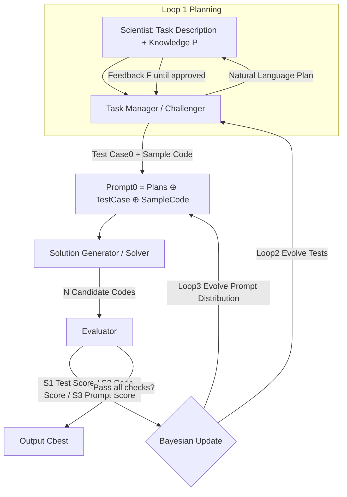

# AI-for-Science Low-code Platform with Bayesian Adversarial Multi-Agent Framework

**Conference**: ICLR 2026  
**OpenReview**: [https://openreview.net/forum?id=Cug26Y0RlT](https://openreview.net/forum?id=Cug26Y0RlT)  
**Code**: TBD  
**Area**: Multi-agent / AI for Science / Code Generation  
**Keywords**: Multi-agent, Adversarial Co-evolution, Bayesian Optimization, Science Code Generation, Low-code Platform, Hallucination Suppression  

## TL;DR
The framework organizes "tasking-solving-scoring" agents into an adversarial loop and uses a **non-LLM Bayesian update rule** to evolve code, test cases, and prompts simultaneously. It enables 32B open-source models to outperform 235B models on scientific code generation benchmarks, shifting system reliability from "betting on a strong LLM" to "reducing uncertainty via Bayesian convergence."

## Background & Motivation
**Background**: LLMs (Codex, AlphaCode, CodeLlama, etc.) are automating code generation for tasks like scientific simulation and data analysis. Multi-agent systems further decompose complex scientific problems using role assignment and structured communication.

**Limitations of Prior Work**: The probabilistic nature of LLMs causes hallucinations in both **code generation** and **test case generation**. In multi-agent pipelines, upstream errors are accepted uncritically by downstream agents, causing **error amplification** where system reliability is bottlenecked by the "weakest agent." Furthermore, evaluating scientific tasks is inherently difficult—standard unit tests fail to cover scientific constraints, comprehensive evaluation metrics are often expensive or undefinable, and LLM-generated tests inherit the same unreliability as the code being tested.

**Key Challenge**: Traditional multi-agent systems treat code as the "object to be verified" and tests as the "trusted judge." In scientific scenarios, tests are as **untrustworthy** as the code. Consequently, the foundation of "static verification" collapses—both must be treated with equal skepticism and optimized concurrently.

**Goal**: To build a framework that does **not place absolute trust** in the intelligence level of the base LLM, covering models from 1.7B open-source to the latest commercial models. The goal is to suppress error propagation while allowing domain scientists without prompt engineering expertise to complete tasks using natural language.

**Core Idea**: **Adversarial Co-evolution + Bayesian Update**—letting test case generation and code improvement sharpen each other through competition, while using Bayes' theorem to evolve the "prompt distribution," systematically reducing reliance on the reliability of a single LLM.

## Method

### Overall Architecture
The framework consists of three agents forming a recursive adversarial loop: **Task Manager (TM) as Challenger** (structuring vague user requirements into plans and generating test cases), **Solution Generator (SG) as Solver** (generating candidate code in batches based on prompts), and **Evaluator (Eval)** (scoring code, tests, and prompts). TM continuously generates more challenging yet solvable tests to expose SG's weaknesses, and SG iterates based on feedback. The selection distribution of the "code-test-prompt" triplet is recursively updated by a **non-LLM Bayesian rule** until code passes all checks or the maximum number of rounds (default 3) is reached.

### Key Designs

**1. Triplet Prompts and Adversarial Games: Putting Tests and Code on the Same Table**  
The framework begins by concatenating user-approved plans, initial test cases, and sample code into an initial prompt $\text{Prompt}_0 := \text{Plans} \oplus \text{Test Case}_0 \oplus \text{Sample Code}_0$, where tests and code can be **updated independently** in subsequent iterations. The core of the game is the confrontation between TM and SG: TM adjusts weights and selects tests based on "true difficulty," intentionally constructing test suites that are "hard enough to force progress but not impossible" for SG's current capability. SG responds with generated code, and the success/failure signals shape TM's next-round strategy. This competitive co-evolution replaces the "static unit test" paradigm, allowing code and tests to converge to solutions satisfying both explicit requirements and implicit domain constraints.

**2. Tri-Consistent Self-Scoring: S1 for Difficulty, S2 for Code, S3 for Prompts**  
The Evaluator provides three coupled scores. The test case score $S_1$ measures "true difficulty"—a good test should distinguish between different code qualities, updated via momentum:

$$S_1(i)^{t+1} = (1-\alpha)\cdot S_1(i)^t + \alpha\cdot\left(\frac{\sum_{j' \text{ pass}} S_2(j')}{|\{Code_{j'}\}|} - \frac{\sum_{j^\dagger \text{ fail}} S_2(j^\dagger)}{|\{Code_{j^\dagger}\}|}\right)$$

where $\alpha=0.8$ controls momentum (i.e., tests passed by high-quality code but failed by low-quality code score higher). The code score $S_2$ is calculated as the weighted difficulty of passed tests: $S_2(j)^t = \frac{\sum_i \mathbb{I}(C_j \text{ pass } T_i)\cdot S_1(i)^{t-1}}{\sum_i S_1(i)^{t-1}}$. The prompt score $S_3 = \frac{1}{M}\sum S_1 + \frac{1}{N}\sum S_2$ combines test and code quality as the observation signal for Bayesian updates. These scores are closed-loop factors that do not rely on the LLM as a judge, cutting off "judging hallucinations with hallucinations" at the source.

**3. Bayesian Prompt Update: Learning Effective "Teacher-Student" Pairings**  
The selection of test $i$ and sample code $j$ for the next prompt is determined by a Bayesian rule:

$$p(\text{Prompt}^{t+1}_{ij} \mid S_3^t) \propto p(S_3^t \mid \text{Prompt}^t_{ij})\, p(\text{Prompt}^t_{ij})$$

The prior $p(\text{Prompt}^t_{ij})$ is initialized uniformly and adapts based on historical effectiveness. The likelihood $p(S_3^t \mid \text{Prompt}^t_{ij}) \propto \exp(\mathbb{E}[S_3^{t-1}\mathbb{1}(i,j)])$ prioritizes (test, code) pairs whose performance significantly exceeds their historical average. Intuitively, this mines "teacher-student" pairings—identifying which sample code and test combinations most stably produce high-scoring prompts. The sample code pool is dynamic: initially containing only user references, high $S_2$ code generated by SG is recycled into the pool, and its "instructional quality" is learned via its contribution to prompt scores.

**4. Bayesian Optimization for Code Performance Prior Estimation: Saving Expensive Executions**  
Executing every scientific code candidate against all tests is computationally prohibitive. The framework uses Bayesian Optimization (BO) for **prior estimation**: each code is embedded into a vector $x_i$ via AST structural features and code embeddings. BO predicts the performance scores of untested code based on its structural similarity to tested code. The system only performs expensive real execution on a few promising candidates selected by the acquisition function (set to 5 in experiments), maintaining evaluation accuracy and exploration breadth while efficiently driving the evolution of the prompt distribution and co-evolution.

## Key Experimental Results

### Main Results: SciCode Across Base Models (Sub=Sub-problem success %, Main=Main problem %)

| Model | Method | Sub (w/o Knowledge) | Sub (w/ Knowledge) |
|---|---|---|---|
| Qwen3-8b | Baseline / Ours | 13.2 / **24.7 (+87.1%)** | 19.8 / **27.4 (+38.4%)** |
| Qwen3-14b | Baseline / Ours | 17.7 / **30.6 (+72.9%)** | 25.0 / **32.6** |
| Qwen3-32b | Baseline / Ours | 18.4 / **33.0 (+79.3%)** | 27.4 / **36.1** |
| Qwen3-235B-A22b | Baseline / Ours | 30.6 / **38.9** | 37.2 / **41.0** |
| GPT-4o | Baseline / Ours | 24.1 / **37.2 (+54.3%)** | 33.7 / **40.6** |
| Claude-sonnet-4 | Baseline / Ours | 31.3 / **42.7** | 38.8 / **43.8** |

Key takeaway: Qwen3-14b + Ours reaches 30.6 "w/o knowledge," **matching the Qwen3-235B baseline** (16x larger). 32B open-source models with the framework can outperform the 235B model.

### Main Results: ScienceAgentBench (GPT-4o Base, VER=Valid Execution Rate)

| Method | SR(w/o) | CBS(w/o) | VER(w/o) | VER(w/) |
|---|---|---|---|---|
| Direct | 11.8 | 82.6 | 52.9 | 41.2 |
| OpenHands CodeAct | 19.6 | 83.1 | 78.4 | 73.5 |
| Self-Debug | 22.6 | 84.4 | 83.3 | 71.6 |
| **LCP (Ours)** | **26.5** | **85.1** | **90.2** | **87.3** |

### Ablation Study

| Analysis Item | Conclusion |
|---|---|
| Iteration Count | Performance on HumanEval/MBPP/SciCode **increases monotonically** with iterations. Significant gains after 3 rounds, convergence at 4-5 (SciCode 27.1→37.2). |
| Adversarial Test Case (ATC) | Comparable to non-ATC in first 2 rounds, **diverges significantly from round 3**, with ATC consistently higher. |
| Robustness to Non-Expert Users | Baselines show large gaps between "Basic Prompt vs. Expert Prompt" (heavy reliance on prompt engineering). Ours closes this gap; **"Ours-w/o knowledge" consistently outperforms "Baseline-w/ expert knowledge."** |

### Key Findings
- Error propagation is effectively suppressed: By treating tests and code with equal skepticism, reliability is no longer bottlenecked by the weakest agent.
- Gains are **larger for smaller models** (up to +87.1%), indicating high value in compensating for base model deficiencies.
- High VER (90.2%) is crucial for scientific applications, proving the output code is "executable and correct."

## Highlights & Insights
- **Paradigm Shift**: Moving from "trusting a single LLM's intelligence" to "systematically reducing uncertainty via non-LLM Bayesian mechanisms," turning multi-agent reliability into a convergent optimization problem.
- **Symmetrical Skepticism**: Explicitly acknowledging that test cases and code are "equally prone to hallucinations" and granting them symmetrical optimization status corrects the traditional self-refine/self-debug paradigms.
- **Low-code Accessibility**: TM's built-in requirement structuring and interaction clarification allow domain scientists to succeed with vague natural language. Robustness experiments quantify the benefit of "eliminating prompt engineering."
- **Engineering Economy**: Using BO + AST/embedding similarity as a performance prior compresses the cost of "full execution" to "testing only the 5 most promising," making the framework feasible for expensive scientific code.

## Limitations & Future Work
- The recursive loop of three agents, 20 candidate codes per round, and BO estimation results in **significant total computation/token overhead**. Although BO mitigates this, absolute costs remain higher than single-pass generation.
- Hyperparameters (e.g., 3 rounds, 15 initial test cases) are empirically set; a systematic analysis of adaptive scheduling for different tasks is missing.
- The specific form of the Bayesian likelihood (exponential family approximation) is heuristic. Theoretical convergence and the reliability of "difficulty" measurements require deeper proof.
- Scientific evaluation is focused on SciCode, ScienceAgentBench, and Geosciences; generalization across more disciplines (biology, materials, etc.) remains to be verified.

## Related Work & Insights
- **Comparison with self-refine / Reflexion / Self-Debug**: These rely on LLM self-reflection and are constrained by the base LLM's reliability. Ours takes the judging authority away from the LLM using non-LLM adversarial Bayesian updates.
- **Comparison with MetaGPT / AgentCoder / MapCoder / CodeCoR**: These multi-agent coding frameworks often use LLMs for evaluation and decision-making, incurring high error propagation risks. Ours explicitly models "tests can be wrong" and optimizes symmetrically.
- **Insight**: Porting adversarial concepts (e.g., GANs) into agent orchestration and using BO as a proxy for expensive evaluations provides a reusable path toward "less reliance on strong base models"—particularly valuable for AI4S scenarios using budget-constrained, medium-sized open-source models.

## Rating
- **Novelty**: ⭐⭐⭐⭐ Introducing adversarial co-evolution and non-LLM Bayesian updates to multi-agent scientific code generation is original, specifically the "symmetrical doubt" and BO performance prior.
- **Experimental Thoroughness**: ⭐⭐⭐⭐ Covers 1.7B~235B base models, general and scientific benchmarks, and multiple ablations (iterations/ATC/robustness). Costs and broader disciplines are slightly under-explored.
- **Writing Quality**: ⭐⭐⭐⭐ Clear motivation, well-articulated scoring/Bayesian update formulas, and intuitive framework comparisons in figures.
- **Value**: ⭐⭐⭐⭐ Enables small/medium open-source models to approach large model performance on scientific code and remains robust for non-expert users, showing strong practical value for AI4S.

<!-- RELATED:START -->

## Related Papers

- [\[AAAI 2026\] Hierarchical Pedagogical Oversight: A Multi-Agent Adversarial Framework for Reliable AI Tutoring](../../AAAI2026/multi_agent/hierarchical_pedagogical_oversight_a_multi-agent_adversarial_framework_for_relia.md)
- [\[ICLR 2026\] Learning to Summarize by Learning to Quiz: Adversarial Agentic Collaboration for Long Document Summarization](learning_to_summarize_by_learning_to_quiz_adversarial_agentic_collaboration_for_.md)
- [\[AAAI 2026\] KDR-Agent: A Multi-Agent LLM Framework for Multi-Domain Low-Resource In-Context NER via Knowledge Retrieval](../../AAAI2026/multi_agent/a_multi-agent_llm_framework_for_multi-domain_low-resource_in-context_ner_via_kno.md)
- [\[ICLR 2026\] CellAgent: LLM-Driven Multi-Agent Framework for Natural Language-Based Single-Cell Analysis](cellagent_llm-driven_multi-agent_framework_for_natural_language-based_single-cel.md)
- [\[ICLR 2026\] HAMLET: A Hierarchical and Adaptive Multi-Agent Framework for Live Embodied Theatre](hamlet_a_hierarchical_and_adaptive_multi-agent_framework_for_live_embodied_theat.md)

<!-- RELATED:END -->
