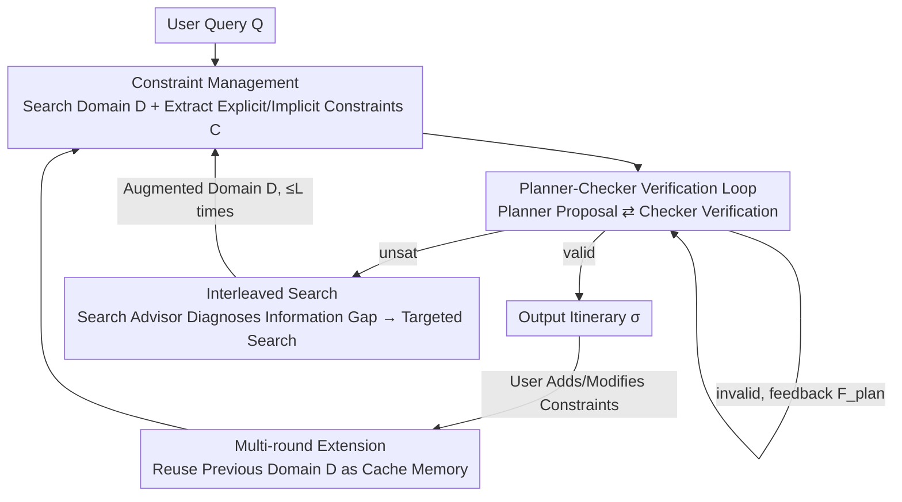

# ATLAS: Constraints-Aware Multi-Agent Collaboration for Real-World Travel Planning

**Conference**: ICLR2026  
**OpenReview**: [https://openreview.net/forum?id=mIYGiBf9Pm](https://openreview.net/forum?id=mIYGiBf9Pm)  
**Code**: To be confirmed  
**Area**: Agent / Multi-Agent Collaboration / LLM Planning  
**Keywords**: Multi-Agent, Constraint Satisfaction, Travel Planning, Interleaved Search, Multi-round Interaction

## TL;DR
ATLAS formalizes "real-world travel planning with search" as a dynamic Constraint Satisfaction Problem (CSP). It utilizes five specialized LLM agents (Search, Constraint Manager, Planner, Checker, and Search Advisor) to cooperatively complete constraints, iteratively correct errors, and guide search in the event of a deadlock. This approach increases the final pass rate of TravelPlanner from 23.3% to 44.4% and achieves an 84% pass rate in a real-world multi-round scenario with live web search for the first time.

## Background & Motivation
**Background**: LLMs have made significant progress in reasoning and tool use. Travel planning is treated as a typical testbed for "constraint adherence ability"—given a budget, dates, destinations, and dietary preferences, the agent must organize a reasonable multi-day itinerary. Existing work either assumes all necessary information is pre-given (focusing only on constraint adherence) or assumes all constraints are known a priori (focusing only on search).

**Limitations of Prior Work**: The truly difficult scenario is when both occur simultaneously—the agent must search for contextual information while discovering constraints, which is precisely the part that remains unsolved. The paper uses Figure 1 as an example: even Gemini-2.5-Pro, while meeting explicit user requirements (budget, dates), fails on implicit common-sense rules, such as not arranging lunch despite a 9 AM arrival, recommending a restaurant in a different city for the day's itinerary, illogical city sequences, or even fabricating non-existent flights.

**Key Challenge**: Constraints are categorized into two types with different sources—**explicit constraints $C_E$** (hard rules stated by the user or derived from search results, e.g., budget caps, minimum stay nights) and **implicit constraints $C_I$** (common sense and physical reality, e.g., the trip must return to the starting city, restaurants cannot be identical throughout). Monolithic agents compress "searching information, extracting constraints, scheduling plans, and checking legality" into a single generation. Any error in the chain contaminates the entire plan, and it is impossible to distinguish between "failing to find suitable options" and "logical scheduling errors." Furthermore, in multi-round dialogues, users dynamically add or remove constraints, evolving the static problem into a dynamic CSP.

**Goal**: Systematically dismantle the three fundamental challenges of constraint-aware planning: (1) Constraint construction: identifying complete explicit and implicit constraints without a priori knowledge; (2) Answering under constraints: generating and verifying a legal plan that satisfies all constraints; (3) Bridging the information gap: determining whether a failure is a logical error or insufficient searched information, and performing supplementary search accordingly.

**Key Insight**: Travel planning is strictly formulated as a CSP $P=\langle X, D, C\rangle$—where $X$ represents decision variables for each slot per day (Day1Transportation, Day1Dinner, etc.), $D$ is the domain of candidate values for each variable (dynamically filled by real-time search rather than being pre-given), and $C$ is the set of constraints that must be satisfied. Multi-round scenarios are modeled as a dynamic CSP, i.e., a sequence of static CSPs $P^1, P^2, \dots, P^t$, where each subsequent one is a transformation of the previous one.

**Core Idea**: Instead of burdening a single agent, the three challenges are assigned to three specialized mechanisms: a Constraint Manager for constraint handling, a Planner-Checker closed-loop for "proposal-verification" iterations, and a Search Advisor that performs backward diagnosis and guides supplementary search when an `unsat` (unsatisfiable) state is determined. This allows "search" and "planning" to be interleaved rather than serially connected.

## Method

### Overall Architecture
ATLAS (Agent-based Travel planning with Live Adaptive Search) is a multi-agent pipeline organized around CSP solving. The input is a user natural language query $Q^t$, and the output is a feasible itinerary $\sigma^t$. The system's operation is characterized by three nested loop indices: $t=1,\dots,T$ for dialogue rounds, $\ell=0,\dots,L$ for interleaved search cycles within a round, and $k=0,\dots,K$ for the proposal-verification cycles between the Planner and Checker.

**Mechanism**: In each round, the **Search Agent** first calls tools to collect raw observations $O^{t,\ell}$ and extracts them into a structured domain $D^{t,\ell}$ (stored in a "notepad"). The **Constraint Manager** then builds a complete constraint set $C^{t,\ell}=C_E^{t,\ell}\cup C_I$. Subsequently, the **Planner** proposes an assignment $\sigma$ on $\langle X, D^{t,\ell}, C^{t,\ell}\rangle$, which is passed to the **Checker** for step-by-step verification. The Checker outputs a verdict $V\in\{\texttt{valid},\texttt{invalid},\texttt{unsat}\}$. If `invalid`, feedback $F_{plan}$ is sent back to the Planner for revision within $K$ steps. If `unsat`, meaning the current information cannot produce a legal plan, the **Search Advisor** is triggered to diagnose the information gap and generate a directional supplementary search instruction $F_{search}$, returning control to the Search Agent to obtain an augmented domain $D^{t,\ell+1}$. The loop continues for up to $L$ interleaved searches. In multi-round settings, the final domain $D^{t,L}$ from the previous round is reused as a cache memory to avoid searching from scratch.

### Key Designs

**1. Constraint Management: Separating "Information Search" and "Explicit+Implicit Constraint Extraction" (Challenge 1)**

Addressing the issue where monolithic agents mix search and constraint identification, often missing implicit common-sense rules, ATLAS splits the first stage into two roles: Search Agent and Constraint Manager. The Search Agent follows the standard ReAct tool-calling paradigm to map queries to a domain: $D^{t,\ell}=\text{Search}(Q^t, F_{search}^{t,\ell-1})=(\Gamma\circ\Omega)(Q^t, F_{search}^{t,\ell-1})$, where $\Omega$ fetches raw observations from the environment and $\Gamma$ filters and structures observations into candidate domains (e.g., a set of bookable restaurants in a city on a specific day). Once the domain is filled, the Constraint Manager constructs $C^{t,\ell}=C_E^{t,\ell}\cup C_I$. The explicit part $C_E^{t,\ell}=\Pi(Q^t, D^{t,\ell})$ is extracted from user queries and search results (budget, minimum nights, etc.), while the implicit part $C_I$ leverages the LLM's world knowledge to complete rules like "vacations must return to the departure city" and "restaurants cannot be repeated." This step decouples constraint identification from planning—ablation shows that disabling the Constraint Manager drops the macro pass rate of hard constraints by 14.4%, proving that explicit extraction cannot be left to the Planner.

**2. Planner-Checker Verification Loop: Iterative Error Correction via Adverse Interaction (Challenge 2)**

To solve the problem where "single-shot generated plans often violate constraints but go unverified," ATLAS assigns "proposal" and "verification" to two different agents and allows them to iterate. In each attempt, the Planner views not only the CSP instance but also historical failed assignments and their corresponding feedback: $\sigma^{t,\ell,k}=\text{Plan}(X, D^{t,\ell}, C^{t,\ell}; \{(\sigma^{t,\ell,i}, F_{plan}^{t,\ell,i})\}_{i=1}^{k-1})$. The Checker verifies every assignment against each constraint in $C^{t,\ell}$, producing a verdict and feedback localized to specific violating constraints: $(V^{t,\ell,k}, F_{plan}^{t,\ell,k})=\text{Check}(Q^t, D^{t,\ell}, C^{t,\ell}, \sigma^{t,\ell,k})$. Crucially, the Checker distinguishes between `invalid` (plan violates rules, revisable) and `unsat` (no solution exists under current domain + constraints; revision is futile). The former sends localized feedback to the Planner for revision within $K$ steps, while the latter escalates to the supplementary search phase. This "iterative revision with directional feedback" is more reliable than self-reflection; single-step checking ($K=1$) alone raises the final pass rate from 20.6% to 29.4%, though gains saturate after $K=3$ because remaining failures often stem from insufficient information rather than logical errors.

**3. Interleaved Search: Translating "Stuck" into "What to Re-search" via Search Advisor (Challenge 3)**

To overcome the dead end where "information obtained in a single-shot search is insufficient and the Planner cannot produce a plan no matter how it is revised," ATLAS activates the Search Advisor when the Checker returns `unsat`. It analyzes the full context (user query, current domain, constraint set, planning history) to locate the root cause and generate directional feedback: $F_{search}^{t,\ell}=\text{SearchAdvise}(Q^t, D^{t,\ell}, C^{t,\ell}, H^{t,\ell,k})$, where $H^{t,\ell,k}$ is the planning history. For instance, if no accommodation in the selected city satisfies both "traveling with children under 10" and "private rooms," it suggests searching in another city in the same state. this instruction is fed back to the Search Agent, obtaining an augmented domain $D^{t,\ell+1}$ and a refreshed constraint set $C^{t,\ell+1}$, allowing search and planning to interleave. The paper emphasizes this converts deadlocks into "opportunities for adaptive information replenishment." Activating interleaved search after three plan revisions further increases the final pass rate from 31.1% to 44.4% ($L=5$). Comparative experiments also show that simply adding single-shot search to strong planners like Reflexion or EvoAgent yields no gain; in fact, ReAct+EvoAgent performs worse than pure ReAct because complex planning on poor search results amplifies the information gap.

**4. Multi-round Extension: Using Previous Domains as Cache Memory**

In real dialogues, users dynamically modify constraints (changing budget or preferences). Restarting each round from scratch is slow and wastes tool calls. ATLAS elevates the single-round process to a dynamic CSP. When a user updates from $Q^t$ to $Q^{t+1}$, the system does not reboot; instead, it reuses the final domain $D^{t,L}$ from the previous round as a cache of known options. The Constraint Manager generates updated constraints $C^{t+1,1}=C^{t+1,1}_E\cup C_I$ against the cached domain. The new CSP instance becomes $P^{t+1,1}=\langle X, D^{t,L}, C^{t+1,1}\rangle$, and first enters the Planner-Checker loop to attempt a legal plan using only existing information. Only if it still gets `unsat` after $K$ revisions is the cached information judged insufficient, triggering a full interleaved search. This "prioritize old knowledge, replenish if insufficient" design is a key efficiency step, avoiding unnecessary tool calls and allowing ATLAS to stably absorb incremental constraints.

## Key Experimental Results

### Main Results
Evaluation is based on TravelPlanner (sandbox environment with APIs). Official metrics (%): Delivery rate, Micro/Macro pass rate (Common sense vs. Hard constraints), and Final pass rate (satisfying both simultaneously). All methods are limited to 120 tool calls. ATLAS is set with $K=3, L=10$. Base models: Gemini-2.5-Pro and Claude-Sonnet-4.

| Dataset / Base Model | Method | Delivery | Macro (CS) | Macro (Hard) | Final Pass |
|:---|:---|:---:|:---:|:---:|:---:|
| Validation (#180) / Gemini-2.5-Pro | ReAct | 98.33 | 29.63 | 46.56 | 20.56 |
| | PMC (Multi-Agent) | 100 | 30.56 | 37.22 | 23.33 |
| | **ATLAS** | 100 | **48.33** | **74.44** | **44.44** |
| Test (#1000) / Gemini-2.5-Pro | ReAct+Reflexion | 99.90 | 25.90 | 56.70 | 22.70 |
| | PMC | 100 | 28.30 | 46.10 | 21.08 |
| | **ATLAS** | 100 | **40.50** | **70.60** | **35.00** |
| Test (#1000) / Claude-Sonnet-4 | PMC | 100 | 15.59 | 33.56 | 12.12 |
| | **ATLAS** | 100 | **31.00** | **42.00** | **18.00** |

ATLAS consistently outperforms in all metrics, increasing the final pass rate from the best alternative (PMC's 23.3%) to 44.4% on the validation set. On the test set, it leads multi-agent baselines by up to 14%. The authors note that ATLAS outperforms PMC because it "explicitly choreographs constraint discovery, answering, and information gap handling," which is more reliable than relying on emergent LLM task decomposition.

### Ablation Study
Ablation conducted on the validation set using Gemini-2.5-Pro (Figure 3):

| Configuration | Final Pass | Note |
|:---|:---:|:---|
| Full ATLAS | 44.4% | $K=3, L=5$ |
| w/o Constraint Manager | Hard Macro -14.4% | Failed explicit constraint management, proving Challenge 1 |
| $K=0$ (ReAct serial search-then-plan) | 20.6% | No checking or revision |
| $K=1$ | 29.4% | Significant gain from single-step checking; saturates at $K=3$ |
| $L=0$ (ReAct + 3-step check) | 31.1% | No interleaved search |
| $L=5$ | 44.4% | Activating interleaved search adds another 13 points |

### Key Findings
- The three components specifically address one challenge each: removing the Constraint Manager hurts hard constraints, $K$ increases show diminishing marginal returns, and $L$ covers the final gap—validating the Design Motivation.
- Simply adding strong planners (Reflexion/EvoAgent) to single-shot search provides no benefit or even hurts (ReAct+EvoAgent < ReAct), highlighting the necessity of "interleaved search" over "serial search."
- In the sandbox, ATLAS's advantage primarily comes from the capability to "discover unique hidden solutions under sparse information." In real-time environments where options are abundant, finding any feasible solution initial is easier, reducing the single-round gap; however, ATLAS's error correction and anti-hallucination advantages fully manifest over multi-round feedback.

## Highlights & Insights
- **Strictly formalizing fuzzy "Constraint-Aware Planning" as dynamic CSP**: Using $\langle X, D, C\rangle$ and the explicit/implicit split provides a formal skeleton. The five agents correspond to specific CSP roles (filling domains, extracting constraints, proposing assignments, verifying constraints, diagnosing searches). This "formalize then decompose" paradigm is transferable to any "search-while-discovering-constraints" task.
- **The `unsat` verdict in Checker is the masterstroke**: Differentiating between "plan violation (revisable)" and "insufficient information (unrevisable)" allows the system to know when to keep revising and when to look back for information. This addresses the root cause of monolithic agent dead-loops and serves as the trigger for interleaved search.
- **The `unsat` → Search Advisor feedback loop** transforms failure into a search signal. This is a rare design of "planning guiding search" rather than "search unidirectionally feeding planning," which could be directly transferred to RAG or tool-use tasks for adaptive retrieval.
- **Multi-round domain caching as memory** is a simple but practical efficiency trick: "prioritizing old knowledge and replenishing if insufficient" avoids useless tool calls when existing information suffices and stabilizes the absorption of incremental constraints.

## Limitations & Future Work
- The authors admit that each component is a "simple yet effective" instantiation (Search is ReAct, Checker is LLM-based). Future work could introduce parallel test-time scaling for the Planner or formal CSP solvers for the Checker to improve robustness.
- In live search scenarios, finding any feasible solution is easier, which dilutes ATLAS's single-round advantage over ReAct. Its superiority is most prominent in "sparse information, conflicting constraints" tasks.
- Evaluation remains focused on the travel planning domain. Extension to privacy compliance or personalized preferences is mentioned but cross-domain validation is not yet provided.

## Related Work & Insights
- **vs. PMC (Multi-Agent Task Decomposition)**: PMC relies on emergent task decomposition and delegation. ATLAS uses explicit choreography for specific challenges. The result that ATLAS consistently beats PMC suggests that in constraint-intensive tasks, "Explicit System Design > Emergent Decomposition."
- **vs. ReAct / Reflexion / EvoAgent**: These methods either use pure tool calling or serial search-before-planning. ATLAS's core difference is "interleaved search"—directional re-searching triggered by `unsat`. This proves that non-adaptive single-shot search can actually hinder strong planners when information gaps exist.
- **Insight**: This template—formalizing as CSP + multi-agent role division + verification failure guiding search—can be migrated to any agent task requiring complex constraint satisfaction under incomplete information (compliance checking, scheduling, configuration generation).

## Rating
- Novelty: ⭐⭐⭐⭐ Formalizing constraint-aware planning as dynamic CSP and mapping specialized agents to CSP roles is highly structured. The `unsat`-triggered backward search is a genuine innovation.
- Experimental Thoroughness: ⭐⭐⭐⭐⭐ Eval includes sandbox + multi-round + live search across two base models with full component ablation. First to provide quantitative results in real-world live multi-round scenarios.
- Writing Quality: ⭐⭐⭐⭐⭐ Formalization is clear; Figure 1/2 are intuitive; the three challenges map perfectly to the three mechanisms.
- Value: ⭐⭐⭐⭐ The general framework is transferable; an 84% pass rate in real-time travel planning has practical significance.

<!-- RELATED:START -->

## Related Papers

- [\[ICML 2025\] Is Your LLM-Based Multi-Agent a Reliable Real-World Planner? Exploring Fraud Detection in Travel Planning](../../ICML2025/multi_agent/is_your_llm-based_multi-agent_a_reliable_real-world_planner_exploring_fraud_dete.md)
- [\[ACL 2026\] Towards Robust Real-World Spreadsheet Understanding with Multi-Agent Multi-Format Collaboration](../../ACL2026/multi_agent/towards_robust_real-world_spreadsheet_understanding_with_multi-agent_multi-forma.md)
- [\[ICLR 2026\] UIS-Digger: Towards Comprehensive Research Agent Systems for Real-world Unindexed Information Seeking](uis-digger_towards_comprehensive_research_agent_systems_for_real-world_unindexed.md)
- [\[ICLR 2026\] AgentPO: Enhancing Multi-Agent Collaboration via Reinforcement Learning](agentpo_enhancing_multi-agent_collaboration_via_reinforcement_learning.md)
- [\[ICLR 2026\] Strategic Planning and Rationalizing on Trees Make LLMs Better Debaters](strategic_planning_and_rationalizing_on_trees_make_llms_better_debaters.md)

<!-- RELATED:END -->
## Related Papers

- [\[ICML 2025\] Is Your LLM-Based Multi-Agent a Reliable Real-World Planner? Exploring Fraud Detection in Travel Planning](../../ICML2025/multi_agent/is_your_llm-based_multi-agent_a_reliable_real-world_planner_exploring_fraud_dete.md)
- [\[ACL 2026\] Towards Robust Real-World Spreadsheet Understanding with Multi-Agent Multi-Format Collaboration](../../ACL2026/multi_agent/towards_robust_real-world_spreadsheet_understanding_with_multi-agent_multi-forma.md)
- [\[ICLR 2026\] UIS-Digger: Towards Comprehensive Research Agent Systems for Real-world Unindexed Information Seeking](uis-digger_towards_comprehensive_research_agent_systems_for_real-world_unindexed.md)
- [\[ICLR 2026\] AgentPO: Enhancing Multi-Agent Collaboration via Reinforcement Learning](agentpo_enhancing_multi-agent_collaboration_via_reinforcement_learning.md)
- [\[ICLR 2026\] Strategic Planning and Rationalizing on Trees Make LLMs Better Debaters](strategic_planning_and_rationalizing_on_trees_make_llms_better_debaters.md)

<!-- RELATED:END -->
