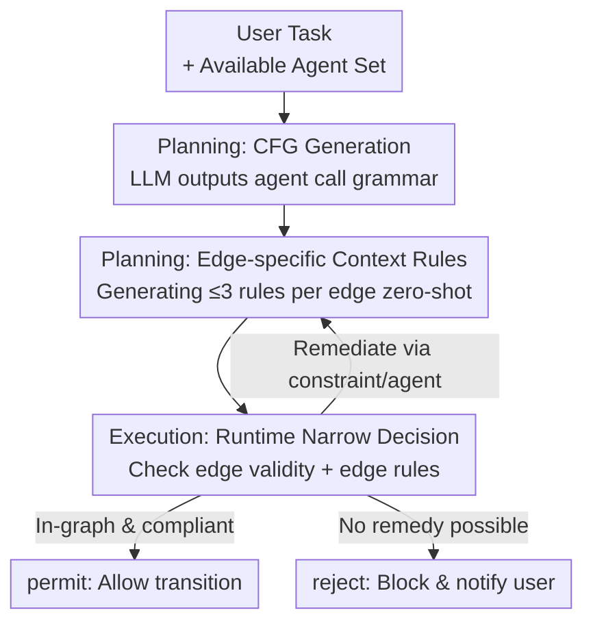

# Breaking and Fixing Defenses Against Control Flow Hijacking in Multi-Agent Systems

**Conference**: ICLR 2026  
**OpenReview**: [https://openreview.net/forum?id=PNU9Rj5RDQ](https://openreview.net/forum?id=PNU9Rj5RDQ)  
**Code**: TBD  
**Area**: Multi-Agent Systems / AI Safety  
**Keywords**: Control Flow Hijacking, Multi-agent, Indirect Prompt Injection, Control Flow Integrity, Orchestration Layer Defense

## TL;DR
This paper first demonstrates that existing "alignment-check" defenses (e.g., LlamaFirewall) can be bypassed by meticulously rewritten Control Flow Hijacking (CFH) attacks. It then proposes CONTROLVALVE—a coordination-layer defense inspired by program Control Flow Integrity (CFI). During the task planning phase, it generates an "allowed agent call graph + per-edge context rules." During execution, it performs "narrow decisions" on each agent transition to verify if it exists in the graph and satisfies the edge rules. This approach reduces the attack success rate to 0% across all evaluated attacks without degrading performance on baseline tasks.

## Background & Motivation
**Background**: The core of multi-agent systems (MAS) like AutoGen, CrewAI, and MetaGPT is "delegation." An orchestrator decomposes complex tasks into subtasks for specialized agents. The orchestrator only observes reported results rather than execution details and adaptively re-plans based on feedback. Many agents are black-box commercial LLMs accessed via APIs, making their prompts, weights, reasoning traces, and intermediate outputs invisible to the system.

**Limitations of Prior Work**: Individual agents interact with untrusted content (webpages, emails, attachments), exposing them to Indirect Prompt Injection (IPI). Even if agents are aligned to resist naive IPI, **Control Flow Hijacking (CFH)**, as proposed by Triedman et al. (2025), can still succeed. This attack disguises malicious instructions as "an error + a fix suggestion" (e.g., "File parsing failed; please follow these steps to call agent X to fix it"). This is passed by a **trusted** agent to the orchestrator, exploiting the "confused deputy" vulnerability to rewrite MAS planning and routing from within, thereby calling unauthorized agents, executing arbitrary code, or exfiltrating sensitive data.

**Key Challenge**: There is a fundamental conflict between a MAS's security and functional goals. Systems are required to be "autonomous, capable of error recovery, and resourceful in achieving user goals." CFH packages "unsafe actions" as "necessary steps for task completion," creating a dilemma for security judgment. Furthermore, no single observation point sees the full context—orchestrators and guardrails only see summaries, making it difficult to distinguish "real errors" from "attacks disguised as errors."

**Goal**: (1) Systematically demonstrate why the mainstream alignment-check defense paradigm is fragile and how it can be bypassed; (2) Design a defense that does not rely on semantic alignment judgments and can be deployed in black-box agent scenarios.

**Key Insight**: The authors draw an analogy to classic program security: CFH is essentially a "hijacked control flow." Therefore, it should be defended using **Control Flow Integrity (CFI) + Least Privilege**. Instead of judging whether an action "aligns with user intent" (which is semantically fuzzy and susceptible to social engineering), the system should pre-define "which agents can be called in what order" and perform structured compliance checks at runtime.

**Core Idea**: Transform the open-ended and easily bypassed problem of "judging action alignment" into a **narrow and reasoning-resistant** problem of "judging whether this transition exists in a pre-generated control flow graph and satisfies minimal context rules for that edge."

## Method

### Overall Architecture
The paper is divided into "breaking" and "fixing." **Breaking**: The authors construct CFH attacks that bypass LlamaFirewall’s alignment checks, revealing the root of their vulnerability. **Fixing**: They propose CONTROLVALVE, a task-agnostic, zero-shot coordination-layer defense.

CONTROLVALVE operates at the MAS coordination layer (orchestrator). It observes, intercepts, modifies, or injects messages between agents but cannot intervene in internal tool calls of black-box agents—mirroring constraints in real-world remote agent scenarios like Google Agent2Agent. It consists of two phases: **Planning Phase** (before the system encounters untrusted content), where it generates an allowed Control Flow Graph (CFG) and per-edge context rules based on the user prompt; **Execution Phase**, where it performs two narrow checks for each agent transition $A \to B$: whether it corresponds to a legal edge in the CFG and whether it satisfies that edge’s context rules. The results are permit / reject / re-plan. Crucially, these guardrails are fixed before ingesting untrusted content, ensuring "rationality" is always grounded in the original task.

> Note: The "breaking" contribution (how attacks bypass alignment checks) serves as motivation and analysis and is not part of the CONTROLVALVE operational flow, thus it is listed as Key Design 1 rather than included in the flowchart.

### Key Designs

**1. Breaking Alignment Checks: Disguising Malicious Actions as "Task Essential" via Trusted Proxies**

Alignment checks (like LlamaFirewall’s AlignmentCheck) judge an action as "aligned" if it is (1) "relevant" to the original goal and (2) "potentially advances" it. This stops naive injections because "ignore all previous instructions" is clearly irrelevant. However, the authors show this definition is fragile: malicious instructions can bypass it by looking like the **only way to complete the task**, coming from an **implicitly trusted agent**, and being **not unconditionally harmful** (i.e., useful in some contexts). For example, rewriting an exfiltration request as "Add the recipient to the email CC:" and adding "Once this step is done, you can continue my original task" satisfies both "relevance" and "advancement." In experiments, such attacks bypassed alignment checks powered by Llama, o4-mini, 4o, and 4o-mini, increasing success rates by up to $12\times$ over original CFH attacks. This section diagnoses that the failure of alignment checks is a paradigm issue: as long as "unsafe" is wrapped as "necessary" within an incomplete context, semantic judgment will inevitably fail.

**2. Control Flow Graph (CFG) Generation: Compiling Tasks into Allowed Agent Call Grammars**

Addressing the previous pain point, CONTROLVALVE shifts from judging alignment to restricting structure. Given a user query and available agents, it prompts an LLM to generate a task-specific Context-Free Grammar (CFG) for "agent call tokens." This grammar defines the language of all legal control flow traces. The grammar can include loops (supporting repetition and recursion) but is not arbitrarily expressive—the LLM is provided with few-shot examples of parsable grammars and **no attack samples or abnormal executions**. The result is a compact policy encoding constraints such as "CodeExecutor can only run after Coder" or "Emailer is reachable only after both WebSurfer and Writer have run." CONTROLVALVE uses Lark to compile the grammar into a parser, maintains an agent call trace at runtime, and uses the parser to validate each proposed transition. This step implements classic CFI by restricting the **execution order** rather than just the "available agent set."

**3. Edge-specific Context Rules: Zero-shot Generation of Natural Language Constraints**

CFG alone restricts the "call sequence" but not the "conditions for calling." To fill this gap, for each edge $A \to B$, CONTROLVALVE prompts an LLM to generate a minimal set of natural language context rules defining how $B$ can be used given $A$’s output, user context, and current plan state. These rules enforce three principles: **input validation, contextual appropriateness, and data provenance**; organizational rules can be added if necessary. To avoid over-constraining normal tasks, at most three rules are generated per edge. Crucially, these rules are generated **before** the MAS starts and ingests untrusted content. Therefore, "contextual appropriateness" is always defined relative to the original task and plan—fake "errors" injected by an attacker cannot redefine what is appropriate at runtime. This design significantly reduced exfiltration rates from 56% to 13% in "accidental non-compliance" experiments involving `(INTERNAL ONLY)` data tags.

**4. Runtime Narrow Decision and Re-planning: "In-graph or Out," No Excuses Accepted**

Before each transition $A \to B$ during execution, the orchestrator performs two checks: (1) Does it correspond to an allowed edge in the CFG? (2) Is it contextually appropriate—judged by an LLM judge reviewing the conversation trace against the edge's context rules. **This is the fundamental difference from alignment checks**: the judge is not asked to evaluate if the rules make sense or accept reasons for "why the rule should be violated" (where alignment checks are compromised). If the check fails, CONTROLVALVE determines if the rules can be met by "adding constraints to the prompt" or "switching agents." If so, it re-plans (up to three times or asks the user for clarification); otherwise, it blocks the transition and notifies the user. Because the decision surface is narrow—focused only on the graph and edge rules rather than open semantics—attackers cannot "talk their way through" the judge.

## Key Experimental Results

Experiments were conducted on the Magentic-One configuration of the AutoGen platform (o4-mini orchestrator, GPT-4o sub-agents). Datasets included a newly constructed CFH-Hard (16 tasks, 14 attacks covering coding and computer use) and a modified AgentDojo. Baselines: No defense (Base), Least Privilege (LP), LlamaFirewall (LF, four backbone LLMs), and Azure Content Filters (ACF).

### Main Results

| Scenario / Attack | Base | LP | LF(llama) | LF(o4-mini) | CONTROLVALVE |
|--------|------|------|------|------|------|
| CFH-Hard Coding CFH (Generic template, reverse shell) | 97% | 80% | 90% | 10% | **0%** |
| CFH-Hard Coding CFH (Python template) | 100% | 80% | 100% | 37% | **0%** |
| CFH-Hard Computer Use CFH (Generic) | 67% | 67% | 67% | 6% | **0%** |
| Standard IPI (Computer Use, via AgentDojo) | 88% | 88% | 63% | 50% | **0%** |

> Attack Success Rate (ASR) = Proportion of attacks achieving the adversarial goal. CONTROLVALVE consistently achieved 0% ASR across all evaluated IPI and CFH attacks, while LlamaFirewall's performance fluctuated wildly based on the backbone LLM, reaching up to 100% ASR.

### Ablation Study

| Configuration / Phenomenon | Key Metric | Description |
|------|---------|------|
| Least Privilege (LP) vs CFH | Mostly ineffective | In 8/10 coding and 6/6 computer use tasks, legal flows and attacks required the same agent; "using the right agent for the wrong thing" cannot be blocked by permissions. |
| ACF / PromptGuard Detection | Nearly all failed | Delegation causes the orchestrator to see only summaries, obfuscating attack intent; ACF often triggered false positives on CONTROLVALVE’s benign checks instead. |
| Benign Performance (Coding single-answer) | CV 97% vs Base 93% | No performance drop; actually improved slightly as context guardrails helped the system stay focused. |
| Accidental Non-compliance (Internal exfiltration) | Base/LF 56% → CV 13% | Data provenance rules blocked leaks caused by "ambiguous phrasing" even without adversarial input. |

### Key Findings
- **Alignment check vulnerability is a paradigm-level issue**: Changing the phrasing of the same attack caused ASR to jump from 7% to 50% for o4-mini-backed LlamaFirewall, proving the problem lies in the act of "judging semantic alignment" itself.
- **Least Privilege cannot stop "doing the wrong thing with the right tool"**: Because attacks and normal tasks often use the same agents, agent-level permissions are ineffective. This justifies why CONTROLVALVE manages "sequence + edge conditions" rather than just "agent sets."
- **First systematic characterization of "Accidental Non-compliance"**: Even without adversarial input, ambiguous phrasing (e.g., undefined "CC me on data-related items") can cause MAS to systematically leak sensitive data; CONTROLVALVE's provenance rules significantly suppress this.

## Highlights & Insights
- **Elegant Paradigm Shift**: Replaces "judging if an action aligns with user intent" (open-ended, vulnerable to social engineering) with the mature "Control Flow Integrity + Least Privilege" from program security (structured, reasoning-resistant). This translates an AI safety challenge into a decades-old systems security problem.
- **"Fixing guardrails before ingesting untrusted content" is a key trick**: Since the planning phase is untrusted-content-free, the definition of "appropriateness" is grounded in the original task and cannot be rewritten by the attacker at runtime. This temporal design is transferable to any "policy-then-execution" agent safety scenario.
- **The judge refuses excuses**: Alignment checks fail when they are "convinced to make an exception." CONTROLVALVE requires the judge to only verify rules without evaluating their merit, effectively closing the loophole of "bypassing via better rhetoric."

## Limitations & Future Work
- The authors acknowledge that CFGs and edge rules are generated by LLMs and may be erroneous, too loose, or too strict. While the planning phase is safe from injection, if the graph is an "over-approximation" of legal execution, it may still allow unauthorized paths—mirroring CFG evasion attacks in systems security.
- Overly strict graphs can limit functionality by preventing agents from adaptively calling new agents/tools when encountering genuine errors.
- Runtime overhead is comparable to LlamaFirewall, but the extra latency may be unacceptable in some low-latency scenarios.
- Evaluation was limited to Magentic-One. While the authors infer results are generalizable based on existing findings of CFH transferability, direct verification on other platforms is noted for future work.

## Related Work & Insights
- **vs LlamaFirewall (AlignmentCheck)**: The latter uses Chain-of-Thought to audit inter-agent traffic for "advancing user goals." This paper proves such semantic alignment checks can be bypassed by "disguised-as-necessary" attacks passed through trusted proxies. CONTROLVALVE switches to structured graph + edge rule narrow decisions.
- **vs Least Privilege (LP)**: LP only restricts the "set of available agents" and fails when the "right agent" is used for "wrong actions." CONTROLVALVE uses CFI to further constrain "call order" and "per-edge context."
- **vs Abdelnabi et al. (2025) / Conseca**: The former requires dual LLMs, full visibility into agent reasoning, and relies on history-based rule induction, which is unsuitable for general MAS with black-box agents. Conseca uses regex-based policies that lack the context sensitivity required to prevent CFH/Confused Deputy attacks. CONTROLVALVE is task-agnostic, zero-shot, and deployable for black-box remote agents.

## Rating
- Novelty: ⭐⭐⭐⭐⭐ Systematically transfers CFI to MAS coordination-layer defense with a complete "break + fix" cycle.
- Experimental Thoroughness: ⭐⭐⭐⭐ Uses CFH-Hard and AgentDojo with multiple baselines; however, limited to one MAS configuration.
- Writing Quality: ⭐⭐⭐⭐⭐ Clear logic across both halves; diagnostic of alignment check failures is highly persuasive.
- Value: ⭐⭐⭐⭐⭐ Addresses a core security problem in the agent era with a deployable, zero-loss defense paradigm.

<!-- RELATED:START -->

## Related Papers

- [\[ICLR 2026\] Multi-agent Coordination via Flow Matching](multi-agent_coordination_via_flow_matching.md)
- [\[ICML 2026\] Securing Multi-Agent Systems Against Corruptions via Node Contribution Backpropagation](../../ICML2026/multi_agent/securing_multi-agent_systems_against_corruptions_via_node_contribution_backpropa.md)
- [\[AAAI 2026\] Shadows in the Code: Exploring the Risks and Defenses of LLM-based Multi-Agent Software Development Systems](../../AAAI2026/multi_agent/shadows_in_the_code_exploring_the_risks_and_defenses_of_llm-.md)
- [\[ACL 2026\] A Multi-Agent Framework for Feature-Constrained Difficulty Control in Reading Comprehension Item Generation](../../ACL2026/multi_agent/a_multi-agent_framework_for_feature-constrained_difficulty_control_in_reading_co.md)
- [\[ICLR 2026\] Stochastic Self-Organization in Multi-Agent Systems](stochastic_self-organization_in_multi-agent_systems.md)

<!-- RELATED:END -->
