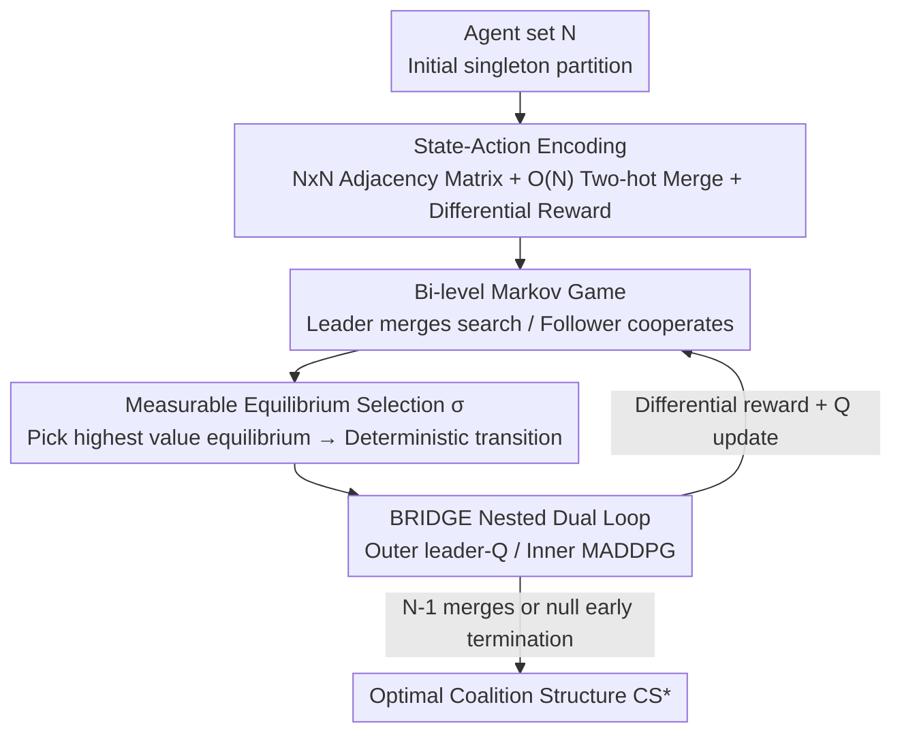

# BRIDGE: Bi-level Reinforcement Learning for Dynamic Group Structure in Coalition Formation Games

**Conference**: ICLR2026  
**OpenReview**: [https://openreview.net/forum?id=kIIG4Km1lu](https://openreview.net/forum?id=kIIG4Km1lu)  
**Code**: To be confirmed  
**Area**: Multi-Agent Systems / Reinforcement Learning  
**Keywords**: Coalition Structure Generation, Bi-level Reinforcement Learning, Multi-Agent Systems, Stackelberg Games, MADDPG

## TL;DR
This paper models the "optimally partitioning a group of agents into several coalitions" (the NP-complete Coalition Structure Generation problem) as a compact, RL-solvable MDP. By employing bi-level RL (where the upper level learns to merge coalitions and the lower level learns optimal individual policies), models trained on only 3 agents can generalize to 100 agents, outperforming traditional heuristics in both inference speed and performance in mixed-motive Markov games.

## Background & Motivation

**Background**: Coalition Structure Generation (CSG) investigates how to partition $N$ autonomous agents into disjoint subsets (coalitions) that cover the entire set, maximizing the total social welfare $v(CS)=\sum_{C\in CS} v(C)$. It is a core problem in scenarios such as ride-sharing, disaster response coordination, and smart grids. Traditional solutions fall into two categories: exact methods (such as integer programming ODP-IP, ODSS, etc.) guarantee optimality but face an exponential explosion in search space as the number of agents grows, becoming computationally infeasible beyond approximately 40 agents; approximate methods (C-Link, GRASP, etc.) are faster but lack quality guarantees.

**Limitations of Prior Work**: Both categories of methods are designed for static normal-form games—given a fixed set of coalition values $v(C)$, they seek an optimal partition. They suffer from two major drawbacks: first, **they must recompute from scratch for every new instance**, failing to learn transferable structures; second, **they only handle static values**, making them unable to cope with sequential, dynamic situations in Markov games where "the coalition value itself depends on how agents act subsequently."

**Key Challenge**: The coalition structure space is of Bell number magnitude (exponential explosion), and coalition values are not simply additive—cooperation between agents can bring extra gains or costs, meaning a grand coalition is not necessarily optimal. This requires a method that can both search efficiently in an exponentially large space and adapt to values that change dynamically with policies. Directly feeding the entire combinatorial problem into a naive MDP is infeasible: naive encoding leads to exponential explosion, and solving arbitrary MDPs is PSPACE-hard.

**Goal**: Design a **structured, RL-friendly** CSG formalization that enables deep RL to approximate optimal coalition structures at a large scale, while incorporating the dynamic coupling where coalition values are determined by low-level agent policies.

**Key Insight**: The authors noticed that coalition values possess **compositionality**—the value of a large structure can be assembled from the values of its sub-coalitions. By defining the "reward" as the **difference** in coalition structure value between two adjacent steps, a neural network can generalize sub-structure values learned from small instances to unseen larger structures. Furthermore, drawing on the hierarchical idea of Stackelberg games, the problem is split into two levels: "forming coalitions" and "how agents act within coalitions."

**Core Idea**: Use a compact $N\times N$ adjacency matrix to represent coalition structures and use differential rewards to make values generalizable, formulating CSG as a finite MDP. Then, apply bi-level RL: the upper level (leader) searches for the optimal structure by progressively merging coalitions, while the lower level (follower) uses MADDPG to learn optimal cooperative policies under a given structure, which in turn provides the coalition values.

## Method

### Overall Architecture

BRIDGE decomposes CSG into two coupled levels. **The upper level is a leader agent** facing an episodic MDP: the state $s_l$ is the current coalition structure, with the initial state fixed as the all-singleton partition $\{\{1\},\dots,\{N\}\}$. Each action $a_l$ selects two coalitions to merge (or a "null" action to terminate early). Transitions are deterministic—the merged structure is uniquely defined. An episode lasts at most $N-1$ steps. **The lower level consists of follower agents**: under the coalition structure currently provided by the leader, each agent treats its own coalition as the object for cooperative optimization, using MADDPG to learn an optimal policy and calculate the actual value $J_f^C$ that each coalition can achieve.

The two levels are coupled via **rewards**: the leader's reward at step $t_c$ is defined as the difference between the coalition structure values before and after the merge:

$$r_l(s_l,a_l,\pi_f) := \sum_{C\in T(s_l,a_l)} J_f^C(\pi_f\mid s_l) - \sum_{C\in s_l} J_f^C(\pi_f\mid s_l),$$

where $J_f^C$ is exactly the coalition return optimized by the lower-level followers. Thus, the $Q_l$ learned by the leader reflects both "which merge improves overall value" and the actual collaboration capabilities of the lower-level agents, achieving adaptation to dynamic environments.

### Key Designs

**1. Structure-Consistent State-Action Encoding: Enabling Knowledge Reuse Across Scales**

The hardest part of CSG is the exponential explosion of the coalition structure space. Naively treating each structure as a discrete symbol makes learning impossible and non-generalizable. BRIDGE encodes any coalition structure $s_l$ as an $N\times N$ 0/1 adjacency matrix—$(i,j)=1$ if and only if agents $i$ and $j$ are in the same coalition—and flattens it into a vector. This representation **systematically characterizes all pairwise relationships**, providing a unified input format for the deep network, and is equivariant under consistent permutations of agent indices. For the action side, "which two coalitions to merge" is encoded as an $(N+1)$-dimensional **two-hot vector** via a shared scorer $\psi$. The encoding dimension grows **linearly** with $N$ rather than quadratically, preventing output dimension explosion. The key benefit of this encoding is generalization: the pattern of "which group is good" learned from small instances is local and compositional. After learning the value of a structure like $\{\{1,2\},\{3\}\}$, the network can transfer that knowledge to estimate $\{\{1,2\},\{3\},\{4,5\}\}$. Consequently, a model trained on 3 agents can directly extrapolate to dozens or even hundreds.

**2. Bi-level Markov Game: Decoupling "Formation" and "Execution" as Leader-Follower**

In reality, coalition values are often not pre-defined constants but depend on the policies learned by agents within the coalition—a dynamic aspect ignored by traditional static CSG. BRIDGE handles this using the hierarchical structure of a Stackelberg game: the high-level leader aims to maximize the coalition structure value, while each low-level agent follows as a pursuer, maximizing the discounted cumulative return $J_f^C(\pi_f)=\sum_{t_k}\mathbb{E}[\gamma_f^{t_k} r_{f,t_k}^C]$ of its own coalition under the leader's partition constraints. The upper level is an episodic MDP responsible for "building" the structure sequentially, while the lower level is a cooperative game responsible for "filling" the collaborative policies within each coalition. Each level defines its own optimal action-value functions and corresponding Bellman operators ($Q_l^*$ for the leader, $Q_f^{i,*}$ for the followers). The paper proves in the appendix that under standard assumptions, this RL formalization converges to the optimal coalition structure.

**3. Measurable Equilibrium Selection σ: Eliminating Transition Uncertainty from Multiple Nash Equilibria**

The lower level is a cooperative game. Given the leader's structure $s_l$, each coalition $C$ is treated as a rational player, and their joint strategies fall into the Nash Equilibrium set $\mathrm{NE}(s_l)$. The problem is that multiple equilibria may exist, yielding different coalition values and making the upper-level leader's rewards/transitions stochastic and unlearnable. BRIDGE introduces a **measurable selection rule** $\sigma:\mathrm{NE}(s_l)\to\Pi_f$, agreeing that when multiple equilibria exist, the one that **maximizes the coalition structure reward** is always selected:

$$\pi_f = \arg\max_{\pi_f\in \mathrm{NE}(s_l)} \sum_{C\in s_l} J_f^C(\pi_f).$$

This provides a **deterministic reward/transition mapping** for the upper level, making the leader's MDP well-defined and solvable via Q-learning. In practice, followers are trained by MADDPG and can only provide approximate best responses; the authors use an ablation study in Figure 4 to verify the system's robustness to "moderately suboptimal followers."

**4. BRIDGE Nested Dual-Loop Algorithm: Slow Outer-Loop Structure Search, Fast Inner-Loop Policy Training**

To implement these designs, BRIDGE uses a nested dual-loop (Algorithm 1) inspired by the meta-RL paradigm. The **outer loop** progresses through iterations $c$. At each step $t_c$, the leader uses $\epsilon$-greedy to select a merge action from $Q_l$, observes the next structure and differential reward, and stores the transition $(s_{l,t_c},a_{l,t_c},s_{l,t_c+1},r_{l,t_c})$ in the leader's replay buffer $G$. After the outer loop completes, the leader's Q-network is updated using $y_g=r_{l,g}+\gamma\max_{a'}Q_l(s'_{l,g},a')$. The **inner loop** trains followers using a modified MADDPG (replacing deterministic policies with stochastic ones) under the leader's given structure. The outer loop is slow (focusing on structure building), while the inner loop is fast (focusing on intra-coalition cooperation). These two time-scale loops are nested to correspond to the coupling between "coalition formation" and "agent policy optimization."

### Loss & Training

Followers at the lower level use a MADDPG-style approach: critic loss $L(\theta_f^i)=\frac{1}{|B_{mini}|}\sum_b\big(y_b^i-Q_f^i(o_f^C,a_f^C;\theta_f^i)\big)^2$ with target $y_b^i=r_{f,b}^C+\gamma Q_f^i(o'^C_{f,b},a'^C_{f,b})$; actors are updated via policy gradient $\nabla_{\theta_f^i}J=\mathbb{E}[\nabla_{\theta_f^i}\log\pi_{\theta_f^i}(a_f^i\mid o_f^i)\,Q_f^i]$. The leader uses a Q-network loss $L(\theta_l)=\frac{1}{|G_{mini}|}\sum_g(y_g-Q_l(s_{l,g},a_{l,g};\theta_l))^2$ with learning rate $\rho_l$. Training involves approximately 300 outer-loop episodes, with early stopping if reward variance stays below 1% for 20 consecutive episodes.

## Key Experimental Results

### Main Results

**Generalization (Pre-trained on 3 agents, evaluated on 5–10 agents, modified normal distribution, reporting % of optimal value achieved)**:

| Training Paradigm | 5 agents | 6 agents | 7 agents | 8 agents | 9 agents | 10 agents |
|----------|---------|---------|---------|---------|---------|----------|
| Random Policy | 44.42% | 36.59% | 36.32% | 30.97% | 25.05% | 21.01% |
| Few-Shot (100 ep) | 88.83% | 66.17% | 59.67% | 55.62% | 47.18% | 41.61% |
| Few-Shot (200 ep) | **97.2%** | **80.33%** | **78.68%** | **63.52%** | **58.15%** | **48.24%** |

Pre-training on only 3 agents and fine-tuning for 100/200 episodes on the target scale consistently outperforms the random policy; 200-episode fine-tuning performs best across all scales. The paper claims the model can extrapolate up to 100 agents.

**Mixed-Motive Markov Games (LBF environment, 6 $a\times t$ configurations, metric is Baseline Gain, mean±std)**:

| Scenario | C-Link | GRASP | SALDAE | CSG-UCT | BRIDGE |
|------|--------|-------|--------|---------|--------|
| 6a4t | 27.70 | 9.17 | 25.00 | 31.00 | **34.17** |
| 8a4t | 32.58 | 12.44 | 27.43 | 34.76 | **38.57** |
| 8a5t | 40.68 | 23.33 | 31.33 | 45.33 | **52.17** |
| 10a4t | 66.23 | 29.71 | 41.33 | 73.33 | **77.43** |
| 10a5t | 73.71 | 33.10 | 63.83 | 82.83 | **89.29** |

Except for the 6a5t case, BRIDGE outperforms all traditional CSG baselines (C-Link, GRASP, CSG-UCT, SALDAE) in the vast majority of configurations. On normal-form benchmarks with six value distributions, BRIDGE also achieves higher coalition structure values, particularly on "hard" distributions. Furthermore, its inference speed is significantly faster than traditional heuristic CSG methods (Table 2).

### Ablation Study

**Impact of follower training level on leader performance (LBF, varying follower training epochs)**:

| Scenario | 15 epochs | 10 epochs | 7 epochs | 5 epochs |
|------|-----------|-----------|----------|----------|
| 6a4t | 32.11 | 34.17 | 26.73 | 2.82 |
| 8a4t | 37.05 | 38.57 | 21.46 | 9.84 |
| 8a5t | 51.24 | 52.17 | 47.44 | 11.49 |
| 10a5t | 91.28 | 89.29 | 88.35 | 29.97 |

### Key Findings

- **Follower quality determines the ceiling, but there is a tolerance band**: When followers converge well (10–15 epochs), leader performance is high and stable; with moderate training (7 epochs), performance drops but remains usable; collapse only occurs when followers are severely under-trained (5 epochs).
- **Generalization improves monotonically with fine-tuning budget**: The percentage of optimal value increases steadily from 0-shot to 200-shot, proving the $N\times N$ encoding effectively learns transferable grouping patterns.
- **Harder distributions widen the gap**: BRIDGE shows a more pronounced advantage over heuristic baselines on "hard" distributions with higher randomness and grand coalition penalties.

## Highlights & Insights

- **Differential reward is the key to generalization**: Defining rewards as the "difference in adjacent structure values" rather than absolute values cleverly exploits the compositionality of coalition values. This is why "3-agent training, 100-agent inference" works.
- **"Determinizing" the game with measurable selection**: Multiple Nash equilibria are usually a roadblock for RL; BRIDGE's rule of picking the "highest value equilibrium" makes the upper-level transition deterministic, rendering the leader's MDP well-defined.
- **Two-time-scale nested loops**: The architecture cleanly maps "how to build coalitions" and "how to act within them" to two coupled but asynchronous optimization goals, providing better control than single-layer end-to-end approaches.

## Limitations & Future Work

- **Index order reliance**: The $N\times N$ encoding is stable only when the agent index order is fixed during training and evaluation; it is not truly permutation invariant.
- **Dependency on follower optimality**: While robust to moderate suboptimality, the framework is sensitive to the follower's training budget.
- **Optimality verification at scale**: True optimal values can only be computed via brute force for $N \le 10$. For 100 agents, only relative metrics (Baseline Gain) can be used, making it hard to strictly bound approximation quality.

## Related Work & Insights

- **vs. Exact CSG**: Exact methods guarantee optimality but stall at $\sim 40$ agents and solve every instance from scratch; BRIDGE sacrifices strict optimality for generalization, scalability to 100 agents, and faster inference.
- **vs. Approximate CSG**: Traditional heuristics are designed for static normal-form games without quality guarantees; BRIDGE learns search policies through deep RL and handles dynamic values in Markov games.
- **vs. Task Allocation in MARL**: While task allocation is similar to coalition formation, it rarely formalizes CSG as an optimizable upper-level MDP; BRIDGE formally integrates game-theoretic CSG with MARL policy learning using a bi-level structure.

## Rating
- **Novelty**: ⭐⭐⭐⭐⭐ First to formalize CSG as a structured RL-friendly MDP with bi-level RL; differential reward and measurable selection are ingenious.
- **Experimental Thoroughness**: ⭐⭐⭐⭐ Covers various value distributions and both normal/Markov games; however, lacks optimal ground truth for large-scale experiments.
- **Writing Quality**: ⭐⭐⭐⭐ Clear formal definitions and logical progression; some theory is secondary but well-documented in appendices.
- **Value**: ⭐⭐⭐⭐ Provides a scalable paradigm for coalition formation with "dynamic, learnable values," significant for multi-agent coordination.

<!-- RELATED:START -->

## Related Papers

- [\[ICLR 2026\] AgentPO: Enhancing Multi-Agent Collaboration via Reinforcement Learning](agentpo_enhancing_multi-agent_collaboration_via_reinforcement_learning.md)
- [\[ICLR 2026\] Adaptive Collaboration with Humans: Metacognitive Policy Optimization for Multi-Agent LLMs with Continual Learning](adaptive_collaboration_with_humans_metacognitive_policy_optimization_for_multi-a.md)
- [\[AAAI 2026\] Learning to Generate and Extract: A Multi-Agent Collaboration Framework for Zero-shot Document-level Event Arguments Extraction](../../AAAI2026/multi_agent/learning_to_generate_and_extract_a_multi-agent_collaboration_framework_for_zero-.md)
- [\[ICLR 2026\] Context Learning for Multi-Agent Discussion](context_learning_for_multi-agent_discussion.md)
- [\[ICLR 2026\] Learning to Summarize by Learning to Quiz: Adversarial Agentic Collaboration for Long Document Summarization](learning_to_summarize_by_learning_to_quiz_adversarial_agentic_collaboration_for_.md)

<!-- RELATED:END -->
