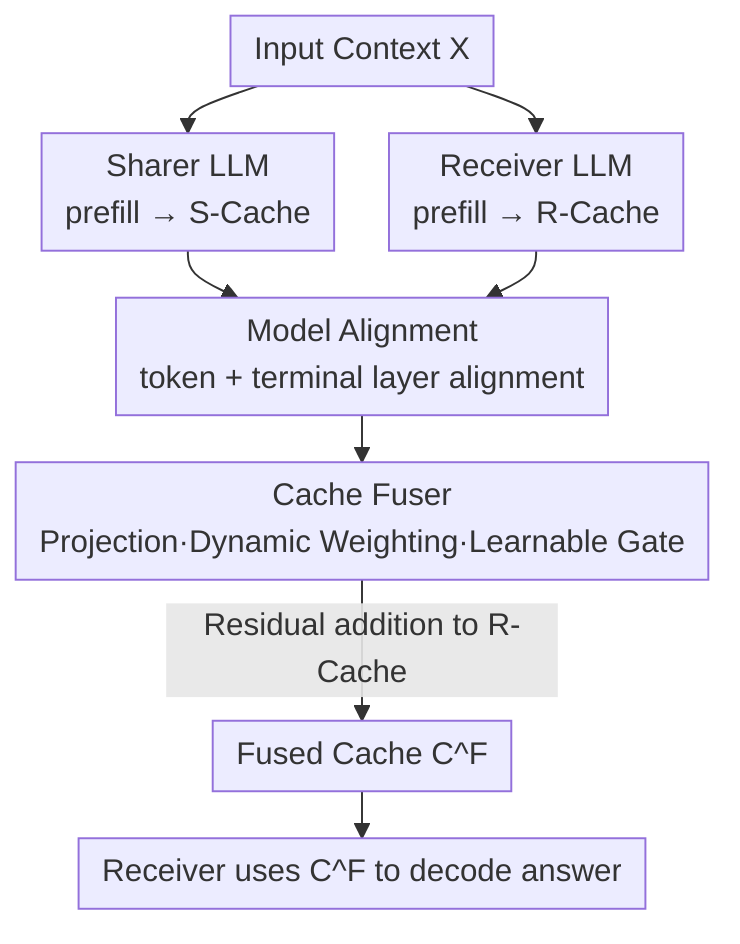

# Cache-to-Cache: Direct Semantic Communication Between Large Language Models

**Conference**: ICLR2026  
**OpenReview**: [https://openreview.net/forum?id=LeatkxrBCi](https://openreview.net/forum?id=LeatkxrBCi)  
**Code**: https://github.com/thu-nics/C2C  
**Area**: Multi-LLM Collaboration / Inter-LLM Communication / KV-Cache  
**Keywords**: Multi-LLM systems, KV-Cache fusion, semantic communication, model collaboration, inference acceleration

## TL;DR
Instead of collaborating through natural language "conversations," multiple large language models use a lightweight neural network to directly project and fuse the KV-Cache of a Sharer model into a Receiver model. This bypasses token-by-token text generation, preserving deep semantics that text might lose, while reducing average latency by 2.5× and improving accuracy by approximately 3–5% compared to pure text-based collaboration.

## Background & Motivation
**Background**: Multi-LLM systems are becoming increasingly popular—different models have different strengths (coding, mathematics, vision, edge deployment, etc.), and teaming them up often achieves performance and efficiency unattainable by a single model. Whether it is collaborative systems (Chain-of-Agents, MetaGPT, Mixture-of-Agents, multi-agent debate) or routing-based inference systems, these models communicate almost exclusively via **text**: one model decodes its internal representation into a token sequence, and the other model then consumes this text.

**Limitations of Prior Work**: The authors decompose the issues of the text-to-text (T2T) interface into three points. First, text is a **low-bandwidth medium**, creating an information bottleneck—high-dimensional internal representations are repeatedly compressed into linear strings and then decompressed by the receiver. When two models have different knowledge structures or roles, some signals cannot be recovered. The paper provides a vivid example (Figure 2): a Coder model tells a Writer model to "write inside the `<section>` wrap," but the structural semantics of `
` as a paragraph separator are lost in the text, causing the Writer to insert content incorrectly. Second, natural language is **inherently ambiguous**, with idioms, unclear references, and vague expressions being common; even with protocols like MCP/A2A standardizing message templates, rigid templates cannot support flexible open-domain collaboration. Third, text communication has **high latency**, as each exchange requires the complete context to be decoded token-by-token.

**Key Challenge**: Collaboration requires the transmission of "rich and diverse semantic understanding," but the bandwidth, clarity, and speed of the text channel are all contrary to this requirement. Models have already computed a high-dimensional semantic representation (KV-Cache) internally, yet they are forced to flatten it into text for the other party to re-understand it.

**Goal**: Find a more direct communication medium than text that allows a model's semantic understanding to be moved as a whole into another model while supporting cross-family and cross-scale model interaction.

**Key Insight**: The authors ask, "Can LLMs communicate outside of text?" and use two sets of oracle experiments to verify feasibility—(1) **Benefit**: Does making the KV-Cache semantics "richer" without lengthening the sequence improve accuracy? (2) **Convertibility**: Can the KV-Cache of one model be used by another? Both experiments yield positive answers, and they find that different LLMs encode complementary semantic understandings for the same input.

**Core Idea**: Use KV-Cache as the communication medium—train a **Cache Fuser** to project the Sharer's KV-Cache into the Receiver's representation space and fuse it. A learnable gate then selects which layers actually need injection, realizing "direct semantic communication" (Cache-to-Cache, C2C) between LLMs.

## Method

### Overall Architecture
C2C operates on two **frozen** LLMs: the one providing context understanding is the **Sharer**, and the one using it is the **Receiver**. During the prefill stage, both models encode the input into their own KV-Caches ($C^S(X)$ and $C(X)$). The Cache Fuser takes the $n$-th layer Receiver cache and the aligned $G(n)$-th layer Sharer cache as input, outputs a "fused cache," and adds it back to the Receiver via a residual connection:

$$C^F = \left\{\, C_n(X) + F_n\big(C_n(X),\, C^S_{G(n)}(X)\big) \,\right\}_{n=1}^{N}$$

The Receiver then uses this fused cache $C^F$ instead of its original cache to decode the answer. The entire inference process adds only one parallel cache fusion step (measured at ~90ms) compared to a single model, without requiring the Sharer to "speak" the content token-by-token. To make this design work, three problems must be solved: how to fuse caches (Fuser structure), how to align tokens and layers across models (Model Alignment), and how to train the Fuser (Training Scheme).

### Key Designs

**1. KV-Cache as Communication Medium: Solidifying Validity**

Before designing the network, the authors use two oracle experiments to answer "is this possible?", forming the foundation of the paper. **Cache enrichment oracle** aims to prove that enriching the semantics of KV-Cache without increasing sequence length can improve performance. Three settings are compared: Direct (prefill $X$, decode with $C(X)$), Few-shot (prefill examples $E$ concatenated with $X$, decode with longer $C(E\oplus X)$), and Oracle (prefill $E\oplus X$, but drop the example cache before decoding, keeping only the aligned slice $C^*(X) = C_{[|E|:|E|+|X|]}(E\oplus X)$). The Oracle's cache length is identical to Direct, yet accuracy rises from 58.42% to 62.34% (Table 1), showing that gains come from "better embedding of the question in the cache" rather than seeing more tokens. They also find that this gain **varies by layer**: augmenting the top-5 best layers is slightly better than augmenting all layers, while augmenting the worst layers drops performance (Figure 4), directly motivating the gating design. **Cache transformation oracle** trains a 3-layer MLP to map Qwen3-4B's cache to the Qwen3-0.6B space. T-SNE shows that transformed caches fall within the target model's space (Figure 3), proving cross-model caches are **convertible**, though they only cover a subset, confirming complementary semantics.

**2. Cache Fuser Three-Module Structure: Residual Injection instead of Overwriting**

The Fuser is the core learnable component, following the "residual integration" principle—augmenting the Receiver cache without destructively overwriting its information. Thus, Equation (3) uses addition $C_n + F_n(\cdot)$ rather than replacement. It contains three modules:
- **Projection Module**: Concatenates Receiver and Sharer caches along the feature dimension, passes them through a projection layer and a fusion layer to merge heterogeneous caches.
- **Dynamic Weighting Module**: A following input-aware head modulation layer re-weights the projected information at the attention head level based on the current input—different inputs require different information from the Sharer.
- **Learnable Gate**: Assigns a trainable gate value to each layer to decide "whether" to inject the Sharer's context, addressing the finding that injection in some layers is harmful. The gate uses **Gumbel-sigmoid** with temperature annealing: differentiable during training and approaching a binary (0/1) hard choice during inference.

**3. Model Alignment: Matching Different Families and Scales**

For cross-family and cross-scale fusion, alignment must occur at both **token** and **layer** levels. **Token Alignment** handles different tokenizers: each Receiver token is decoded back to a string and re-encoded using the Sharer's tokenizer. For one-to-many mappings, the Sharer token with the largest string overlap is selected. **Layer Alignment** uses a **terminal alignment** strategy: the last layers of both models are aligned first, followed by the second-to-last, and so on, until the first layer of the shallower model is reached. This ensures that the most semantically mature deep layers are paired first. The layer mapping $G(n)$ is provided by this strategy.

**4. Training Scheme: Frozen Models, Train Only the Fuser**

During training, both Sharer and Receiver are frozen, and only the C2C modules are updated, making the cost much lower than fine-tuning an LLM. The supervision signal is the standard next-token prediction loss on the Receiver's output (similar to SFT), with the only difference being that the Receiver predicts based on the **fused cache**. Training involves: (1) Forward—both models encode input to get caches; (2) Fusion—C2C fuses and replaces the Receiver cache; (3) Supervision—Receiver predicts with the fused cache, and gradients backpropagate only into C2C to minimize loss. Training uses the first 500,000 general samples from OpenHermes2.5 for generalization.

### Loss & Training
The objective is the next-token cross-entropy on the Receiver's answer. Gradients update only the Fuser. Gating uses Gumbel-sigmoid with temperature annealing for a smooth transition from "differentiable training" to "binary inference." Both LLMs remain frozen throughout.

## Key Experimental Results

### Main Results
The Receiver is fixed as Qwen3-0.6B with three different Sharers, evaluated on OpenBookQA, MMLU-Redux, ARC-C, and C-Eval.

| Setting (Sharer→Receiver=Qwen3-0.6B) | Benchmark | Receiver (Single) | Text-to-Text | Cache-to-Cache |
|---|---|---|---|---|
| Qwen2.5-0.5B | OpenBook | 39.20 | 44.00 | **52.60** |
| Qwen2.5-0.5B | ARC-C | 41.04 | 49.48 | **54.52** |
| Llama3.2-1B | MMLU-Redux | 35.53 | 43.32 | **44.42** |
| Qwen3-4B-Base | OpenBook | 39.20 | 46.40 | **53.20** |
| Qwen3-4B-Base | ARC-C | 41.04 | 53.91 | **55.39** |

Overall, C2C improves average accuracy by 9.6–11.9% over the single Receiver and by 3.06–5.36% over T2T. Regarding efficiency, C2C is 3.46×/1.51×/14.41× faster than T2T across the three Sharers (average ~2.5×). Latency breakdown shows that in T2T, the Sharer decoding 80 tokens takes 1312ms, while C2C replaces this with a 90ms parallel cache fusion.

An interesting case: Qwen3-4B-Base as a Sharer often fails to follow instructions (low single-model accuracy) and T2T communication is very slow, but C2C bypasses the "instruction following" requirement, allowing a smaller instruction-tuned Receiver to directly consume knowledge from the strong base model.

### Ablation Study

| Config | #Param. | OpenBook | ARC-C | MMLU | C-Eval | Description |
|---|---|---|---|---|---|---|
| Single | 596M | 45.80 | 47.65 | 36.81 | 35.81 | Fine-tuned Receiver only, no Sharer |
| Identical | 529M | 50.60 | 52.52 | 42.17 | 40.34 | Sharer=Receiver (same model) |
| C2C | 478M | **52.60** | **54.52** | **42.92** | **41.77** | Sharer/Receiver (different models) |

### Key Findings
- **Clean decomposition of gains**: The Single→Identical jump shows that the "C2C fusion structure + training" itself is useful; the Identical→C2C jump shows the contribution of "complementary semantics between different models."
- **Gating reflects oracle findings**: Cache enrichment varies by layer (Figure 4). The per-layer learnable gate is not a decoration but a necessity derived from experimental observations.
- **Scalability**: Across sequence lengths (0-4k to 8k+), C2C consistently outperforms T2T on LongBenchV1. As the Sharer scales up, C2C's gains grow faster than T2T's.

## Highlights & Insights
- **Changing the collaboration medium from text to KV-Cache** is a paradigm-shifting idea: it addresses bandwidth, ambiguity, and latency simultaneously by avoiding the flattening of internal representations into text.
- **Oracle-first research paradigm**: Two sets of oracle experiments lock in the premises of "semantic enhancement" and "cross-model convertibility," making the network design choices (like gating) traceable to experimental evidence.
- **Residual + Layer-wise Gating**: This is a transferable trick. When injecting external information into a frozen network's hidden states without wanting to destroy them, residual injection + Gumbel-sigmoid gating is a clean template.
- **Decoupling ability from instruction-following**: C2C allows strong but "disobedient" base models to contribute knowledge, suggesting that core capabilities and instruction-following can be transmitted separately.

## Limitations & Future Work
- **Requires training and pairing**: Every Sharer-Receiver pair needs a trained Fuser; changing the pair requires retraining, unlike "plug-and-play" text collaboration.
- **Requires white-box access**: One must access the internal KV-Cache of both models, preventing closed-source API models from participating.
- **Heuristic alignment**: Token alignment and terminal layer alignment are engineering approximations; robustness across vastly different architectures needs more systematic verification.
- **Diminishing returns for strong Receivers**: As the Receiver becomes larger and its knowledge overlaps more with the Sharer, relative gains decrease. C2C's "sweet spot" is a small Receiver paired with a stronger or complementary Sharer.

## Related Work & Insights
- **vs. KV-Cache Reuse/Sharing**: Those works focus on **single-model acceleration** (e.g., reusing cache between layers); C2C uses cache as a **cross-model semantic transmission** medium with explicit support for cross-family/cross-size models.
- **vs. Collaborative Multi-Agents**: These exchange messages via text, limited by bandwidth and ambiguity. C2C shares at the deeper internal representation level, skipping token-by-token decoding.
- **vs. Routing-based Multi-LLM Inference**: Routing either drops the other model's context or uses only its own understanding; small models cannot benefit from the rich representations already computed by large models. C2C allows the Receiver to directly inherit the Sharer's semantic understanding.

## Rating
- Novelty: ⭐⭐⭐⭐⭐ A rare paradigm-level idea in multi-LLM communication.
- Experimental Thoroughness: ⭐⭐⭐⭐ Covers benchmarks, scaling, and gain decomposition.
- Writing Quality: ⭐⭐⭐⭐⭐ Clear logic from oracle to design to experiments; Figure 2 is excellent.
- Value: ⭐⭐⭐⭐ High heuristic value and efficiency gains, though limited by white-box and training requirements.

<!-- RELATED:START -->

## Related Papers

- [\[ACL 2026\] AgenticEval: Toward Agentic and Self-Evolving Safety Evaluation of Large Language Models](../../ACL2026/multi_agent/agenticeval_toward_agentic_and_self-evolving_safety_evaluation_of_large_language.md)
- [\[NeurIPS 2025\] Large Language Models Miss the Multi-Agent Mark](../../NeurIPS2025/multi_agent/large_language_models_miss_the_multi-agent_mark.md)
- [\[ICLR 2026\] Emergent Coordination in Multi-Agent Language Models](emergent_coordination_in_multi-agent_language_models.md)
- [\[AAAI 2026\] MedLA: A Logic-Driven Multi-Agent Framework for Complex Medical Reasoning with Large Language Models](../../AAAI2026/multi_agent/medla_a_logic-driven_multi-agent_framework_for_complex_medic.md)
- [\[NeurIPS 2025\] Debate or Vote: Which Yields Better Decisions in Multi-Agent Large Language Models?](../../NeurIPS2025/multi_agent/debate_or_vote_which_yields_better_decisions_in_multi-agent_large_language_model.md)

<!-- RELATED:END -->
