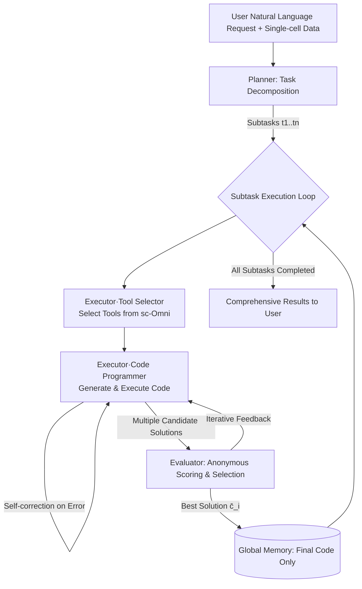

# CellAgent: LLM-Driven Multi-Agent Framework for Natural Language-Based Single-Cell Analysis

**Conference**: ICLR 2026  
**OpenReview**: [https://openreview.net/forum?id=BsA2GNkJhz](https://openreview.net/forum?id=BsA2GNkJhz)  
**Code**: TBD  
**Area**: LLM Multi-Agent / AI for Science (Single-cell Bioinformatics)  
**Keywords**: Multi-Agent, scRNA-seq, Spatial Transcriptomics, Self-Reflective Optimization, Tool Calling  

## TL;DR
CellAgent utilizes a three-tier agent architecture (Planner-Executor-Evaluator) combined with an expert toolbox (sc-Omni) and a self-reflective optimization mechanism. It enables researchers to perform end-to-end single-cell RNA sequencing and spatial transcriptomics analysis using only natural language, achieving quality comparable to or exceeding that of human experts across multiple downstream tasks.

## Background & Motivation
**Background**: Single-cell RNA sequencing (scRNA-seq) and spatial transcriptomics (ST) have become core methods in molecular biology, characterizing cellular heterogeneity with unprecedented precision. However, these methods generate massive amounts of data that require complex computational toolchains for meaningful biological information extraction.

**Limitations of Prior Work**: Existing analysis pipelines (Scanpy, Squidpy, Seurat, scVI, etc.) are mature but require analysts to possess both programming proficiency and biological expertise. Analysts must manually select appropriate tools and fine-tune hyperparameters based on data characteristics. This "dual expertise barrier" makes single-cell analysis costly and hinders biological discovery.

**Key Challenge**: General-purpose LLMs (GPT-4) and general agent frameworks (AutoGen) lack domain knowledge, making it difficult to produce reliable biological analyses. Existing domain-specific agents (AutoBA, BioMANIA) focus solely on "task execution success rates" and **lack mechanisms to automatically evaluate the biological relevance of results**. Consequently, they cannot autonomously select algorithms or tune hyperparameters across heterogeneous datasets. In essence, "completing the run" does not equate to "getting it right."

**Goal**: To build a natural-language-driven, functionally integrated, and autonomously optimized analysis framework that translates high-level scientific questions into optimized computational workflows, lowering the technical threshold while ensuring analysis quality.

**Core Idea**: **[Hierarchical Decision Making + Self-Reflective Evaluation]** The analysis workflow is modeled as a hierarchical decision process over the "pipeline space." A Planner performs task decomposition, an Executor instantiates candidate pipelines, and an Evaluator scores and selects candidates. A specialized Evaluator agent explicitly embeds "biological relevance assessment" into the automated workflow, replacing subjective manual judgment with objective metrics.

## Method

### Overall Architecture
CellAgent is a hierarchical multi-agent system simulating a "deep thinking" workflow, composed of three specialized agents collaborating: a high-level Planner decomposes natural language requests into ordered subtasks; an Executor selects tools, writes code, and executes it for each subtask; and an Evaluator scores outputs and provides feedback for revision. The system relies on three supporting modules: the sc-Omni expert toolbox, a dual-layer memory system, and a secure code sandbox.

### Key Designs

**1. Hierarchical Decomposition: Translating abstract goals into ordered pipelines.** The Planner acts as the "chief architect." Its system prompt $p^p_{sys}$ is injected with expert knowledge of scRNA-seq/ST workflows, including standard operation sequences (e.g., QC before normalization), typical parameter ranges, and specific upstream preprocessing requirements for downstream tasks. Upon receiving a request, the Planner examines the dataset summary $\psi(D)$ to ground its decisions and generates a discrete, ordered sequence of subtasks:

$$t_1, t_2, ..., t_n \leftarrow A^{LLM}_p(p^p_{sys}, u_{task}, u_{req}, u_D, \psi(D))$$

This step transforms broad goals into manageable step chains, establishing the logical skeleton for execution and optimization. Crucially, planning is based on specific data features, avoiding the "plausible but unsuitable" workflows common in general-purpose agents.

**2. Self-Reflective Optimization: Replacing manual judgment with objective evaluation.** Each subtask enters an Executor-Evaluator collaboration loop. The Executor consists of a Tool Selector and a Code Programmer. The former identifies the most appropriate tools $T_{t_i} \leftarrow A^{LLM}_t(p^t_{sys}, u_{req}, T, t_i)$ from the toolset $T$. The latter combines tool documentation and the memory module $M$ to generate executable code and text analysis $(c_i, w_i) \leftarrow A^{LLM}_c(p^c_{sys}, u_{task}, u_{req}, u_D, \psi(D), M, t_i, Doc(T_{t_i}))$, performing autonomous error correction upon encountering execution errors $E(c_i)$. The core innovation lies in the Evaluator: it runs a set of mature algorithms for the same task to generate multiple candidate solutions $\{c^j_i\}$, followed by systematic evaluation driven by GPT-4o. Evaluation criteria vary by task, integrating quantitative metrics (e.g., Accuracy Score for imputation, iLISI for batch correction), domain-knowledge-guided qualitative visual judgments (e.g., trajectory continuity, spatial domain consistency), and heterogeneous evidence synthesis (e.g., cell type annotation) to select the optimal result:

$$\bar{c}_i = A^{LLM}_e(p^e_{sys}, u_{req}, u_D, t_i, \{c^j_i\}), \quad j = 1, 2, ...$$

To prevent "self-loop bias," the Evaluator only sees anonymized outputs, task metrics, and diagnostic plots, **without access to the prompts or tool names used by the Executor**, ensuring objective scoring and automating traditionally time-consuming manual evaluations.

**3. Memory Control: Contextual transmission via high-information-entropy code.** Addressing the stateless nature of LLMs, CellAgent employs a dual-architecture memory. The design is based on the observation that single-cell analysis subtasks are mostly self-contained, depending only on the **final validated artifacts** of the previous step. Thus, global memory only stores the final code of each step $M \leftarrow \{\bar{c}_1, \bar{c}_2, ...\}$. Code is chosen as the storage format because it possesses high information entropy in bioinformatics, precisely encoding complex transformations in a minimal format to pass full context with low token overhead. Complementary local memory serves as the Executor's short-term workspace for a single subtask, capturing real-time execution trajectories (including successes, failures, and self-correction iterations).

**4. sc-Omni Expert Toolbox: Grounding LLM capabilities in domain expertise.** Recognizing that vanilla LLMs lack deep biological knowledge, CellAgent developed sc-Omni—an expert-curated, high-performance toolset. It integrates core tools for scRNA-seq and spatial transcriptomics analysis (e.g., Cellmarker/Celltypist for annotation, scVI/Harmony for batch correction, Tangram for spatial imputation). The Executor's Tool Selector retrieves from this set and generates calling code based on documentation, grounding LLM analysis in genomic complexity.

## Key Experimental Results

### Main Results (Multi-task Comparison, higher scores are better)

| Task | Metric | CellAgent | Prev. SOTA | Method |
|------|------|-----------|----------|----------|
| Cell Type Annotation | Average score | **0.85** | 0.77 | scGPT |
| Batch Correction | Overall score | **0.67** | 0.66 | scVI |
| Trajectory Inference | Overall score | **0.50** | 0.47 | Slingshot |
| Spatial Domain ID | ARI | **0.47** | 0.47 | SCSA/SEDR |
| Spatial Imputation | Accuracy score | **0.88** | 0.75 | Tangram |

CellAgent achieves SOTA or tied-best performance across several tasks, with notable advantages in cell type annotation (0.85 vs. 0.77) and spatial imputation (0.88 vs. 0.75).

### Key Findings
- **High Robustness**: Achieves an average execution success rate exceeding 96% across more than 60 datasets, demonstrating the stability of its self-correction and tool selection mechanisms.
- **Expert-level Performance**: CellAgent performs comparably to or better than human experts in terms of task completion, quality, and efficiency.
- **Effective Anonymized Evaluation**: The Evaluator reduces "self-loop bias" by viewing only anonymized outputs, ensuring objective selection of the best solution.
- **Efficiency Gains**: Automatically translating high-level scientific questions into optimized workflows eliminates significant manual labor in tool selection and parameter tuning.

## Highlights & Insights
- **Evaluation as a First-Class Citizen**: Unlike previous bioinformatics agents that only sought "successful execution," CellAgent treats "biological relevance evaluation" as a dedicated Evaluator agent embedded in the main loop, addressing the "completion vs. correctness" pain point.
- **Bias Mitigation via Anonymization**: Preventing the Evaluator from seeing the Executor's prompts or tool names is a refined de-biasing design valuable for other multi-agent systems.
- **"Code-only" Memory Philosophy**: The insight that code has high information entropy in bioinformatics allows using final code instead of long execution traces for long-term memory, representing a pragmatic token-saving strategy.
- **Lowering Barriers and Democratization**: Enabling biologists without programming skills to run complex analyses holds real value for the "democratization" of scientific discovery in genomics.

## Limitations & Future Work
- **Dependency on Curated Toolboxes**: The capacity of the system is capped by the range of sc-Omni; adaptability to new methods or tasks outside the toolbox remains a question.
- **Reliance on GPT-4o for Evaluation**: Evaluation quality depends on the underlying LLM's capabilities and the design of evaluation metrics. Reliability of qualitative judgments for tasks lacking mature quantitative metrics requires further validation.
- **Cost and Reproducibility**: Repeated execution of multiple agents and candidate solutions incurs high computational/API costs; end-to-end overhead is not fully discussed.
- **Marginal Improvements on Certain Metrics**: Improvements in some tasks (e.g., batch correction 0.67 vs. 0.66) are minimal, necessitating further verification of statistical significance.

## Related Work & Insights
- **Scientific Domain Agents**: Following paradigms like ChatMOF (Materials) and ChemCrow (Chemistry), CellAgent systematizes the LLM + Expert Tool approach for single-cell analysis.
- **Single-cell Computational Tools and Foundation Models**: While Scanpy, Seurat, and scVI provide algorithms, and scGPT/cellPLM provide representations, they require manual pipeline construction. CellAgent encapsulates these into a natural-language-accessible toolbox.
- **Biomedical Agents**: Compared to Biomni, AutoBA, and BioMANIA, CellAgent distinguishes itself through explicit quality assessment and self-reflective optimization.
- **Insight**: Decoupling the "Evaluator" as an independent, de-biased agent is a generalizable paradigm for any multi-agent system requiring autonomous optimization. Code-centric memory design also offers lessons for context management in long-workflow agents.

## Rating
- **Novelty**: ⭐⭐⭐⭐ Operationalizing self-reflective evaluation as a dedicated de-biased agent specifically for bioinformatics is a novel architectural solution.
- **Experimental Thoroughness**: ⭐⭐⭐⭐ Covers 5 major downstream tasks and 60+ datasets with extensive baselines, though cost analysis and marginal gains in some areas are slight weaknesses.
- **Writing Quality**: ⭐⭐⭐⭐ Clear framework diagrams, logically progressing motivation, and well-defined module responsibilities make it highly readable.
- **Value**: ⭐⭐⭐⭐ Significantly lowers the technical threshold for single-cell analysis and provides an online platform, actively driving democratization in bioinformatics.

<!-- RELATED:START -->

## Related Papers

- [\[ICLR 2026\] From EduVisBench to EduVisAgent: A Benchmark and Multi-Agent Framework for Reasoning-Driven Pedagogical Visualization](from_eduvisbench_to_eduvisagent_a_benchmark_and_multi-agent_framework_for_reason.md)
- [\[AAAI 2026\] MedLA: A Logic-Driven Multi-Agent Framework for Complex Medical Reasoning with Large Language Models](../../AAAI2026/multi_agent/medla_a_logic-driven_multi-agent_framework_for_complex_medic.md)
- [\[ICLR 2026\] DoVer: Intervention-Driven Auto Debugging for LLM Multi-Agent Systems](dover_intervention-driven_auto_debugging_for_llm_multi-agent_systems.md)
- [\[AAAI 2026\] COACH: Collaborative Agents for Contextual Highlighting -- A Multi-Agent Framework for Sports Video Analysis](../../AAAI2026/multi_agent/coach_collaborative_agents_for_contextual_highlighting_--_a_multi-agent_framewor.md)
- [\[ICLR 2026\] Graph-of-Agents: A Graph-based Framework for Multi-Agent LLM Collaboration](graph-of-agents_a_graph-based_framework_for_multi-agent_llm_collaboration.md)

<!-- RELATED:END -->
