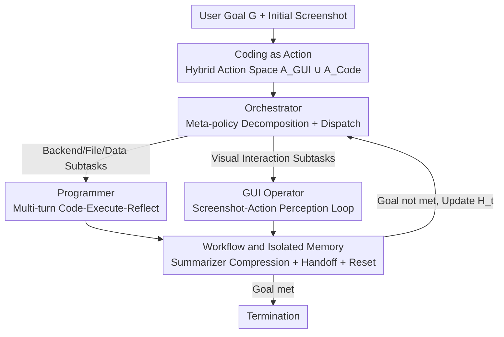

# CoAct-1: Computer-using Multi-agent System with Coding Actions

**Conference**: ICLR2026  
**OpenReview**: [https://openreview.net/forum?id=l1MQVgIKEU](https://openreview.net/forum?id=l1MQVgIKEU)  
**Code**: https://github.com/SalesforceAIResearch/CoAct-1  
**Area**: Agent / Computer-Using Agent / Multi-Agent System  
**Keywords**: Computer-using Agent, Coding Actions, Multi-agent, GUI Operations, Task Decomposition

## TL;DR
CoAct-1 treats "writing and executing code" as a first-class action alongside GUI clicking. It utilizes an Orchestrator to dynamically assign subtasks to a Programmer (proficient in Python/Bash) or a GUI Operator (capable of screen interaction). This approach pushes the success rate to 60.8% on OSWorld (52.5% on WindowsAgentArena) while reducing the average number of steps to 10.15.

## Background & Motivation

**Background**: Current computer-using agents predominantly follow a pure GUI route—relying on vision-language-action models to perceive screenshots and output mouse clicks and keyboard inputs to complete tasks step-by-step. To handle complex tasks, mainstream approaches (such as GTA-1 and Agent S2.5) overlay a high-level planner to decompose user goals into a sequence of sub-goals.

**Limitations of Prior Work**: The issue is that even with a planner, **all actions must still be executed via the GUI**. Many operations are inherently unsuitable for screen clicking: locating a specific sheet in a multi-sheet spreadsheet, filtering by complex criteria, and copying results to a CSV; or finding all images in nested directories, batch resizing them, and archiving them. Performing these tasks via "click and drag" is both tedious and fragile—visual grounding can easily misidentify similar icons/menus, and error probabilities accumulate in long sequences where a single misclick can cause the entire task to fail.

**Key Challenge**: High-level planning can improve the decomposition of "what to do," but **it cannot change the "how to do" execution foundation**. As long as the execution layer is restricted to the low-level GUI action space $A_{\text{GUI}}$, planning uncertainty, visual perception errors, and the connection issues between high-level planning and low-level action generation will persist.

**Goal**: To provide agents with a more flexible and reliable action space, allowing background operations that could be "solved with a single line of script" to avoid long, error-prone GUI clicking sequences.

**Key Insight**: Human computer use is naturally hybrid—using command lines/scripts when possible and clicking the interface only when necessary. Based on this, the authors propose **coding as a system interaction action**, coexisting with GUI actions, where a high-level controller dynamically selects the modality based on the nature of the subtask.

**Core Idea**: Replace redundant and fragile GUI actions with "coding actions"—forming a hybrid action space $A = A_{\text{GUI}} \cup A_{\text{Code}}$, and implementing the decision-making of "when to code vs. when to click" as a hierarchical strategy via a triple-agent system (Orchestrator / Programmer / GUI Operator).

## Method

### Overall Architecture

To solve the problem of "pure GUI execution being slow and fragile," CoAct-1 models computer operation as a hierarchical decision process. At the top is an **Orchestrator** acting as a meta-policy $\pi_{\text{orch}}$. It does not interact directly with the OS but is responsible for decomposing the user goal $G$ into subtasks and selecting an executor for each. At the bottom are two specialized executors—the **Programmer** (implementing $\pi_{\text{Code}}$, writing Python/Bash scripts to interact with the OS backend) and the **GUI Operator** (implementing $\pi_{\text{GUI}}$, perceiving screenshots and clicking the interface). After each subtask, the executor's detailed interaction history is compressed into a brief report by a summarizer, which is sent back to the Orchestrator along with the latest screenshot to update its high-level history $H_t$ and decide the next step or termination.

Formally, at each time step $t$, the agent observes environment $o_t \in O$ (primarily screenshots) and takes action $a_t \in A$ according to policy $\pi(a_t \mid H_t, G)$, where $H_t = (o_1, a_1, \dots, o_{t-1}, a_{t-1}, o_t)$ is the historical context. The key modification is expanding the action space from $A_{\text{GUI}}$ to $A_{\text{GUI}} \cup A_{\text{Code}}$—an action in $A_{\text{Code}}$ is a script that directly manipulates the OS backend, compressing file/data processing into a single, robust step.

### Key Designs

**1. Coding as a First-Class Action: Replacing Fragile GUI Sequences with a Hybrid Action Space**

This design directly addresses the pain point of "long and error-prone pure GUI execution." Instead of summarizing APIs or SDKs for every app/website, the authors allow the agent to perform **free-form coding** guided by strong language models. The action space is explicitly split into $A = A_{\text{GUI}} \cup A_{\text{Code}}$: $a_t \in A_{\text{GUI}}$ represents direct manipulations of the graphical interface like clicks and typing; $a_t \in A_{\text{Code}}$ is a Python or Bash script interacting directly with the OS backend. For tasks like "finding images in nested directories and batch processing them," a single script can compress dozens of clicks into one reliable execution, fundamentally bypassing visual grounding ambiguity and error accumulation. Its effectiveness is evident in the ablation: tasks solved by the Programmer alone averaged only **1.14 steps**, demonstrating the "directness" of coding actions.

**2. Triple-Agent Hierarchical Strategy: Orchestrator Dispatching to Programmer and GUI Operator**

The hybrid action space introduces a new problem—who decides whether a subtask should be coded or clicked? This design materializes the hierarchical policy $\pi$ via three agents with distinct roles. The **Orchestrator** is the high-level meta-policy $\pi_{\text{Orch}}$, performing task decomposition and dynamic planning based on the full observation history $H_t$ and goal $G$. It selects $\pi_{\text{Code}}$ or $\pi_{\text{GUI}}$ for the current subtask and, upon completion, receives an execution report and new screenshot $o_{t+1}$ to determine termination. The **Programmer** implements $\pi_{\text{Code}}$, engaging in multi-turn dialogues with a code interpreter: generating scripts $\rightarrow$ interpretation $\rightarrow$ reflection and revision based on results, until the subtask is resolved. The Orchestrator feeds it context like file paths and window information inferred from $H_t$. The **GUI Operator** is a vision-language-action model implementing $\pi_{\text{GUI}}$, generating single GUI actions in a "perception-action" loop until subtask completion. While the action granularity differs—scripts for the Programmer vs. atomic clicks for the GUI Operator—both are unified under the Orchestrator's scheduling.

**3. Workflow and Isolated Memory: Summarizer for Handoff and Memory Reset**

Multi-agent coordination risks context contamination and the Orchestrator being overwhelmed by irrelevant details. This design manages information flow through a structured workflow and hierarchical isolated memory. In the workflow, after the Orchestrator dispatches a subtask, the chosen executor generates a detailed interaction history. Upon completion, a **dedicated summarizer model** compresses this history into a brief report (capturing key actions and final results), which is returned to the Orchestrator as a "concentrated update" to its high-level history $H_t$. For memory, a **hierarchical + isolated** structure is used: the Orchestrator maintains the long-term master memory ($H_t$), while the Programmer and GUI Operator maintain short-term working memories (instance history) valid only during the subtask. Their dialogue histories are **not shared**, and an executor's working memory is **immediately cleared** once it reports back—this reset mechanism allows executors to focus on the new subtask without interference from previous interactions.

### Mechanism Example

Consider a cross-app task: "Filter a specific sheet in a multi-sheet spreadsheet based on criteria, export as CSV, and confirm the result." The Orchestrator first splits the goal into two subtasks: "Locate and process spreadsheet data" and "Confirm/open results in the interface." Since the first involves filtering and exporting, the Orchestrator assigns it to the Programmer. The Programmer interacts with the code interpreter—writing scripts to read/filter data and export to CSV, reflecting and revising if errors (like incorrect paths) occur—until successful. This entire process counts as very few high-level steps (averaging 1.14 steps for code-only tasks). The summarizer then returns a report: "CSV exported to path X." For the second subtask requiring visual interaction, the Orchestrator assigns the GUI Operator, which clicks to open the file for verification. Upon receiving both reports, the Orchestrator terminates. Coding actions replaced a long sequence of fragile spreadsheet clicks, explaining why CoAct-1 completes OSWorld tasks in an average of 10.15 steps.

### Loss & Training

CoAct-1 is a **training-free system-level orchestration framework** that does not introduce new learnable parameters. It calls existing strong models and builds the multi-agent system using AG2 (AutoGen). Specifically: the Orchestrator uses OpenAI o3, the Programmer uses o4-mini, the GUI Operator uses OpenAI computer-use-preview, and the summarizer uses o4-mini. Budget limits are set at $I=20$ maximum turns for the Programmer, $K=25$ maximum steps for the GUI Operator, and $J=15$ maximum turns for the Orchestrator. Thus, the system interaction upper bound is roughly 375 steps (though early stopping usually occurs before 150 steps).

## Key Experimental Results

### Main Results

Evaluation was conducted on two real-world OS testbeds: OSWorld (369 tasks) and WindowsAgentArena (154 tasks). Success is determined via rule-based Boolean expressions comprising 134 atomic executable clauses.

| Benchmark | Metric | CoAct-1 | Prev. SOTA | Gain |
|-----------|--------|---------|------------|------|
| OSWorld (150 steps) | Success Rate | **60.76%** | Agent S2.5 w/ o3 55.98% | +4.78 |
| OSWorld (100 steps) | Success Rate | 59.93% | Agent S2.5 55.98% | Exceeds all baselines' final values |
| WindowsAgentArena (100 steps) | Success Rate | **52.5%** | Agent S2 29.8% | +22.7 |
| OSWorld | Avg. Steps/Success | 10.15 | GTA-1 15.22 / UI-TARS 14.90 | More efficient |

By domain, the advantages of coding are most prominent in categories where programmatic control is most effective: OSWorld Office 64.80%, OS 75.00%, and Multiple Apps 47.87%; WindowsAgentArena Windows System 83.3% and Windows Utils 77.7%.

### Ablation Study

| Configuration | OSWorld Avg. | Avg. Steps | Description |
|---------------|--------------|------------|-------------|
| Programmer Only (Pure Code) | 35.73 | 1.14 | Extremely fast, but low ceiling as many tasks require GUI |
| GUI Operator Only (Pure GUI) | 50.68 | 11.20 | Wider task coverage but slower |
| Full CoAct-1 (Hybrid) | **60.76** | 10.15 | Synergistic modalities, both accurate and efficient |

Backbone sensitivity (Table 3): With GUI Operator fixed as CUA 4o, using o4-mini for both Orchestrator/Programmer yielded only 43.43%; replacing both with o3 increased success to 58.72%; the optimal heterogeneous configuration was o3 (Orchestrator) + o4-mini (Programmer) at 60.76%.

### Key Findings
- **Hybrid > Either Single Modality**: Pure Code (35.73%) and Pure GUI (50.68%) combined reach 60.76%, proving the modalities are complementary—coding handles backend files/data while GUI handles visual navigation.
- **Efficiency Couples with Success Rate**: While CUA 4o is more step-efficient (6.14), its success rate is only 31.40%. CoAct-1's low step count represents "effective efficiency" rather than "task abandonment."
- **More Steps Increase Failure Risk**: Figure 3d shows failure rates correlate positively with required actions; using scripts to compress steps inherently reduces error opportunities.
- **High-level Roles Benefit Most from Model Capability**: Allocating strong models to the Orchestrator and Programmer (roles with high reasoning demand) yields the highest gains, validating the modular "compute as needed" design.

## Highlights & Insights
- **Elevating "Coding" to a First-Class Action**: This is the core "aha" moment—instead of summarizing APIs for every app, the agent is allowed to write Python/Bash freely to manipulate the OS backend, replacing long click sequences with one script and fundamentally avoiding visual grounding ambiguity.
- **Dynamic Modality Selection Over Binary Choice**: The Orchestrator dynamically dispatches between coding and GUI based on subtask nature, gaining script precision while retaining GUI versatility. This scheduling logic is transferable to any agent system with heterogeneous tools.
- **Summarizer + Memory Reset Logic**: Using a dedicated model to compress histories and resetting executor memory solves context contamination in multi-agent systems—a reusable multi-agent orchestration trick.
- **Training-free, Plug-and-play**: Achieving SOTA simply by orchestrating off-the-shelf strong models (o3 / o4-mini / CUA) proves that significant gains come from "action space design" rather than just "retraining a model."

## Limitations & Future Work
- Performance is **highly sensitive** to the backbone model capability of the Orchestrator/Programmer—switching to weaker models (o4-mini) drops results from 60.76% to 43.43%, indicating a strong dependency on top-tier closed-source reasoning models.
- The framework relies entirely on OpenAI closed-source models, and performance on open-source backbones remains unverified.
- Coding actions execute scripts directly on the OS backend, posing **safety/accidental deletion risks** in real environments; the paper does not deeply discuss sandboxing or safety constraints.
- Evaluation is focused on preset tasks in OSWorld/WindowsAgentArena; stability in open-ended, long-term real-world workflows remains to be seen; the 35.73% ceiling for pure coding suggests many tasks still inevitably depend on fragile GUI interactions.

## Related Work & Insights
- **vs. Pure GUI / End-to-End Native Agents (UI-TARS, OpenCUA, CUA 4o)**: These unify perception-reasoning-action into a single model with a GUI-only space; CoAct-1 expands the action space and uses hierarchical scheduling, leading significantly in Office/OS/Multi-app tasks by "changing the action space" rather than just the model.
- **vs. Modular Planner-Grounders (GTA-1, Agent S2.5, Jedi)**: These focus on "where and how to click" through test-time scaling or Mixture-of-Grounding, but the execution base remains GUI. CoAct-1 bypasses GUI for certain subtasks via scripts, showing the most improvement in programmatic tasks.
- **vs. Hybrid Agentic Frameworks (UFO-2, PyVision, BeyondBrowsing, ALITA)**: These also dynamically combine tools/APIs. CoAct-1 shares the "dynamic tool construction" philosophy but focuses on "free coding as a universal system action" synergized with GUI modalities, positioning it closer to general computer automation.

## Rating
- Novelty: ⭐⭐⭐⭐ Merging "coding as a first-class action" with GUI modalities via dynamic multi-agent fusion is a clear, solid solution to pure GUI pain points.
- Experimental Thoroughness: ⭐⭐⭐⭐⭐ SOTA on two benchmarks + step budget decomposition + single-modality ablation + backbone sensitivity + efficiency analysis.
- Writing Quality: ⭐⭐⭐⭐ Motivation and hierarchical design are well-explained; safety and open-source backbone discussions are relatively brief.
- Value: ⭐⭐⭐⭐⭐ Achieves SOTA and efficiency gains through training-free orchestration, offering practical insights for computer-using agent design.

<!-- RELATED:START -->

## Related Papers

- [\[ICLR 2026\] PixelCraft: A Multi-Agent System for High-Fidelity Visual Reasoning on Structured Images](pixelcraft_a_multi-agent_system_for_high-fidelity_visual_reasoning_on_structured.md)
- [\[ICLR 2026\] From What to Why: A Multi-Agent System for Evidence-based Chemical Reaction Condition Reasoning](from_what_to_why_a_multi-agent_system_for_evidence-based_chemical_reaction_condi.md)
- [\[ICLR 2026\] MAC-AMP: A Closed-Loop Multi-Agent Collaboration System for Multi-Objective Antimicrobial Peptide Design](mac-amp_a_closed-loop_multi-agent_collaboration_system_for_multi-objective_antim.md)
- [\[AAAI 2026\] AgentODRL: A Large Language Model-based Multi-agent System for ODRL Generation](../../AAAI2026/multi_agent/agentodrl_a_large_language_model-based_multi-agent_system_fo.md)
- [\[AAAI 2026\] LungNoduleAgent: A Collaborative Multi-Agent System for Precision Diagnosis of Lung Nodules](../../AAAI2026/multi_agent/lungnoduleagent_a_collaborative_multi-agent_system_for_precision_diagnosis_of_lu.md)

<!-- RELATED:END -->
