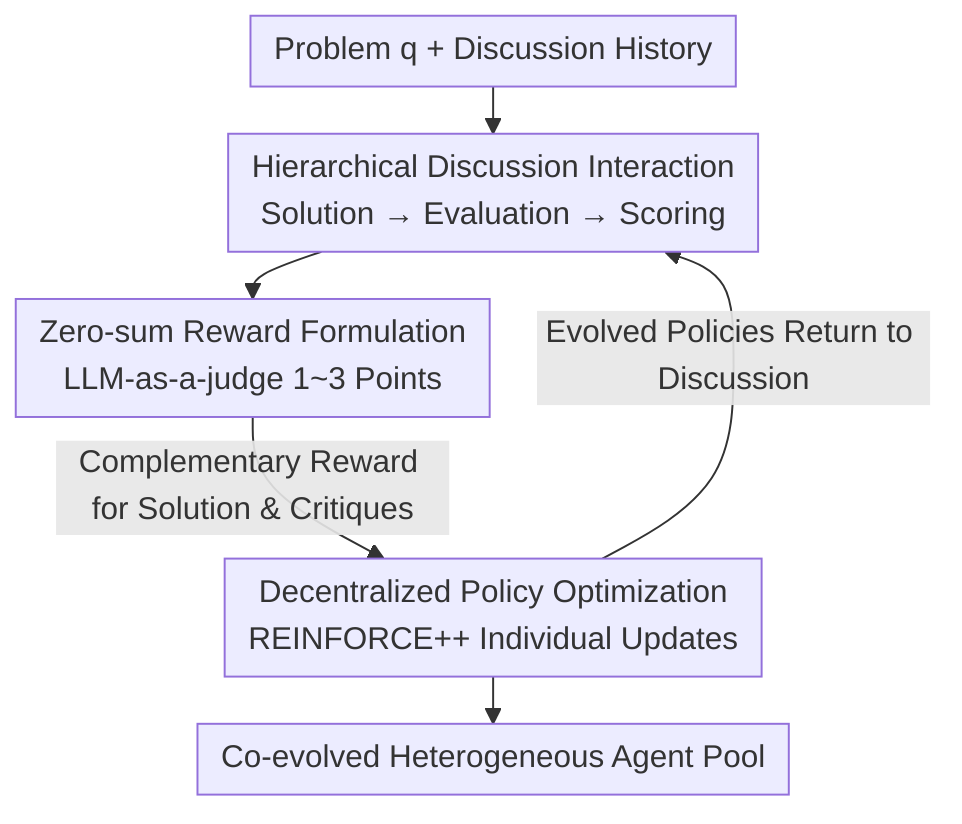

# CoMAS: Co-Evolving Multi-Agent Systems via Interaction Rewards

**Conference**: ICLR2026  
**OpenReview**: [https://openreview.net/forum?id=ihwAzktmWc](https://openreview.net/forum?id=ihwAzktmWc)  
**Code**: https://github.com/xxyQwQ/CoMAS  
**Area**: Multi-Agent / Agent Self-Evolution / Reinforcement Learning  
**Keywords**: Multi-Agent Systems, Self-Evolution, Interaction Rewards, LLM-as-a-judge, REINFORCE++

## TL;DR
CoMAS enables multiple LLM agents to propose solutions, critique, and score each other within a forum-like discussion environment. These discussion dynamics are converted into intrinsic reward signals via LLM-as-a-judge, which are then used to update individual policies through RL, achieving decentralized and scalable collaborative self-evolution without relying on external verifiers or reward models.

## Background & Motivation
**Background**: Enabling LLM agents to continue improving after pre-training (self-evolution) is a core topic in current agent research. Early approaches were RL-free, such as expanding external knowledge bases, integrating multiple agents, optimizing task workflows, or introducing symbolic learning—none of which modify model parameters, leaving the capability ceiling capped by the base model. Recent research has shifted toward RL-based methods: either relying on **external rewards** (rule verifiers, dedicated reward models) or extracting **intrinsic rewards** from the model itself (self-certainty, confidence, semantic entropy, majority voting pseudo-labels).

**Limitations of Prior Work**: External reward methods require tasks to be verifiable with existing reward signals, rendering them inapplicable to open-ended problems. Intrinsic reward methods, while free from external supervision, are essentially **single-model self-rewarding**—where a model scores its own output. This often leads to self-reinforcing high-confidence predictions and avoiding low-probability regions, which diverges significantly from the evolutionary mechanisms of human intelligence.

**Key Challenge**: Human intelligence is not evolved by perfect individuals through introspection but is a **collective phenomenon**—individuals learn and improve through mutual discussion, collaboration, and criticism without an external oracle judging every contribution. Existing RL self-evolution methods lock "rewards" at the single-model level, missing the evolutionary path of "learning from peer interaction" that humans rely on most.

**Goal**: To answer whether LLM agents can achieve self-evolution **purely through agent-to-agent interactions** within a multi-agent system, similar to humans, without any external reward signals. This requires solving three sub-problems: how to organize interactions to produce valuable learning signals, how to extract credible rewards from pure discussions, and how to apply these rewards to the policy updates of heterogeneous agents.

**Key Insight**: The authors draw inspiration from the discussion forms of technical communities like Reddit, GitHub, or Stack Overflow—where some propose solutions, others point out flaws, and others provide ratings. This hierarchical, decentralized "solution-critique-scoring" discussion naturally contains signals of correctness without needing an external judge.

**Core Idea**: Use the discussion dynamics generated by agent interactions as the source of intrinsic rewards (interaction rewards). Design the solver and critic roles as a **zero-sum game**, and use RL to let each agent individually absorb lessons from the interaction, achieving decentralized, heterogeneous, and scalable co-evolution.

## Method

### Overall Architecture
The goal of CoMAS is: given a pool of LLM agents, let them repeatedly discuss problems in a shared environment, turn the discussion itself into training signals, and ultimately improve each agent through RL. The system is built on an "interactive multi-agent workflow" consisting of three serial stages: **Interaction** to generate dialogue data, **Reward Formulation** to extract signals from discussion history and assign them to actions, and **Policy Optimization** to update each agent's weights using RL algorithms.

The system maintains an agent pool $U=\{u_1,\dots,u_l\}$, where each agent $u_k$ has its own policy $\pi_{\theta_k}$. Crucially, **heterogeneity** is allowed: different agents can be based on different base models without sharing a backbone. An interaction is abstracted as a policy mapping an input prompt $p$ to a response $o=\pi_{\theta_k}(p)$. For a given problem $q$, interaction unfolds over $m$ rounds: in each round, one agent proposes a solution $s_i$ based on the discussion history $h_q$, then $n$ evaluators $\{e_{i,j}\}$ critique the solution. The solution and critiques are appended to $h_q$ for subsequent rounds (history is compressed to the last $\kappa$ rounds to prevent context explosion). Simultaneously, each "solution-critique" pair $(s_i,e_{i,j})$ undergoes a scoring step to produce $\tau_{i,j}$, specifically for generating rewards. The speaker for each step is sampled **uniformly at random** $u_k\sim\text{Uniform}(U)$ to ensure equal opportunity and balanced training load across agents.

### Key Designs

**1. Hierarchical Discussion Interaction: Decoding "Solution-Critique-Scoring" into Reusable Patterns**

This step addresses the weakness of single-model self-rewarding signals. CoMAS defines three interaction modes based on community discussions. **Solution**: Given problem $q$ and history $h_q$, the agent generates $s_i=u_k(q,h_q)$. **Evaluation**: Given $q, h_q,$ and a solution $s_i$, the agent produces a critique $e_{i,j}=u_k(q,h_q,s_i)$—here the agent is **explicitly prompted to find potential flaws rather than agree**, specifically to mitigate the common "catering bias" in LLMs and align with the subsequent zero-sum reward design. **Scoring**: Given $q, s_i, e_{i,j}$, the agent outputs a score $\tau_{i,j}=u_k(q,s_i,e_{i,j})$ in a fixed format. Scoring is an **interaction mode independent of the discussion**—it serves only for reward generation and is not added to the discussion history to avoid contaminating future turns. This generates $m$ solutions, $m \cdot n$ critiques, and $m \cdot n$ scores per problem, forming rich trainable trajectories.

**2. Zero-sum Interaction Rewards: Turning Solvers and Critics into Opponents**

To convert discussions into numerical rewards, CoMAS uses LLM-as-a-judge to parse scores into integers $\hat\tau_{i,j}=\text{Extract}(\tau_{i,j})\in\{1,2,3\}$. The semantics are: 3 for a correct solution where the critique was unhelpful/wrong; 2 for a largely correct solution with minor flaws noted; 1 for a solution with fatal errors caught by the critique. Scores are normalized to calculate **complementary rewards**:

$$r(s_i)=\frac{\hat\tau_{i,j}-1}{2},\qquad r(e_{i,j})=1-r(s_i)=\frac{3-\hat\tau_{i,j}}{2}$$

This creates a **zero-sum game**: the more correct the solution, the higher the solver's reward and the lower the critic's; the more incorrect the solution (if caught), the critic wins. This forces solvers to be accurate and critics to find real issues. A separate format penalty is applied to the scoring action: 0 for correct extraction, -1 otherwise:

$$r(\tau_{i,j})=\begin{cases}0,&\tau_{i,j}\in\{1,2,3\}\text{ successful extraction}\\-1,&\text{otherwise}\end{cases}$$

Giving the scorer a 0 reward (rather than positive) is intentional—it encourages format compliance while keeping the scorer **neutral**, preventing it from manipulating scores for its own gain and stabilizing the training.

**3. Decentralized Policy Optimization: REINFORCE++ with Token-level Credit Assignment**

Since CoMAS features **multiple interaction modes** rather than multiple rollouts of the same prompt, standard GRPO is not a natural fit. Instead, **REINFORCE++** is used. Each agent $u_k$ collects interactions where it acted as solver, critic, or scorer into its own replay buffer $D_k=\{(p,o,r(o))\}$. Training is **decentralized**, allowing heterogeneous agents to evolve without a shared backbone bottleneck. Advantages utilize token-level credit assignment: the trajectory reward $r(o)$ minus a cumulative KL penalty to prevent distribution shift:

$$A_t=r(o)-\beta\sum_{\lambda=t}^{|o|}\log\frac{\pi_{\theta_k}(o_\lambda|p,o_{<\lambda})}{\pi_{\text{ref}}(o_\lambda|p,o_{<\lambda})}$$

Advantages are standardized within the batch $\hat A_t=(A_t-\text{Mean})/(\text{Std}+\epsilon)$ for stability, followed by a clipped surrogate objective (PPO-style) with importance sampling ratio $\rho_t(\theta_k)=\pi_{\theta_k}/\pi_{\text{old}}$.

### Main Results
Evaluation was conducted across 7 benchmarks (GSM8K, MATH-500, HumanEval, MBPP, SciBench, GPQA, MMLU) and 4 reasoning setups (Vanilla, Consistency, AutoGen, Debate), comparing against untrained models, SRLM, MAPoRL, and TTRL.

| Setup | Metric/Benchmark | Untrained | CoMAS | Best Baseline |
|-------|-----------|-----------|-------|----------------|
| Vanilla | GSM8K | 84.00 | **85.40 (+1.40)** | MAPoRL 84.80 |
| Vanilla | HumanEval | 68.90 | **70.73 (+1.83)** | MAPoRL 69.51 |
| Consistency | HumanEval | 73.78 | **77.44 (+3.66)** | MAPoRL 75.61 |
| AutoGen | GSM8K | 52.60 | **72.40 (+19.80)** | SRLM 58.00 |
| AutoGen | MMLU | 37.40 | **50.60 (+13.20)** | SRLM 42.40 |
| Debate | HumanEval | 71.34 | **77.44 (+6.10)** | MAPoRL 74.39 |

Key Observations: In the single-agent setup, CoMAS consistently outperforms the base model and rivals MAPoRL (which relies on external verifiers). **In multi-agent setups, the advantage widens**—in the AutoGen setup, TTRL collapses (GSM8K -11.60, HumanEval -16.46), while CoMAS achieves significant gains across all benchmarks. Even without external rewards, CoMAS reaches SOTA or near-SOTA performance.

### Ablation Study

| Configuration | Phenomenon | Explanation |
|------|------|------|
| Full CoMAS | Reward stabilizes ~0.5 | Adversarial design maintains stable training |
| w/o Evaluation | Reward **decreases** from ~0.8 | Agents become overly strict judges, signals fail, performance drops below untrained |
| w/o Scoring | Reward **climbs to 1.0** | Reward hacking: all agents give full marks to everything |

Removing either Evaluation or Scoring causes performance to drop below the untrained baseline, proving that **adversarial zero-sum rewards** are critical to CoMAS's success, rather than just any reward signal.

### Key Findings
- **Scalability (Quantity)**: Performance increases monotonically as the number of agents $l$ goes from 1 to 4, especially in Consistency and Debate setups.
- **Scalability (Diversity)**: A **heterogeneous** pair (Qwen2.5-3B and Llama-3.2-3B) consistently outperforms homogeneous pairs, showing that CoMAS effectively utilizes the knowledge complementarity of different base models.
- **Training Dynamics**: Average response lengths grow steadily (indicating improved reasoning), and normalized rewards converge to ~0.5, confirming the adversarial rewards provide a stable training environment.

## Highlights & Insights
- **Shifting Reward Source from Introspection to Group Interaction**: This is the core "Aha!" moment—since self-rewarding is prone to self-looping, the zero-sum game between solver and critic creates a self-regulating signal that avoids collapse without external verifiers.
- **Clever Neutral Scoring**: Assigning 0 reward for scoring ensures the judge follows the format while remaining neutral, preventing the "manipulated referee" problem common in LLM-as-a-judge setups.
- **Decentralization + Heterogeneity**: Agents training independently on separate backbones makes this paradigm highly practical for real-world heterogeneous teams.
- **Evolutionary Guidance**: The finding that performance scales with agent diversity suggests that diverse peers themselves serve as a free source of supervision.

## Limitations & Future Work
- **Small Base Model Scale**: Primary experiments used 3B models; scalability to much larger models remains to be fully explored.
- **Reasoning Task Focus**: The tasks are strictly limited to math, code, and science; the validity of this "community discussion" paradigm in open-ended social collaboration is unverified.
- **Dependence on Scoring Quality**: Reward signals rely on the base model's ability to distinguish between 1-3 points; a poor scorer might provide misleading feedback.
- **Interactive Overhead**: Training costs scale with the number of agents and discussion rounds.

## Related Work & Insights
- **vs. External Reward RL (MAPoRL, etc.)**: These rely on rule verifiers; CoMAS generates rewards internally, allowing it to handle non-verifiable open tasks at the cost of being limited by LLM-as-a-judge quality.
- **vs. Intrinsic Reward RL (SRLM, TTRL, etc.)**: These use single-model signals like self-certainty; CoMAS upgrades "self-reflection" to "peer-review zero-sum games," avoiding the collapse seen in methods like TTRL under multi-agent settings.
- **vs. Static/Dynamic MAS**: Prior work focused on collective reasoning via topology; CoMAS focuses on the **evolution of individual agents** within the pool through interaction.

## Rating
- Novelty: ⭐⭐⭐⭐⭐ Shifting self-evolution rewards from introspection to zero-sum multi-agent interaction is a significant paradigm shift.
- Experimental Thoroughness: ⭐⭐⭐⭐ Extensive benchmarks across 4 setups and scalability tests, though larger models and real-world scenarios are missing.
- Writing Quality: ⭐⭐⭐⭐⭐ Clear framework, clean derivation of zero-sum rewards, and insightful ablation of failure modes.
- Value: ⭐⭐⭐⭐ A decentralized, heterogeneous, and external-reward-free co-evolution paradigm with clear implications for MAS research.

<!-- RELATED:START -->

## Related Papers

- [\[ACL 2026\] LLM-Based Human-Agent Collaboration and Interaction Systems: A Survey](../../ACL2026/multi_agent/llm-based_human-agent_collaboration_and_interaction_systems_a_survey.md)
- [\[ICML 2026\] Representational Similarity and Model Behavior in Multi-Agent Interaction](../../ICML2026/multi_agent/representational_similarity_and_model_behavior_in_multi-agent_interaction.md)
- [\[ICLR 2026\] DoVer: Intervention-Driven Auto Debugging for LLM Multi-Agent Systems](dover_intervention-driven_auto_debugging_for_llm_multi-agent_systems.md)
- [\[ICLR 2026\] Aligned Agents, Biased Swarm: Measuring Bias Amplification in Multi-Agent Systems](aligned_agents_biased_swarm_measuring_bias_amplification_in_multi-agent_systems.md)
- [\[NeurIPS 2025\] Multi-Agent Collaboration via Evolving Orchestration](../../NeurIPS2025/multi_agent/multi-agent_collaboration_via_evolving_orchestration.md)

<!-- RELATED:END -->
