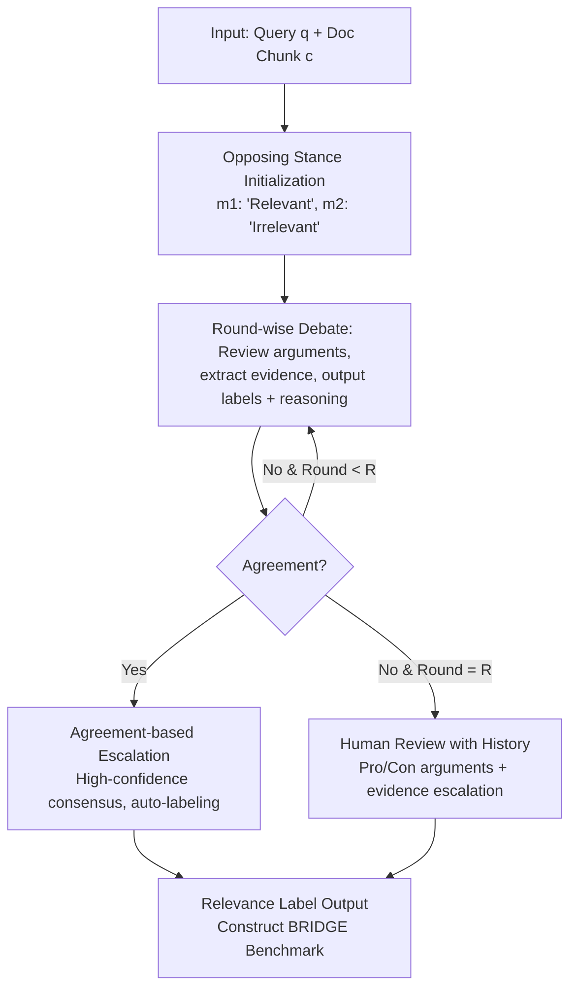

# Completing Missing Annotation: Multi-Agent Debate for Accurate and Scalable Relevance Assessment

**Conference**: ICLR 2026  
**arXiv**: [2602.06526](https://arxiv.org/abs/2602.06526)  
**Code**: [GitHub](https://github.com/DISL-Lab/DREAM-ICLR-26)  
**Area**: Other  
**Keywords**: Information Retrieval Evaluation, Multi-Agent Debate, Relevance Annotation, Human-AI Collaboration, BRIDGE Benchmark

## TL;DR

Ours proposes DREAM—a multi-agent multi-round debate framework based on opposing stance initialization for IR relevance annotation: automated labeling upon agreement, and escalation to humans (assisted by debate history) upon disagreement. It achieves 95.2% balanced accuracy with only 3.5% human intervention. Using this, the BRIDGE benchmark was constructed, identifying 29,824 missing relevance annotations (428% of the original), correcting retrieval system ranking biases and the retrieval-generation performance mismatch in RAG.

## Background & Motivation

**Background**: Information retrieval (IR) evaluation relies heavily on manual query-chunk relevance judgments. However, due to high annotation costs, only a small number of documents are labeled in practice, leading to many unlabeled relevant documents—so-called "holes"—being treated as irrelevant by default. These holes introduce systematic bias into evaluation results, as some retrievers are undervalued for retrieving relevant but unannotated documents.

**Limitations of Prior Work**:

1.  **Overconfidence of fully automated LLM labeling**: Single-agent LLMJudge achieves a balanced accuracy of only 73.9%, primarily due to a significant deficiency in recall for the irrelevant class (50.2%)—tending excessively toward a "relevant" judgment.
2.  **Low efficiency of confidence-based human-in-the-loop methods**: Methods like LARA use LLM token probabilities for uncertainty estimation, but calibration is poor—requiring 50% human intervention to match the accuracy DREAM achieves at 3.5% intervention.
3.  **Cascading impact of holes**: Holes in IR benchmarks not only distort retrieval system rankings but also lead to a mismatch between retrieval and generation performance in RAG evaluations—where strong retrieval is misidentified as poor, and good generation results are wrongly attributed to internal model knowledge.
4.  **Intrinsic limitations of single-agent judgment**: Regardless of how fine-tuned the confidence calibration is, a single-model perspective cannot overcome systematic bias.

**Key Challenge**: The need for high-accuracy annotation methods with low manual costs. Fully automated methods are insufficiently accurate (73.9%), while confidence-based hybrid methods are unreliably calibrated and still require significant human effort.

**Core Idea**: Replace single-agent judgment with multi-agent debate. Two agents are initialized with opposing stances $\rightarrow$ multi-round mutual critique $\rightarrow$ agreement = high-confidence automated annotation (a signal more reliable than single-model confidence) $\rightarrow$ disagreement = escalation to humans (aided by debate history).

## Method

### Overall Architecture

DREAM replaces the single-agent "final word" with multi-round debates between two opposing agents: Agent $m_1$ is assigned a "relevant" stance $s_1$, and $m_2$ is assigned an "irrelevant" stance $s_2$. In each round, they review each other's arguments, extract evidence sentences, and produce new labels and reasoning. If both agents reach the same label in any round, it is treated as a high-confidence consensus for automated annotation. If they still disagree after the maximum number of rounds, the case is escalated to humans along with the debate history. The logic can be expressed as:

$$
\text{DREAM}(q,c) = \begin{cases} y_1^j, & \exists j \leq R \text{ s.t. } y_1^j = y_2^j \\ \text{Human}(q, c, h^R), & \text{otherwise} \end{cases}
$$

where $R$ is the maximum number of debate rounds (default 2), and $h^R$ is the final round's debate history.

### Key Designs

**1. Opposing Stance Initialization: Forcing conflict to reveal errors behind premature consensus**

Single-agent and even neutral-initialized multi-agent systems suffer from the LLM's overconfident tendency to judge items as "relevant." If both parties start from a neutral position, they often reach a quick but incorrect consensus. DREAM instead pins $m_1$ and $m_2$ to "relevant" and "irrelevant" extremes, forcing each agent to dig deep for evidence supporting their stance while actively questioning the opponent. This brings conflicting evidence to the surface that would otherwise be obscured, ensuring both possibilities are fully argued before convergence. Ablations show that the sequence of stance assignment does not affect results, indicating the benefit comes from the conflict itself rather than an advantage of one side going first.

**2. Agreement-based Escalation: Using consensus as the escalation signal instead of single-model confidence**

Methods like LARA rely on LLM token probabilities to estimate uncertainty, but this calibration is inherently unreliable. To achieve high accuracy, they must permit high levels of manual intervention—at 3.5% escalation, LARA's bAcc is only 82.1%. DREAM uses multi-agent consistency as a quality signal: agreement leads to auto-labeling, while disagreement leads to escalation. This requires neither manual tuning of escalation thresholds nor training calibration models on human data. At the same 3.5% intervention rate, this signal pushes bAcc directly to 95.2%, validating the core hypothesis that "agreement is more trustworthy than confidence."

**3. Debate History Empowered Human Review: Transforming escalation from "AI giving up" to a structured hand-off**

Cases escalated to humans are often the most difficult boundary samples. If annotators start from raw documents, quality and consistency are hard to guarantee. DREAM provides annotators with the agents' arguments, extracted evidence sentences, and complete reasoning. Annotators can then adjudicate by reviewing the structured pro/con confrontation. In experiments, human annotation bAcc assisted by debate history rose from 87.3% to 92.0%, and inter-annotator agreement (Fleiss' κ) improved from 0.50 to 0.62. Debate history serves both to help agents converge efficiently and as leverage for the human phase, achieving true AI-human collaboration.

## Key Experimental Results

### Main Results: Annotation Accuracy and Escalation Rate

| Method | Irrelevant Recall | Relevant Recall | bAcc | Escalation Rate |
| :--- | :--- | :--- | :--- | :--- |
| LLMJudge | 50.2% | 97.5% | 73.9% | 0.0% |
| LARA (3.5%) | 74.5% | 89.6% | 82.1% | 3.5% |
| LARA (12.5%) | 76.1% | 91.6% | 83.9% | 12.5% |
| LARA (50%) | 94.1% | 98.4% | 96.3% | 50.0% |
| Human-Only (MTurk) | 89.9% | 97.8% | 93.8% | 100.0% |
| **Ours (DREAM)** | **91.9%** | **98.4%** | **95.2%** | **3.5%** |

DREAM achieves 95.2% bAcc with 3.5% manual intervention, surpassing the 93.8% of Human-Only. LARA requires 50% intervention to reach a similar level.

### Ablation Study: Debate Rounds and Adjudication Strategy

| Setting | Adjudicator | Irrelevant Recall | Relevant Recall | bAcc |
| :--- | :--- | :--- | :--- | :--- |
| DREAM (R=1) | LLM | 82.9% | 97.2% | 90.0% |
| DREAM (R=2) | LLM | 90.0% | 96.7% | 93.3% |
| DREAM (R=3) | LLM | 90.8% | 95.7% | 93.2% |
| **DREAM (R=2)** | **Human** | **91.8%** | **98.4%** | **95.1%** |

Two rounds of debate are sufficient for saturation (no extra gain at R=3). Human adjudication (95.1%) is significantly better than LLM adjudication (93.3%), validating the AI-human collaboration strategy.

### BRIDGE Benchmark Construction

| Metric | Value |
| :--- | :--- |
| Total Annotations | 116,622 |
| Auto-annotated (Agent Agreement) | 112,566 (96.5%) |
| Human-annotated (Agent Disagreement) | 4,056 (3.5%) |
| Missing relevant chunks discovered (holes) | **29,824** |
| Original gold chunks | 6,976 |
| Holes as % of original | **428%** |
| Human annotation cost | ~$506 |
| Comparison to Human-Only | 200x cheaper |
| Comparison to Human-Only | 3.5-7x faster |

### Key Findings: Impact of Holes on Retrieval Ranking

| Metric | Original Benchmark | BRIDGE | Change |
| :--- | :--- | :--- | :--- |
| Average Hole@10 | 17.1% | Corrected | Eliminated |
| System Ranking Change | - | 20/25 systems | Significant |
| RAGAlign@10 (Avg) | 0.70 | **0.84** | +0.14 |
| RAGAlign Pearson Correlation | - | **0.985** | Highly aligned |

After correcting for holes, the retrieval-generation alignment (RAGAlign) improved from 0.70 to 0.84, with a Pearson correlation of 0.985. This proves that previous retrieval-generation mismatches in IR evaluations were partly due to systematic underestimation of retrieval metrics.

## Highlights & Insights

-   **Core Insight: Agreement > Confidence**: Multi-agent consistency is a more reliable quality signal than single-model confidence. LARA requires 14 times more human effort to match DREAM's accuracy because LLM confidence calibration is inherently unreliable.
-   **Dual Value of Debate History**: Not only does it help agents converge efficiently within 2 rounds, but it also serves as an auxiliary resource that improves human annotation quality from 87.3% to 92.0%—realizing true AI-human synergy rather than a simple "fall back to human" approach.
-   **Impact of 29,824 Holes**: The original benchmark had only 6,976 gold annotations. The missing annotations discovered by DREAM are 428% of the original, implying systematic bias exists in the evaluation of mainstream IR benchmarks.
-   **New Explanation for Retrieval-Generation Mismatch**: Previously attributed to conflict between "external and internal knowledge," this paper reveals another overlooked cause: retrieval performance itself was underestimated.

## Limitations & Future Work

-   Increasing the number of agents actually reduces accuracy (harder to reach consensus on relevant cases).
-   The evaluation set scale of 700 pairs is relatively limited.
-   Dependence on Llama3.3-70B; performance may need re-validation with different models.
-   Debate might still fail to resolve extremely ambiguous boundary cases.

## Rating

-   Novelty: ⭐⭐⭐⭐ Combination of multi-agent debate and agreement-based escalation.
-   Experimental Thoroughness: ⭐⭐⭐⭐⭐ Comprehensive ablation + BRIDGE construction + retrieval reranking + RAG alignment analysis.
-   Writing Quality: ⭐⭐⭐⭐⭐ Clear structure with progressive problem definition and motivation.
-   Value: ⭐⭐⭐⭐⭐ Significant advancement in IR evaluation methodology + practical impact of the BRIDGE benchmark.

<!-- RELATED:START -->

## Related Papers

- [\[AAAI 2026\] iMAD: Intelligent Multi-Agent Debate for Efficient and Accurate LLM Inference](../../AAAI2026/multi_agent/imad_intelligent_multi-agent_debate_for_efficient_and_accura.md)
- [\[AAAI 2026\] Scalable and Accurate Graph Reasoning with LLM-Based Multi-Agents](../../AAAI2026/multi_agent/scalable_and_accurate_graph_reasoning_with_llm-based_multi-agents.md)
- [\[ICLR 2026\] Multi-Agent Debate with Memory Masking (MAD-M²)](multi-agent_debate_with_memory_masking.md)
- [\[ICLR 2026\] MAD-Logic: Multi-Agent Debate Enhances Symbolic Translation and Reasoning](mad-logic_multi-agent_debate_enhances_symbolic_translation_and_reasoning.md)
- [\[NeurIPS 2025\] 3D-Agent: Tri-Modal Multi-Agent Collaboration for Scalable 3D Object Annotation](../../NeurIPS2025/multi_agent/3d-agenttri-modal_multi-agent_collaboration_for_scalable_3d_object_annotation.md)

<!-- RELATED:END -->
