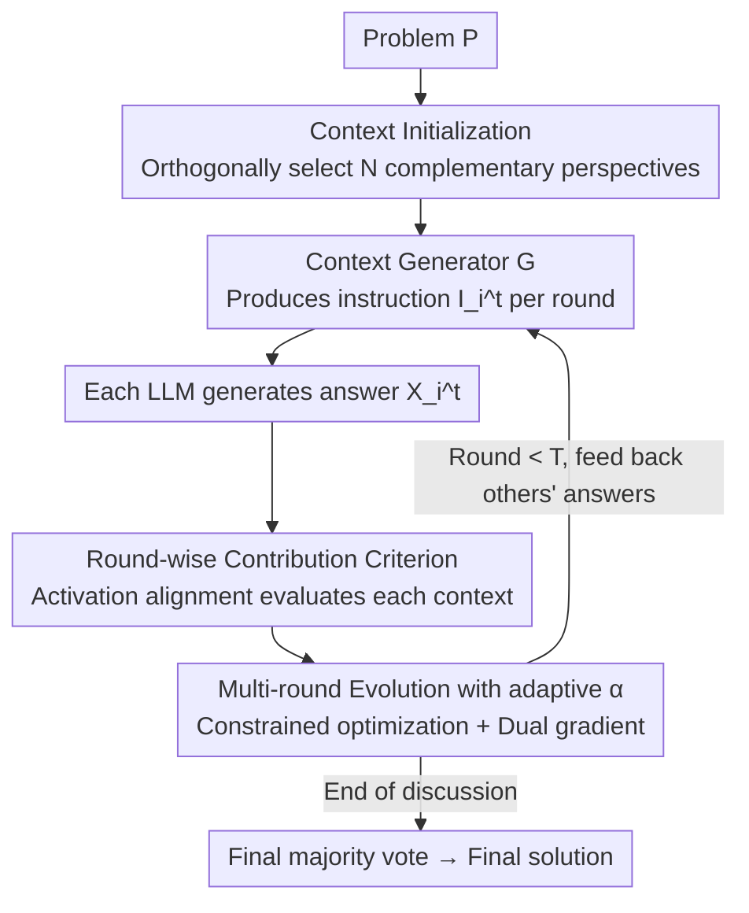

# Context Learning for Multi-Agent Discussion

**Conference**: ICLR2026  
**OpenReview**: [https://openreview.net/forum?id=EUu8TILWpR](https://openreview.net/forum?id=EUu8TILWpR)  
**Code**: https://github.com/HansenHua/M2CL-ICLR26  
**Area**: Multi-Agent / LLM Collaboration  
**Keywords**: Multi-agent discussion, in-context learning, consensus alignment, self-adaptive balance, MAD

## TL;DR
M2CL learns a "context generator" for each LLM in Multi-Agent Discussion (MAD), allowing round-wise instruction contexts to be automatically organized and refined based on discussion progress. This approach prevents early convergence on "majority noise" while gradually aligning multiple LLMs toward the correct consensus, outperforming existing methods by 20%–50% across 9 benchmarks.

## Background & Motivation
**Background**: Multi-Agent Discussion (MAD) enables multiple LLM instances to collaborate on problem-solving through structured debate. Typical approaches assign pre-defined "perspectives" via context/role instructions and facilitate iterative exchange of previous answers until consensus is reached (e.g., Debate, DyLAN, GPTSwarm, MacNet). This "society of mind" paradigm is expected to expand the solution space and improve reasoning accuracy.

**Limitations of Prior Work**: The authors identify a prevalent issue of **discussion inconsistency** in existing MAD—most LLM instances fail to agree on a coherent solution, and collective decisions are often dominated by noise rather than principled reasoning. A multi-step geometric proof example (Fig. 1) illustrates that even when one agent derives a correct intermediate conclusion, other agents may fail to absorb it despite having the conclusion in their extended context, instead repeating flawed derivations or providing contradictory arguments.

**Key Challenge**: The root cause is **context misalignment**, manifested in two ways. First, pre-assigned roles/context instructions provide a coarse understanding of the task, being rigid, incomplete, or biased, which misguides individual LLM reasoning. Second, these contexts offer little guidance on "how to fuse information exchanged between LLMs," thus failing to guide the discussion toward a coherent solution. In short, static preset contexts do not evolve with the discussion nor enforce the utilization of others' conclusions.

**Goal**: The research aims to answer the question: "How can we obtain contexts that continuously guide multi-LLM discussions toward the correct consensus?" Manually modifying instructions as discussion progresses is impractical; therefore, a learning mechanism is required to **let contexts automatically evolve with intermediate discussion results**. The challenges are: (i) how to evaluate the contribution of an LLM's context to the final solution; (ii) how to simultaneously control consistency between LLMs (inter-agent) and across rounds for an individual LLM (intra-agent).

**Core Idea**: Learn a **context generator** $G_{\theta_i}$ for each agent. In each round, it automatically generates the current instruction context based on the task goal, its initial instructions, and the previous answers of other LLMs. A "self-adaptive balance mechanism" is employed to navigate the trade-off between "enforcing consistency" and "preserving diversity"—preventing premature convergence on majority noise while aligning towards the correct consensus.

## Method

### Overall Architecture
M2CL transforms MAD contexts from "manually preset static strings" into "learnable, dynamically generated instructions." Formally, the context for the $i$-th LLM in round $t$ consists of three parts: the task goal $P$ (constant), the concatenated previous answers of all other LLMs $\bar{X}^{t-1}_i$ (serving as cross-LLM interaction memory), and the current instruction context $I^t_i$. The key innovation lies in the third part: instead of static roles, instructions $I^t_i = G_{\theta_i}([P; I^b_i; \bar{X}^{t-1}_i])$ are generated online. Given $C^t_i = [I^t_i, \bar{X}^{t-1}_i, P]$, each LLM $\phi_i$ outputs $X^t_i$. After $T$ rounds, a majority vote on the final outputs determines the result.

The method is driven by Theorem 4.1. The authors use attention activations $a(\cdot)$ to measure context and prove that the "total distance between the correct answer activation $a_c$ and the sum of context activations" is upper-bounded by two parts: one part is the **variance among LLM activations + deviation from initial context** (minimized via evolution), and the other part **depends only on initial contexts** (minimized via "orthogonal and complementary" initialization). This naturally splits the method into **two phases**: context initialization to ensure diverse perspectives, followed by context evolution to reduce divergence into consensus.

### Key Designs

**1. Context Initialization: Laying the Foundation with Near-Orthogonal Multi-Perspective Instructions**

To address rigid roles and insufficient exploration due to overlapping perspectives, Theorem 4.1's second term $\min_\omega \lVert a_c - \sum_i \omega_i a(C^b_i)\rVert$ shows that if initial activations are **orthogonal**, they form a "basis" that better approximates the correct activation. Initialization is formulated as selecting a set $I^b$ from a candidate pool such that their linear combination best reconstructs the target activation $a_c$ (Eq. 7). Since the activation matrix dimension greatly exceeds the number of selected contexts $N$, "optimal reconstruction" naturally forces a set of near-orthogonal, non-redundant directions.

As $a_c$ is unavailable at initialization, activations are projected into a latent space $f(\cdot)$, and the "problem sentence vector $v_P$" serves as a proxy for the target (Eq. 9–10). A lightweight mapping $F(\cdot)$ is distilled to project $[I^b_i; P]$ into the problem space (Eq. 11–12) to avoid high computational costs.

**2. Round-wise Contribution Criterion: Measuring Contribution via Activation Alignment**

Evaluating context contribution is difficult. Relying solely on the final solution leads to sparse and unstable training, while using "answer correctness" as the only metric penalizes LLMs that provide critical insights without arriving at the final answer themselves. The authors propose a round-wise criterion (Eq. 13): $\max_{j\in[N]} \{-\alpha\lVert C^t_i - C^b_i\rVert - \lVert a(C^t_i) - a(C^t_j)\rVert\}$. The first term preserves the reasoning capability from initialization, while the second uses **activation differences** to encourage alignment between LLMs.

To avoid the bias of concurrent optimization, a **per-LLM surrogate criterion** is designed (Eq. 14): $-\alpha\lVert C^t_i - C^b_i\rVert - \lVert a([I^t_i,P]) - a([X^{t-1}_i,P])\rVert$. The second term enforces temporal coherence between the "current instruction" and "own previous answer." Lemma C.1 proves that the sum of this criterion across all LLMs upper-bounds the sum of Eq. 13.

**3. Multi-round Evolution with Adaptive $\alpha$: Dynamic Balancing between Consistency and Diversity**

To solve the difficulty of manually tuning $\alpha$, the authors treat the adjustment of context relative to the initial state $\lVert C^t_i - C^b_i\rVert \le \beta$ as a constraint. This is transformed into a constrained optimization problem (Eq. 16) and solved using its dual form. The dual variable $\alpha$ is updated via approximate dual gradient descent (Eq. 17).

$\alpha$ thus becomes **self-adaptive**: in early discussion stages with high divergence, $\alpha$ decreases to relax the constraint, guiding the generator to push the context toward convergence. Once consensus is approached, $\alpha$ stabilizes to prevent premature convergence and maintain multi-perspective depth.

### Loss & Training
The core training involves alternating dual gradients: $L(\theta_i) = \lVert a(G_{\theta_i}(P,I^b_i,\bar{X}^{t-1}_i)) - a(X^{t-1}_i)\rVert + \alpha\lVert C^t_i - C^b_i\rVert$ updates the generator, and $L(\alpha_i) = \alpha_i(\beta - \lVert G_{\theta_i}(\cdot) - C^b_i\rVert)$ updates the dual variable. Initialization involves projection loss (Eq. 10) and distillation loss (Eq. 11).

## Key Experimental Results

### Main Results
Covering 3 categories across 9 datasets: reasoning (MMLU / MATH / GPQA / HumanEval-Code), embodied agents (ALFWorld / SciWorld / GAIA / PDDL), and mobile GUI (AndroidWorld). Baselines include Single, Best-of-N, Debate, DyLAN, GPTSwarm, and MacNet. Base models include Qwen-2.5 (7B/14B/72B), Llama-2, and Qwen2.5-VL for GUI.

| Config | Method | MMLU | MATH | GPQA | Code | GAIA | PDDL |
|------|------|------|------|------|------|------|------|
| Qwen-7B | BoN | 74.2 | 24.9 | 36.4 | 62.5 | 21.1 | 26.3 |
| Qwen-7B | DyLAN | 74.3 | 26.7 | 35.4 | 63.4 | 18.4 | 23.4 |
| Qwen-7B | **Ours** | **92.5** | **47.8** | **66.1** | **80.3** | **33.6** | **34.7** |
| Qwen-72B | DyLAN | 91.5 | 63.1 | 51.6 | 80.4 | 40.4 | 45.5 |
| Qwen-72B | MacNet | 83.8 | 52.9 | 46.2 | 70.5 | 46.4 | 53.7 |
| Qwen-72B | **Ours** | **95.1** | **72.5** | **78.9** | **90.7** | **67.2** | **70.5** |

M2CL consistently leads across all 9 datasets, with particularly significant gains in complex multi-round tasks like GPQA (+33.0 on Qwen-72B) and GAIA (+26.0). Notably, BoN often outperforms basic MAD baselines, suggesting that fixed contexts can actually hinder convergence and collaborative reasoning.

### Ablation Study

| Config | Observation | Explanation |
|------|------|------|
| Full M2CL | Optimal | Complete method. |
| w/o Context Initialization | Significant drop | Difficulty in differentiation and coordination without high-impact initial perspectives. |
| w/o $\alpha$ tuning | Drop | Early consensus reached at the expense of creativity and diversity. |
| w/o Context Evolution | Drop | Lack of collaborative guidance; failure to leverage others' outputs. |

### Key Findings
- **High Efficiency**: Performance gains of >20% were achieved with runtime overhead <10% (Fig. 3) due to the lightweight generator.
- **Better MAD Scaling Law**: M2CL performance grows logarithmically with agent count (up to 64) and improves significantly more than baselines before saturating.
- **Sweet Spot for Constraint $\beta$**: If $\beta$ is too small, discussion remains inconsistent; if too large, answers become naively uniform and lack depth.
- **Faster Convergence of Discrepancy**: The discrepancy intensity $\max_{i,j}\lVert a_i - a_j\rVert_2$ decreases faster in M2CL than other methods.
- **Transferability**: Generators trained on one model provide consistent gains when transferred to stronger LLMs without retraining.

## Highlights & Insights
- **Redefining "Context"**: Transforming contexts from static strings to learnable dynamic objects moves the MAD bottleneck from prompt engineering to in-context learning.
- **Activation-based Consistency**: Using attention activations instead of token embeddings captures deeper reasoning representations, being more robust to surface linguistic variations.
- **Surrogate Criterion Elegance**: Replacing global inter-agent coupling with local temporal coherence (Eq. 14) resolves the bias of stale snapshots while remaining theoretically bounded to the global objective.
- **Self-adaptive $\alpha$ via Duality**: By deriving $\alpha$ as a dual variable, the model eliminates manual hyperparameter tuning while maintaining theoretical consistency.

## Limitations & Future Work
- **Computational Inefficiency**: Current MAD relies on a large number of LLM instances; future work could focus on capturing specific expertise rather than relying on sheer volume.
- **White-box Dependency**: The method requires access to and differentiable operations on attention activations, making it less applicable to black-box API models.
- **Ethical Risks**: Bias in initialization or errors in consensus building could be amplified, requiring caution in high-risk domains like law or medicine.
- **Future Directions**: Combining temporal coherence with explicit role expertise modeling or introducing task-difficulty-aware constraint scheduling.

## Related Work & Insights
- **vs Debate (Du et al., 2023)**: Debate uses preset contexts which are static and provide no guidance on information fusion; M2CL addresses this by evolving context per round.
- **vs DyLAN (Liu et al., 2024)**: DyLAN focuses on topological optimization through scoring; M2CL complements this by optimizing the context content within the agents.
- **vs GPTSwarm (Zhuge et al., 2024)**: GPTSwarm optimizes the prompt and graph as a one-shot process; M2CL provides round-wise adaptive adjustments based on the discussion state.
- **vs Single-LLM Context Learning**: Methods like ProRefine focus on individual feedback; M2CL extends this to multi-agent alignment by guiding each LLM to utilize others' intermediate results.

## Rating
- Novelty: ⭐⭐⭐⭐⭐ Attributing MAD inconsistency to context misalignment and solving it via learnable generators and dual adaptation is highly original.
- Experimental Thoroughness: ⭐⭐⭐⭐⭐ Comprehensive evaluation across 9 datasets, multiple model sizes, scaling, efficiency, and transferability.
- Writing Quality: ⭐⭐⭐⭐ Clear progression from motivation to theorem to method, though the dual derivation is dense.
- Value: ⭐⭐⭐⭐⭐ Large gains with low overhead and high transferability make this highly valuable for multi-agent system deployment.

<!-- RELATED:START -->

## Related Papers

- [\[ICML 2026\] CoOT: Learning to Coordinate In-Context with Coordination Transformers](../../ICML2026/multi_agent/coot_learning_to_coordinate_in-context_with_coordination_transformers.md)
- [\[NeurIPS 2025\] The PokeAgent Challenge: Competitive and Long-Context Learning at Scale](../../NeurIPS2025/multi_agent/the_pokeagent_challenge_competitive_and_long-context_learning_at_scale.md)
- [\[ICLR 2026\] AgentPO: Enhancing Multi-Agent Collaboration via Reinforcement Learning](agentpo_enhancing_multi-agent_collaboration_via_reinforcement_learning.md)
- [\[ICLR 2026\] Adaptive Collaboration with Humans: Metacognitive Policy Optimization for Multi-Agent LLMs with Continual Learning](adaptive_collaboration_with_humans_metacognitive_policy_optimization_for_multi-a.md)
- [\[ICLR 2026\] Learning to Summarize by Learning to Quiz: Adversarial Agentic Collaboration for Long Document Summarization](learning_to_summarize_by_learning_to_quiz_adversarial_agentic_collaboration_for_.md)

<!-- RELATED:END -->
