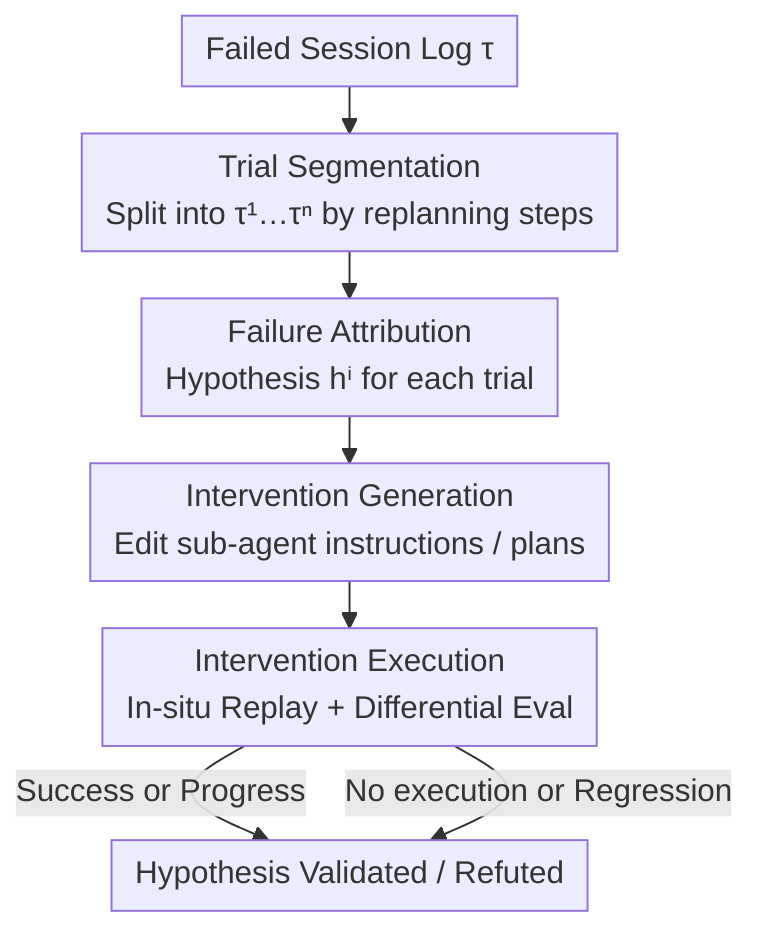

# DoVer: Intervention-Driven Auto Debugging for LLM Multi-Agent Systems

**Conference**: ICLR2026  
**OpenReview**: [https://openreview.net/forum?id=mrEK16Jy6h](https://openreview.net/forum?id=mrEK16Jy6h)  
**Code**: https://aka.ms/DoVer (Open source promised by the paper, subject to official release)  
**Area**: LLM Multi-Agents / Agent Debugging / Failure Attribution  
**Keywords**: Multi-agent systems, Auto debugging, Failure attribution, Intervention verification, Counterfactual replay

## TL;DR
DoVer upgrades the "log attribution" debugging paradigm for LLM multi-agent systems from "guessing the faulty agent/step" to "targeted intervention and replay verification" (Do-then-Verify). By segmenting failure trajectories into multiple trials, proposing hypotheses for each, and rewriting orchestrator instructions or plans for in-situ replay with milestone scoring, it successfully flips 18–28% of failure cases in GAIA / AssistantBench and achieves a 49% flip rate on GSMPlus.

## Background & Motivation
**Background**: LLM-driven multi-agent systems (e.g., Magentic-One, AutoGen) are increasingly deployed in production, making debugging their failures a necessity. Here, "failure" means the system completes the task but yields incorrect or unsatisfactory results rather than crashing. The current mainstream approach is "log-based failure attribution": feeding the entire conversation log to an LLM to identify the "decisive error" (defined as: a step where changing the action to the correct one would lead to subsequent success). A representative dataset is Who&When (WW).

**Limitations of Prior Work**: Upon replicating the WW protocol, the authors identified two fundamental flaws. First, **log-only attribution remains an "untested hypothesis"**—the model may pinpoint "step 53," but without actually modifying and rerunning it, the correctness of the attribution cannot be verified. Second, **single-step/single-agent attribution is an ill-posed problem**: modern agents use ReAct-style "plan-execute" loops where a single session contains multiple trials, each with its own decisive errors. Furthermore, when an orchestrator gives vague instructions and a sub-agent executes them incorrectly, the responsibility is ambiguous (Inter-Agent Misalignment).

**Key Challenge**: The "gold standard labels" for attribution are inherently uncertain. The authors re-annotated 29 GAIA cases from WW and found that 14 exhibited GT uncertainty (matching the 15–30% annotator uncertainty reported in WW). On these 14 uncertain cases, GPT-4o's step attribution accuracy was only 24%, compared to 44% on the 15 certain cases—indicating that low accuracy is largely driven by noisy labels. Continually optimizing the "attribution accuracy" metric is thus a misguided direction.

**Goal + Key Insight**: Instead of approximating an inherently unreliable "correct attribution," a more outcome-oriented evaluation perspective should be adopted—asking not "is the attribution correct?" but "did the system eventually fix the failure or make quantifiable progress toward success?"

**Core Idea**: Replace "read-only log attribution" with "explicit intervention + replay verification." Treat attribution as an **experimentally testable hypothesis**: perform a targeted edit (modify messages/plans) at the suspected failure point, preserve the preceding context, and re-execute from the intervention point. Success validates the hypothesis, while failure refutes it.

## Method

### Overall Architecture
DoVer (Do-then-Verify) is a debugging pipeline that transforms "failure attribution hypotheses" into "controlled edits" to verify if they change the outcome. The input is a failed agent session log $\tau = \{(a_t, m_t, \sigma_t)\}_{t=1}^{T}$ ($a_t$ is the active agent producing message $m_t$, $\sigma_t$ is stateful information for state recovery such as historical context or browsing history). The output includes several "counterfactual trajectories after intervention" and a verification judgment for each hypothesis.

The pipeline consists of four stages: **(1) Trial Segmentation**—splitting long logs into multiple trials $\tau^i$ using "replanning steps" as cut points; **(2) Failure Attribution**—generating a candidate hypothesis $h^i$ for each trial, marking the suspected step and agent; **(3) Intervention Generation**—transforming the hypothesis into executable edits $I^i$ for plans or messages; **(4) Intervention Execution**—replaying the trial in-situ, applying the intervention, and performing differential evaluation relative to the original trajectory using task success rates and progress scores. A single session can yield multiple hypotheses and interventions in parallel, reflecting the reality that many failures have multiple viable fixes.

### Key Designs

**1. Trial Segmentation: Transforming a "single failure" ill-posed problem into multiple independent sub-problems**

The authors found that single-step attribution is ill-posed because a single session contains multiple "plan-execute" loops. Trial segmentation defines a trial as a continuous interval starting from a planning step and extending through all execution steps of that plan. Using replanning steps as cut points, $\tau$ is split into several $\tau^i$. This shortens the context for LLM reasoning on a single causal chain and allows interventions to be executed independently and in parallel. Implementation relies on prompting the LLM to identify planning steps rather than hard-matching specific patterns, ensuring generalizability across different agent frameworks.

**2. Failure Attribution: Repurposing log attribution as a "hypothesis to be tested"**

For each trial $\tau^i$, DoVer generates a candidate attribution hypothesis $h^i = (\hat{a}^i_{\hat{t}}, r^i_{\hat{t}})$, where $\hat{t}$ is the attributed failure step, $\hat{a}^i$ is the suspected agent, and $r^i$ is the natural language reasoning. It adopts existing log attribution methods (specifically an "All-at-Once" prompt improved by the authors) adapted for segmented trials. The key shift is that **attribution precision is no longer strictly required** because correctness will be explicitly tested by the intervention stage.

**3. Intervention Generation: Orchestrator vs. Sub-agent classification with message-level edits**

To remain framework-agnostic, DoVer focuses on **orchestrator-level interventions via direct edits in the message-passing layer**. These are categorized into: ① **Modified instructions for sub-agents** (clarifying intent, correcting parameters, or adding missing context to indirectly influence sub-agent behavior); ② **Updated plans** (reordering, decomposing, or replacing steps to bypass identified failure points). This trade-off prioritizes universality over direct sub-agent capability enhancement (e.g., adding in-page search to a WebSurfer).

**4. Intervention Execution & Differential Evaluation: Counterfactual replay with milestone-based progress**

The agent system applies the intervention in-situ and replays, preserving all steps preceding the intervention. This produces a counterfactual trajectory $\tilde{\tau}_I = \{\tau_1, \dots, \tau_{i-1}, \tilde{\tau}_i\}$. To counter LLM stochasticity, each intervention is executed 3 times. Evaluation uses two sets of metrics:
The first set measures "Failure Flipping": **Trial Success Rate** and **Progress Made**. The latter uses $K \le 5$ milestones extracted from human-annotated solution steps. For a trajectory $\gamma$, milestones achieved is $A(\gamma) = \sum_{k=1}^{K} \mathbb{I}(\text{milestone } m_k \text{ achieved in } \gamma)$. Progress is the normalized difference:

$$\mathrm{Prog}(\tau \to \tilde{\tau}_I) = \frac{A(\tilde{\tau}_I) - A(\tau)}{K} \in [-1, 1].$$

The second set handles "Hypothesis Verification," classifying results into **Validated / Partially Validated / Refuted / Inconclusive**. "Inconclusive" is used when the system fails to faithfully execute the intervention instruction, making it unclear if the hypothesis was wrong or if the system was simply incapable.

## Key Experimental Results

### Main Results
Frameworks: Magentic-One (M1) and AutoGen2 (AG2). Datasets: WW-AB, WW-GAIA, GAIA-Level-1, and GSMPlus.

Failure Flipping Metrics (Table 2):

| Setting | Intervened Trials | Trial Success Rate | Progress Made |
|------|-----------|--------------------|---------------|
| WW-AB | 72 | 17.6% | +0% |
| WW-GAIA | 99 | 17.6% | +8.8% |
| GAIA-Level-1 | 63 | 27.5% | +15.7% |
| GSMPlus | 198 | 49.0% | — |

The 49% flip rate on GSMPlus demonstrates that the method generalizes across datasets and frameworks.

Hypothesis Verification Distribution (Table 3):

| Setting | Validated | Inconclusive | Partially Validated | Refuted |
|------|-----------|--------------|---------------------|---------|
| WW-AB | 15.3% | 66.7% | 4.2% | 13.9% |
| WW-GAIA | 16.2% | 57.6% | 5.1% | 21.2% |
| GAIA-Level-1 | 34.9% | 28.6% | 12.7% | 23.8% |

On complex WW tasks, ~60% fall into "Inconclusive" (difficulty in faithful intervention execution), while GAIA-Level-1 shows higher Validated/Refuted rates.

### Ablation Study

| Configuration | Intervened Trials | Trial Success Rate | Gain |
|------|-----------|--------------------|------|
| Qwen3-8B (0-shot) | 77 | 11.3% | Baseline for open-source |
| Qwen3-8B (3-shot) | 77 | 14.3% | Improved with examples |
| Qwen3-32B (0-shot) | 87 | 16.9% | Approaches GPT-4o |
| GPT-4o (0-shot) | 99 | 17.6% | Frontier model baseline |

### Key Findings
- DoVer does not rely on a single closed-source backend; Qwen3-32B (16.9%) performs nearly on par with GPT-4o.
- Smaller models benefit from few-shot prompting to generate better interventions.
- "Attribution accuracy" is heavily contaminated by noise in gold standards: GPT-4o achieved only 24% on uncertain cases vs. 44% on certain cases, validating the shift toward outcome-oriented evaluation.

## Highlights & Insights
- **Redefining Debugging as a Falsifiable Scientific Experiment**: Do-then-Verify transforms attribution from a subjective LLM assertion into an empirical counterfactual test.
- **Embracing the Ill-posed Nature of the Problem**: Rather than forcing a single point of failure, DoVer uses multiple trials and progress scores to provide a continuous measure of improvement.
- **Orchestrator-level Message Rewriting as a Primal Interface**: Editing at the message-passing layer ensures high compatibility across different agent frameworks at the cost of direct sub-agent skill enhancement.

## Limitations & Future Work
- **Message-only Intervention**: Cannot fix failures caused by inherent sub-agent capability gaps (e.g., missing features in a web driver).
- **High Inconclusive Rate**: In complex tasks, the system's failure to follow intervention instructions dilutes the verification signal.
- **Dependency on Milestone Labels**: Currently requires human-annotated steps for progress scoring; future work will explore using LLM-as-a-judge for direct trajectory comparison.

## Related Work & Insights
- **vs. Log Failure Attribution (Who&When)**: DoVer treats attribution as a hypothesis rather than ground truth, bypassing the uncertainty of "decisive error" labels.
- **vs. Human-in-the-loop Tools (AGDebugger)**: DoVer automates the rewind/edit/re-execute workflow found in manual debugging tools.
- **vs. AgentDebug**: DoVer specifically addresses the attribution ambiguity between orchestrators and sub-agents in multi-agent environments.

## Rating
- Novelty: ⭐⭐⭐⭐⭐ (Paradigm shift from attribution to verification)
- Experimental Thoroughness: ⭐⭐⭐⭐ (Cross-framework and cross-model, though small sample sizes)
- Writing Quality: ⭐⭐⭐⭐⭐ (Strong logical chain from problem analysis to solution)
- Value: ⭐⭐⭐⭐⭐ (A practical, automated mechanism for agent reliability)

<!-- RELATED:START -->

## Related Papers

- [\[ICLR 2026\] CellAgent: LLM-Driven Multi-Agent Framework for Natural Language-Based Single-Cell Analysis](cellagent_llm-driven_multi-agent_framework_for_natural_language-based_single-cel.md)
- [\[ACL 2026\] Seeing the Whole Elephant: A Benchmark for Failure Attribution in LLM-based Multi-Agent Systems](../../ACL2026/multi_agent/seeing_the_whole_elephant_a_benchmark_for_failure_attribution_in_llm-based_multi.md)
- [\[AAAI 2026\] Beyond Detection: Exploring Evidence-based Multi-Agent Debate for Misinformation Intervention and Persuasion](../../AAAI2026/multi_agent/beyond_detection_exploring_evidence-based_multi-agent_debate_for_misinformation_.md)
- [\[ICML 2026\] MASPO: Joint Prompt Optimization for LLM-based Multi-Agent Systems](../../ICML2026/multi_agent/maspo_joint_prompt_optimization_for_llm-based_multi-agent_systems.md)
- [\[ICLR 2026\] CoMAS: Co-Evolving Multi-Agent Systems via Interaction Rewards](comas_co-evolving_multi-agent_systems_via_interaction_rewards.md)

<!-- RELATED:END -->
