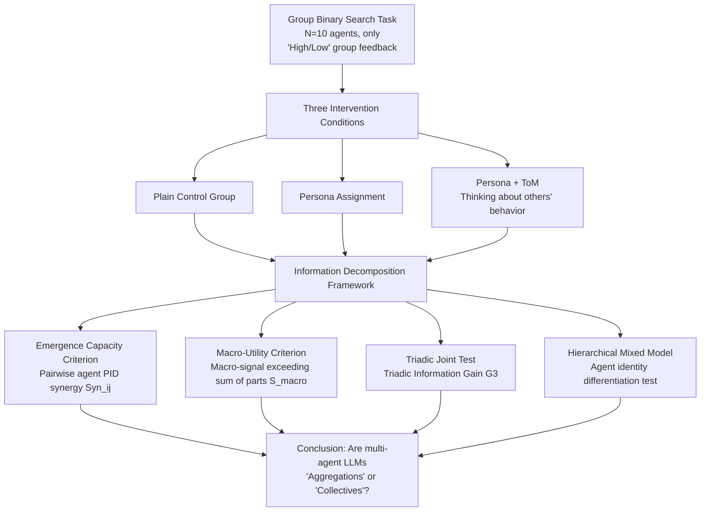

# Emergent Coordination in Multi-Agent Language Models

**Conference**: ICLR 2026  
**Code**: https://github.com/riedlc/AI-GBS  
**Area**: Multi-Agent Systems  
**Keywords**: Multi-agent coordination, emergence, partial information decomposition, Theory of Mind, collective intelligence

## TL;DR

This paper proposes a quantifiable framework based on Partial Information Decomposition (PID) and Time-Delayed Mutual Information (TDMI), proving that multi-LLM agent systems can leap from loose aggregations to true collectives with high-order coordination structures under appropriate prompting (Persona + ToM). It further reveals that the "Synergy $\times$ Redundancy" interaction is the critical mechanism for performance improvement.

## Background & Motivation

**Background**: Multi-agent LLM systems have frequently achieved results surpassing single agents in complex tasks such as software development and healthcare. The claim that "the whole is greater than the sum of its parts" has become a common assertion, with role differentiation (e.g., programmer, tester, CEO) serving as a mainstream design intuition.

**Limitations of Prior Work**: Existing work almost never answers a fundamental question—is the system a true "collective" or merely an average of multiple single-agent reasonings? Win-rate based evaluations cannot distinguish "synergistic emergence" from "mere redundant aggregation," nor can they quantify where agent complementarity actually originates.

**Key Challenge**: The alleged "synergistic effect" is neither falsifiable nor localizable—it remains unknown where coordination occurs between specific agents, whether it aligns with task goals, and how it might guide system design.

**Goal**: To establish a purely data-driven, falsifiable quantitative framework to measure whether and where dynamic emergence exists in multi-agent LLM systems and explore how to actively regulate emergent structures through prompt engineering.

**Key Insight**: By borrowing Partial Information Decomposition (PID) and Time-Delayed Mutual Information (TDMI) from information theory, "high-order structures" are operationalized as computable statistics, and rigorous null hypothesis comparisons are provided through permutation tests.

**Core Idea**: PID is used to decompose the predictive information of multi-agent systems into three components: "Redundancy + Uniqueness + Synergy." A synergy term $> 0$ provides evidence of emergence. Persona provides agents with stable identities, while ToM prompts transform identity differentiation into goal-aligned complementary roles.

## Method

### Overall Architecture

The framework consists of three information-theoretic measures and a hierarchical mixed model test, sequentially answering the progressive questions of "whether emergence exists → how emergence is maintained → whether roles are differentiated." All analyses are conducted on a minimalist Group Binary Search (GBS) task, with three prompting interventions (Plain / Persona / ToM) serving as causal variables.

### Key Designs

**1. Measuring Emergence Capacity via PID: Pinpointing Pairwise Synergy**

Simple mutual information cannot distinguish "redundant alignment" from "complementary synergy"—both make the system more predictable. This paper performs a two-source PID between the current state of agent pairs $(i, j)$ at $X_{i,t}, X_{j,t}$ and their joint future state $T_{ij,t+\ell} = (X_{i,t+\ell}, X_{j,t+\ell})$:

$$
I(\{X_{i,t}, X_{j,t}\}; T_{ij,t+\ell}) = UI_i + UI_j + Red_{ij} + Syn_{ij}
$$

Where $Syn_{ij} > 0$ indicates that predictive information about the joint future cannot be reconstructed from any single agent independently—this is the information-theoretic fingerprint of high-order structure. The median of all agent pairs is taken as the collective emergence capacity. Compared to direct mutual information, this design **surgically separates synergistic terms from redundant ones**, making "emergence capacity" a falsifiable independent statistic rather than a chaotic "better correlation."

**2. Macro-Utility Criterion and Triadic Joint Test: Goal-Aligned Emergence**

Emergence capacity only examines the dynamics between agent pairs without considering task relevance. The utility criterion directly focuses on the macro-signal $V_t$ (total group error):

$$
S_{macro}(\ell) = I(V_t; V_{t+\ell}) - \sum_{k=1}^{n} I(X_{k,t}; V_{t+\ell})
$$

A positive value indicates that the self-predictive ability of the macro-signal exceeds the sum of its parts, meaning emergence is goal-aligned. Furthermore, the triadic joint test uses

$$
G_3 = I_3 - \max(I_{2\{1,2\}}, I_{2\{1,3\}}, I_{2\{2,3\}})
$$

to measure how much extra predictive information about the macro-signal a triplet provides compared to the best agent pair, specifically excluding cases already explained by the optimal pair. Experiments found that under ToM conditions, Total Stability (the normalized value of $I_3$) is significantly greater than zero ($p = 2.9 \times 10^{-14}$), while triadic gain $G_3 \approx 0$, indicating that system stability is supported by dense pairwise alignment (Mean Field coupling) rather than more complex third-order structures—this aligns with the task structure where agents only receive group-level feedback and cannot observe each other directly.

**3. Causal Manipulation via Persona + ToM Prompting: From Noise to Steady-State Roles**

In the Plain condition, agent differentiation comes only from LLM randomness with no stable identity. Persona injects attributes such as names, professions, personality traits, and personal values into each agent, providing behavioral anchors; hierarchical mixed model tests show significant agent random intercept effects. ToM additionally instructs agents to "think about what other agents might do," utilizing public history as a coordination device (Common Ground) to amplify the slight asymmetries introduced by Persona into stable, self-reinforcing complementary roles. Regression analysis reveals that synergy and redundancy **interactively predict** success rate ($\beta = 0.24, p = 0.014$), while neither has a significant effect alone—performance improves significantly (approximately 27% amplification in each direction) only when goal-aligned redundancy and differentiation-complementary synergy coexist.

### Mechanism / Training Strategy

Sample entropy estimation uses the Jeffreys prior ($\alpha = 1/2$ pseudo-count Dirichlet smoothing) to handle sparse discrete data, with robustness comparisons against the Miller-Madow bias-corrected estimator. Permutation tests are divided into two types: row shuffling (breaking agent identity locks) corresponds to the null hypothesis that "identity differentiation does not exist," and column time-shift shuffling (preserving individual dynamics while breaking cross-agent alignment) corresponds to "dynamic alignment does not exist," ensuring strict control over false positive rates.

## Key Experimental Results

### Main Results (GPT-4.1, N=10, T=1, 200 groups per condition)

| Metric | Plain | Persona | Persona+ToM |
|------|-------|---------|-------------|
| Avg Success Rate | ~40% | ~40% | ~40% (No sig. diff) |
| Utility Criterion BC (Wilcoxon p) | $1.5\times10^{-16}$ | $6.6\times10^{-7}$ | 0.02 |
| Total Stability (BC, p) | 0.976 (≈0) | 0.858 (≈0) | $2.9\times10^{-14}$ (Significant) |
| Prop. of groups with sig. I3 > 0 | ~15% | ~20% | ~50% (Sig. higher) |
| Prop. of groups with sig. agent diff | ~20% | ~40% | ~60% |

### Cross-Model Generalization

| Model | Capability | Persona/ToM Emergence Enhancement | Special Failure Mode |
|------|---------|---------------------|-------------|
| GPT-4.1 | High | Significant | None |
| LLAMA 70B | High | Significant | None |
| Gemini 2.0 Flash | High | Significant | None |
| QWEN3 235B | Reasoning | Significant but Unstable | **Paralysis under coordination ambiguity** (Infinite CoT loops) |
| LLAMA 8B | Small | Insignificant | Unable to break oscillation, insufficient ToM |

### Ablation Study

| Configuration | Key Metric | Description |
|------|---------|------|
| Synergy alone | Does not predict success | Requires redundancy to be effective |
| Redundancy alone | Does not predict success | Requires synergy to be effective |
| Synergy $\times$ Redundancy Interaction | $\beta=0.24, p=0.014$ | Pairwise amplification of ~27% |
| Causal Mediation (ToM→Synergy→Success) | ACME=0.034, p=0.053 | Marginally significant, consistent direction |

### Key Findings

- Dynamic emergence exists across all conditions (utility criterion significantly positive), but quality varies: Plain and Persona groups remain in a "gaseous" non-aligned state, whereas ToM moves the system into stable attractors.
- Total Stability serves as a proxy for Lyapunov stability; ToM acts as the "control parameter" allowing the system to leap from chaotic zones to stable zones.
- Triadic gain $G_3 \approx 0$ (even under ToM) indicates that higher-order coordination is achieved through dense pairwise alignment rather than complex third-order locking—Mean Field dynamics dominate here.
- The reasoning model QWEN3 exhibits a unique failure mode: an infinite chain-of-thought loop under coordination ambiguity ("recursive mental modeling trap").

## Highlights & Insights

- **Methodological Contribution**: Transforms the "collective vs. aggregation" debate, previously discussed only qualitatively, into computable and falsifiable information-theoretic statistics. It achieves rigorous quantification in LLM multi-agent systems for the first time—approaching the "why" more closely than any benchmark win rate.
- **Counter-intuitive Synergy $\times$ Redundancy Interaction**: Optimizing synergy or redundancy in isolation is ineffective; they must co-occur. For agent system design, this implies agents must have both distinct identities (differentiation) and goal alignment (redundancy), echoing classic findings in human team research.
- **New Failure Mode for Reasoning Models**: QWEN3's "paralysis under coordination ambiguity" reveals a vulnerability that standard benchmarks do not touch—overthinking the intentions of others leads to system-level deadlocks, providing the first information-theoretic evidence of reasoning model limitations in multi-agent scenarios.

## Limitations & Future Work

- **Single Task (Group Binary Search)**: The task was specifically designed to be sensitive to complementary strategies; it remains unverified whether conclusions hold in more general scenarios.
- **Finite Sample Difficulties in Information Estimation**: Restricted by state-space discretization, emergence capacity can only be calculated for $k=2$ orders (pairwise); higher-order $k>2$ synergy is missed.
- **Endogeneity of Synergy and Performance**: Synergy and performance often appear synchronously; although the causal chain was controlled via mediation analysis, it only reached marginal significance.
- **No Absolute Team-over-Solo Advantage**: The framework focuses on conditional cross-agent coordination and does not claim that multi-agent systems are universally superior to single agents.

## Related Work & Insights

- **vs. Generative Agents (Park et al., 2023)**: The latter shows social emergence but lacks a quantitative framework; this paper provides tools to verify if high-order coordination truly exists in such systems.
- **vs. AgentVerse / ChatDev**: These systems intuitively assign roles but never test if role differentiation brings information complementarity. The analytical method here can be used to audit the coordination structure of any multi-agent system post-hoc.
- **vs. PID / TDMI Methods (Rosas et al., 2020; Mediano et al., 2022)**: This paper applies dynamic emergence theories from physics/neuroscience to LLM collective behavior for the first time, opening a new interdisciplinary direction.
- **Inspiration**: The two-step design of Persona + ToM (assign identity, then assign meta-cognition for "thinking about others") is the most concise prompt recipe for multi-agent coordination, worth reusing directly in engineering practice.

## Rating

- Novelty: ⭐⭐⭐⭐⭐ First systematic application of PID+TDMI dynamic emergence framework to LLM multi-agent systems.
- Experimental Thoroughness: ⭐⭐⭐⭐ Five models, 600+ experimental groups, multiple robustness tests, though limited to a single task category.
- Writing Quality: ⭐⭐⭐⭐ High readability with alternating theoretical frameworks and intuitive explanations.
- Value: ⭐⭐⭐⭐⭐ Provides actionable diagnostic tools and causal design principles for multi-agent systems.

<!-- RELATED:START -->

## Related Papers

- [\[ICLR 2026\] Multi-agent Coordination via Flow Matching](multi-agent_coordination_via_flow_matching.md)
- [\[ICLR 2026\] Cache-to-Cache: Direct Semantic Communication Between Large Language Models](cache-to-cache_direct_semantic_communication_between_large_language_models.md)
- [\[AAAI 2026\] LieCraft: A Multi-Agent Framework for Evaluating Deceptive Capabilities in Language Models](../../AAAI2026/multi_agent/liecraft_a_multi-agent_framework_for_evaluating_deceptive_capabilities_in_langua.md)
- [\[ACL 2026\] AgenticEval: Toward Agentic and Self-Evolving Safety Evaluation of Large Language Models](../../ACL2026/multi_agent/agenticeval_toward_agentic_and_self-evolving_safety_evaluation_of_large_language.md)
- [\[NeurIPS 2025\] Large Language Models Miss the Multi-Agent Mark](../../NeurIPS2025/multi_agent/large_language_models_miss_the_multi-agent_mark.md)

<!-- RELATED:END -->
