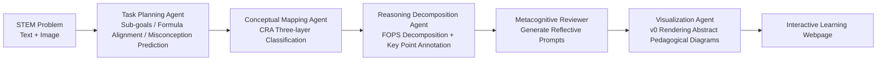

# From EduVisBench to EduVisAgent: A Benchmark and Multi-Agent Framework for Reasoning-Driven Pedagogical Visualization

**Conference**: ICLR 2026  
**OpenReview**: [https://openreview.net/forum?id=FVCpV04ZRe](https://openreview.net/forum?id=FVCpV04ZRe)  
**Code**: [github.com/aiming-lab/EduVisBench](https://github.com/aiming-lab/EduVisBench) / [github.com/aiming-lab/EduVisAgent](https://github.com/aiming-lab/EduVisAgent)  
**Area**: Multi-Agents / Educational Visualization / Foundation Model Evaluation  
**Keywords**: Educational Visualization, Multi-Agent Framework, Visual Reasoning Evaluation, STEM Education, LVLM  

## TL;DR
This paper proposes the EduVisBench benchmark (1,154 STEM problems + five-dimensional pedagogical scoring rubric) to systematically reveal the weakness of foundation models in "reasoning correctly but failing to draw effective pedagogical diagrams." It designs the EduVisAgent multi-agent framework featuring five collaborating experts to decompose abstract reasoning into human-cognition-aligned interactive web pages, achieving a 40.2% improvement over the strongest baseline.

## Background & Motivation
**Background**: Diffusion models and Large Vision-Language Models (LVLMs) have been widely applied in educational scenarios, but applications are almost entirely confined to textual interaction—providing text-based solution steps or classroom Q&A. However, in K-12 education, visualizing the solution process (illustrations, diagrams, interactive tools) is crucial for conceptual understanding, yet this capability lacks systematic evaluation.

**Limitations of Prior Work**: The authors identify three difficulties in generating "pedagogical visualizations": (1) decomposing complex reasoning into representable steps aligned with human cognition is inherently difficult; (2) generating precise visual aids that facilitate learning for each sub-step is challenging; (3) different disciplines (Math, Physics, Chemistry) require distinct visualization styles, making unified provision difficult. Empirical tests show that existing models often suffer from semantic misalignment between text and visuals, omitted key steps in diagrams, and structural inconsistency in code-generated figures, which increases learner confusion.

**Key Challenge**: Models "mostly calculate correctly" in textual reasoning but fail significantly when translating to visual representations. This reveals that **a single model architecture cannot simultaneously master the composite tasks of "reasoning decomposition + cognitive alignment + visual design."**

**Goal**: Establish a multi-dimensional, multi-difficulty benchmark to quantify foundation model weaknesses, then build a system that simulates the division of labor in expert pedagogical design to fill this gap.

**Core Idea**: **Evaluation First + Collaborative Division of Labor**. First, build EduVisBench to provide a five-dimensional pedagogical diagnosis. Then, use EduVisAgent to explicitly embed the roles of a "pedagogical design expert team" into an agent pipeline, where each expert handles one stage of instruction, ultimately synthesizing an interactive learning webpage.

## Method

### Overall Architecture
The work is divided into two halves: **EduVisBench for "Evaluation" and EduVisAgent for "Generation"**. The benchmark includes 1,154 STEM problems across Mathematics, Physics, and Chemistry, three difficulty levels, and 15 sub-domains. It requires models to produce interactive webpages or diagrams from text+visual inputs. Heterogeneous outputs (SVG/PNG/Webpage screenshots) are standardized via rasterization into images, which GPT-4o then scores from 0–5 across five pedagogical dimensions (total 25, normalized to a 100-point scale). EduVisAgent treats visualization as a two-stage process: first using a planning agent to reconstruct the problem into a structured pedagogical task (**Pedagogical Flow Construction**), then activating five expert agents to produce the webpage (**Collaborative Solution Generation**).

### Key Designs

**1. EduVisBench Benchmark: 5D pedagogical scoring transforms "looks okay" into quantifiable diagnosis.** Moving beyond binary correctness, this paper designs five pedagogical dimensions based on educational theory: Contextualization (problem situated in relevant contexts), Diagram Design (clarity, accuracy, and effectiveness of diagrams), Text-Visual Integration (mutual reinforcement of text and visuals), Reasoning Guidance (highlighting key thinking steps), and Interactivity (inviting active learner interaction/reflection). Each is scored 0–5. This rubric decomposes the vague concept of "pedagogical effectiveness" into independently evaluable sub-items. To ensure the reliability of GPT-4o auto-scoring, the authors compared 50 samples per subject with human scores from top-tier undergraduates, achieving an average cosine similarity of $0.9655$ and MSE of $0.5702$.

**2. Pedagogical Flow Construction: The planning agent "translates" problems into pedagogical tasks rather than solving them directly.** Feeding raw problems directly to models often results in missed logical dependencies. The Task Planning Agent performs four tasks: splitting the problem into coherent sub-goals, defining expected reasoning for each step, aligning steps with disciplinary principles or formulas, and predicting potential student misconceptions. This step reconstructs a "problem" into a "blueprint with pedagogical intent," providing a unified pedagogical foundation for downstream visual generation.

**3. Expert Collaboration: Explicitly assigning human pedagogical design roles to four downstream agents.** This is the core of the performance leap—each agent handles one link in the pedagogical chain with inter-dependency: the Conceptual Mapping Agent uses the Concrete-Representational-Abstract (CRA) model to classify information; the Reasoning Decomposition Agent applies the FOPS strategy (Find → Organize → Plan → Solve) and flags steps requiring visual scaffolding; the Metacognitive Reviewer generates self-questioning prompts based on metacognitive theory; and the Visualization Agent avoids decorative illustrations in favor of number lines, charts, and graphic organizers, rendered as deployable webpages via the v0 system.

**4. Standardized Evaluation Protocol for Heterogeneous Outputs: Rasterizing all results for uniform judging.** Since models produce diverse formats (static images, SVG, HTML/Next.js), direct comparison is often biased. The protocol uses SVG/PNG directly and renders webpages via headless browsers for screenshots. For interactive pages, an automated script traverses all reachable states, taking representative screenshots of each. This ensures all systems are judged fairly at the "image level."

## Key Experimental Results

### Main Results (EduVisBench Average Score, 0–100)

| Category | Model (Best Output Format) | Avg Score |
|---|---|---|
| Diffusion Models | Flux.1-dev / SD3.5 / SDXL | 13.8 / 18.4 / 21.8 |
| LVLM | Deepseek-VL2 (Webpage) | 17.5 |
| LVLM | GPT-4o (Webpage) | 38.1 |
| LVLM | Gemini 2.0 Flash (Webpage) | 43.6 |
| LVLM | Claude 3.7 Sonnet (Webpage) | 54.6 |
| Visualization Agent | v0 (Webpage) | 58.2 |
| **Ours** | **EduVisAgent (Webpage)** | **81.6** |

EduVisAgent scored 81.6%, exceeding the strongest baseline v0 (58.2%) by 23.4 points, a relative **40.2%** improvement. It significantly outperformed the best LVLM (Claude 3.7) and diffusion models.

### Performance by Discipline and Difficulty

| Discipline | Easy | Medium | Hard |
|---|---|---|---|
| Mathematics | 81.6 | 90.2 | 64.5 |
| Physics | 85.3 | 81.7 | 84.0 |
| Chemistry | 69.0 | 76.3 | 76.0 |

Five-dimensional analysis (Figure 7) shows that all baselines, including v0, are generally weak in the **Interactivity** dimension. EduVisAgent showed consistently strong performance across all five dimensions.

### Key Findings
- Existing models often "get the text steps right but fail the visualization," with most average scores below 50, proving visual pedagogical reasoning is a hard, unsolved problem for single models.
- Diffusion models performing the worst (13.8–21.8) suggests pure image generation struggles to meet explanatory and guidance requirements.
- LVLMs are more effective at outputting webpages than SVGs (GPT-4o: 38.1 vs 26.3; Claude: 54.6 vs 42.0), suggesting "structured interactive webpages" are superior carriers for visual explanations.
- Case studies show EduVisAgent can activate prior knowledge with concrete scenarios (e.g., factory diagrams), then provide accurate illustrations and interactive components (e.g., sliders to observe Carnot cycle efficiency).

## Highlights & Insights
- **"Evaluation First" methodology**: Quantifying weaknesses via fine-grained 5D scoring before targeted system design creates a solid logical closed-loop.
- **Explicit encoding of pedagogical theories into agent roles** (CRA, FOPS, Metacognition): This role specialization is the root cause of the significant lead over single models.
- **Standardized output protocol**: Standardizing heterogeneous multimodal outputs via headless browser traversal and rasterization solves a practical pain point in visualization evaluation.
- The consistent finding of "Webpage > SVG" provides direct guidance for prompting LVLMs in visualization tasks.

## Limitations & Future Work
- **Reliance on GPT-4o as a judge**: Despite high human alignment, there is a risk of systematic bias and inter-correlation between the five scoring dimensions.
- **Benchmark scale and language**: 1,154 problems primarily in STEM and K-12 levels; generalization to broader disciplines or higher education remains to be verified.
- **Lack of standard ablation**: The paper provides dimensional analysis but lacks an ablation study on the individual contribution of each of the five agents.
- **Rendering dependency**: The reliance on the commercial v0 system limits reproducibility and cost control.
- **Future directions**: Expanding to more subjects/languages, introducing real-world classroom learning effects as metrics, and researching the trade-off between the number of agents and pedagogical gain.

## Related Work & Insights
- Continues the research lineage of foundation models in education but focuses specifically on the neglected dimension of "visual pedagogical reasoning."
- Serves as a practical example of multi-agent collaboration—mapping domain expertise (pedagogical design) to agent roles is an effective paradigm for current LLM agent engineering.
- Provides a toolkit (rubric design + output standardization + theory-driven role division) that is transferable to other scenarios requiring the externalization of reasoning into diagrams.

## Rating
- Novelty: ⭐⭐⭐⭐ First benchmark and framework for "reasoning-driven pedagogical visualization," with strong theoretical grounding.
- Experimental Thoroughness: ⭐⭐⭐ Wide baseline coverage and human alignment validation, though lacking explicit multi-agent ablation.
- Writing Quality: ⭐⭐⭐⭐ Clear logic from motivation to diagnosis to solution; well-supported by figures and cases.
- Value: ⭐⭐⭐⭐ Provides a quantifiable scale and significant performance gain (+40.2%) for educational AI and visualization generation.

<!-- RELATED:START -->

## Related Papers

- [\[ICLR 2026\] CellAgent: LLM-Driven Multi-Agent Framework for Natural Language-Based Single-Cell Analysis](cellagent_llm-driven_multi-agent_framework_for_natural_language-based_single-cel.md)
- [\[AAAI 2026\] MedLA: A Logic-Driven Multi-Agent Framework for Complex Medical Reasoning with Large Language Models](../../AAAI2026/multi_agent/medla_a_logic-driven_multi-agent_framework_for_complex_medic.md)
- [\[AAAI 2026\] Hierarchical Pedagogical Oversight: A Multi-Agent Adversarial Framework for Reliable AI Tutoring](../../AAAI2026/multi_agent/hierarchical_pedagogical_oversight_a_multi-agent_adversarial_framework_for_relia.md)
- [\[ICLR 2026\] HAMLET: A Hierarchical and Adaptive Multi-Agent Framework for Live Embodied Theatre](hamlet_a_hierarchical_and_adaptive_multi-agent_framework_for_live_embodied_theat.md)
- [\[ICLR 2026\] DoVer: Intervention-Driven Auto Debugging for LLM Multi-Agent Systems](dover_intervention-driven_auto_debugging_for_llm_multi-agent_systems.md)

<!-- RELATED:END -->
