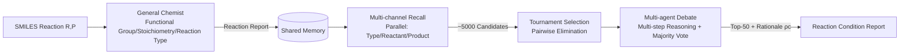

# From What to Why: A Multi-Agent System for Evidence-based Chemical Reaction Condition Reasoning

**Conference**: ICLR 2026  
**OpenReview**: [https://openreview.net/forum?id=Rh72R0VXPS](https://openreview.net/forum?id=Rh72R0VXPS)  
**Code**: To be confirmed  
**Area**: Multi-Agent Systems / AI for Science (Chemical Reaction Condition Recommendation)  
**Keywords**: Multi-agent debate, chemical reaction condition prediction, evidence-driven reasoning, tool-integrated reasoning, explainable AI  

## TL;DR
ChemMAS reframes the task from "what conditions to recommend" to "why these conditions are selected" through evidence-driven reasoning. It employs a four-stage pipeline: "General Chemist Mechanism Analysis → Multi-channel Candidate Recall → Tournament Elimination → Multi-agent Debate & Voting." This ensures each decision is accompanied by falsifiable and auditable chemical evidence. The system's Top-1 similarity is 20–35% higher than specialized models and 10–15% higher than general LLMs.

## Background & Motivation
**Background**: Selecting reaction conditions (solvent, temperature, catalyst, reagent ratios) is critical to the success of chemical synthesis. Early works used GNNs and Transformers to train small models from scratch, which perform well with sufficient annotated data. With the rise of LLMs, approaches have split into two factions: retrieval-based (transferring conditions from similar reactions in databases) and reasoning-based (direct prompt/fine-tuning of LLMs to infer conditions).

**Limitations of Prior Work**: Regardless of retrieval or reasoning, existing methods only answer "what conditions to use" and almost never explain "why these conditions are appropriate." In high-risk research workflows, a trustworthy system should not only provide a solvent or temperature but also clarify: which functional group dominates the reactivity? What prior experimental evidence supports this? What constraints exclude other reagents? Without this layer of explanation, the model remains a black box, making it difficult to integrate into real-world scientific cycles.

**Key Challenge**: Scientific discovery requires "falsifiable, auditable, and mechanistically grounded" condition certificates. However, classic recommendation objectives only optimize a success rate proxy score $u$, which is essentially a black-box ranking. These two are misaligned.

**Goal**: Upgrade reaction condition recommendation to "evidence-driven reaction condition reasoning"—requiring the model to simultaneously output what-level conditions and why-level evidence.

**Core Idea**: **Multi-agent collaboration + evidence grounding**. The condition selection is decomposed into four steps: mechanistic grounding, multi-channel recall, constraint-aware agent debate, and evidence aggregation. The output of each step is written into a shared Memory. Ultimately, each selected condition $c$ is paired with a reasoning $\rho(c)=(M,S,E,\Pi)$ (domain reasoning, verifiable checks, aligned evidence, and concise derivation).

## Method

### Overall Architecture
ChemMAS is a multi-stage agent pipeline based on shared Memory. Given a reaction $(R,P)$ in SMILES format, the "General Chemist" first invokes tools to analyze the mechanism and generate a Reaction Report. Then, multi-channel recall retrieves candidate conditions from a structured reaction database and expands them to approximately 5,000 entries. Next, tournament-style pairwise elimination reduces candidates to the Top-50. Each pairing is decided by specialized agents through multi-step reasoning and multi-agent debate voting. Finally, $K$ conditions with rationale are aggregated. All agents in the system are based on Qwen3-8B-Instruct, trained through a two-stage process of "Chemistry-tailored SFT + Tool-incentivized RL."

### Key Designs

**1. General Chemist: Grounding mechanisms into verifiable evidence.** This is the foundation of the reasoning. The chemist agent $A_{Gen}$ orchestrates three tools to extract mechanistic priors required downstream: The **Functional Group Tagger** uses a SMARTS substructure library $L=\{(\text{name}_k,\text{SMARTS}_k)\}$ to match each reactant, ranking functional groups by electrophilicity/nucleophilicity labels, activation levels, and frequency to identify the Main FG. The **Constraint Engine** normalizes reactant/product molecular graphs and aligns them based on Maximum Common Substructure (MCS) for atom mapping. It uses Integer Linear Programming (ILP) to solve for stoichiometric coefficients $\nu=(\nu_R,\nu_P,\nu_{aux})$ and combines leaving group heuristics to enumerate neutral side-product hypotheses. The **Chemical Knowledge Base** uses functional groups, product scaffolds, and molecular identifiers to construct query templates for retrieving evidence from databases like PubChem for reaction classification and side-product confirmation. All outputs are written to Memory. In experiments, the accuracy for identifying the Main FG, side-products, and reaction types reached 95.8%, 90.2%, and 92.5%, respectively.

**2. Multi-channel Recall: Parallel retrieval without scoring.** A structured reaction database $D=\{(\tau_n,r_n,p_n,c_n)\}$ is maintained, containing reaction types, reactant/product representations, and condition triplets $(\text{cat},\text{sol},\text{reag})$. Three parallel queries are performed for the current reaction: exact type matching $S_t$, reactant nearest neighbors $S_r$, and product nearest neighbors $S_p$ (the latter two based on functional groups, MCS, and embedding similarity). Scoring or rank fusion is intentionally avoided; any hit is included in a deduplicated union $S_{matched}=\text{dedup}(S_t\cup S_r\cup S_p)$. Slot-level recombination $\Pi(c)$ is then applied: elements in the condition are replaced with high-co-occurrence alternatives under $(\hat\tau,F_R)$ to generate "similar conditions" for diversity. The pool is finally truncated to $C=\text{truncate}_{5000}(S_{matched}\cup S_{similar})$. This "high recall, no scoring" strategy prevents good candidates from being filtered out prematurely by noisy scores.

**3. Tournament Selection: Pairwise duels to replace fragile global scoring.** The 5,000 candidates are randomly permuted and paired. In each round, a pair $(a,b)$ is judged by a panel of agents, with the winner determined by majority vote $\text{win}(a,b)=\arg\max_{o\in\{a,b\}}\sum_j\mathbb{1}[d_j=o]$ (ties are broken using confidence). Winners are reshuffled and paired again until 50 remain. The authors argue that absolute scores across heterogeneous condition sets are difficult to calibrate and amplify noise when values are close, whereas head-to-head comparisons are anchored in a comparable context, are naturally linear-time, and are parallelizable. Ablations show that replacing Candidate Pairing with global scoring significantly degrades performance.

**4. Multi-agent Debate + Multi-step Reasoning: Creating chains of evidence for every judgment.** For a candidate $o$, four agents $A_{Full},A_{Cat},A_{Sol},A_{Rea}$ execute evidence-seeking chains: they parse keywords $\kappa_j$ from the Memory’s Reaction Report, query the knowledge base for support $\Theta_j^{(0)}(o)$, and provide an initial judgment $\text{Init}_j(o)$. Subsequently, during multiple micro-rounds, they read peer summaries, re-query if uncertainty is detected, and refine their stance $\text{Dec}_j^{(u+1)}(o)=\Phi(\text{Dec}_j^{(u)}(o),\text{Peers}^{(u)},\Theta_j^{(u+1)}(o))$, where $\Phi$ integrates new citations, constraint engine checks (e.g., "base required to trap HCl"), and potential failure modes. Upon convergence, agents output a final judgment $d_j$ and store rationales in Memory, followed by a structured debate (with a coordinator managing turns and resolving conflicts) to reach a majority vote.

**5. Two-stage Multi-tool Collaborative Training: Teaching models when and how to use tools.** The first stage, "Chemistry Teaching," uses SFT to cold-start with the objective $\mathcal{L}(\theta)=-\sum\log P_\theta(y_i|x_i)$, enabling Tool-Integrated Reasoning (TIR) with special tokens like `<search>` and `<memory>`. The output includes step-by-step reasoning chains $y_i^r$ and independent judgment segments $y_i^a$. The second stage, "Tool Incentivization," uses RL via GRPO with hierarchical rewards: if formatting is correct and $\text{Acc}>0$, the reward is $\max(\text{Acc}+r_M,\text{Acc})$, where a multi-tool reward $r_M=0.1$ is added only if both `<search>` and `<memory>` appear. If correct is 0, the reward is 0; otherwise, it is $-1$. This encourages collaborative tool use without sacrificing accuracy.

## Key Experimental Results

### Main Results (Private dataset of 544k reactions, Top-k Similarity %)

| Model | Catalyst T1 | Solvent1 T1 | Solvent2 T1 | Reagent1 T1 | Reagent2 T1 |
|------|------|------|------|------|------|
| RCR | 40.3 | 49.9 | 45.3 | 50.1 | 36.4 |
| MM RCR | 43.4 | 53.7 | 49.3 | 55.7 | 40.2 |
| GPT-5 | 62.7 | 73.7 | 65.9 | 67.2 | 68.4 |
| Gemini2.5-Pro | 63.4 | 68.0 | 63.1 | 64.3 | 63.7 |
| **ChemMAS** | **78.1** (+14.7) | **85.4** (+11.7) | **76.3** (+10.4) | **88.3** (+20.0) | **73.6** (+5.2) |

ChemMAS ranks first across all five condition categories and all $k$ values, with a Top-1 improvement of 70%–90%+ relative to domain-specific baselines (RCR/Reagent Transformer/MM RCR) and a consistent 15–25% lead over top-tier general LLMs.

### Ablation Study (Private dataset Top-1 Similarity %, Catalyst/Reagent1 columns)

| Removed Component | Catalyst T1 | Reagent1 T1 |
|------|------|------|
| w/o Main FG | 66.7 | 64.1 |
| w/o Multi-Agent Debate | 65.7 | 62.9 |
| w/o Multi-Step Reasoning | 62.4 | 69.1 |
| w/o Candidate Pairing | 74.1 | 84.2 |
| **Complete ChemMAS** | **78.1** | **88.3** |

Removing Main FG results in an average drop of 8.4%, and removing multi-step reasoning leads to a 12.3% drop, identifying them as the most critical components. Training ablations show that the combination of SFT+RL is optimal; performance drops significantly without either, and both Acc and $r_M$ in the hierarchical reward are indispensable.

### Key Findings
- **OOD Generalization**: On the public benchmark ChemCoTBench-RCR, Top-1 for Catalyst/Solvent/Reagent reached 62.1/57.8/51.2%, outperforming the second best by 16.5/13.7/11.1 percentage points, proving that the model relies on reasoning rather than retrieving near-duplicates.
- **Interpretability**: The intermediate products of the General Chemist achieved >90% accuracy against human annotations. The LLM-Score of generated reasoning trajectories reached 92.8 (vs. 62.5–77.2 for baselines) with a BLEU-4 of 0.26, indicating that the explanations are scientifically sound rather than just plausible-sounding text.

## Highlights & Insights
- **Task Reframing is the Core Contribution**: Upgrading "top-k ranking" to "reasoning with falsifiable certificates $\rho(c)$." By using a formal criterion $\text{Valid}(\rho(c);x)$ (hard constraints + evidence alignment threshold + derivation consistency), interpretability becomes an optimizable objective rather than a post-hoc explanation.
- **High-Recall without Scoring + Tournament Pairwise Elimination**: Avoids the difficulty of calibrating global scores for heterogeneous conditions by placing judgments in a comparable context, which is also engineering-efficient due to linear-time parallelization.
- **Pragmatic Tool-Incentivized RL**: Reward is issued only when both retrieval and memory tools are used simultaneously, embedding the habit of "collaborative tool use" directly into the policy.

## Limitations & Future Work
- **Reliance on a private dataset of 544k reactions**, making the main experiments difficult to reproduce. Public evaluation was limited to a small subset (90 reactions) of ChemCoTBench-RCR.
- **Heaviness of the Pipeline**: 5,000 candidates × multiple tournament rounds × multi-agent multi-micro-round debate leads to high inference costs and latency that were not fully discussed, potentially limiting throughput in closed-loop experiments.
- **Metrics Use Top-k Tanimoto Similarity**: This measures structural similarity to ground-truth conditions, which does not necessarily equate to actual experimental yield or feasibility; interpretability also relies on "LLM-as-Judge," which carries inherent model bias.
- No real wet-lab validation was performed; the "auditable and suitable for closed-loop experiments" claims currently remain at the level of metrics and human alignment.

## Related Work & Insights
- **Retrieval vs. Reasoning in Condition Recommendation**: This work merges both (multi-channel recall provides empirical priors + multi-step reasoning performs mechanistic judgment) and points out that both lack "why"-level explanations.
- **Multi-agent Debate / LLM-as-Judge**: Debate voting is used to adjudicate candidates, echoing recent trends in multi-agent collaboration to improve reasoning reliability.
- **Tool-Integrated Reasoning (TIR) + GRPO**: The training framework adopts the DeepSeek-style GRPO and tool reward paradigm, migrating it to chemical domain `<search>/<memory>` dual-tool collaboration.
- **Insight**: In any scientific or engineering recommendation scenario requiring "trustworthy decisions," one can adopt this paradigm: reframing recommendation as reasoning with falsifiable certificates + high-recall without scoring + head-to-head elimination to replace fragile black-box global scoring.

## Rating
- Novelty: ⭐⭐⭐⭐ Reframing condition recommendation as evidence-driven reasoning with formal falsifiable criteria and a four-stage multi-agent pipeline constitutes clear framework-level innovation.
- Experimental Thoroughness: ⭐⭐⭐ Strong results on a 544k private dataset, but reproducibility is hindered; public OOD evaluation is small, and cost/latency analysis as well as wet-lab validation are lacking.
- Writing Quality: ⭐⭐⭐⭐ Clear structure, well-formalized problem definition, comprehensive diagrams and ablations, and well-explained interpretability evaluation.
- Value: ⭐⭐⭐⭐ Provides a practical paradigm for "interpretable and auditable" condition recommendation in AI for Science, offering significant utility for high-risk research cycles.

<!-- RELATED:START -->

## Related Papers

- [\[ICLR 2026\] PixelCraft: A Multi-Agent System for High-Fidelity Visual Reasoning on Structured Images](pixelcraft_a_multi-agent_system_for_high-fidelity_visual_reasoning_on_structured.md)
- [\[AAAI 2026\] Beyond Detection: Exploring Evidence-based Multi-Agent Debate for Misinformation Intervention and Persuasion](../../AAAI2026/multi_agent/beyond_detection_exploring_evidence-based_multi-agent_debate_for_misinformation_.md)
- [\[ICLR 2026\] MAD-Logic: Multi-Agent Debate Enhances Symbolic Translation and Reasoning](mad-logic_multi-agent_debate_enhances_symbolic_translation_and_reasoning.md)
- [\[NeurIPS 2025\] MASFIN: A Multi-Agent System for Decomposed Financial Reasoning and Forecasting](../../NeurIPS2025/multi_agent/masfin_a_multi-agent_system_for_decomposed_financial_reasoning_and_forecasting.md)
- [\[ICML 2026\] Why Specialist Models Still Matter: A Heterogeneous Multi-Agent Paradigm for Medical Artificial Intelligence](../../ICML2026/multi_agent/why_specialist_models_still_matter_a_heterogeneous_multi-agent_paradigm_for_medi.md)

<!-- RELATED:END -->
