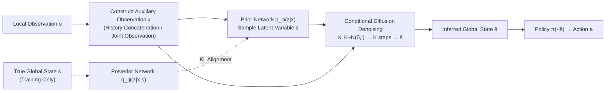

# GlobeDiff: State Diffusion Process for Partial Observability in Multi-Agent Systems

**Conference**: ICLR 2026  
**OpenReview**: [https://openreview.net/forum?id=96g2BRsYZX](https://openreview.net/forum?id=96g2BRsYZX)  
**Code**: To be confirmed (Paper states it will be released upon acceptance)  
**Area**: Multi-Agent Reinforcement Learning / Partial Observability  
**Keywords**: Dec-POMDP, Partial Observability, Conditional Diffusion Model, Global State Inference, Multimodal Generation, CTDE  

## TL;DR
This paper reformulates "global state inference" under multi-agent partial observability as a **conditional diffusion denoising process**. By introducing a latent variable $z$ as a "mode selector," it explicitly models the one-to-many ambiguity where a single local observation corresponds to multiple plausible global states. This approach avoids the mode collapse inherent in discriminative methods, enabling agents to reconstruct high-fidelity global states from local information for decision-making.

## Background & Motivation
- **Background**: Multi-Agent Reinforcement Learning (MARL) has achieved significant progress in collaborative tasks such as robotics and autonomous systems. However, Partial Observability (PO) remains a core obstacle—each agent has a limited field of view, and the true global state is unknown, formally modeled as a Dec-POMDP. Existing approaches follow two main routes: **Belief State Estimation** (using RNNs/Transformers to integrate historical observations into a belief of the environment) and **Explicit Communication** (exchanging information between agents to expand the receptive field).
- **Limitations of Prior Work**: Belief-based methods rely solely on historical experience, leading to error accumulation over time and insufficient information in complex systems. Communication-based methods incur high overhead, require complex protocol design, and lack a powerful model to effectively utilize auxiliary information. More fundamentally, most mainstream approaches are **discriminative**—using recurrent networks or Transformers to predict a **single most likely** global state from historical observations.
- **Key Challenge**: The essence of PO is a **one-to-many mapping**—the same local observation can correspond to many vastly different global states. Discriminative models collapse this rich distribution into a point estimate, leading to **mode collapse**: they either average distinct plausible states into a meaningless representation or arbitrarily commit to one while ignoring others, failing to capture the true uncertainty of the environment.
- **Goal**: To learn a generative model $p_\theta(s\mid x)$ from auxiliary local observations $x$ to global states $s$, allowing agents to make decisions based on inferred global states rather than raw local observations during execution, thereby bypassing the constraints of partial observability.
- **Core Idea**: **[Generative over Discriminative]** One-to-many ambiguity should not be resolved via discriminative prediction but through **generative modeling**—learning the entire conditional distribution rather than a single point. This is implemented via **[Conditional Diffusion + Latent Variable as Mode Selector]**: global state inference is formulated as a denoising process, and a latent variable $z$ is introduced to transform the ill-posed "$x$ to $s$" problem into a well-defined "$(x, z)$ to $s$" problem, where $z$ is responsible for selecting a specific mode from numerous possibilities.

## Method

### Overall Architecture
GlobeDiff models global state inference as a conditional diffusion model $p_\theta(s\mid x,z)$, supplemented by a prior network $p_\phi(z\mid x)$ and a posterior network $q_\psi(z\mid x,s)$ used only during training. Auxiliary local observations $x$ are constructed in two ways: when information is sufficient, $x_t=\{o^i_{t-m},\dots,o^i_t\}$ is a concatenation of agent $i$'s past $m$ steps; when insufficient, communication is enabled to form joint observations $x_t=\{o^1_t,\dots,o^n_t\}$. Training involves two branches (minimizing prior-posterior KL and training the diffusion denoising network). During execution, each agent first samples $z$ from the prior network, then performs $K$ denoising steps starting from Gaussian noise $s_K\sim N(0,I)$ to obtain the inferred global state $\hat s$, and finally makes decisions via $a^i=\pi_{\vartheta_i}(\cdot\mid\hat s)$. The entire process avoids real global information during execution, fitting naturally into the CTDE framework.

### Key Designs

**1. Latent Variable $z$ as a Mode Selector: Converting Ill-posed One-to-Many to Well-defined One-to-One.** The observation function $U$ does not guarantee a unique mapping $(S\times A)\to O$. Different global states may map to the same local observation; directly learning $p(s\mid x)$ would average multiple possibilities, generating blurred states. GlobeDiff introduces $z$, marginalizing the objective as $p_{\theta,\phi}(s\mid x)=\int p_\theta(s\mid x,z)\,p_\phi(z\mid x)\,dz$. Intuitively, $z$ provides the necessary context to "select a specific mode": the model is no longer asked to resolve the ambiguous "$x\to s$" but the well-defined "$(x,z)\to s$". This step is the foundation for avoiding mode collapse.

**2. Prior-Posterior Bridge: Resolving $z$ at Inference Time.** Latent variables introduce a challenge: at execution time, only $x$ is available without the true $s$. How to obtain a meaningful $z$? During training, a posterior network $q_\psi(z\mid x,s)$ uses the true global state $s$ to learn the "ideal $z$ required for reconstruction," while a prior network $p_\phi(z\mid x)$ observes only $x$. KL divergence is used to pull the prior toward the posterior. Using Jensen's inequality, the variational lower bound is $\log p_{\theta,\phi}(s\mid x)\ge \mathbb{E}_{q_\psi}[\log p_\theta(s\mid x,z)]-\mathrm{KL}(q_\psi(z\mid x,s)\,\|\,p_\phi(z\mid x))$. During execution, the prior network provides $z$, bridging the gap between training and inference.

**3. Forward Diffusion and Reverse Denoising.** The forward process sequentially adds Gaussian noise according to a variance schedule $q(s_k\mid s_{k-1})=N(s_k;\sqrt{1-\beta_k}\,s_{k-1},\beta_k I)$, which can be simplified as $s_k=\sqrt{\alpha_k}\,s_0+\sqrt{1-\alpha_k}\,\epsilon$ (where $\alpha_k=\prod_{i=1}^k\alpha_i$). The reverse process conditions the noise prediction network $\epsilon_\theta$ on $(x,z,k)$, iteratively denoising via $s_{k-1}=\frac{1}{\sqrt{\alpha_k}}\big(s_k-\frac{\beta_k}{\sqrt{1-\alpha_k}}\epsilon_\theta(s_k,x,z,k)\big)+\sqrt{\beta_k}\,\epsilon$. The total loss combines denoising MSE and prior-posterior KL: $\mathcal{L}=\mathbb{E}\big[\|\epsilon-\epsilon_\theta(\sqrt{\alpha_k}s+\sqrt{1-\alpha_k}\epsilon,x,z,k)\|^2\big]+\beta_{KL}\,\mathrm{KL}(q_\psi\|p_\phi)$. Diffusion processes learn complex multimodal structures implicitly through $\epsilon_\theta$ rather than explicitly modeling the generation distribution.

**4. Theoretical Guarantees with Error Bounds.** When the observation function $U$ is injective (one-to-one), Theorem 1 provides an expected single-sample error bound $\mathbb{E}[\|\hat s-s\|^2]\le 2W_2^2(p_{\theta,\phi},p)+4\mathrm{Var}(s\mid x)$ (where $W_2$ is the 2-Wasserstein distance). When the mapping is one-to-many and the true distribution is a mixture of $N$ Gaussians, Theorem 2 proves that under separation conditions, $\hat s$ must lie near a specific mode center. The error bound is $\mathbb{E}[\|\hat s-\mu_j\|^2]\le C_1K\delta^2+C_2\varepsilon_{KL}+2\max_i\mathrm{Tr}(\Sigma_i)+O(e^{-D^2/8\sigma^2_{\max}})$, where $\delta^2$ is the denoising MSE and $\varepsilon_{KL}$ is the prior alignment error. This multimodal bound is specifically tailored for the target scenarios of this method.

**Mechanism**: The denoising network uses a 1D temporal convolutional U-Net (stacked residual blocks); the fully convolutional nature allows the inference horizon to be determined by input dimensions rather than architecture. During training, an initial diffusion model is pre-trained on an offline dataset. During online execution, it is continuously updated with new data to compensate for offline-to-online distribution shifts, allowing the generative model to function from early training stages and reduce MARL instability. When integrated with CTDE, the policy training uses true global states to save computation, while the inferred states are used only during decentralized execution.

## Key Experimental Results

Experiments were conducted in SMAC (StarCraft II based collaborative MARL) to answer three questions: accurately inferring global states, improving MARL performance, and superiority over other generative models. All experiments used three seeds with uniform settings, using MAPPO as the backbone.

### Background & Modifications
The authors noted that vanilla SMAC is not fully suitable for studying PO: reducing the sight range from 9 to 3 only dropped MAPPO performance by ~0.03, as local observations still contained sufficient information. Thus, they constructed stricter **SMAC-v1 (PO)** and **SMAC-v2 (PO)** by removing enemy types and health from local observations (v2 further includes random team compositions and starting positions).

### Main Results (Comparison with Global State Inference Baselines)

| Dimension | Baselines | Results |
| --- | --- | --- |
| SMAC-v1 (PO): MMM2 / 6h vs 8z / 3s5z vs 3s6z | LBS, Dynamic Belief, CommFormer, vanilla MAPPO | GlobeDiff leads significantly in win rate across most maps |
| SMAC-v2 (PO): protoss/terran/zerg 5v5, zerg 10v10, terran 10v11, zerg 10v11 | Same as above | GlobeDiff consistently and significantly outperforms all baselines |

Performance gaps are attributed to baselines' limited ability to model complex multimodal distributions: LBS accumulates errors over long horizons; Dynamic Belief's inference is unimodal; CommFormer relies on explicit communication and reliable message aggregation, which is unstable under severe PO.

### Ablation Study and Generative Model Comparison

| Experiment | Setting | Key Findings |
| --- | --- | --- |
| Q3 Generative Comparison | Replacing Diffusion with Conditional VAE / MLP (MAPPO-VAE, MAPPO-MLP); MAPPO-Joint (direct joint obs) | GlobeDiff leads comprehensively on super-hard maps; VAE/MLP show almost no gain over vanilla MAPPO; MAPPO-Joint is worse than vanilla on some maps, indicating a need for feature extraction via inference |
| Prior Network Ablation | GlobeDiff w/o p (removing KL and prior network) | Win rates are significantly higher with the prior network across maps |
| Denoising Steps K (1→8) | zerg 5v5 | Longer denoising steps lead to more accurate state inference |
| Residual Blocks (1→3) | zerg 5v5 | Model capacity has a relatively small impact; small models suffice for accurate inference |
| State Reconstruction | t-SNE + Voronoi polygons comparing true/inferred states | Inferred states align highly with true states and improve over online training |

### Key Findings
- Denoising steps are more critical than model capacity: Increasing $K$ steadily improves accuracy, while increasing U-Net capacity yields diminishing returns.
- Directly feeding joint observations to the policy (MAPPO-Joint) can degrade performance, proving the inherent value of the "infer first, then decide" pipeline over simply stacking information.

## Highlights & Insights
- **Clean Problem Redefinition**: Condensing the core pain point of PO into "one-to-many mapping + discriminative mode collapse" leads logically to generative diffusion.
- **Latent Variable as Mode Selector**: Using $z$ to transform the ill-posed $x\to s$ and the prior-posterior bridge to handle the constraints of missing real states at inference is the most elegant part of the design.
- **Theory-Scenario Alignment**: Beyond a general unimodal bound, the paper provides a specific mode-center bound for multimodal mixtures, directly serving the method's target scenarios.
- **Honest Benchmark Modification**: Identifying and fixing the limitations of vanilla SMAC for PO research ensures the evaluation actually measures what it claims.

## Limitations & Future Work
- Experiments are limited to SMAC simulations; no validation on real robots/environments (listed as future work).
- Diffusion inference requires $K$ iterative steps, adding execution overhead compared to single-step discriminative prediction—a concern for time-sensitive deployments.
- Auxiliary observations in communication scenarios assume joint observations, implying certain communication assumptions without deep discussion on bandwidth constraints.
- Theoretical bounds rely on assumptions like "well-trained networks" and "sufficient mode separation," which lack quantitative characterization in practical tasks.

## Related Work & Insights
- **Traditional PO Routes**: Belief state estimation (RNNs, but with error accumulation) and explicit communication (high overhead, complex protocols)—this paper provides a generative alternative to their weaknesses.
- **Diffusion in RL**: Previously used mainly as planners for single-agent/offline RL (generating optimal trajectories, e.g., Diffuser); some works use diffusion for MARL belief distributions (shared attractors), but do not explicitly model the $x\to s$ one-to-many mapping.
- **Insight**: Shifting from "discriminative point estimation" to "generative distribution modeling" can be applied to any state/belief estimation with one-to-many ambiguity (e.g., SLAM, sensor fusion, opponent modeling). Latent variables + prior-posterior bridges are a general paradigm for asymmetric information between training and inference.

## Rating
- Novelty: ⭐⭐⭐⭐ First to use conditional diffusion + latent mode selectors for MARL global state inference; clean construction and clear differentiation.
- Experimental Thoroughness: ⭐⭐⭐⭐ Covers various SMAC-v1/v2 maps, multiple baselines, ablations, and visualizations; hardware overhead and real-world testing are missing.
- Writing Quality: ⭐⭐⭐⭐ Motivation is logically sound, method and theory are tightly aligned, with clear illustrations.
- Value: ⭐⭐⭐⭐ Provides a plug-and-play generative paradigm for CTDE in PO tasks with theoretical bounds and strong empirical results.

<!-- RELATED:START -->

## Related Papers

- [\[ICML 2025\] MetaAgent: Automatically Constructing Multi-Agent Systems Based on Finite State Machines](../../ICML2025/multi_agent/metaagent_automatically_constructing_multi-agent_systems_based_on_finite_state_m.md)
- [\[ICML 2026\] RADAR: Redundancy-Aware Diffusion for Multi-Agent Communication Structure Generation](../../ICML2026/multi_agent/radar_redundancy-aware_diffusion_for_multi-agent_communication_structure_generat.md)
- [\[ICLR 2026\] Stochastic Self-Organization in Multi-Agent Systems](stochastic_self-organization_in_multi-agent_systems.md)
- [\[ICLR 2026\] Goal-Aware Identification and Rectification of Misinformation in Multi-Agent Systems](goal-aware_identification_and_rectification_of_misinformation_in_multi-agent_sys.md)
- [\[ICLR 2026\] Aegis: Automated Error Generation and Attribution for Multi-Agent Systems](aegis_automated_error_generation_and_attribution_for_multi-agent_systems.md)

<!-- RELATED:END -->
