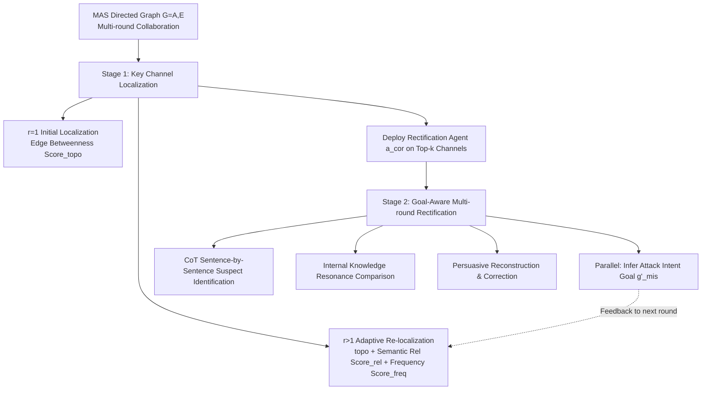

# Goal-Aware Identification and Rectification of Misinformation in Multi-Agent Systems

**Conference**: ICLR 2026  
**OpenReview**: [https://openreview.net/forum?id=6Y9NP1qhoM](https://openreview.net/forum?id=6Y9NP1qhoM)  
**Code**: [https://github.com/zhrli324/ARGUS](https://github.com/zhrli324/ARGUS)  
**Area**: Multi-Agent Systems, AI Safety  
**Keywords**: Multi-Agent System, Misinformation Injection, Goal-Aware Reasoning, Training-Free Defense, Information Flow  

## TL;DR
This paper proposes the red-teaming dataset MisInfoTask and the training-free defense framework ARGUS. Through a two-stage process of "adaptive localization of key propagation channels on the graph + goal-aware multi-round persuasive rectification," it specifically defends against "misinformation" injection—content that is semantically harmless but factually incorrect—within LLM multi-agent systems.

## Background & Motivation
**Background**: LLM Multi-Agent Systems (MAS) handle complex tasks through collaboration. However, complex topologies and frequent inter-agent communication introduce new attack surfaces, making systems vulnerable to false information injection. Existing defense research follows three main paths: adversarial attack/defense, consensus-based consistency verification, and structural defense targeted at graph topologies.

**Limitations of Prior Work**: Most existing methods share two major gaps: (I) defense objectives focus on "malicious information" with obvious intent that is easily intercepted by conventional detection, while ignoring **semantically harmless but factually incorrect** "misinformation"; (II) evaluation tasks are often too simplistic (mostly straightforward Q&A), failing to reflect the capabilities and vulnerabilities of MAS in real-world complex tasks.

**Key Challenge**: Misinformation is highly stealthy because it "appears harmless," allowing it to bypass detection mechanisms designed for malicious content. In multi-round MAS collaborations, even a minor factual error can be amplified round by round, eventually causing the entire task chain to collapse. Ours found that after injecting misinformation, the Task Success Rate (TSR) of MAS dropped from 87.47% to 67.70%, while Misinformation Toxicity (MT) soared from 1.28 to approximately 4.71.

**Goal**: To build an agent-centric misinformation evaluation benchmark for real-world complex tasks and design a robust, adaptive, and efficient defense framework.

**Core Idea**: **[Spatial Localization + Temporal Rectification]** By treating the MAS as a directed graph, the framework adaptively identifies key communication channels through which misinformation is most likely to flow from a **spatial dimension**. It then deploys rectification agents from a **temporal dimension** to identify and persuasively correct misinformation using CoT to activate parametric knowledge and "goal-aware reasoning," all while remaining **training-free**.

## Method

### Overall Architecture
The paper presents two outputs: the **MisInfoTask** dataset for evaluation and the **ARGUS** framework for defense. MisInfoTask contains 108 real-world complex tasks, each providing potential misinformation injection points, reference solution processes, and 4-8 "plausible but fallacious" arguments with ground truths, covering five categories: conceptual reasoning, fact-checking, process application, formal language interpretation, and logical analysis. ARGUS models the MAS as a directed graph $G=(A,E)$ and operates in two stages: first, **adaptively localizing** key misinformation propagation channels (spatial), then deploying a rectification agent $a_{cor}$ on these channels for **goal-aware multi-round persuasive rectification** (temporal). The two stages are linked in each iteration—the "attack intent goal" inferred during the rectification stage informs the channel localization for the next round.

### Key Designs

**1. Initial Topological Localization: Defending via "Information Hubs" when logs are absent**. Before the first round ($r=1$), when no interaction logs exist, ARGUS relies on graph structure to determine which edges are most critical. It calculates the normalized **Edge Betweenness Centrality** for each edge $e$: $\text{Score}_{topo}(e)=\frac{1}{N_{norm}}\sum_{a_i}\sum_{a_j,i\neq j}\frac{\sigma_{ij}(e)}{\sigma_{ij}}$, where $\sigma_{ij}$ is the total number of shortest paths between $a_i$ and $a_j$, and $\sigma_{ij}(e)$ is the number of those paths passing through edge $e$. The intuition is that edges participating in more shortest paths act as bottlenecks for information flow. To avoid clustering monitoring at a few nodes, ARGUS first selects the highest-scoring outgoing edge $e_i^*$ for each source node to form $E_{best}$ (ensuring source node coverage), then selects the Top-k edges from $E_{best}$ and the remaining edges according to weights, balancing "channel importance" and "agent coverage breadth."

**2. Adaptive Re-localization: Refocusing using the inferred attack goal from the previous round**. Monitoring positions in subsequent rounds ($r>1$) are dynamic. The rectification agent outputs a textual description of the inferred "misinformation intent goal," which is deduplicated to form a goal set $G'_{mis}$ and mapped to an embedding vector set $V'_{mis}$. For each sentence $s$ in a message, the average cosine similarity to all goal embeddings is calculated: $S(s,V'_{goal})=\frac{1}{p}\sum_{i=1}^{p}\text{Sim}_{cos}(\Phi(s),v_i')$. The relevance of message $m$ is the maximum similarity of sentences within it that exceed a threshold $\theta_{sim}$, and the edge relevance score $\text{Score}_{rel}(e)$ is the maximum relevance of all messages on that edge. The final comprehensive score $\text{Score}_r(e)$ is a weighted sum of topological importance, semantic relevance $\text{Score}_{rel}$, and communication frequency $\text{Score}_{freq}$ (with weights $\alpha,\beta,\gamma$). This allows monitoring positions to converge toward truly contaminated channels as the attack intent is identified.

**3. Goal-Aware Persuasive Rectification: Using the LLM's own knowledge to "persuade" misled messages**. When a message flows through a monitored channel, the rectification agent $a_{cor}$ triggers a multi-stage CoT-driven process. First, it performs **multi-dimensional suspect identification**, decomposing the message sentence-by-sentence to find not only explicit factual assertions but also potential logical contradictions, violations of common sense, or vagueness. Next, it performs **internal knowledge resonance**, activating relevant knowledge clusters within the LLM's parameters for each suspicious anchor point and conducting deep semantic comparisons with external info in the message. Upon confirming a critical conflict, it enters **heuristic persuasive reconstruction**, generating logically persuasive corrective statements using root cause analysis, cognitive restructuring, and context-adaptive adjustment. The key is not simply labeling content as "fake," but activating aligned internal LLM knowledge to drive the message back on track persuasively.

**4. Parallel Goal-Aware Intent Inference: Feeding "Defense" back into "Localization"**. While rectifying, $a_{cor}$ executes a parallel sub-task: when it judges that the misinformation in the current message exhibits "highly organized" or "obviously induced" characteristics, it systematically records its inference of the attacker's most likely misleading goal. This inference serves as the input $G'_{mis}$ for the adaptive re-localization in design 2 for the next round. This creates a closed loop where ARGUS becomes increasingly accurate when facing sustained, coordinated misinformation attacks by feeding temporal rectification experience back into spatial localization.

## Key Experimental Results

The authors ran 5 rounds of collaboration on MisInfoTask using 4 core LLMs (GPT-4o-mini, GPT-4o, DeepSeek-V3, Gemini-2.0-flash) across 3 types of injection attacks (Prompt Injection, RAG Poisoning, Tool Injection), comparing against Self-Check and G-Safeguard baselines.

### Main Results (Selected GPT-4o-mini and GPT-4o; lower MT is better / higher TSR is better)

| Core LLM | Method | Avg. MT ↓ | Avg. TSR ↑ |
|---|---|---|---|
| GPT-4o-mini | Attack-only | 5.22 | 67.43 |
| GPT-4o-mini | Self-Check | 5.02 | 68.38 |
| GPT-4o-mini | G-Safeguard | 4.07 | 68.75 |
| GPT-4o-mini | **ARGUS** | **3.43** | **78.43** |
| GPT-4o | Attack-only | 4.90 | 67.07 |
| GPT-4o | Self-Check | 4.75 | 68.39 |
| GPT-4o | G-Safeguard | 4.04 | 65.64 |
| GPT-4o | **ARGUS** | **3.51** | **76.96** |

On DeepSeek-V3, ARGUS averaged MT 3.25 / TSR 84.33; on Gemini-2.0-flash, MT 3.40 / TSR 72.41. ARGUS achieved the best performance across all four models. By attack type, ARGUS reduced MT by an average of: Prompt Injection -28.18%, RAG Poisoning -20.38%, and Tool Injection -35.95%.

### Ablation Study (DeepSeek-V3, sub-modules and hyper-parameters)

| Configuration | PI MT | PI TSR | RP MT | RP TSR | TI MT | TI TSR |
|---|---|---|---|---|---|---|
| Attack only | 4.88 | 69.44 | 4.93 | 63.89 | 4.24 | 70.37 |
| Attack + ARGUS | 3.50 | 75.93 | 3.93 | 70.37 | 2.77 | 87.04 |
| w/o Dynamic Localization | 4.55 | 68.52 | 4.56 | 64.81 | 3.80 | 74.07 |
| w/o CoT Rectification | 3.90 | 71.30 | 4.15 | 68.52 | 2.98 | 82.41 |
| w/o Multi-round Correction | 4.63 | 70.37 | 4.61 | 62.04 | 3.88 | 71.30 |
| w/ Ground Truth | 3.32 | 78.70 | 3.77 | 74.07 | 2.54 | 91.67 |

Removing any core module leads to significant performance degradation; providing ground truth sets an even higher upper bound for defense. Hyper-parameter ablation (Table 3, PI scenario) shows that $\gamma$ (frequency) and $\alpha$ (topology) are critical; removing $\gamma$ increases MT from 3.73 to 4.59, but "semantic relevance $\beta$ is the most critical factor, and optimal defense is only reached when all three are combined."

### Key Findings
- General MAS architectures are highly vulnerable to misinformation: without defense, MT increases monotonically over 5 rounds, confirming the "contagiousness and stealthiness" of misinformation. With ARGUS, MT decreases over rounds.
- ARGUS is robust to topological structures: it effectively detects and rectifies misinformation across Self-Determination, Chain, Full, Circle, and Star topologies, showing good transferability.
- The high accuracy of adaptive localization in inferring attack intent goals validates the reliability of the "goal-aware" loop.

## Highlights & Insights
- **Valuable Problem Definition**: Clearly distinguishes "malicious information" from "misinformation," focusing defense on the more stealthy and overlooked latter category. The accompanying red-teaming dataset MisInfoTask fills an evaluation gap for complex tasks.
- **Elegant Spatial × Temporal Dual Perspective**: Decouples "where to monitor (edge localization on the graph)" and "how to correct (multi-round CoT persuasion)" into spatial and temporal lines, using "intent inference" to link them into a closed loop—more rectification leads to more accurate localization.
- **Training-Free, Plug-and-Play**: Does not rely on training, instead activating aligned internal parametric knowledge of the LLM for rectification. It shows good transferability across core LLMs and topologies with low deployment barriers.

## Limitations & Future Work
- **Additional Overhead**: Introducing external rectification modules adds computational cost and latency, which is a common trade-off in MAS defense. The paper does not deeply quantify the efficiency-cost balance.
- **Limited to Parametric Knowledge-based Misinformation**: Currently mainly addresses misinformation conflicting with the LLM's internal knowledge. For misinformation relying on dynamic, highly time-sensitive external info (e.g., real-time facts), internal knowledge resonance may fail, requiring more complex multi-component collaborative defense.
- **Dependence on LLM Judge Scoring**: Both MT and TSR are scored by GPT-4o as a judge, meaning evaluation may be subject to judge model bias.

## Related Work & Insights
- **MAS Information Injection Attacks**: Prompt Infection contaminates MAS via propagation, AgentSmith uses adversarial injection to poison agents, and Corba uses recursive infection to spread "viruses" causing MAS collapse. These works outline the attack surface of MAS, while this paper systematizes the defense against the stealthy sub-type: "misinformation."
- **MAS Defense Strategies**: Netsafe studies MAS graph security, AgentSafe uses hierarchical data management to mitigate poisoning leakage, and AgentPrune/G-Safeguard use graph pruning and GNNs to locate high-risk agents. ARGUS, like G-Safeguard, operates on the graph but avoids GNN training and edge pruning in favor of a training-free "localization + persuasive rectification" route, serving as a beneficial supplement to this direction.
- **Insight**: Feeding "intermediate inferences from defense" back into "resource allocation/localization" to form a loop is a reusable paradigm in agent systems. Using the LLM's own parametric knowledge for "persuasive correction" rather than hard filtering suggests a more gentle, interpretable approach to content governance.

## Rating
- Novelty: ⭐⭐⭐⭐ First to explicitly separate "misinformation" from "malicious information" as an independent defense target. The spatial × temporal dual perspective combined with the intent inference loop is clever, supported by a specialized red-teaming dataset.
- Experimental Thoroughness: ⭐⭐⭐⭐ 4 LLMs × 3 Attacks × 5 Topologies × multiple baselines, including sub-module and hyper-parameter ablations and round-by-round trends. Missing quantitative analysis on efficiency/cost.
- Writing Quality: ⭐⭐⭐⭐ Clear motivation, complete formulas and flowcharts, and a coherent description of the two-stage method.
- Value: ⭐⭐⭐⭐ Training-free with good transferability across models and topologies. The open-sourcing of the dataset and framework practically contributes to building trustworthy MAS.

<!-- RELATED:START -->

## Related Papers

- [\[AAAI 2026\] BAMAS: Structuring Budget-Aware Multi-Agent Systems](../../AAAI2026/multi_agent/bamas_structuring_budget-aware_multi-agent_systems.md)
- [\[ICLR 2026\] MARTI: A Framework for Multi-Agent LLM Systems Reinforced Training and Inference](marti_a_framework_for_multi-agent_llm_systems_reinforced_training_and_inference.md)
- [\[ICLR 2026\] MAS²: Self-Generative, Self-Configuring, Self-Rectifying Multi-Agent Systems](mas2_self-generative_self-configuring_self-rectifying_multi-agent_systems.md)
- [\[AAAI 2026\] Beyond Detection: Exploring Evidence-based Multi-Agent Debate for Misinformation Intervention and Persuasion](../../AAAI2026/multi_agent/beyond_detection_exploring_evidence-based_multi-agent_debate_for_misinformation_.md)
- [\[ICLR 2026\] ATLAS: Constraints-Aware Multi-Agent Collaboration for Real-World Travel Planning](atlas_constraints-aware_multi-agent_collaboration_for_real-world_travel_planning.md)

<!-- RELATED:END -->
