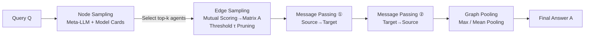

# Graph-of-Agents: A Graph-based Framework for Multi-Agent LLM Collaboration

**Conference**: ICLR 2026  
**arXiv**: [2604.17148](https://arxiv.org/abs/2604.17148)  
**Code**: [UNITES-Lab/GoA](https://github.com/UNITES-Lab/GoA)  
**Area**: Multi-Agent / LLM Collaboration  
**Keywords**: Multi-Agent LLMs, Graph Structure, Message Passing, Mixture-of-Agents, Test-time Reasoning, Agent Selection  

## TL;DR
GoA models multi-LLM collaboration as a dynamic directed graph—first selecting a small set of the most relevant agents as nodes using model cards, then constructing edges based on mutual scores for bidirectional message passing, and finally aggregating via graph pooling. Using only 3 agents, it outperforms baselines like Mixture-of-Agents that utilize a full set of 6 agents.

## Background & Motivation

**Background**: With the explosive growth of open-source LLMs, orchestrating multiple models with diverse expertise at test-time to solve problems collaboratively has become a prominent research direction. Mixture-of-Agents (MoA) is a representative approach that concatenates responses from all available agents to the original query and feeds them into the next layer, relying on "strength in numbers" to achieve complementarity.

**Limitations of Prior Work**: This "all-in + multi-to-one aggregation" paradigm in MoA has three structural weaknesses. First, it is **indiscriminate**—it invokes all agents regardless of the query, causing computational explosion and injecting noise from irrelevant domains (e.g., adding a math model to an anatomy question). Second, it uses **coarse communication**—concatenating all responses for the aggregator fails to capture fine-grained interactions between pairs of agents or weight responses by relevance. Third, it is **expensive to integrate**—the complexity of concatenating all tokens is $O(LNd)$ (where $L$ is the number of layers, $N$ is the number of agents, and $d$ is the token length per agent), which becomes unsustainable as scale increases.

**Key Challenge**: The benefit of multi-agent collaboration stems from "diversity," but simple all-to-all aggregation transforms diversity into noise and cost—more agents lead to more irrelevant responses and higher communication overhead, diluting truly useful experts.

**Goal**: Design a test-time framework that requires no fine-tuning, relies purely on prompt interfaces, is compatible with black-box APIs, and can adaptively select relevant agents, perform precise directional communication, and integrate answers at a low cost.

**Core Idea (Reconstructing Multi-Agent Collaboration via Graph Perspective)**: Treat agents as nodes and "response relevance" as directed edges. Reformulate multi-agent collaboration in terms of graph operations: **Node Sampling** answers "whom to select," **Edge Sampling + Message Passing** answers "how to communicate," and **Graph Pooling** answers "how to integrate." These three long-conflated problems are decoupled into distinct graph operators.

## Method

### Overall Architecture

The pool of $N$ agents is modeled as a directed graph $G=(V,E)$, where a subgraph containing only relevant agents is dynamically constructed for each query. The process follows four steps: the meta-LLM reads model cards to select top-$k$ nodes → selected agents score each other to construct a weighted directed adjacency matrix and prune edges → source→target and target→source bidirectional message passing refines responses → final answers are produced via max/mean graph pooling. The entire process is conducted at the prompt level without modifying model weights.

### Key Designs

**1. Node Sampling: meta-LLM selects candidates based on "resumes"**. GoA no longer broadcasts the query to all agents. Instead, it extracts three types of metadata from Hugging Face model cards for each agent—domain, specialized tasks, and model scale/features—to form a "resume" dictionary. A general-purpose meta-LLM (Qwen2.5-7B-Instruct in experiments) takes the query and these resumes to select the $k$ most relevant agents: $V_s = \text{Meta-LLM}(\text{Top-}k \mid Q, \text{Model Cards})$. Consequently, a mixed query of biomedicine, math, and code will only activate experts in those fields, blocking irrelevant nodes like legal models and preventing agent explosion and noise injection.

**2. Edge Sampling & Relevance Scoring: Mutual evaluation defines hierarchy**. After node selection, each agent generates an initial response to the query and then scores all responses other than its own (excluding self-evaluation to reduce self-promotion bias), with the total score assigned by each agent normalized to 1.0. A node $j$'s relevance score is determined by the sum of scores it receives from others: $S_j = \sum_{i \neq j} \text{Score}_{i \to j}$. Weak responders with scores below a threshold $\tau$ (default 0.05) are pruned. The remaining nodes are ranked as "Source Nodes" (high relevance, high influence) and "Target Nodes" (lower relevance). Edge weights are given by normalized neighbor scores: $A_{ji} = S_i / \sum_{k \in N_j} S_k$, allowing more relevant agents to exert proportionally greater influence on their neighbors for fine-grained 1-on-1 communication.

**3. Bidirectional Message Passing: Support the weak, then refine the strong**. This is the core benefit of the graph structure, executed in two steps. Step 1 **Source→Target**: Higher-ranked source nodes pass their credible responses to lower-ranked target nodes, which then refine their own outputs: $R'_j = v_j\big(\|_{i<j} A_{ij} R^{\text{sorted}}_i\big)$, where $v_j(\cdot)$ is agent $j$'s forward pass, $\|$ denotes concatenation, and $R^{\text{sorted}}$ are responses sorted by relevance. Step 2 **Target→Source**: Conversely, source nodes refine their answers once more based on the improved target responses $R'_j$: $R''_i = v_i\big(\|_{i<j} A_{ji} R'_j\big)$, thereby absorbing neighborhood consensus. Ablation studies show this direction is crucial: reversing the two directions leads to the largest performance collapse (MMLU-Pro −2.60, GPQA −5.05), as allowing weak nodes to dominate injects noise back into source nodes.

**4. Graph Pooling: Selection or weighted averaging**. Finally, graph pooling aggregates refined responses into a final answer, avoiding the high cost of concatenating all tokens as in MoA. Two strategies are used: $\text{Max-Pooling}$ directly takes the response from the source node with the most incoming edges (most relevant) $R''_{\text{max-source}}$; $\text{Mean-Pooling}$ lets the meta-LLM synthesize all selected responses weighted by their relevance scores. These are formalized as $A = R''_{\text{max-source}}$ (max) or $A = \text{Meta-LLM}(\text{Average} \mid R'')$ (mean), corresponding to the $\text{GoA}_{\text{max}}$ and $\text{GoA}_{\text{mean}}$ variants. The paper also proves that **GoA is a strict generalization of MoA** (Proposition 1): when $k=N$, the adjacency matrix is fully connected with all weights equal to 1, each layer includes a query self-loop, and mean pooling is used, GoA reduces to MoA.

## Key Experimental Results

Settings: A pool of 6 domain-specific LLMs (7–8B) (General/Code/Math/Biomedical/Finance/Legal), with Qwen2.5-7B-Instruct as the meta-LLM, all using zero-shot CoT at test-time.

### Main Results

| Category | Method | MMLU | MMLU-Pro | GPQA | MATH | HumanEval | MedMCQA |
|------|------|------|----------|------|------|-----------|---------|
| Single Agent | General (Best Single) | 77.61 | 53.90 | 32.83 | 69.00 | 81.50 | 55.22 |
| Multi-Agent(6) | SC | 77.97 | 54.12 | 36.36 | 69.80 | 82.57 | 55.70 |
| Multi-Agent(6) | Refine | 77.40 | 54.71 | 38.92 | 71.60 | 80.49 | 54.94 |
| Multi-Agent(6) | MoA | 75.71 | 53.33 | 32.83 | 65.80 | 76.22 | 54.94 |
| Multi-Agent(6) | Self-MoA | 78.14 | 54.19 | 33.84 | 68.20 | 79.27 | 55.56 |
| **Multi-Agent(3)** | **GoA_Max (Ours)** | **79.18** | **54.78** | 39.98 | 69.83 | 84.67 | **60.04** |
| **Multi-Agent(3)** | **GoA_Mean (Ours)** | 78.52 | 54.27 | **40.54** | **73.12** | **84.98** | 57.92 |

GoA using only 3 agents outperforms almost all multi-agent baselines using 6 agents across 6 benchmarks. GoA_Max achieves the best results in MMLU / MMLU-Pro / MedMCQA, while GoA_Mean leads in GPQA / MATH / HumanEval.

Efficiency (MMLU-Pro): Compared to MoA, GoA_Max reduces LLM calls from 19 to 11, tokens from 56.05k to 19.18k, and latency from 240s to 100s, while accuracy improves from 53.33 to 54.78—it is cheaper, faster, and more accurate.

Scaling to GPT-4o (GPQA/MedMCQA/HumanEval): GoA_Max with 3 agents also outperforms DyLAN using 8 agents (e.g., HumanEval 92.07 vs 93.29), confirming that "selection is superior to quantity."

### Ablation Study

| Configuration | MMLU-Pro | GPQA |
|------|----------|------|
| GoA (Top-k=3, τ=0.05) | 54.78 | 39.98 |
| Reverse Message Passing | 52.18 | 34.93 |
| w/o Target-to-Source | 53.66 | 38.03 |
| w/o Source-to-Target | 52.21 | 36.12 |
| w/o Scoring (A_ij=1) | 52.91 | 37.34 |
| Top-k=2 | 53.54 | 36.75 |
| Top-k=5 | 54.65 | 39.13 |
| τ=0.1 | 53.12 | 38.43 |

### Key Findings
- **Direction is critical**: Reversing the bidirectional flow incurs the highest performance cost (GPQA −5.05), indicating that the sequence of "strong supports weak, weak refines strong" is a core design rather than an optional one.
- **Relevance scoring is effective**: Setting all edge weights to 1 (removing scoring) drops performance by 1.87/2.64, proving that relevance-based weighting effectively filters noise.
- **k=3 is the sweet spot**: $k=2$ provides insufficient information, while $k=5$ introduces redundancy; top-$k=3$ is optimal for balancing precision and cost.

## Highlights & Insights
- **Decoupling chaotic problems into graph operators**: Selection = Node Sampling, Communication = Edge Sampling + Message Passing, Integration = Graph Pooling. The framework is elegant and each step can be independently validated via ablation.
- **Counter-intuitive "Less is More" conclusion**: 3 meticulously selected agents beat 6 or even 8 agents while saving over half the tokens and latency, which is highly attractive for cost-sensitive real-world deployments.
- **Theoretical unification of MoA**: Proposition 1 proves MoA is a special case of GoA, positioning GoA at the upstream of the multi-agent framework spectrum.
- **Zero training, black-box compatible**: Pure prompt interface allows direct application to closed-source APIs with low barriers to entry.

## Limitations & Future Work
- **Dependency on model card quality**: Node sampling relies on Hugging Face resumes; if metadata is missing or inaccurate, selection becomes distorted (partially mitigated by the threshold $\tau$, but not fundamentally solved).
- **Overhead and bias in mutual scoring**: Every agent must score others, which becomes expensive as the number of nodes increases; additionally, LLM mutual evaluation may not always be reliable.
- **Limited pool scale**: Experiments were limited to 6–8 agents. The claimed "scalability to 10/100" has not yet been validated on larger pools, and the cost curve for graph construction and multi-round message passing on very large pools remains unknown.
- **Single-hop graph, fixed two-step process**: Message passing is hardcoded to two steps with shallow graph layers. Deeper multi-hop reasoning or adaptive layer counts remain subjects for future exploration.

## Related Work & Insights
- **vs MoA / Self-MoA**: Upgrades from "fully connected multi-to-one aggregation" to "sparse directed graph + weighted message passing," formally subsuming MoA as a special case.
- **vs MacNet / GPTSwarm**: The latter puts agents into **predefined static DAGs**, whereas GoA **dynamically constructs graphs** based on query relevance, providing greater flexibility.
- **vs DyLAN**: DyLAN relies on forward-backward peer scoring for dynamic activation but requires a fixed temporal feed-forward network; GoA’s bidirectional message passing is lighter and requires no extra optimization.
- **An extension of Graph-of-Thought series**: Migrates the structural idea of "Graph-of-Thought" from internal reasoning within a single model to collaboration across multiple models.

## Rating
- **Novelty**: ⭐⭐⭐⭐ Uses graph structures to unify selection, communication, and integration with theoretical support. While graphs and message passing are not entirely new to multi-agent systems, the combination of relevance scoring and bidirectional flow is innovative.
- **Experimental Thoroughness**: ⭐⭐⭐⭐ Coverage of 6 benchmarks, efficiency analysis, GPT-4o expansion, and detailed ablations (direction/scoring/top-k/τ). The only missing piece is validation of scalability on a pool truly at the 10/100 scale.
- **Writing Quality**: ⭐⭐⭐⭐ The narrative connecting the three core problems is clean, graph operator analogies are intuitive, and formulas/pipeline diagrams are clear.
- **Value**: ⭐⭐⭐⭐ The conclusion that "3 agents beat 6 and save more" is highly practical for cost-sensitive multi-agent deployment. Zero-training black-box compatibility further lowers deployment barriers.

<!-- RELATED:START -->

## Related Papers

- [\[AAAI 2026\] Scalable and Accurate Graph Reasoning with LLM-Based Multi-Agents](../../AAAI2026/multi_agent/scalable_and_accurate_graph_reasoning_with_llm-based_multi-agents.md)
- [\[ICLR 2026\] GraphPlanner: Graph Memory-Augmented Agentic Routing for Multi-Agent LLMs](graphplanner_graph_memory-augmented_agentic_routing_for_multi-agent_llms.md)
- [\[ACL 2026\] MASFactory: A Graph-centric Framework for Orchestrating LLM-Based Multi-Agent Systems with Vibe Graphing](../../ACL2026/multi_agent/masfactory_a_graph-centric_framework_for_orchestrating_llm-based_multi-agent_sys.md)
- [\[ICLR 2026\] Unlocking the Power of Multi-Agent LLM for Reasoning: From Lazy Agents to Deliberation](unlocking_the_power_of_multi-agent_llm_for_reasoning_from_lazy_agents_to_deliber.md)
- [\[AAAI 2026\] A Graph-Theoretical Perspective on Law Design for Multiagent Systems](../../AAAI2026/multi_agent/a_graph-theoretical_perspective_on_law_design_for_multiagent_systems.md)

<!-- RELATED:END -->
