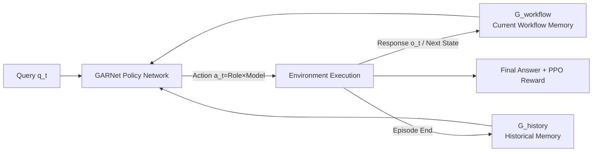

# GraphPlanner: Graph Memory-Augmented Agentic Routing for Multi-Agent LLMs

**Conference**: ICLR 2026  
**Code**: [https://github.com/ulab-uiuc/GraphPlanner](https://github.com/ulab-uiuc/GraphPlanner)  
**Area**: Multi-Agent Systems / LLM Routing  
**Keywords**: LLM Routing, Multi-Agent Collaboration, Heterogeneous Graph Memory, Reinforcement Learning, Workflow Generation  

## TL;DR
GraphPlanner upgrades multi-model LLM routing from "selecting a single model" to "generating a multi-agent workflow." It utilizes a heterogeneous graph memory network, GARNet, to simultaneously encode the current workflow and historical interactions, while jointly optimizing task performance and computational overhead using PPO. It achieves up to a 9.3% accuracy improvement across 14 tasks while reducing GPU training overhead from $186 \text{ GiB}$ to $1 \text{ GiB}$.

## Background & Motivation
**Background**: LLM routing has become a key method for integrating multiple heterogeneous models to balance performance and cost. Existing routers fall into two categories: single-turn routers (e.g., RouterDC, GraphRouter), which assign requests to a model based on query embeddings or classifiers in a simple and efficient manner; and multi-turn routers (e.g., Router-R1, R2-Reasoner), which alternate between reasoning and routing across multiple calls for greater flexibility.

**Limitations of Prior Work**: Single-turn routers cannot decompose tasks or coordinate across models, making them inadequate for complex queries. Although multi-turn routers introduce context, they treat each call as an independent event and **do not explicitly model collaboration between models**. This leads to redundant calls, contextual semantic conflicts, and a failure to leverage the complementary strengths of different models. Both approaches remain at the level of "model selection" rather than entering true agentic scenarios requiring planning, task division, and memory.

**Key Challenge**: Agentic LLM systems naturally require joint decisions on "which model + which role." This introduces three difficulties: (1) relationships between queries, responses, and candidate models are highly heterogeneous and evolve through workflow branching, interaction, or conflict; (2) early routing decisions have long-range impacts on final results, representing a typical **delayed reward / credit assignment** problem; (3) agentic systems accumulate vast historical interaction trajectories (successful collaborations, error patterns, efficient task divisions), which existing routers rarely utilize.

**Goal**: To generalize routing from simple model selection to a **multi-agent coordination problem**. The router must decide both which LLM backbone to call and which role to activate at each step (Planner / Executor / Summarizer), thereby transforming a sequence of independent calls into a structured workflow.

**Core Idea**: **A trio of Graph Memory + MDP + RL**. The generation of agentic workflows is modeled as a Markov Decision Process (MDP), where actions are "role $\times$ model" pairs. A heterogeneous graph, GARNet, is used to carry both current workflow memory and historical memory, stitched together via shared "role hub nodes." Finally, PPO is used for end-to-end joint optimization of task performance and overhead.

## Method

### Overall Architecture
GraphPlanner frames the generation of an agentic routing workflow for a query as a sequential decision-making process. At each step, the policy network, guided by GARNet, outputs an action (specifying both an LLM backbone and a role). The environment executes the subtask, generates an intermediate response, and incrementally merges this trajectory into the workflow memory graph $G_{\text{workflow}}$. After an episode ends, the entire trajectory is solidified into the historical memory graph $G_{\text{history}}$. GARNet fuses these two graphs into a state representation, and the entire pipeline is optimized using PPO.

### Key Designs

**1. Modeling Workflow Generation as a Role-Based MDP: Learning "Division of Labor" Instead of Just "Model Selection"**  
GraphPlanner defines the state as the current query to be solved $s_t = q_t$. The action is a pair $a_t = (\alpha_t, m_t)$, where $\alpha_t$ selects a role from $\{\text{planner, executor, summarizer}\}$ and $m_t$ selects a model from $K$ candidate backbones, resulting in an action space of $|A| = 3K$. Each role has specific responsibilities: the planner decomposes complex queries into atomic sub-queries, the executor generates answers with or without context, and the summarizer aggregates multi-path outputs into a coherent answer. To ensure semantic validity, a **dynamic mask** $M_t$ is applied: the summarizer is prohibited in the first step, only the executor is allowed in the final step ($M_T$), and a hyperparameter $P_{\max}$ limits the number of planner occurrences to prevent infinite recursion. The transition function updates the state based on the role: moving to the first sub-query for a planner, the next pending query for an executor, and the summary query for a summarizer.

**2. Balancing Performance and Cost to Address Delayed Rewards**  
The reward function binds task utility and routing cost:
$$r_t = \begin{cases} U(\hat{y}, y^*) - \alpha\, C(a_t), & t = T \ (\text{termination}) \\ -\alpha\, C(a_t), & t < T \ (\text{intermediate steps}) \end{cases}$$
Where $U(\hat{y}, y^*)$ is the task-related utility (Accuracy, BLEU, MRR, etc.), $C(a_t)$ is the computational cost of the action, and $\alpha > 0$ adjusts the trade-off. Task utility is only granted at the termination step, while intermediate steps incur negative cost penalties. This directly addresses the delayed reward nature of agentic routing where "early decisions affect the whole," forcing the policy to perform long-range credit assignment. The objective is to maximize the discounted return $\max_\pi \mathbb{E}_{q\sim Q}[\sum_{t=0}^T \gamma^t r(s_t,a_t)]$.

**3. GARNet Heterogeneous Graph + Shared Role Hub Nodes: Stitching Workflow and History**  
The policy $\pi(a_t|s_t)$ is parameterized by the heterogeneous graph neural network GARNet, representing the environment at each step as $G_t = G_{\text{workflow}} \cup G_{\text{history}}$. Nodes are categorized into three types: query nodes $x_q$ (Longformer embeddings), response nodes $x_r$, and **role hub nodes** $x_m = [e_{\text{role}}; U; C]$ (concatenating "LLM-role" text embeddings with utility and cost). The key innovation is that each (LLM, role) pair maintains **only one fixed role hub node**. Regardless of which round a query/response is generated in, they connect to the same set of hub nodes. This allows multi-turn routing to avoid adding new role nodes, instead implicitly connecting different rounds through "shared neighbors" without explicit temporal edges, enabling GARNet to naturally reuse accumulated knowledge. $x_m$ is shared by both $G_{\text{workflow}}$ and $G_{\text{history}}$, serving as a bridge for information exchange.

**4. Nested Dual-Graph Encoding + State Fusion Scoring**  
Encoding uses a "history first, then workflow" nested scheme: the history graph is encoded first to obtain updated embeddings for role hub nodes $H^{(\text{his})} = \text{GARNet}_{\theta_{\text{his}}}(G_{\text{history}})$, which are then injected into the workflow graph encoder $H^{(\text{loc})} = \text{GARNet}_{\theta_{\text{loc}}}(G_{\text{workflow}}; H^{(\text{his})})$ to obtain locally contextualized representations. For scoring, the current query embedding is projected as $z_t = f_{\text{trans}}(s_t)$, and compatibility is calculated with the LLM-role node embedding $h_{m,j}$ of each candidate action as $\text{score}_j = z_t^\top h_{m,j}$. This is passed through mask $M_t$ and softmaxed into an action distribution. The entire policy network is trained using PPO (actor-critic).

## Key Experimental Results

### Main Results

**Phase 1 (Optimizing routing within a given workflow), Depth=1/Width=3:**

| Router | Math | Code | CS | WK | Popular | Avg Acc | Cost |
|---|---|---|---|---|---|---|---|
| Router-KNN* | 48.1% | 70.0% | 84.7% | 29.4% | 27.0% | 54.8% | 1508.9 |
| RouterDC* | 41.5% | 52.0% | 85.3% | 25.0% | 30.0% | 50.3% | 1689.3 |
| GraphRouter* | 41.5% | 48.0% | 59.3% | 29.5% | 44.1% | 45.8% | 797.4 |
| **Ours** | **55.0%** | **72.0%** | 76.6% | **33.0%** | **47.0%** | **58.6%** | 900.4 |

**Phase 2 (Jointly generating workflow + selecting models):**

| Setting | Avg Acc | Avg Cost | Avg LLM Calls |
|---|---|---|---|
| RouterDC (Best single-turn) | 54.3% | 138.7 | 1 |
| Router-R1 (Best multi-turn) | 51.8% | 76.3 | 1.8 |
| R2-Reasoner (Multi-turn) | 50.1% | 643.6 | 5.4 |
| **Ours** | **63.6%** | 605.0 | 8.1 |

In Phase 2, GraphPlanner's average accuracy is **+9.3%** higher than the strongest baseline, achieving SOTA in 4 out of 5 scenarios.

### Ablation Study

**Training Overhead Comparison (Phase 2 training):**

| Router | Used Tokens | GPU Compute | Avg Train Calls |
|---|---|---|---|
| RouterDC | 64.87M | 10.56 GiB | 1 |
| Router-R1 | 150.36k | **186.26 GiB** | 1.18 |
| **Ours** | 182.45k | **1.04 GiB** | 4.25 |

**Zero-shot Generalization on Unseen Datasets (Phase 2):**

| Router | LogicGrid | MGSM | CommonGen | Avg Acc |
|---|---|---|---|---|
| RouterDC | 32% | 82% | 60% | 58% |
| Router-R1 | 24% | 40% | 48% | 38% |
| **Ours** | **60%** | **92%** | **82%** | **78%** |

### Key Findings
- **Performance-Cost Win-Win**: Compared to Router-R1, GraphPlanner reduces training GPU overhead from $186.26 \text{ GiB}$ to $1.04 \text{ GiB}$ (approx. $1/180$) while achieving higher accuracy; it consistently remains on the Pareto frontier for performance-cost across different $\alpha \in \{0, 0.1, 0.3, 0.5, 0.9\}$.
- **Strong Generalization**: Achieves an average accuracy of 78% on unseen tasks, 20–40 percentage points higher than previous routers; handles unseen LLM backbones without fine-tuning.
- **Effective Historical Memory**: GARNet models both history and current workflow memory, supporting both efficient inductive reasoning and higher-performance (but costlier) transductive reasoning.
- **Workflow Generation > Fixed Workflow**: Phase 2 (generating workflows) shows an average accuracy gain of approximately 5% over Phase 1 (optimizing within fixed workflows), with the most significant gains in reasoning tasks like Math and Code.

## Highlights & Insights
- **Redefining "Routing" as "Workflow Generation"**: Elevating from single-step model selection to sequential "role $\times$ model" selection allows the router to explicitly express decomposition and collaboration for the first time.
- **Shared Role Hub Nodes as a Stroke of Genius**: Using a fixed set of (LLM, role) hub nodes to aggregate information from multi-turn, historical, and current workflows into a single interface avoids graph explosion and removes the need for explicit temporal edges—a key engineering insight for cross-round memory reuse.
- **Small Router, Large Tasks**: GraphPlanner itself is a lightweight graph network that orchestrates 12 LLMs of various sizes, proving that "scheduling intelligence" can be decoupled from "scheduled compute."

## Limitations & Future Work
- **Fixed Role Set**: While Planner/Executor/Summarizer covers basic agentic divisions, real-world tasks may require finer-grained or learnable roles; the scalability of the role set was not explored.
- **High Cost of Transductive Mode**: While transductive reasoning performs better, accessing the historical memory graph increases overhead and latency, requiring a trade-off in deployment.
- **Reward Dependence on Ground-Truth**: Training requires task labels to calculate $U(\hat{y}, y^*)$; for open-ended generation tasks without clear answers, reward design remains an open problem.
- **Hyperparameter Sensitivity**: $P_{\max}$ and $\alpha$ require task-specific tuning; automating these selections is a valuable future direction.

## Related Work & Insights
- **Single-turn Routing**: RouterDC (contrastive learning for LLM differentiation) and GraphRouter (routing as node classification)—GraphPlanner inherits graph modeling but upgrades "classification" to "sequential generation."
- **Multi-turn Routing**: Router-R1 (RL for alternating thinking/routing) and R2-Reasoner (multi-step internal reasoning before expert selection)—these introduce context and RL but lack explicit collaboration modeling and history graph memory, which GraphPlanner provides.
- **Multi-Agent Collaboration**: Borrowing the classic Planner/Executor/Summarizer paradigm and grafting it onto routing. The insight for future work is that the **Memory Graph + RL** combination can be generalized to broader agent orchestration (tool calls, retrieval, code execution) beyond just LLM selection.

## Rating
- **Novelty**: ⭐⭐⭐⭐⭐ Redefines LLM routing as "multi-agent workflow generation" and unifies context via heterogeneous graph memory with shared hub nodes.
- **Experimental Thoroughness**: ⭐⭐⭐⭐ Comprehensive coverage across 14 tasks, two-phase evaluations, 9 baselines, Pareto curves, and generalization tests, though deeper ablation on role sets and reward design is slightly lacking.
- **Writing Quality**: ⭐⭐⭐⭐ Logical progression from motivation to method; Figure 1/2 clarify the router types and process well, though the density of formulas/symbols is high.
- **Value**: ⭐⭐⭐⭐⭐ Achieves accuracy gains while reducing training overhead by two orders of magnitude, offering direct practical value for cost-performance trade-offs in real-world agentic systems.

<!-- RELATED:START -->

## Related Papers

- [\[ACL 2026\] Memory-Augmented LLM-based Multi-Agent System for Automated Feature Generation on Tabular Data](../../ACL2026/multi_agent/memory-augmented_llm-based_multi-agent_system_for_automated_feature_generation_o.md)
- [\[ICLR 2026\] Graph-of-Agents: A Graph-based Framework for Multi-Agent LLM Collaboration](graph-of-agents_a_graph-based_framework_for_multi-agent_llm_collaboration.md)
- [\[ICLR 2026\] Multi-Agent Debate with Memory Masking (MAD-M²)](multi-agent_debate_with_memory_masking.md)
- [\[ICLR 2026\] WideSearch: Benchmarking Agentic Broad Info-Seeking](widesearch_benchmarking_agentic_broad_info-seeking.md)
- [\[ICLR 2026\] Learning to Summarize by Learning to Quiz: Adversarial Agentic Collaboration for Long Document Summarization](learning_to_summarize_by_learning_to_quiz_adversarial_agentic_collaboration_for_.md)

<!-- RELATED:END -->
