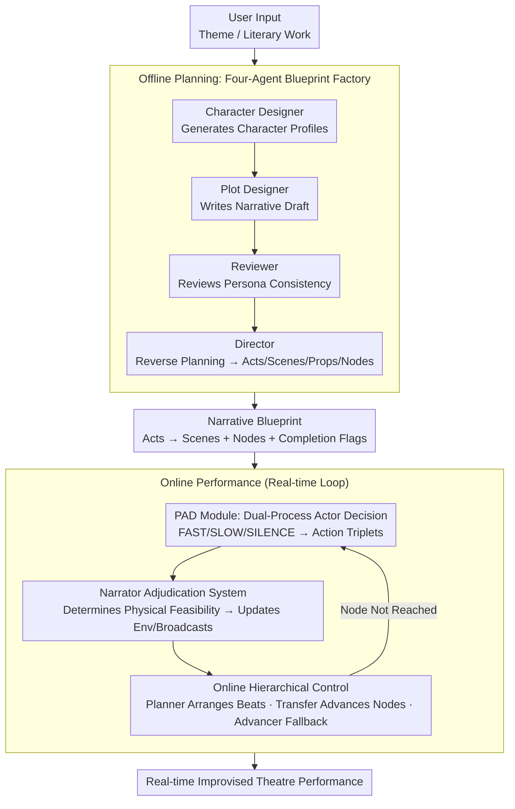

# HAMLET: A Hierarchical and Adaptive Multi-Agent Framework for Live Embodied Theatre

**Conference**: ICLR 2026  
**arXiv**: [2507.15518](https://arxiv.org/abs/2507.15518)  
**Code**: [https://github.com/HAMLET-2025/HAMLET](https://github.com/HAMLET-2025/HAMLET)  
**Area**: LLM Agent / Interactive Narrative  
**Keywords**: Multi-agent framework, Theatre performance, LLM Agent, Perception and decision-making, Interactive narrative

## TL;DR

The HAMLET multi-agent framework is proposed to decouple AI theatre creation and online performance into two stages: offline planning and online performance. Through a narrative blueprint, a Perception-and-Decision (PAD) module, and a hierarchical control system, it achieves an AI theatre experience characterized by proactive agency, physical environment interaction, and improvisational freedom.

## Background & Motivation

### Background
Creating immersive interactive theatre experiences is a long-standing goal in interactive narrative. While LLMs provide new pathways, existing LLM-driven theatre generation methods suffer from three key issues:

**Lack of Initiative**: AI agents typically wait passively for instructions and cannot make independent decisions.

**Inability to Interact with Physical Environments**: Character behaviors do not affect the stage environment, reducing theatre to abstract dialogue.

**Dependency on Detailed User Input**: Requirements for complete story outlines or detailed guiding paragraphs limit flexibility.

### Key Challenge
The paradigm shift from passive response to proactive guidance—AI actors need the ability to make autonomous decisions, cooperate or conflict in open scenarios, and actively drive the plot forward. This is a concrete manifestation of Agentic AI in theatrical performance.

## Method

### Overall Architecture

HAMLET addresses the problem of allowing AI to "create + perform in real-time" an immersive play from scratch, ensuring it neither deviates from the plot nor loses improvisational freedom. It decouples this process into two stages. The **Offline Planning Phase** utilizes four specialized agents to condense a simple user-provided theme (or literary work) into a structured **Narrative Blueprint**—defining acts, scenes, interactive props, and segmenting the plot into a series of narrative nodes with "completion flags." After loading the blueprint, the **Online Performance Phase** enters a real-time loop: each character produces candidate actions via their respective Perception-and-Decision (PAD) modules. A Narrator agent adjudicates whether these actions can physically occur on stage and updates the environment, while three control agents manage the "beats," determine if nodes are reached, and provide a fallback to advance the plot when it stalls. The former phase ensures a robust narrative skeleton, while the latter ensures actors are proactive, capable of improvisation, and can truly "act" to change the stage.

### Key Designs

**1. Offline Planning: A Blueprint Factory with Four-Agent Collaboration and Reverse Planning**

Generating a performable script with a single LLM often leads to loose logic and difficulty in maintaining constraints. HAMLET decomposes "playwriting" into a pipeline of four agents with clear divisions of labor. The **Actor Designer** first creates character profiles (static attributes like background/personality and dynamic ones like initial goals/core relationships) based on user input, utilizing external knowledge bases if necessary. The **Plot Designer** then writes a preliminary narrative draft. The **Reviewer** specifically checks for consistent character settings, clear motivations, and logical relationships to prevent discrepancies before performance. Finally, the **Director** performs structural finalization—dividing the play into Acts and Scenes, listing interactive props, and breaking the plot into **Narrative Points**, each with explicit completion flags and outcomes. A critical technique is the Director's use of **reverse planning**: defining the ending node first and working backward to fill in preceding nodes, ensuring every step converges toward the intended conclusion and preventing plot divergence during real-time performance.

**2. PAD Module: Embedding Dual-Process Theory into the Actor's Mind**

While the blueprint fixes the trajectory, what a character says or does at any moment is produced by the **Perceive And Decide (PAD)** module, which explicitly integrates intuitive and reflective reasoning. The input provides two perspectives: subjective internal states (Persona, subjective relationships, Memory, Goal) and objective external stimuli (environment descriptions, present characters, dialogue history, interactive objects). Decision-making is driven by **dual goals**—the public completion flag of the current node and the character's private goal (refreshed per node). The output corresponds to the two systems in Kahneman’s dual-process theory: **FAST** (System 1 intuitive response), **SLOW** (System 2 deliberate reflection), and **SILENCE** (choosing not to act), generating structured potential action triplets (Subject-Verb-Object) for environmental adjudication. The PAD itself is a fine-tuned 8B model trained to switch between these systems, allowing characters to react instantly or pause to reflect at critical junctures.

**3. Narrator Adjudication System: Allowing Characters to Truly Change the Stage**

A common flaw in pure dialogue systems is that character actions have no physical consequence. HAMLET introduces a **Narrator Agent** to adjudicate all physical interactions. When a character attempts a physical action, the Narrator judges its feasibility based on current environment states and physical rules. If feasible, the Narrator confirms the action, updates the environment, and broadcasts an objective description to all characters. If infeasible, it declares failure with a logical explanation (e.g., "The dagger is not in your inventory," "Humans cannot fly," or "The character is not in this scene"). This adjudication pulls theatre from abstract dialogue back to an embodied stage with cause and effect.

**4. Online Hierarchical Control: Multi-Trajectory Improvisation with Three-Agent Scheduling**

Performances are organized into a hierarchy of "Act → Scene + Node → Beat." A **Beat** is the smallest effective interaction step where a character takes an action to advance the situation. The blueprint only mandates the transition between nodes; **multiple trajectories** are allowed between two nodes. How characters argue, cooperate, or take detours is decided on the fly—this is the point of balance between structured narrative and open improvisation. To prevent this freedom from devolving into chaos, three control agents collaborate: the **Planner** breaks node completion flags into executable Beat sequences and presets multiple candidate trajectories; the **Transfer** periodically checks if node flags are met to advance to the next node and manages character entrances/exits; and the **Advancer** serves as a fallback mechanism—actively guiding relevant characters to take action if the plot stalls beyond a time threshold. Ablation studies show that removing the Advancer significantly drops the task completion rate to 68.7% and increases stagnation, proving its necessity as a "safety fuse."

## Key Experimental Results

To establish a quantifiable metric for theatrical quality, HAMLET is scored across three dimensions: Character Performance (consistency, emotional expression), Narrative Quality (coherence, structural integrity), and Interaction Experience (naturalness of environmental interaction, immersion). To reduce evaluation costs, the authors trained an 8B critic model, **HAMLETJudge**, to replace expensive human or large-model scoring. Win rates were compared against a GPT-4o baseline, allowing automatic 3D scoring across 100 cases.

### Main Results: Multi-Model Evaluation Leaderboard

| Model | English Avg | Chinese Avg | Total |
|------|----------|----------|------|
| Claude-4-sonnet-Thinking | 78.98 | 79.92 | **79.45** |
| Claude-4-sonnet | 76.92 | 79.68 | 78.30 |
| Qwen3-32B-Thinking | 69.10 | 78.59 | 73.85 |
| OpenAI-o3 | 69.45 | 77.89 | 73.67 |
| Qwen3-235B-A22B-Thinking | 70.74 | 75.92 | 73.33 |
| DeepSeek-R1-0528 | 66.58 | 79.37 | 72.98 |
| Qwen3-235B-A22B | 69.65 | 72.76 | 71.21 |
| Llama-3.1-8B | 35.51 | 33.83 | 34.67 |

### Dataset Composition

| Source | Count | Description |
|------|------|------|
| Chinese Classics | 25 | Literary excerpts |
| English Classics | 25 | Literary excerpts |
| Custom Themes | 50 | Covering 10 different themes |
| **Total** | **100 cases** | |

### Key Findings
- Reasoning models (e.g., Claude-4-sonnet-Thinking) generally perform best, though the advantage is less pronounced than expected.
- Performance in Chinese is generally superior to English (possibly due to better alignment between Chinese literature and the framework design).
- Small models (e.g., Llama-3.1-8B) perform significantly worse in theatrical performance.
- The PAD module (8B) achieves SOTA performance in specific decision-making tasks.
- HAMLETJudge (8B) provides a cost-effective and reliable evaluation alternative.

## Highlights & Insights

1. **Complete AI Theatre Pipeline**: An end-to-end framework from theme input to real-time online performance, filling a systematic gap in AI theatre.
2. **Cognitive Foundation for PAD**: Incorporates Kahneman's dual-process theory into AI actor decision-making, making responses more human-like.
3. **Reverse Planning Strategy**: The Director defines the ending first and builds backward, effectively preventing plot drift—a clever design for interactive narratives.
4. **Beat-driven Multi-trajectory Improvisation**: Allows for multiple paths between narrative nodes, balancing structural narrative with improvisational freedom.
5. **Physical Environment Interaction**: The Narrator adjudication system moves theatre beyond pure dialogue, enhancing embodiment and immersion.

## Limitations & Future Work

- Evaluation relies heavily on LLM-as-Judge (GPT-4o and HAMLETJudge), lacking large-scale human evaluation.
- The evaluation dataset of 100 cases is limited in scale.
- The current framework primarily supports text-based theatre; multi-modal elements (voice, vision, motion capture) are not yet integrated.
- The PAD module is a fine-tuned 8B model which may face latency issues in real-time performance.
- Interactive experiences involving human players were not fully evaluated in the paper.
- Maintaining consistency in long-form (multi-act) performances may face long-context challenges.

## Related Work & Insights

- **Dramatron** (Mirowski et al., 2023): Uses a hierarchical approach to separate planning from generation but lacks support for real-time performance.
- **CoSER** (Wang et al., 2025): Expands character counts but lacks a holistic evaluation of theatrical performance.
- **CharacterEval** (Tu et al., 2024): Multi-dimensional scoring for multi-turn dialogues, but limited to dual-character scenarios.
- **Kahneman’s Dual-Process Theory**: Serves as the cognitive science basis for the PAD module.
- Insight: The balanced design of hierarchical control and improvisational freedom is applicable to other agent systems such as game NPCs and virtual assistants.

## Rating
- Novelty: ⭐⭐⭐⭐ — Comprehensive and novel framework design with cognitive theory support for the PAD module.
- Experimental Thoroughness: ⭐⭐⭐ — Leaderboard evaluation is valuable, but lacks human assessment and extensive ablation studies.
- Writing Quality: ⭐⭐⭐⭐ — Clear framework descriptions and rich diagrams, though the paper is lengthier.
- Value: ⭐⭐⭐⭐ — Significant contribution to the fields of interactive narrative and AI theatre.

<!-- RELATED:START -->

## Related Papers

- [\[AAAI 2026\] Hierarchical Pedagogical Oversight: A Multi-Agent Adversarial Framework for Reliable AI Tutoring](../../AAAI2026/multi_agent/hierarchical_pedagogical_oversight_a_multi-agent_adversarial_framework_for_relia.md)
- [\[ICLR 2026\] From EduVisBench to EduVisAgent: A Benchmark and Multi-Agent Framework for Reasoning-Driven Pedagogical Visualization](from_eduvisbench_to_eduvisagent_a_benchmark_and_multi-agent_framework_for_reason.md)
- [\[CVPR 2026\] Visual Document Understanding and Reasoning: A Multi-Agent Collaboration Framework with Agent-Wise Adaptive Test-Time Scaling](../../CVPR2026/multi_agent/visual_document_understanding_and_reasoning_a_multi-agent_collaboration_framewor.md)
- [\[ACL 2026\] PosterForest: Hierarchical Multi-Agent Collaboration for Scientific Poster Generation](../../ACL2026/multi_agent/posterforest_hierarchical_multi-agent_collaboration_for_scientific_poster_genera.md)
- [\[ICLR 2026\] Adaptive Collaboration with Humans: Metacognitive Policy Optimization for Multi-Agent LLMs with Continual Learning](adaptive_collaboration_with_humans_metacognitive_policy_optimization_for_multi-a.md)

<!-- RELATED:END -->
