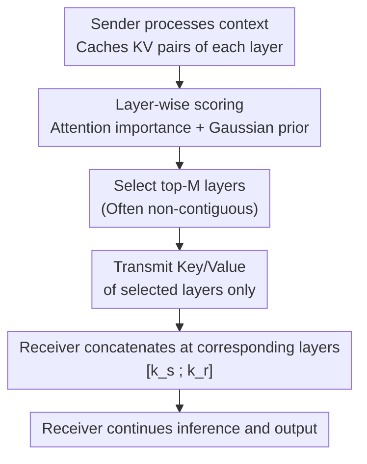

# KVComm: Enabling Efficient LLM Communication through Selective KV Sharing

**Conference**: ICLR 2026  
**arXiv**: [2510.03346](https://arxiv.org/abs/2510.03346)  
**Code**: To be confirmed  
**Area**: Agent / LLM Efficiency  
**Keywords**: LLM communication, KV cache sharing, multi-agent LLM, selective layer, attention importance  

## TL;DR
The KVComm framework is proposed to enable efficient communication between LLMs through selective sharing of KV pairs. It identifies an "information concentration bias" in hidden states that makes them unsuitable for cross-model transmission and designs a layer selection strategy based on attention importance paired with a Gaussian prior. Transmitting only 30% of layers outperforms most baselines.

## Background & Motivation
**Background**: Multi-LLM collaboration scenarios require efficient communication mechanisms. Existing methods transmit either hidden states or the full KV cache.

**Limitations of Prior Work**: ① The last token of hidden states is most critical in deep layers, but transmitting it overrides the Receiver's information. ② Full KV cache transmission involves excessive data volume.

**Key Challenge**: The balance between communication efficiency and information integrity.

**Goal**: To find the representation form and selection strategy best suited for cross-LLM transmission.

**Key Insight**: A systematic comparison between hidden states and KV pairs shows that KV pairs are naturally suitable—they allow for layer-wise selective transmission without overriding Receiver information.

**Core Idea**: KV pairs serve as the optimal communication medium. Selecting middle layers (semantically richest) combined with high-attention layers yields the optimal subset.

## Method

### Overall Architecture
KVComm addresses the problem of "how to efficiently transmit context information during the collaboration of multiple homogeneous LLMs." The mechanism works as follows: The Sender processes its context normally and caches the KV pairs of all layers. Instead of transmitting all layers, it uses a lightweight scoring function to calculate a "worthiness" score for each layer. The top-$M$ layers are selected, and only their Keys/Values are sent to the Receiver. Upon reception, the Receiver concatenates the sequences at the corresponding layers—$\mathbf{k}_r^l \leftarrow [\mathbf{k}_s^{l_i}; \mathbf{k}_r^l]$—before continuing inference. This mechanism requires zero training; the "intelligence" resides entirely in the scoring and layer selection step. By accurately selecting a few layers with rich semantics and concentrated attention, transmitting 30% of layers can surpass methods that transmit full hidden states.

### Key Designs

**1. Choosing KV pairs over hidden states as the medium: Avoiding overriding the Receiver's own representation**

Intuitively, hidden states are the most complete representation at each layer and seem ideal for transmission. However, the authors discovered an "information concentration bias"—the last token in deep layers carries nearly all context information. Once transmitted, it essentially replaces the Receiver's corresponding representation at that layer, flushing out the Receiver's own internal state. In contrast, KV pairs are inputs to the Attention mechanism rather than outputs. By concatenating the Sender's $\mathbf{k}_s$ and $\mathbf{v}_s$ to the end of the Receiver's KV sequence, the Receiver's Query simply gains more Keys to attend to, without altering a single byte of the original representation. This "addition instead of replacement" approach allows the softmax attention to autonomously decide whether and how much to utilize the Sender's information, naturally assigning low weights to useless components. Thus, KV communication is inherently more stable and controllable than hidden state communication.

**2. Layer selection scoring via Attention importance + Gaussian prior: Identifying the optimal subset with one calibration sample**

Since only partial layers are transmitted, the "worthiness" of each layer must be quantified. The authors calculate a weighted sum of two scores for each layer: first, attention importance, which averages the attention weights of all heads and queries for each context token:

$$\hat{S}_a^l = \frac{1}{H|Q|}\sum_h\sum_q\sum_c a_{h,q,c}^l$$

More concentrated attention indicates that the layer is more "focused" on the context and carries higher information density (supporting Hypothesis H2: layers with more concentrated attention distributions contain more information). Second, a Gaussian prior $P^l = \exp\!\big(-\frac{(l-\mu)^2}{2\sigma^2}\big)$ biases selection toward the middle layers of the network—because lower layers handle syntax and low-level features, while top layers are too tied to next-token prediction. Middle layers contain the most generic and transferable semantic and world knowledge (supporting Hypothesis H1: KV in middle layers contains the most transferable semantic knowledge). The final score $S^l = \alpha S_a^l + (1-\alpha) P^l$ determines the top-$M$ layers for transmission. This scoring system is robust even with **just one calibration sample**, making deployment costs extremely low. Furthermore, the selected layers are often non-contiguous, offering more flexibility than the contiguous chunk selection used in DroidSpeak. The two hypotheses support each component of the score, explaining why 30% of layers can outperform most baselines—reducing transmission is not a compromise but a precise selection of truly useful layers.

## Key Experimental Results

### Main Results (9 model pairs, 8 datasets)

| Model | Method | Countries | HotpotQA | MultiFieldQA |
|------|------|-----------|----------|-------------|
| Llama-3.2-3B | Skyline | 0.57 | 0.73 | 0.47 |
| Llama-3.2-3B | KVComm(0.5) | **0.57** | 0.57 | **0.51** |
| Llama-3.2-3B | NLD | 0.51 | 0.47 | 0.38 |
| Llama-3.2-3B | AC | 0.35 | 0.32 | 0.29 |

### Ablation Study

| Transmission Ratio | Effect |
|---------|------|
| 30% Layers | Surpasses NLD/CIPHER/AC baselines |
| 50% Layers | Close to Skyline |
| 70% Layers | Approaching or surpassing Skyline |
| Non-contiguous vs. Contiguous | Non-contiguous is significantly superior |

### Key Findings
- KV pairs for only 30% of layers surpass most baselines—selectivity > quantity.
- Outperforms Skyline on MultiFieldQA (0.51 vs 0.47)—selective sharing has a regularization effect.
- The AC method performs close to the no-communication baseline on most datasets.
- Computational overhead reduced by 2.5x-6x compared to NLD.

## Highlights & Insights
- The **information concentration bias of hidden states** is a significant discovery, serving as a warning for all LLM communication methods based on hidden states.
- **"Less is More"**—KV pairs from 30-50% of layers perform better than full hidden states.
- The **Gaussian prior for middle-layer selection** is simple yet effective.
- Layer selection can be finalized with only 1 calibration sample, making it extremely lightweight for deployment.

## Limitations & Future Work
- Only supports communication between homogeneous base models; does not support heterogeneous models.
- Layer indices must correspond one-to-one, limiting communication between models of different scales.
- $\mu$ and $\sigma$ for the Gaussian prior require hyperparameter tuning.
- Only validated in two-agent scenarios.
- Gains in mathematical reasoning are not significant.

## Related Work & Insights
- **vs NLD**: NLD compresses data into natural language, causing significant information loss; KVComm directly transmits internal representations.
- **vs CIPHER**: CIPHER transmits hidden states and is thus affected by information concentration bias.
- **vs DroidSpeak**: DroidSpeak's contiguous chunk selection is less flexible than non-contiguous selection.
- Insights for multi-agent LLM system design: KV cache sharing may become a standard communication primitive.

## Supplementary Technical Details

### Why are KV Pairs better than Hidden States for communication?
Hidden states are complete representations at each layer; direct transmission overrides the Receiver's corresponding layer representation. KV pairs are inputs to the Attention mechanism; appending them to the Receiver's KV sequence does not destroy existing information but allows the Attention mechanism to naturally decide which information to focus on. This "addition instead of replacement" characteristic is the core advantage of KV communication.

### Why are middle layers the most valuable?
Research indicates LLM layers can be categorized into three functional zones: lower layers (low-level features, syntax), middle layers (semantic knowledge, world knowledge), and top layers (task-specific representations, next-token prediction). Semantic knowledge in middle layers is the most generic and transferable, whereas lower layers are too low-level and top layers are too task-specific for cross-model transmission.

### Relation to Prompt Compression
KVComm can be viewed as "prompt compression in the KV space"—compressing the "layer" dimension of internal representations rather than compressing text. This preserves more fine-grained information than NLD (which compresses knowledge into natural language). Future work could explore intra-layer compression (e.g., selective tokens) to achieve dual-dimension "layer + token" compression.

### Attention Mechanism in KV Concatenation
When the Sender's KV is concatenated to the Receiver, the Receiver's Query can freely attend to both parties' Keys. Since Attention is softmax-normalized, useless information is naturally down-weighted. This is more "gentle" than direct hidden state replacement—it does not forcibly overwrite any information.

## Rating
- Novelty: ⭐⭐⭐⭐ Systematic comparison of communication media; reasonable layer selection strategy.
- Experimental Thoroughness: ⭐⭐⭐⭐ 9 model pairs × 8 datasets.
- Writing Quality: ⭐⭐⭐⭐ Clear hypothesis-verification logic.
- Value: ⭐⭐⭐⭐ Practical significance for multi-LLM collaboration.

<!-- RELATED:START -->

## Related Papers

- [\[ICLR 2026\] Learning Efficient and Interpretable Multi-Agent Communication](learning_efficient_and_interpretable_multi-agent_communication.md)
- [\[ICLR 2026\] Stop Wasting Your Tokens: Towards Efficient Runtime Multi-Agent Systems](stop_wasting_your_tokens_towards_efficient_runtime_multi-agent_systems.md)
- [\[AAAI 2026\] iMAD: Intelligent Multi-Agent Debate for Efficient and Accurate LLM Inference](../../AAAI2026/multi_agent/imad_intelligent_multi-agent_debate_for_efficient_and_accura.md)
- [\[ACL 2026\] CIA: Inferring the Communication Topology from LLM-based Multi-Agent Systems](../../ACL2026/multi_agent/cia_inferring_the_communication_topology_from_llm-based_multi-agent_systems.md)
- [\[ICLR 2026\] Benefits and Limitations of Communication in Multi-Agent Reasoning](benefits_and_limitations_of_communication_in_multi-agent_reasoning.md)

<!-- RELATED:END -->
