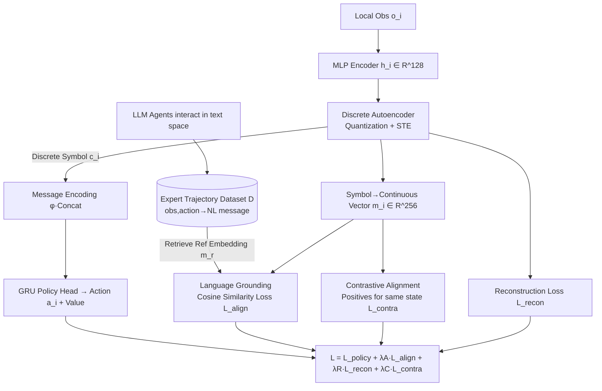

# Learning Efficient and Interpretable Multi-Agent Communication

**Conference**: ICLR 2026  
**OpenReview**: [https://openreview.net/forum?id=a3CUE06G5Y](https://openreview.net/forum?id=a3CUE06G5Y)  
**Code**: To be confirmed  
**Area**: Multi-Agent Systems / Communication Learning  
**Keywords**: Multi-agent communication, discrete communication protocols, Information Bottleneck, LLM semantic alignment, contrastive learning, interpretability  

## TL;DR
GLC unifies "discrete autoencoder compression + LLM offline semantic anchoring + inter-agent contrastive alignment" into an Information Bottleneck framework. This allows learned multi-agent communication protocols to achieve extreme bandwidth efficiency, strong task performance, and human readability simultaneously, breaking the "trilemma" of communication efficiency, utility, and interpretability.

## Background & Motivation

**Background**: In partially observable environments, Multi-Agent Reinforcement Learning (MARL) must rely on communication to overcome individual perceptual blind spots for coordination. Existing methods generally fall into three categories: utility-centric (CommNet, IC3Net, TarMAC, MAGIC), which learn continuous communication vectors end-to-end for strong task performance but lack protocol transparency and consume high bandwidth; efficiency-centric (aeComm, VQ-VIB), which use autoencoders to compress observations into discrete symbols to save bandwidth but result in symbols without semantics that fail to generalize to unfamiliar partners; and interpretability-centric (LangGround, etc.), which leverage pre-trained language models to map communication vectors to natural language semantics, but revert to continuous representations and high communication overhead.

**Limitations of Prior Work**: Each of the three existing directions occupies only one corner of the requirements; none satisfy all simultaneously. **Key Challenge**: The paper emphasizes the "trilemma"—task utility, communication complexity (bandwidth), and informativeness (interpretability) are naturally mutually exclusive. More compression makes interpretation harder; better interpretation usually costs more bandwidth; and prioritizing both often degrades task performance.

**Goal**: To learn a communication protocol that scores high in all three dimensions and can adaptively adjust based on task priorities.

**Core Idea (Unifying the Trilemma via Information Bottleneck)**: The paper formalizes the trilemma using Information Bottleneck (IB) principles as "maximizing task-relevant information while minimizing message complexity." It employs three complementary modules for each corner: a **discrete autoencoder** for compression (reducing complexity), **LLM linguistic grounding** for semantic readability (preserving informativeness/interpretability), and **contrastive learning** for inter-agent consistency (ensuring utility). A crucial design is the **training-deployment decoupling**: the model utilizes LLM expert trajectories and contrastive loss for supervision during training, while during inference, agents communicate solely via discrete symbols without relying on external supervision.

## Method

### Overall Architecture
GLC (Grounding Language and Contrastive learning) consists of four synergistic modules: the MARL agent module uses a discrete autoencoder to compress local observations into symbols and generate actions; the LLM agent module executes in a text space to generate semantic-rich expert trajectories as an offline dataset $\mathcal{D}$; the MARL-LLM language grounding module aligns discrete symbol embeddings with LLM-generated message embeddings; and the communication alignment contrastive learning module forces all agents to "speak the same language" for the same state. These modules are jointly optimized by a multi-objective loss, with a scheduler dynamically adjusting weights based on IB annealing ideas.

### Key Designs

**1. Discrete Autoencoder Compression: Compressing bandwidth to dozens of bits using quantized symbols.** Each agent's observation is first encoded via an MLP into a 128D feature $h_i^{t-1}$, then mapped to a discrete communication symbol $c_i^{t-1}$ by a 3-layer MLP autoencoder, and finally reconstructed back to $\hat{h}_i^{t-1}$ at the decoding end. Since quantization breaks gradients, the authors use a straight-through estimator (STE) for backpropagation and add a reconstruction auxiliary loss $\mathcal{L}_{recon}=\lVert h_i^{t-1}-\hat{h}_i^{t-1}\rVert_2^2$ to ensure critical information is not lost during compression. At the next timestep, agents linearly project, concatenate, and pass all received symbols $c^{t-1}$ through a 3-layer MLP to obtain a fixed-dimensional message representation $\phi(c^{t-1})$, which is concatenated with their own features and fed into a GRU policy head. This discretization reduces communication per step to the magnitude of 32 bits, two to three orders of magnitude less than continuous vector methods.

**2. LLM Offline Semantic Grounding: Making symbols "speak human" without requiring LLMs during inference.** Communication symbols lack innate semantics. GLC adopts ideas from LangGround, allowing LLM embodied agents to interact in a text space informationally equivalent to the physical task space—using a text interface $I$ for bidirectional conversion between natural language and abstract representations. Under general task instructions, LLMs spontaneously generate messages and actions, forming an expert trajectory dataset $\mathcal{D}$ (mapping (obs, action) to natural language messages). During training, the MARL agent maps discrete symbols to 256D vectors $m_i=\phi(c_i^t)$, retrieves semantically related reference message embeddings $m_r$ from $\mathcal{D}$ based on current (obs, action), and narrows the gap using a conditional cosine alignment loss:

$$\mathcal{L}_{align}=\mathbb{I}_{\mathcal{D}}(o_i^t,a_i^t)\cdot\left(1-\frac{(m_i^t)^\top m_r}{\lVert m_i^t\rVert\cdot\lVert m_r\rVert}\right)$$

The indicator function $\mathbb{I}_{\mathcal{D}}$ enables supervision only when the state-action pair exists in the expert set. Consequently, symbols are anchored into a semantic space shared with human language. Readability comes from LLM supervision during training, but no LLM calls are needed during inference—enabling training-deployment decoupling.

**3. Contrastive Alignment: Forcing agents to "say the same thing for the same situation."** Linguistic semantics alone is insufficient; multiple agents might speak differently, leading to mutual misunderstanding. For each message $m_i^t=\phi(c_i^t)$, GLC treats messages generated by other agents observing the same state within a time window $[t-w,t+w]$ in the same trajectory as the positive sample set $H(m_i^t)$. Messages from other trajectories in the same batch represent negative samples. It optimizes a supervised contrastive loss:

$$\mathcal{L}_{contra}=\sum_{m_i^t}\frac{-1}{|H(m_i^t)|}\sum_{m_h\in H(m_i^t)}\log\frac{\exp(m_i^t\cdot m_h/\rho)}{\sum_{m_z\in Z(m_i^t)}\exp(m_i^t\cdot m_z/\rho)}$$

where $\rho$ is the temperature (set to 0.1) and $Z$ represents all messages in the batch except itself. The time window is set to 5 steps, and embeddings are normalized. This term ensures protocol consistency across all agents, supporting high task utility and generalization to unfamiliar teammates.

**4. Multi-objective Dynamic Annealing: Achieving "learn semantics then compress" via scheduling.** The four losses are combined into $\mathcal{L}=\mathcal{L}_{policy}+\lambda_A\mathcal{L}_{align}+\lambda_R\mathcal{L}_{recon}+\lambda_C\mathcal{L}_{contra}$. GLC does not treat weights as fixed hyperparameters but schedules them dynamically based on IB annealing: $\lambda_A$ (alignment weight) is preset based on the task—higher for complex tasks like USAR needing rich semantics, lower for Predator-Prey; $\lambda_R$ (compression weight) uses linear annealing from 0.01 to 0.1, implementing an "explore-then-compress" strategy; $\lambda_C$ (consistency weight) is fixed at a moderate value. A lightweight scheduler updates these weights in real-time, allowing the protocol to evolve adaptively with task constraints and learning stages.

## Key Experimental Results

Evaluations were conducted on Predator-Prey (ppv1 partially visible / ppv0 fully blind) and USAR (Urban Search and Rescue, heterogeneous roles), comparing against IC3Net, aeComm, LangGround, VQ-VIB, and a no-communication baseline (noComm), addressing Q1–Q7 (Utility/Efficiency/Interpretability/Trade-off/Generalization/Ablation/Scalability). Hardware: Single RTX 4090, 3 random seeds.

### Main Results—Communication Efficiency (ppv1, theoretical bits per agent to complete task)

| Method | Bits/Step | Avg. Steps | Total Bits | Ratio to GLC |
|------|-----------|----------|--------|----------------|
| **GLC** | **32.0** | **4.5** | **144.0** | **1.0** |
| LangGround | 8192.0 | 5.3 | 43417.6 | 301.5 |
| IC3Net | 8192.0 | 5.5 | 45056.0 | 312.9 |
| aeComm | 24.0 | 5.4 | 129.6 | 0.9 |
| VQ-VIB | 58.0 | 7.2 | 417.6 | 2.9 |
| NoComm | 0.0 | 6.6 | 0.0 | — |

GLC uses only 32 bits per step, ~300x less than continuous vector methods (8192 bits). While aeComm has slightly lower bits per step, GLC completes tasks in 4.5 steps on average (vs 5.3–7.2 steps), and this efficient coordination further lowers total communication costs.

### Interpretability (Q3, semantic alignment with LLM messages)

| Env | Cos sim (GLC / LangGround) | BLEU (GLC / LangGround) |
|------|------------------------------|---------------------------|
| ppv0 | 0.87±0.02 / 0.82±0.02 | 0.65±0.04 / 0.52±0.03 |
| ppv1 | 0.86±0.03 / 0.81±0.03 | 0.54±0.10 / 0.45±0.12 |
| USAR | 0.84±0.07 / 0.79±0.12 | 0.51±0.05 / 0.42±0.04 |

GLC slightly outperforms LangGround (specifically designed for interpretability) in Cosine similarity and BLEU. Methods without language alignment were excluded as their interpretability is near random. t-SNE+DBSCAN visualization shows symbols spontaneously clustering into semantic groups corresponding to specific environment states (e.g., a "red cluster" corresponding to "prey invisible at (B,3)," with the nearest natural language being "moving right from (B,3)").

### Ablation Study—Dynamic vs. Static Weights (ppv0)

| Method | Episode Length ↓ | Total Bits ↓ | BLEU ↑ |
|------|----------------|----------|--------|
| GLC (Fixed Weights) | 9.62±0.03 | 307.8±0.96 | 0.65±0.04 |
| GLC (Dynamic Weights) | 8.71±0.04 | 278.7±1.28 | 0.62±0.05 |

Dynamic annealing leads to faster task completion and lower total communication cost at the expense of a negligible drop in interpretability, validating the "explore-then-compress" trajectory.

**Key Findings**:
- **Protocols adapt to environment pressure**: In ppv0 (blind), pressure shifts toward utility and coordination; in ppv1 (visible), pressure shifts toward efficiency and minimal bandwidth; in USAR (complex), pressure shifts toward interpretability and natural language alignment. GLC does not seek a single point in the trilemma but shifts dynamically based on the task.
- **Discrete compression + semantic grounding can coexist**: Contrary to the belief that compression inevitably sacrifices semantics, GLC proves strong semantic expression can be maintained under high compression.

## Highlights & Insights
- **Explicitly links the "trilemma" to the IB principle**, giving three engineering-heavy modules theoretical grounding (complexity/information/utility) rather than just being a "bag of losses."
- **Training-deployment decoupling** is a practical masterstroke: inference requires no LLM and only dozens of bits, making the method applicable to bandwidth-constrained robot swarms or autonomous vehicle fleets.
- **Dynamic weight annealing** treats "learn semantics then compress" as a schedulable process, squeezing out more efficiency than static weighting and revealing the inherent rhythm of protocol evolution.
- Using LLMs to generate expert trajectories offline as semantic anchors bypasses the high cost of manual annotation for communication semantics—a clever "LLM-for-MARL" application.

## Limitations & Future Work
- Evaluation is limited to Predator-Prey and USAR grid/rescue benchmarks; performance on larger agent counts, continuous control, or real robot systems is yet to be verified.
- Interpretability depends on the coverage quality of the offline dataset $\mathcal{D}$ and the quality of LLM trajectories; state-action pairs outside $\mathcal{D}$ lack alignment supervision, potentially causing semantic drift in rare cases.
- Future work mentioned: incorporating real-time human feedback for dynamic alignment, extending to multi-modal signals, injecting structured semantic constraints/knowledge graphs, and providing deeper theoretical analysis of emergent communication generalization.
- $\lambda_A$ still requires manual presetting per task; automated determination of priority across tasks remains unresolved.

## Related Work & Insights
- **Utility-centric** (CommNet, IC3Net, etc.): Continuous vectors with strong performance but opaque, high bandwidth. GLC’s contrastive consistency loss inherits their pursuit of coordination utility.
- **Efficiency-centric** (aeComm, VQ-VIB): GLC’s discrete autoencoder is similar but fills the semantic grounding gap.
- **Interpretability-centric** (LangGround, linguistic grounding): GLC directly benchmarks against LangGround, proving discrete symbols can match or exceed its readability while saving hundreds of times the bandwidth.
- **Insight**: When multiple goals conflict, instead of a static compromise, linking them to an information-theoretic framework and using scheduling to let weights drift across stages/tasks is a powerful strategy—this "dynamic trade-off" approach is transferable to other multi-objective representation learning tasks (e.g., multi-modal compression, privacy-utility trade-offs).

## Rating
- **Novelty**: ⭐⭐⭐⭐ First to systematically unify the communication trilemma via IB, solving it with a "compression + grounding + consistency + annealing" suite; the training-deployment decoupling is practical and non-obvious.
- **Experimental Thoroughness**: ⭐⭐⭐⭐ Covers 7 research questions. Demonstrates order-of-magnitude advantages in efficiency and provides both quantitative and visual evidence for interpretability. However, benchmarks are limited to two types, and agent scales are relatively small.
- **Writing Quality**: ⭐⭐⭐⭐ Clear motivation regarding the trilemma, precise mapping between modules and losses; some results for Q5–Q7 being in the appendix slightly affects the main text's completeness.
- **Value**: ⭐⭐⭐⭐ Directly addresses real-world needs for low-bandwidth, human-interpretable coordination, offering direct reference for robot swarms and autonomous driving.

<!-- RELATED:START -->

## Related Papers

- [\[ICLR 2026\] KVComm: Enabling Efficient LLM Communication through Selective KV Sharing](kvcomm_enabling_efficient_llm_communication_through_selective_kv_sharing.md)
- [\[ICLR 2026\] Stop Wasting Your Tokens: Towards Efficient Runtime Multi-Agent Systems](stop_wasting_your_tokens_towards_efficient_runtime_multi-agent_systems.md)
- [\[ICLR 2026\] Learning to Summarize by Learning to Quiz: Adversarial Agentic Collaboration for Long Document Summarization](learning_to_summarize_by_learning_to_quiz_adversarial_agentic_collaboration_for_.md)
- [\[AAAI 2026\] ARCANE: A Multi-Agent Framework for Interpretable and Configurable Alignment](../../AAAI2026/multi_agent/arcane_a_multi-agent_framework_for_interpretable_and_configurable_alignment.md)
- [\[ICLR 2026\] Benefits and Limitations of Communication in Multi-Agent Reasoning](benefits_and_limitations_of_communication_in_multi-agent_reasoning.md)

<!-- RELATED:END -->
