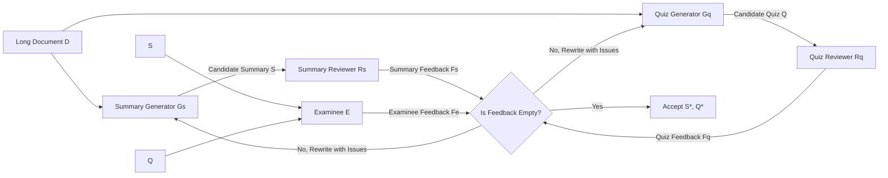

# Learning to Summarize by Learning to Quiz: Adversarial Agentic Collaboration for Long Document Summarization

**Conference**: ICLR 2026  
**OpenReview**: [https://openreview.net/forum?id=WAQhCifBSb](https://openreview.net/forum?id=WAQhCifBSb)  
**Code**: [https://github.com/weixuan-wang123/SummQ](https://github.com/weixuan-wang123/SummQ)  
**Area**: Multi-agent Systems / Long Document Summarization  
**Keywords**: Long Document Summarization, Multi-agent, Adversarial Collaboration, LLM-as-a-Judge, Quiz Verification  

## TL;DR
SUMMQ structures "summarization" and "quizzing" as a pair of adversarial multi-agent tasks: the summarizer is responsible for full-text coverage, while the quizzer interrogates whether the summary omits information or exhibits distortion. An additional "examinee" agent validates if the summary can answer the quiz, utilizing multi-round feedback to refine the summary for improved completeness and factual consistency in long documents.

## Background & Motivation
**Background**: Long document summarization (research papers, legal documents, books) remains a significant challenge for LLMs. Despite advancements in long-context capabilities, issues such as information loss, factual inconsistency, and poor coherence across paragraphs persist when processing extremely long documents. Subtle relationships between distant pieces of information are often discarded, leading to hallucinations.

**Limitations of Prior Work**: Multi-agent systems have demonstrated potential in complex reasoning but remain under-explored for long document summarization. Crucially, existing multi-agent summarization methods largely rely on **self-verification**, where a model checks its own output. This introduces systematic biases, as models often fail to detect their own errors, leading to a "self-echoing" effect.

**Key Challenge**: There is a lack of an "external, falsifiable" evaluation signal for summary quality. Simply asking a model to "re-read its summary" cannot expose omissions, because the omitted content is precisely what is missing from the summary itself.

**Goal**: Construct a mechanism that continuously interrogates whether a summary is comprehensive and factually accurate, forcing the summary to passively expose and repair defects through iteration.

**Core Idea**: **Adversarial Dual-Tasking**—pairing summarization and quizzing as natural opponents. The summarization agent strives to cover the text so that all quiz questions can be answered, while the quizzing agent specifically targets information coverage, factuality, and coherence to find flaws. An "examinee" then attempts to answer questions using only the summary; any failure to answer indicates an omission. This mechanism transforms the subjective quality of a summary into a verifiable, objective signal: "Can the questions be answered based on the summary?"

## Method

### Overall Architecture
SUMMQ is organized around two tasks (Summarization / Quizzing) and two roles (Generator / Reviewer), yielding four groups of agents: Summary Generator $G_s$, Quiz Generator $G_q$, Summary Reviewer $R_s$, and Quiz Reviewer $R_q$, plus an Examinee $E$. In each iteration, generators produce candidate summaries $S^{(t)}$ and quizzes $Q^{(t)}$. Reviewers identify errors to provide feedback $F_s^{(t)}$ and $F_q^{(t)}$. The examinee answers questions using only the summary and provides feedback $F_e^{(t)}$ on unanswerable items. If all feedback is empty (no issues), the result is accepted; otherwise, the agents proceed to the next round with the collected feedback, up to $T_{iter}$ rounds.

### Key Designs

**1. Summarization-Quizzing Adversarial Task: Translating "Quality" into "Answerability".** The core design of SUMMQ is the mutual constraint between summarization and quizzing. The objective function of the summary is implicitly rewritten as "ensuring that the generated quiz questions can be answered using the summary." Conversely, the quizzer intentionally designs questions around information coverage, factual details, and logical coherence. The quiz generator produces 30 question-answer pairs per quiz (10 multiple-choice, 10 true/false, 10 short-answer). Any critical information omitted by the summary becomes an "unanswerable" question, leading to precise localization of the flaw. Ablation studies show that removing the entire quiz mechanism (generator, reviewer, examinee) causes the MENSA BSF1 to drop from 62.76 to 60.59, and SUMMQ_SOLO to plummet from 61.84 to 55.44, proving this adversarial signal is the backbone of the framework.

**2. Four-stage Generator Collaboration: From Independent Drafts to Collective Voting.** To overcome the limited perspective of a single generator, SUMMQ directs a set of generators $G=\{g_i\}$ to first independently draft $z_i$ (draft set $Z=\{z_1,\dots,z_n\}$). It then follows three convergence paths: an Aggregator $A_{Agg}$ merges multiple drafts into a unified version $z_{agg}$ to incorporate complementary information; a Ranker $A_{Ranker}$ identifies the single strongest draft $z_{best}$ as a safeguard against dilution; finally, all generators vote on the candidate set $C=\{z_{agg}, z_{best}\}$, where $z^*=\arg\max_{z\in C}|\{j: vote_j=z\}|$. This "independent drafting-aggregation-selection-voting" pipeline ensures both diversity and quality.

**3. Reviewer Controversy-Debate Adjudication: Distinguishing Genuine Issues via Consensus.** Reviewing is not merely scoring but a four-stage process to identify true issues. Each reviewer $r_i$ independently marks issues (factual errors, omissions, redundancy) as set $A_i$. Issues are then triaged: those marked by $\ge 2$ reviewers are categorized as **Confirmed Issues** $M$, while those marked by fewer than 2 are **Controversial Issues** $C$. For controversies, a $T_{debate}$ round of debate is triggered: reviewers use the original document $D$ and summary/quiz $z$ as evidence to argue, followed by a majority vote to determine if the issue stands. The resulting valid controversial issues $K$ are combined with $M$ to form the final issue list $I=M\cup K$, which is fed back to the generators. This "debate + voting" mechanism filters out noise from individual reviewer misjudgments.

**4. Examinee Closed-loop Verification: Falsifiable External Signal.** The examinee $E$ takes the quiz using only the summary (`TAKEQUIZ`). Its feedback $F_e^{(t)}$ is split by question attribution and merged into the summary and quiz feedback streams. This step transforms "summary self-consistency" into a falsifiable test: if the summary lacks the information required for a question, the examinee fails, and the issue is localized to the summary side. Unlike reviewers who check for errors against the original text (external reference), the examinee checks for self-consistency (internal reference), providing complementary coverage of "accuracy" and "completeness."

## Key Experimental Results

### Main Results
Comparison on three long document summarization benchmarks (ROUGE-1/2/L and BERTScore-F1, using GPT-4O as the default backbone, 3 agents per component, $T_{iter}=3$, $T_{debate}=1$):

| Method | MENSA R-1 | MENSA R-L | MENSA BSF1 | BookSum R-1 | BookSum R-L | GovReport R-1 |
|------|-----------|-----------|------------|-------------|-------------|---------------|
| GPT-4O (prompting) | 25.78 | 13.59 | 59.67 | 23.02 | 12.23 | 31.42 |
| GPT-5 (prompting) | 37.38 | 17.11 | 60.44 | 23.98 | 12.38 | 41.52 |
| O3 (prompting) | 32.84 | 17.09 | 59.27 | 22.00 | 11.51 | 38.28 |
| HM-SR (multi-agent) | 34.26 | 13.46 | 60.22 | - | - | - |
| **SUMMQ_SOLO** | 39.30 | 17.12 | 61.84 | 33.33 | 15.47 | 48.71 |
| **SUMMQ_COMBO** | **41.58** | **18.24** | **62.76** | **44.62** | **20.38** | **52.79** |

SUMMQ_COMBO achieved the best performance across all metrics on MENSA and BookSum. The improvement on BookSum is particularly significant (R-1 increased from GPT-5's 23.98 to 44.62). On GovReport, while some supervised fine-tuning baselines (U.FORMER/SLED/CACHED) outperformed SUMMQ_COMBO in specific metrics due to task-specific training, SUMMQ_COMBO still surpassed all prompting-based baselines.

### Ablation Study
Key ablations on MENSA (SUMMQ_COMBO, GPT-4O):

| Setting | R-1 | R-L | BSF1 |
|------|-----|-----|------|
| Single component to 3 agents - Summary Generator | 40.72 | 18.07 | 62.53 |
| Single component to 3 agents - Summary Reviewer | 41.20 | 17.93 | 61.99 |
| **SUMMQ_COMBO (All 3 agents)** | 41.58 | 18.24 | 62.76 |
| **w/o quiz (Remove Quiz Mechanism)** | 39.49 | 17.13 | 60.59 |
| Iteration $T_{iter}=1$ | 38.14 | 17.85 | 62.60 |
| Iteration $T_{iter}=3$ | 41.58 | 18.24 | 62.76 |
| Iteration $T_{iter}=5$ | 41.53 | 18.21 | 62.55 |
| Agents = 1 / Component | 39.30 | 17.12 | 61.84 |
| Agents = 5 / Component | 42.52 | 18.56 | 62.96 |

### Key Findings
- **The Quiz Mechanism is Critical**: After its removal, the BSF1 of SUMMQ_SOLO dropped from 61.84 to 55.44, the largest decrease observed, proving that adversarial signals are more crucial than simply increasing the number of agents.
- **Optimal Iterations**: Performance improves from 1 to 3 rounds but yields diminishing or negative returns after 3 rounds, suggesting that excessive iteration introduces noise or over-refinement.
- **More Agents Help but with Diminishing Returns**: Performance rises steadily from 1 to 5 agents, but increments decrease while costs scale linearly, representing a quality-compute trade-off.
- **Backbone Robustness**: SUMMQ significantly outperforms baselines across various closed-source and open-source models, such as GPT-4.1, O3, DeepSeek-R1, and Qwen3-32B (e.g., R-1 on GPT-4.1 increased from 30.31 to 49.17).
- **Human Evaluation Superiority**: SUMMQ_COMBO achieved win rates of 88% and 82% against GPT-4O and O3, respectively. Even after using a shortened version SUMMQ_COMBO_R to eliminate length bias, win rates remained high at 65% and 60%.

## Highlights & Insights
- **Outsourcing "Judgment" to an Adversarial Task** is the most innovative contribution: the blind spot of traditional self-verification is that models cannot see what they omit. The quiz-answer loop makes missing information visible through "unanswerable questions," creating a falsifiable, externalized quality signal.
- **The Reviewer Debate Mechanism** carefully addresses the common "noisy voting" issue in multi-agent systems. By using $\ge 2$ votes for consensus and debating only controversies, it saves computation while filtering misjudgments.
- The framework is backbone-agnostic. Even weaker models like Qwen3-32B are significantly elevated by this collaboration, indicating that gains stem from mechanism design rather than purely relying on a powerful base model.

## Limitations & Future Work
- **High Compute Cost**: Four components × multiple agents × multiple iterations × debates lead to token consumption far exceeding single prompting. The paper acknowledges that increasing agents leads to disproportionate cost-to-benefit ratios.
- **Reliance on Backbone Quality**: Summary quality remains strongly correlated with the base model; weaker models still yield lower absolute scores as the mechanism cannot compensate for poor foundational capabilities.
- **Quiz Coverage as an Upper Bound**: If a quiz fails to cover a specific key point, an omission regarding that point remains undetected—the quality ceiling is bounded by the quiz's scope.
- **Evaluation Bias**: The evaluation relies heavily on automated metrics and LLM-as-a-Judge. The human evaluation scale was relatively small (20 NLP papers, 5 PhD students), and generalization to legal or literary genres requires further verification.

## Related Work & Insights
- **Multi-agent Collaboration**: This work extends the concepts of multi-agent debate and discussion used in reasoning, paper reviewing, and code generation, but systematizes them for long document summarization using "dual-task adversarialism" instead of single-task collaboration.
- **Long Document Summarization**: Unlike architectural approaches such as sparse attention, long-context fine-tuning, memory enhancement, or chunked sliding windows, this work utilizes pure prompting and agent orchestration without modifying model structures.
- **Insights**: The paradigm of "using an adversarial task to manifest implicit defects of the target task" is transferable to scenarios like code generation (using test cases as the quiz) or RAG (using Q&A to verify retrieval completeness). The dual external signal design (Examinee + Reviewer) is valuable for any generation task requiring factual verification.

## Rating
- Novelty: ⭐⭐⭐⭐ The summarization-quizzing adversarial task and examinee loop are distinctive mechanisms that convert self-verification blind spots into falsifiable signals.
- Experimental Thoroughness: ⭐⭐⭐⭐ Robust across three benchmarks, multiple backbones, and triple evaluation (Auto/LLM/Human), though human evaluation scale is small and cost metrics are not fully quantified.
- Writing Quality: ⭐⭐⭐⭐ Clear algorithm pseudocode, intuitive framework diagrams, and well-described four-stage collaboration.
- Value: ⭐⭐⭐⭐ Provides a plug-and-play, backbone-robust solution for long document summarization with high transferability, though high costs may limit practical deployment.

<!-- RELATED:START -->

## Related Papers

- [\[ICLR 2026\] AgentPO: Enhancing Multi-Agent Collaboration via Reinforcement Learning](agentpo_enhancing_multi-agent_collaboration_via_reinforcement_learning.md)
- [\[AAAI 2026\] Learning to Generate and Extract: A Multi-Agent Collaboration Framework for Zero-shot Document-level Event Arguments Extraction](../../AAAI2026/multi_agent/learning_to_generate_and_extract_a_multi-agent_collaboration_framework_for_zero-.md)
- [\[ICLR 2026\] Learning Efficient and Interpretable Multi-Agent Communication](learning_efficient_and_interpretable_multi-agent_communication.md)
- [\[NeurIPS 2025\] The PokeAgent Challenge: Competitive and Long-Context Learning at Scale](../../NeurIPS2025/multi_agent/the_pokeagent_challenge_competitive_and_long-context_learning_at_scale.md)
- [\[ICLR 2026\] Context Learning for Multi-Agent Discussion](context_learning_for_multi-agent_discussion.md)

<!-- RELATED:END -->
