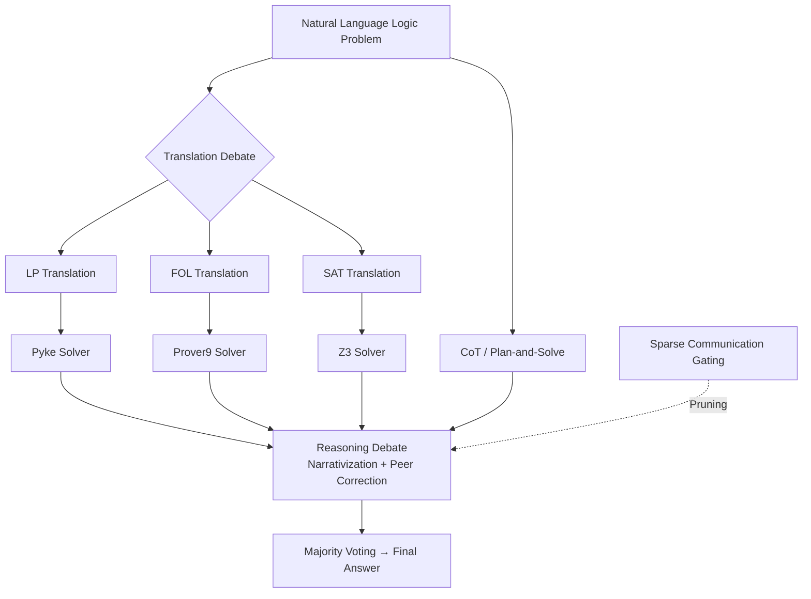

# MAD-Logic: Multi-Agent Debate Enhances Symbolic Translation and Reasoning

**Conference**: ICLR 2026  
**OpenReview**: [https://openreview.net/forum?id=rdE9qxGfIv](https://openreview.net/forum?id=rdE9qxGfIv)  
**Code**: [https://github.com/yhc-666/MAD-Logic](https://github.com/yhc-666/MAD-Logic)  
**Area**: Neural-Symbolic Reasoning / Multi-Agent Debate / Logical QA  
**Keywords**: Logical Reasoning, Symbolic Translation, Multi-Agent Debate, Sparse Communication, Majority Voting  

## TL;DR
The proposed method enables multiple agents to translate a single logic problem into three symbolic languages (LP/FOL/SAT), followed by a multi-round debate between the "Solver group" and the "Natural Language group" with majority voting. Use of sparse communication based on confidence and information gain prunes redundant interactions, achieving superior reasoning strength and robustness in logical QA while reducing token expenditure.

## Background & Motivation
**Background**: Currently, two mainstream pipelines exist for LLM-based complex logical reasoning: one translates natural language (NL) into symbolic languages (SL, e.g., Logic Programming (LP), First-Order Logic (FOL), Boolean Satisfiability (SAT)) for execution by external solvers (Pyke/Prover9/Z3); the other leverages prompting or fine-tuning (e.g., CoT, ToP, Plan-and-Solve) to perform reasoning directly within NL.

**Limitations of Prior Work**: During the translation phase, existing works typically translate problems into a **single predefined SL**. However, SLs vary in expressiveness—LP excels at rule deduction but is limited to rule-based problems, FOL is highly expressive but computationally complex for large-scale tasks, and SAT is extremely fast but struggles with non-Boolean relationships. Relying on one SL often fails to capture diverse features of the source text, leading to information loss or translation errors. During the reasoning phase, a trade-off exists: solvers offer **strong reasoning but weak robustness** (slight translation flaws cause failure), while direct LLM reasoning offers **strong robustness but weak reasoning** (tolerating imperfect translation but prone to hallucination).

**Key Challenge**: The single-agent paradigm cannot simultaneously achieve "rigorous symbolic reasoning" and "robustness to translation errors"—solvers are vulnerable to translation failures, while LLMs suffer from hallucinations. These mutually beneficial paradigms remain isolated.

**Goal**: To construct a framework that synergizes the strengths of "multiple SLs" and "both SL/NL reasoning paradigms," improving both translation and reasoning while suppressing the high token overhead inherent in multi-agent debate.

**Key Insight**: **Modeling logical QA as a multi-agent debate for the first time.** In the translation phase, agents responsible for different SLs peer-correct through debate. In the reasoning phase, the SL-solver group and the NL group engage in multi-round debate followed by majority voting. An **adaptive sparse communication** mechanism dynamically prunes low-value agent interactions based on confidence ratios and information gain.

## Method

### Overall Architecture
MAD-Logic decomposes logical QA into three stages: "Symbolic Translation Debate → SL/NL Reasoning Debate → Majority Voting," governed by a sparse communication scheduler. The original NL problem is translated in parallel into LP, FOL, and SAT, where agents refine translations via debate. Subsequently, LP/FOL/SAT results are processed by solvers to generate symbolic traces, while the LLM solves the NL problem directly using CoT and Plan-and-Solve. All "narrativized" reasoning results enter a multi-round debate for mutual calibration, with the final answer determined by majority voting.

### Key Designs

**1. Multi-SL Parallel Translation + Debate: Leveraging Linguistic Heterogeneity for Robustness.** Recognizing the limitations of any single SL, the problem is represented simultaneously in LP, FOL, and SAT. LP provides rule-chaining (e.g., `has_parent(x,y) ∧ has_parent(y,z) → has_grandparent(x,z)`), FOL uses quantifiers for complex relations (e.g., $\forall x\forall y(\text{Loves}(x,y)\to\neg\text{Hates}(x,y))$), and SAT compresses problems into Boolean constraints for optimized solvers. Multi-agent debate allows these representations to cross-reference and correct errors, ensuring the symbolic input is more accurate than single-language translation and mitigating solver fragility.

**2. SL/NL Mixed Reasoning Debate: Complementarity between Solvers and LLMs.** Solver-based and prompt-based methods are complementary: the former is rigorous but brittle, the latter is robust but weak. The method **narrativizes symbolic traces** (rules, steps, implied facts) into NL descriptions, placing them in the same text space as CoT/Plan-and-Solve outputs. An iterative refinement loop follows: in each round, the LLM rewrites each reasoning narrative using "all other narratives" as context. After $N$ rounds of interaction, majority voting is performed on the conclusions of all refined narratives.

**3. Adaptive Sparse Communication: Pruning via Preference Scores.** To address the overhead of all-to-all communication, a preference score measures the value of transmission from agent $i$ to agent $j$ at round $d$:

$$\text{Pre}^d_{i\to j} = \frac{C^d_i}{C^d_j} + \lambda\big(1 - \cos(A^d_j, A^d_i)\big)$$

The first term is the confidence ratio $C^d_i/C^d_j$ (where agents provide a $[0,1]$ confidence score), and the second term $1-\cos(A^d_j,A^d_i)$ measures output divergence (information gain), with $\lambda$ as a weight. Communication is controlled by a binary gate $O^d_{i\to j}$, using historical average preference as the threshold:

$$O^d_{i\to j} = \begin{cases} 1, & \text{Pre}^d_{i\to j} \ge \alpha\cdot\text{Pre}^{d-1}_{i\to j} \\ 0, & \text{otherwise} \end{cases}$$

This ensures interactions occur only when they are at least as beneficial as the historical average. This is paired with **selective memory updates**: after an initial all-to-all round, agents only incorporate outputs from "open" gates into their personalized memory for the next round.

**4. Theoretical Accuracy Lower Bound for Majority Voting.** Logic QA is modeled as $k$-way classification with $m$ agents, each performing better than random ($p>1/k$). Using average pairwise inter-class correlation $\rho$ to characterize agent error dependence, the lower bound for majority voting accuracy is: $P(H(x)=y)\ge 1-(k-1)\frac{\sigma^2[1+(m-1)\rho]}{m\delta^2}$ (where $\delta$ is determined by $p,k$). This explains why heterogeneous SL/NL agents are effective: heterogeneity ensures low error correlation ($\rho$), avoiding false consensus and maximizing voting gains.

## Key Experimental Results

### Main Results
Evaluated on three synthetic benchmarks (ProntoQA / ProofWriter / LogicalDeduction) and three real-world benchmarks (AR-LSAT / FOLIO / Chinese LogiQA-V2) using GPT-4, Claude 3.7 Sonnet, DeepSeek-V3, and Qwen2.5-7B.

| Method | ProntoQA (GPT-4) | ProofWriter (GPT-4) | LogiDeduct (GPT-4) |
|------|------|------|------|
| Direct | 75.40% | 53.50% | 59.00% |
| 1-shot COT | 81.20% | 67.17% | 69.67% |
| SymbCOT | 96.00% | 82.33% | 86.33% |
| CortexDebate | 99.60% | 90.83% | 92.33% |
| **Ours (w/o sparse)** | 99.40% | 90.17% | 94.00% |
| **Ours (w/ sparse)** | **100.00%** | **92.00%** | **94.33%** |

Ours also leads on real benchmarks (GPT-4): AR-LSAT 53.25%, FOLIO 86.27%, and Chinese LogiQA-V2 74.76%, all outperforming the strongest multi-agent baseline CortexDebate (51.08% / 84.80% / 74.13%). On the smaller Qwen2.5-7B, the sparse version also wins on most datasets.

### Ablation Study

| Configuration | ProntoQA | ProofWriter | LogiDeduct (GPT-4) |
|------|------|------|------|
| w/o Multi-agent Translation | 99.40% | 89.17% | 90.00% |
| w/o SL Reasoning Debate | 95.60% | 79.33% | 84.67% |
| w/o NL Reasoning Debate | 99.20% | 90.67% | 94.00% |
| **Ours** | **100.00%** | **92.00%** | **94.33%** |

Removing the SL reasoning debate caused the steepest decline, identifying the solver group as the primary driver of accuracy.

### Key Findings
- **Sparse communication is more than cost-saving**: The "w/ sparse" version significantly outperforms "w/o sparse" and CortexDebate (t-test p<0.05), indicating that pruning improves precision while reducing cost.
- **Solver execution rates peak at 2-3 debate rounds**, suggesting a "sweet spot" for communication.
- **Multi-SL complementarity is a true source of gain**: Performance improved incrementally from single FOL to SAT+FOL and then to the full SAT+FOL+LP configuration.

## Highlights & Insights
- Reformulating the choice between "SL Solver" and "LLM" into a collaborative debate and voting framework represents a clear paradigm shift in neuro-symbolic reasoning.
- The use of confidence ratios and information gain for thresholding in sparse communication is intuitive and effective, directly addressing token overhead.
- The inclusion of a theoretical accuracy lower bound aligns the design motivation (language heterogeneity) with quantifiable results.

## Limitations & Future Work
- Complexity: The pipeline involving three SLs, multi-round debates, and multiple solvers results in higher end-to-end latency and engineering complexity than single-agent models.
- Scope: Logic types beyond the expressive capacity of LP/FOL/SAT (e.g., probabilistic, temporal, or modal reasoning) are not yet covered.
- Calibration: The reliability of sparse gating depends on the LLM's accuracy in self-reporting confidence scores.

## Related Work & Insights
- **SL-based Solver Route**: Methods like LINC, LogicLM, and SymbCoT focus on translation followed by execution. This work treats them as one faction in a broader debate.
- **NL Direct Reasoning**: CoT and ToT provide robustness but suffer from hallucinations. Here, they compensate for solver brittle-ness.
- **Multi-Agent Debate**: Unlike CortexDebate or SparseMAD which use NL-only or fixed topologies, this work introduces cross-modal (SL/NL) debate and adaptive sparse topologies.
- **Inspiration**: When a task presents a conflict between "rigorous but brittle" and "robust but weak" paradigms, one should narrativize them into a shared space for debate and use information-gain-based gating for efficiency.

## Rating
- **Novelty**: ⭐⭐⭐⭐ First to integrate multi-SL translation and SL/NL heterogeneous debate with a clever sparse communication mechanism.
- **Experimental Thoroughness**: ⭐⭐⭐⭐ Extensive testing across 6 benchmarks and 4 backbones with significance testing and detailed ablations.
- **Writing Quality**: ⭐⭐⭐⭐ Logical flow from motivation to theory and experiment; clear visualizations.
- **Value**: ⭐⭐⭐⭐ Improves accuracy while saving tokens; highly transferable to other "formal vs. natural language" reasoning tasks.

<!-- RELATED:START -->

## Related Papers

- [\[ICLR 2026\] Multi-Agent Debate with Memory Masking (MAD-M²)](multi-agent_debate_with_memory_masking.md)
- [\[ICLR 2026\] From What to Why: A Multi-Agent System for Evidence-based Chemical Reaction Condition Reasoning](from_what_to_why_a_multi-agent_system_for_evidence-based_chemical_reaction_condi.md)
- [\[ACL 2026\] When Identity Skews Debate: Anonymization for Bias-Reduced Multi-Agent Reasoning](../../ACL2026/multi_agent/when_identity_skews_debate_anonymization_for_bias-reduced_multi-agent_reasoning.md)
- [\[AAAI 2026\] MedLA: A Logic-Driven Multi-Agent Framework for Complex Medical Reasoning with Large Language Models](../../AAAI2026/multi_agent/medla_a_logic-driven_multi-agent_framework_for_complex_medic.md)
- [\[ICLR 2026\] Completing Missing Annotation: Multi-Agent Debate for Accurate and Scalable Relevance Assessment](completing_missing_annotation_multi-agent_debate_for_accurate_and_scalable_relev.md)

<!-- RELATED:END -->
