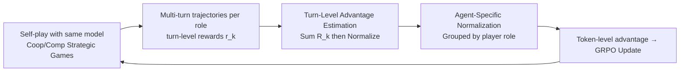

# MARSHAL: Incentivizing Multi-Agent Reasoning via Self-Play with Strategic LLMs

**Conference**: ICLR 2026  
**OpenReview**: [https://openreview.net/forum?id=GCd5v3ehmr](https://openreview.net/forum?id=GCd5v3ehmr)  
**Code**: Open source (Project Page + Code, see OpenReview)  
**Area**: Multi-Agent / LLM Reinforcement Learning  
**Keywords**: Multi-agent reasoning, Self-play, GRPO, Credit assignment, Advantage estimation, Strategic games  

## TL;DR
MARSHAL utilizes a GRPO modification specifically designed for "multi-turn + multi-agent" scenarios (**turn-level advantage estimation with summation before normalization** + **role-based group normalization**). By training Qwen3-4B through self-play in cooperative and competitive strategic games, the model acquires reasoning capabilities that zero-shot transfer to multi-agent systems like MAD/AutoGen, consistently improving performance on math and QA benchmarks.

## Background & Motivation
- **Background**: Reinforcement Learning (GRPO/PPO) has significantly enhanced single-agent LLM reasoning (e.g., DeepSeek-R1). however, real-world negotiation, gaming, and collaborative development are multi-agent systems (MAS) involving long-term interactions. Extending RL to multi-turn, multi-agent scenarios remains largely unexplored.
- **Limitations of Prior Work**: Directly applying GRPO to multi-agent self-play faces two major issues. First is **long-range credit assignment**—a game consists of multiple turns with sparse final outcomes; assigning the overall result to every token (naive GRPO) fails to distinguish which specific action was effective. Second is **advantage variance from role heterogeneity**—different roles (first-mover/second-mover, different positions in cooperation) have asymmetric information and reward scales, which introduces variance and instability when normalized together.
- **Key Challenge**: Self-play naturally generates multi-turn, multi-role trajectories, whereas existing single-turn RL advantage estimation assumes "one response = one turn, one role," creating a structural mismatch.
- **Goal**: Design an end-to-end RL framework to enable LLMs to acquire **generalizable** multi-agent reasoning capabilities through self-play in diverse strategic games, which can transfer to real-world MAS.
- **Core Idea**: **Self-play + two GRPO modifications for multi-turn multi-agent scenarios**—modeling strategic games as turn-level MDPs, using "summation then normalization" turn-level advantage estimation for fine-grained credit assignment, and independently normalizing advantages by player role sub-groups.

## Method

### Overall Architecture
MARSHAL treats a full strategic game as an episode (turn-level MDP): the high-level state $s_k$ is the board/hand status at the start of turn $k$, and the high-level action $a_k$ is the complete LLM output (including reasoning and the move). This action is a sequence generated token-by-token by the underlying autoregressive policy. The goal is to maximize the total episode reward $R=\sum_{k=1}^{K} r_k$. Based on GRPO, the framework uses self-play to let the same model play all roles to generate trajectories, then applies two modifications to convert rewards into accurate token-level advantages for GRPO updates.

### Key Designs

**1. Naive Extension of GRPO to Multi-turn Self-play: Defining the baseline.** In self-play, all players are controlled by the same model, producing one multi-turn trajectory per role per game. Treating all trajectories $\{(s^i_k,a^i_k)_{k=1}^{K_i}\}_{i=1}^{G}$ within a game environment as a set of responses and using the total reward $R_i$ as the terminal reward allows GRPO to be extended with a summation over turns. The advantage becomes $A^i_{k,t}=\frac{R_i-\mathrm{mean}(r)}{\mathrm{std}(r)}$. However, this assigns the same advantage to all tokens in a multi-turn trajectory, leading to the failure of long-range credit assignment.

**2. Turn-level Advantage Estimation: Inverting "Normalize then Sum" to "Sum then Normalize".** Original process-supervised GRPO normalizes each turn's reward across the batch $\tilde r^i_k=(r^i_k-\mathrm{mean}(r))/\mathrm{std}(r)$, then sums them $A^i_k=\sum_{\hat k=k}^{K}\tilde r^i_{\hat k}$. The issue is that intermediate reward distributions vary significantly across turns. MARSHAL reverses the sequence: **first** calculate the Monte Carlo cumulative return from turn $k$ as $R^i_k=\sum_{\hat k=k}^{K} r^i_{\hat k}$, **then** normalize these returns $A^i_{k,t}=R^i_k-\mathrm{mean}(R)$. This is equivalent to GAE with $\gamma=1,\lambda=1$, where the value function $V(s_k)$ is approximated by a simple yet effective baseline—the empirical mean of batch returns $\mathbb{E}[R]$.

**3. Agent-specific Advantage Normalization: Calculating baselines per role group.** Expected returns often depend heavily on player roles (first vs. second player, different cooperative roles). Normalizing across different roles pulls all players toward a shared baseline, which is statistically unsound and masks role-specific signals. MARSHAL partitions batch trajectories into sub-groups $G_p$ based on player role $p$, applying turn-level estimation independently within each sub-group:
$$A^{p,i}_{k,t}=R^{p,i}_k-\mathrm{mean}(R^p),\quad R^p \text{ is the set of cumulative returns for sub-group } G_p$$
This ensures the advantage of each action is calculated relative to that role's average outcome.

**4. Minimal Reward Design + Curriculized Game Selection: Relying on outcome signals.** The primary signal is the intrinsic game result (Tic-Tac-Toe Win/Loss/Draw ±1, Kuhn Poker chips won/lost, Mini Hanabi +1 per card played). Rewards are scaled to a maximum of 4 across games. Two auxiliary rewards stabilize training: format reward (+0.05 for legal format, -10 and termination for illegal) and length penalty $r_{\text{length}}(l)=\alpha\cdot\max(0,1-\frac{l-l_{\min}}{l_{\max}-l_{\min}})$ ($l_{\min}=11,l_{\max}=2048,\alpha=0.5$). Games are categorized for curriculum: Perfect Information Competitive (Tic-Tac-Toe → Connect Four), Imperfect Information Competitive (Kuhn Poker → Leduc Hold'em), and Imperfect Information Cooperative (Mini Hanabi → Simple Hanabi).

## Key Experimental Results

### Main Results (Downstream Reasoning in MAS, Average)

| Setting | Model | Average |
|---|---|---|
| Single Agent | Qwen3-4B | 60.74 |
| Single Agent | SPIRAL | 63.75 |
| Single Agent | MARSHAL Generalist | 62.79 |
| MAD (Competitive) | Qwen3-4B | 72.45 |
| MAD (Competitive) | SPIRAL | 73.41 |
| MAD (Competitive) | MARSHAL Generalist | **75.96** (+3.51) |
| AutoGen (Cooperative) | Qwen3-4B | 79.14 |
| AutoGen (Cooperative) | SPIRAL | 80.05 |
| AutoGen (Cooperative) | MARSHAL Generalist | **82.15** |

Representative gains: The Generalist improved GPQA-Diamond by 7.57% under the MAD framework and AIME by 10.00% under AutoGen.

### Ablation Study (Tic-Tac-Toe Expert, Normalized Returns for Train/Held-out games)

| Model | Tic-Tac-Toe | Kuhn Poker | Mini Hanabi | Connect Four | Leduc Hold'em | Simple Hanabi |
|---|---|---|---|---|---|---|
| MARSHAL | 75.30/32.10 | 74.15/3.42 | 50.48 | 30.65/14.85 | 58.36/27.65 | 29.75 |
| w/o Turn-Level | 74.60/24.15 | 80.26/28.35 | 34.80 | 26.75/12.30 | 48.34/41.34 | 19.05 |
| w/o Agent-Specific | 82.70/31.20 | 70.89/11.24 | 44.10 | 25.40/10.50 | 51.04/49.88 | 21.72 |
| w/ fixed opponent | 88.00/41.95 | 63.15/28.84 | 34.93 | 20.35/5.65 | 47.38/35.55 | 12.22 |

### Key Findings
- **OOD Generalization**: The Tic-Tac-Toe expert generalizes to the more complex Connect Four and even improves on OOD Mini Hanabi, suggesting it learned foundational "turn-based planning" skills.
- **Generalist Performance**: Showed the strongest overall performance across all games, with 28.7% improvement in Leduc Hold'em and 22.9% in Simple Hanabi.
- **Component Necessity**: Removing turn-level estimation or agent-specific normalization significantly degraded performance on held-out games (especially cooperative Hanabi).
- **Self-play vs. Fixed Opponent**: Training against fixed experts leads to overfitting to static environments; fixed opponent variants dropped to zero performance on most held-out games.
- **Failure Mode Attribution**: In GPQA-Diamond + MAD, MARSHAL reduced "Inter-Agent Misalignment" by 11.5%, primarily through fewer "task deviations" and "ignoring inputs from other agents."

## Highlights & Insights
- **Structural Analysis of Strategy Games**: The paper clarifies the difference where single-turn math is "one response = one turn," while strategic games are turn-level MDPs. This precisely identifies the mismatch in GRPO.
- **The "Sum then Normalize" Inversion**: A seemingly small sequence adjustment that aligns with GAE ($\gamma=1,\lambda=1$) using batch means as value functions, providing theoretical consistency with zero extra engineering overhead.
- **Cross-domain Generalization**: Abstract multi-agent skills like "role understanding" and "intent recognition" (Theory of Mind) acquired in games transfer zero-shot to real-world debate/cooperative scenarios in MAS.

## Limitations & Future Work
- Evaluation limited to Qwen3-4B and six simplified two-player games; scalability to larger models or more complex multiplayer games is unknown.
- Downstream transfer tested only on MAD/AutoGen frameworks with math and QA benchmarks; generalization to open tool-use or long-term collaborative tasks remains to be seen.
- Auxiliary rewards and reward scaling still require manual tuning; uniform scaling across games might need re-calibration for more heterogeneous task mixtures.

## Related Work & Insights
- **Single-Agent RL Reasoning**: Follows DeepSeek-R1 and Kimi k1.5 in using RL to scale reasoning, applying format and length rewards but in a multi-agent context.
- **Self-play**: Directly compares with SPIRAL (competitive-only self-play); MARSHAL covers both cooperation and competition while emphasizing cross-domain generalization.
- **GRPO / GAE**: Methodological roots in GRPO, with theoretical grounding in the equivalence between turn-level estimation and GAE.
- **Insight**: Games serve as a training ground for generalizable multi-agent reasoning—externalizing abstract skills into quantifiable game objectives before transferring back to real MAS.

## Rating
- Novelty: ⭐⭐⭐⭐ Clear identification of GRPO mismatches in multi-turn multi-agent settings; "Sum-then-Normalize + Role-based Grouping" is a simple and effective modification.
- Experimental Thoroughness: ⭐⭐⭐⭐ Comprehensive coverage of OOD generalization, MAS frameworks, math/QA benchmarks, ablations, and failure mode analysis.
- Writing Quality: ⭐⭐⭐⭐ Smooth logic from motivation to experiments; well-supported by both formulas and qualitative trajectory analysis.
- Value: ⭐⭐⭐⭐ Provides a reproducible end-to-end paradigm for training generalizable multi-agent reasoning LLMs.

<!-- RELATED:START -->

## Related Papers

- [\[ICLR 2026\] Strategic Planning and Rationalizing on Trees Make LLMs Better Debaters](strategic_planning_and_rationalizing_on_trees_make_llms_better_debaters.md)
- [\[ICLR 2026\] MAS²: Self-Generative, Self-Configuring, Self-Rectifying Multi-Agent Systems](mas2_self-generative_self-configuring_self-rectifying_multi-agent_systems.md)
- [\[ICLR 2026\] Stochastic Self-Organization in Multi-Agent Systems](stochastic_self-organization_in_multi-agent_systems.md)
- [\[ICML 2026\] Toward Culturally Aligned LLMs through Ontology-Guided Multi-Agent Reasoning](../../ICML2026/multi_agent/toward_culturally_aligned_llms_through_ontology-guided_multi-agent_reasoning.md)
- [\[ICLR 2026\] Unlocking the Power of Multi-Agent LLM for Reasoning: From Lazy Agents to Deliberation](unlocking_the_power_of_multi-agent_llm_for_reasoning_from_lazy_agents_to_deliber.md)

<!-- RELATED:END -->
